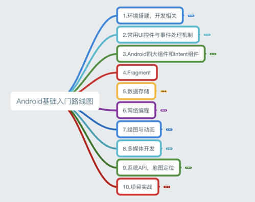

## 1.0 Android基础入门教程

本教程于2015年7月开始撰写，耗时半年，总共148节，涵盖了Android基础入门的大部分知识，由于当时能力局限，虽已竭尽全力，但对于一些问题的分析难免有所纰漏，敬请读者海涵！IT技术更新换代很快，想想2015年还是Android 5.1横行，如今到了2018年都已经Android 8.0了，开发工具Android Studio也更新到了Android Studio 3.0.1。本系列的教程可能有些地方已经过时了，比如6.0以后的动态权限申请。一个人的力量是有限的，而且也有自己的工作忙，不可能去另外整一个大更新，今天写的，可能过几个月就过时了，这是IT界的常态，所以还是得自己学会主动去获取知识的能力，提供几个常备的知识获取站点吧，平时闲着没事可以自己上去获取知识：

- **Android官网**： https://developer.android.google.cn/index.html
- **Android官网**： https://developer.android.com/index.html

当然除此之外还有很多，更多可见： https://github.com/coder-pig/Android-Storage-Box但是切记一点，你是**按需学习**，而不是一个收破烂的，收藏一堆链接，收藏了你就会了，其实收集得越多，你会越浮躁！

附本系列教程的思维导图：

[完整思维导图 PDF](https://www.runoob.com/wp-content/uploads/2015/06/androidmap.pdf)