## 1.10 反编译APK获取代码&资源

## 本节引言

> "反编译Apk"，看上去好像好像很高端的样子，其实不然，就是通过某些反编译软件，对我们的APK进行反编译，从而获取程序的源代码，图片，XML资源等文件；不知道你有没有这样做过，看到一个别人的一个APP界面做得很精美，或者你看上别人的图片素材，简单点的，我们可以下载别人的APK，然后改下后缀名，改成xxx.zip，然后解压： 笔者随便解压了一个APK：

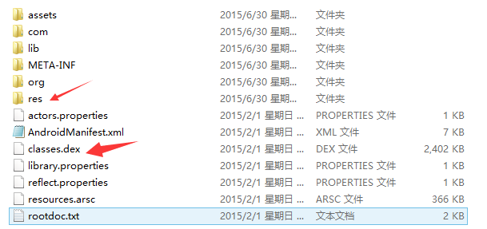

> 我们可以打开res目录，获取里面的图片素材

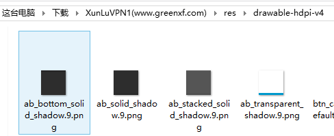

> 但是，这种方法，获得的只会是一些.png，或者.jpg这样的位图文件资源，如果是xml类的资源，打开我们会发现是乱码，并且假如我们想看APK程序的Java代码，也是行不通的，因为他们都打被打包到classes.dex文件中！ 但是反编译可以解决你的需要~另外，切勿拿反编译来做违法的事，比如把人家的APK重新打包后使用自己的签名然后发布到相关市场...另外，我们是参考别人的代码，而不是完全拷贝！！！切记！！

## 1.要准备的三个工具

> 1. **apktool：**获取资源文件，提取图片文件，布局文件，还有一些XML的资源文件
> 2. **dex2jar：**将APK反编译成Java源码(将classes.dex转化为jar文件)
> 3. **jd-gui：**查看2中转换后的jar文件，即查看Java文件 为了方便各位读者，这里将三个打包到一起放到云盘中，又需要的可以进行下载： [反编译相关的三个工具.zip](http://static.runoob.com/download/反编译相关的三个工具.zip)

------

## 2.使用apktool反编译APK获得图片与XML资源：

> 把下载好的apktool解压后，我们可以看到下述文件(忽略那两个csdn，一个是反编译的apk，一个是反编译后文件)：
>
> 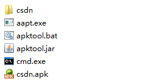
>
> 接下来，双击cmd.exe，来到命令行，键入： **apktool.bat d csdn.apk** 即可，Enter回车：
>
> 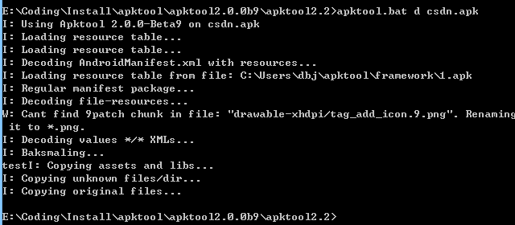
>
> 然后就可以看到生成的csdn文件夹，里面就有我们想要资源
>
> 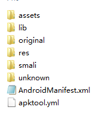
>
> 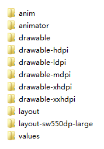
>
> 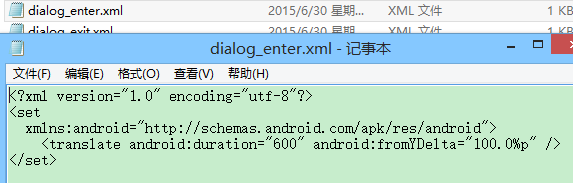
>
>  
>
> 好的，就是XML资源到手了是吧！图片素材也到手了！

------

## 3.使用dex2jar将classes.dex转换成jar文件：

> 把下载好的dex2jar文件夹解压，apk解压后中的classes.dex复制到dex2jar.bat所在的目录下：
>
> 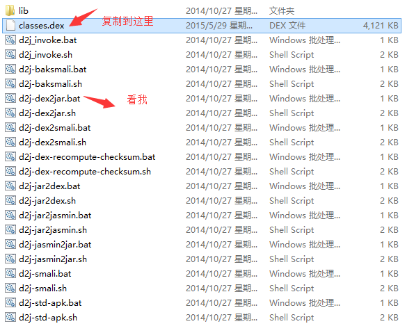
>
> 打开cmd，来到这个目录下：键入：**d2j-dex2jar.bat classes.dex**
>
> 
>
> 接着我们可以看到，生成了一个jar包：
>
> 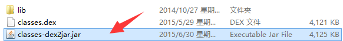
>
>  好的，转换完成！

------

## 4.使用jd-gui查看jar包中的Java代码：

> 好的，打开jd-gui的文件夹
>
> 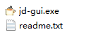
>
> 打开后，打开我们3中转换后的jar包，我们可以看见里面的代码：
>
> 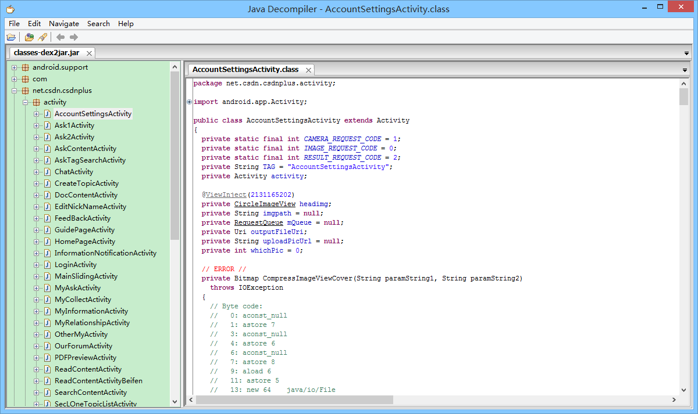 csdn的客户端竟然不混淆代码...可能是本着开源的精神吧，给我们学习代码吧！一般的话，apk发布都会进行混淆，然后进行一些加密，或者使用第三方的加密平台，用的比较多的"爱加密"，有兴趣的也自行百度查看更加详细的介绍！

------

## 本节小结

> 好的，关于APK的反编译就介绍到这里，相信你已经摩拳擦掌想要试试了，那就试试吧，最后提醒一句，别做坏事！尊重别人的劳动成果！另外，关于第一大章环境搭建相关以及一些常用开发技巧就到这里，下一节开始我们就来进行本系列教程的第二章——Android中的常用UI控件的学习了！因相关的基本控件较多，估计有几十个，如果一直学控件可能没什么意思，可能并行写教程，每天学一个控件 + 一点其他的知识点这样，笔者要构思构思，敬请期待~谢谢~