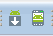
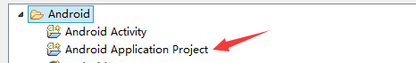
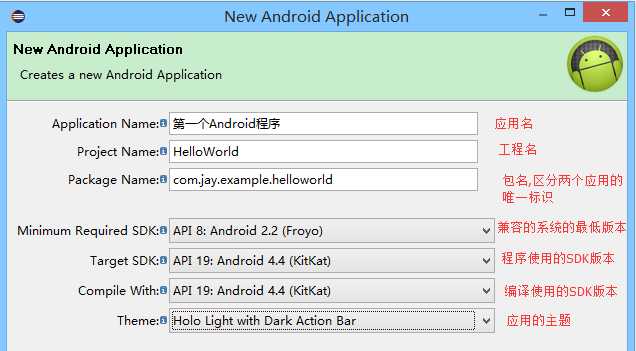
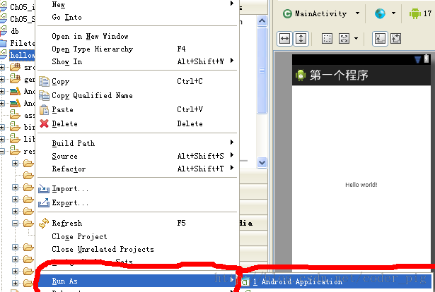
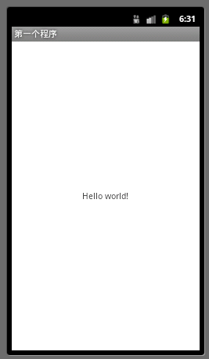
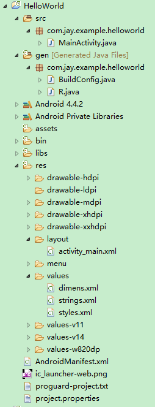
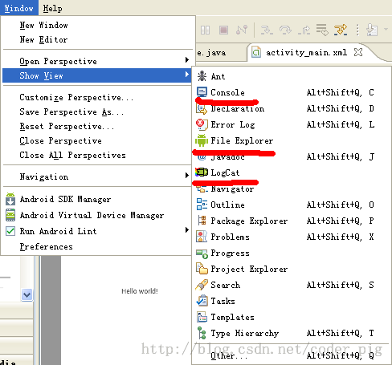
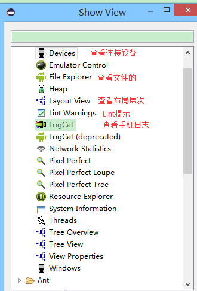
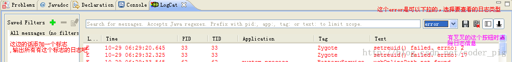

## 1.2.1 使用Eclipse + ADT + SDK开发Android APP

## 1.前言

这里我们有两条路可以选，直接使用封装好的用于开发Android的ADT Bundle，或者自己进行配置 因为谷歌已经放弃了ADT的更新，官网上也取消的下载链接，这里提供谷歌放弃更新前最新版本的 ADT Bundle供大家下载！

------

## 2.直接使用打包好的Eclipse

**32位版：**[adt-bundle-windows-x86-20140702.zip（百度网盘）](http://pan.baidu.com/s/1bnKMfIf) 

**64位版：**[adt-bundle-windows-x86_64-20140702.zip(Google 地址)](https://dl.google.com/android/adt/adt-bundle-windows-x86_64-20140702.zip) 

下载解压，然后直接跳到4.来创建一个Helloworld工程！

------

## 3.自己配置Eclipse + ADT + SDK

Eclipse可自行到Eclipse官网下载：[Eclipse官方下载](http://www.eclipse.org/downloads/) 而SDK和ADT可以到AndroidDevTools处下载：[AndroidDevTools官网](http://www.androiddevtools.cn/) 这里给我们提供了很多Android开发相关的工具，而且不用科学上网，必备开发网站！务必Mark！ 不同版本配置间可能会有一些问题！笔者用的是旧版本的(很旧)，又需要的也可以下载： Eclipse：[eclipse-jee-helios-win32.zip](http://pan.baidu.com/s/1dDIiDWH) ADT：[ADT-15.0.0.zip](http://pan.baidu.com/s/1gd5Tsht) SDK：[android-sdk-windows.rar](http://pan.baidu.com/s/1kTokluR) 搭建流程： 

**1.解压Eclipse：**到解压的文件夹中找到eclipse.exe运行，运行后设置工程代码的存放位置(工作空间) 

**2.ADT配置：**依次点击菜单栏：**help** -> **Install new software** -> **Add** -> **Local...** ->**选中下载加压后的ADT的文件夹** ->**accept** -> **重启Eclipse** ->**看菜单栏是否出现Android小图标**如果出现表示安装完成 **PS**:期间可能出现一个waring,直接忽视~ 

**3.SDK解压配置：**依次点击菜单栏：**windows** -> **Rreferences** -> **Android** ->**选中解压的SDK包** -> **OK** ->**打开重新验证** 

**4.创建AVD(安卓模拟器)：**依次点击菜单栏：**手机小图标** -> **New** -> **选定系统版本** -> **Skin屏幕分辨率** ->**设置下SD卡大小** -> **完成** -> **start即可**！ 

**PS:**第一次启动AVD的话可能很慢，需要等等~

------

## 4.第一个程序HelloWorld工程创建与运行

**1.New -> Android App Project** 如果找不到,可以去Other -> android找到，也是一样的：

 

 **2.然后依次输入工程信息：**

  

**3.运行创建好的程序**

  

**4.从模拟器上看到运行效果：

 

------

## 5.项目的目录结构分析

先来看下我们的工程目录图：

  

接下来我们需要知道的部分：

- **src目录：**包含App所需的全部程序代码文件，我们大多数时候都是在这里编写我们的Java代码的
- **gen目录：**只关注R.java文件，它是由ADT自动产生的，里面定义了一个R类，可以看作一个id(资源编号)的字典，包含了用户界面，图形，字符串等资源的id，而我们平时使用资源也是通过R文件来调用的，同时编译器也会看这个资源列表，没有用到的资源不会被编译进去，可以为App节省空间
- **assets目录：**存放资源，而且不会再R.java文件下生成资源id，需要使用AssetsManager类进行访问
- **libs目录：**存放一些jar包，比如v4,v7的兼容包，又或者是第三方的一些包
- **res资源目录：**存放资源的，drawable：存放图片资源；layout：存放界面的布局文件，都是XML文件； values：包含使用XML格式的参数的描述文件，如string.xml字符串，color.xml颜色，style.xml风格样式等
- **AndroidManifest.xml配置文件：**系统的控制文件，用于告诉Android系统App所包含的一些基本信息，比如组件，资源，以及需要的权限，以及兼容的最低版本的SDK等

------

## 6.几个常用的视图

点击菜单栏上的:Windows -> show view打开对应的视图即可：

点击other,下述是Android中一些常用的视图:

其实主要的还是Logcat的使用，因为和Java不同，我们的App运行在虚拟机上，而我们的控制台却并不会显示相关信息，只有安装状态而已，所以我们会在Logcat上查看程序运行的日志信息：

## 7.本节小结

本节我们学习了使用Eclipse搭建我们的Android开发环境，懒人版和动手搭建版，两者都可以； 接着我们又介绍了下Eclipse开发Android项目的目录结构的一些信息，在下一节中我们将深入HelloWorld工程，了解其中的代码！