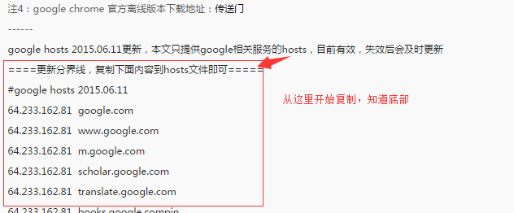
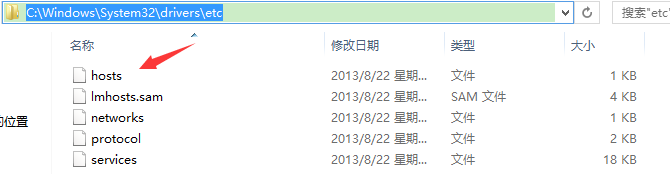
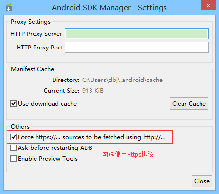
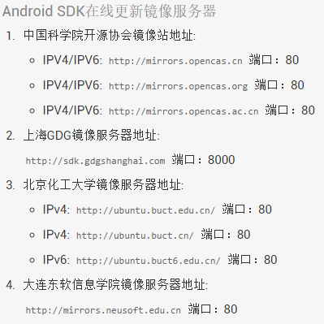
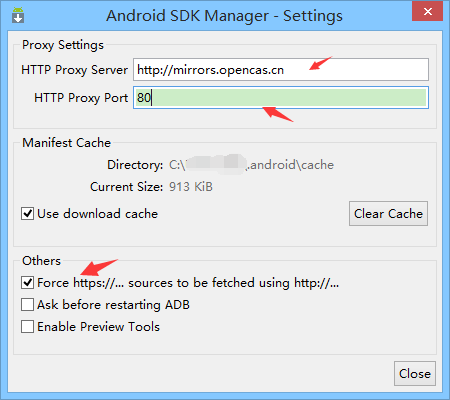

## 1.3 SDK更新不了问题解决

## 问题阐述

> 相信大家在更新SDK的时候都会遇到更新不了的问题，而且打不开Google搜索，这是因为天朝墙了Google，所以要么只能通过科学上网或者改HOSTS才能访问，更新SDK！本节来介绍两种更新SDK的方法！

------

## 1.修改hosts文件

直接百度"Google hosts 2015"就有一堆了，而笔者常用的是： [google hosts 2015,持续更新-360知识库](http://www.360kb.com/kb/2_150.html) 进去后**复制分割线下所有的内容：**

**然后打开电脑上的这个路径：**

**用记事本打开，把复制的内容粘贴即可！**

接着输入：https://www.google.com.hk/

出现：

表明修改Hosts成功

**接着打开sdk设置下：**

然后你会神奇的发现SDK可以更新了，而且你也能访问Google了，但是有点慢是吧，我们再介绍一个更新SDK的方法，速度快很多的！

------

## 2.使用国内镜像服务器更新

还记得前面给大家介绍一个Android开发必备的[AndroidDevTools](http://www.androiddevtools.cn/)吗？打开这个网站，我们可以看到

接下来我们只要选择上面随意一个，然后打开我们的Android SDK Manager，然后做如下设置： **Tools -> Option**，填入镜像源的地址和端号，**勾选Force https:**//使用Https协议

然后close，会到主界面，依次选择Packages -> Reload，就可以看到，刷刷刷进度条动了， 我们也可以选择对应版本的sdk进行下载了，而且速度还很快~

## 3.本节小结

本节给大家介绍了两种解决sdk更新不了的问题，改hosts的话是比较麻烦的，每隔几天就可能需要进行更新，如果仅仅是想更新sdk的话，建议使用国内镜像进行更新！