## 1.5.1 Git使用教程之本地仓库的基本操作

## Git是什么？

> 一个分布式版本控制系统，和SVN类似，但远比SVN强大的一个版本控制系统 ①Git可以方便的在本地进行版本管理，如同你本地有一个版本管理服务器一样 我们可以选择在合适的时间将本地版本推送到统一的版本管理服务器 ②Git每次会提取整个代码仓库的完整镜像，相当于对整个代码仓库都进行了一次备份，这样即使版本服务器出了问题，我们也可以直接采用本地仓库恢复！结合本地版本管理功能，远程版本管理服务器出问题了，我们依然能继续写自己的代码，当他恢复的时候我们再提交我们的本地版本！ Git研发初期是为了更好的管理Linux内核，不过现在已经广泛应用于各种项目中！

------

## 安装Git

如果你的系统是Linux的话，直接打开shell输入:

```
sudo apt-get install git
```

当然，大部分的系统估计都是Windows，这就需要我们到网上下载一个Git For Window了，可到下述网站下载： https://git-for-windows.github.io/ 点击 Download，跳转到 Github ，下载对应安装包即可！

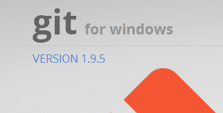

点击后进入页面，下载如下文件即可


或者直接下载目前最新版2.7.0： [v2.7.0.windows.1](https://github.com/git-for-windows/git/releases/tag/v2.7.0.windows.1) 接着傻瓜式的下一步就可以了~ 接下来你可以找到Git Gui然后开始玩Git，不过如果以后换到其他平台上，没有图形化界面你就寸步难行了！ So，如果你有兴趣的话，我们来玩命令行，以后换了系统也能正常的玩Git！

------

## 玩转Git命令行

当然Git肯定是搭配着GitHub玩才够味的，不过先来学习一些本地的指令先把！ 当你安装完Git后我们可以在任意位置右键，点击Git bash打开我们的Git命令行！ 你可以点击Git Init Here直接在当前目录下创建一个代码仓库，又或者点击Git Gui打开Gui的图形操作页面！

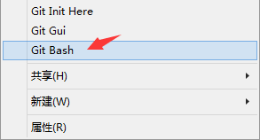

------

### 1.创建代码仓库

Step 1：先配置下我们的身份吧，这样在提交代码的时候Git就可以知道是谁提交的，命令如下：

```
git config --global user.name "coder-pig"
git config --global user.email "779878443@qq.com"
```

配置完成后，我们可以再次输入，不包括名称，可以看到我们已经配置成功了

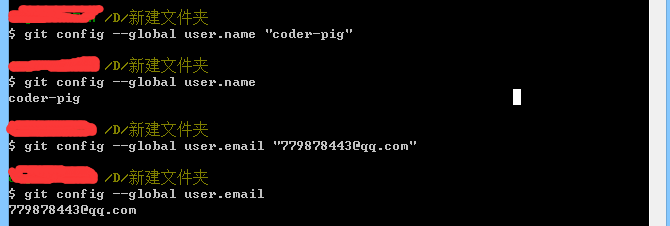

Step 2：找个地方创建我们的代码仓库，然后我创建了一个新的项目：TestForGit，来到工程的目录下，右键，打开我们的Git Bash，键入下述指令完成代码仓库的建立！另外这个代码仓库其实是用来保存版本管理所需的一些信息，我们本地提交的代码都会提交到代码仓库中，于是乎我们可以选择还原到某个版本，当然，如果需要的话，我们还可以将保存在代码仓库中的代码推送那个到远程仓库中！比如GitHub!

```
git init
```

一个简单的代码，代码仓库就创建完毕了！继续输入：ls - al 可以看到下目录下有个.git的文件夹就是他了！

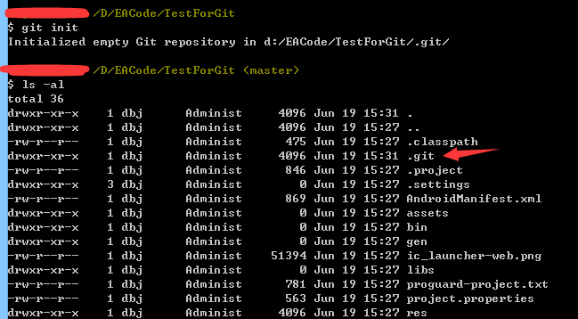

也可以打开工程目录，同样看也看到.git文件夹；如果我们想删除代码仓库只需把这个文件夹删掉即可！

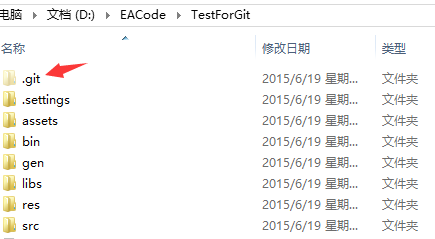

------

### 2.提交本地代码

创建完代码仓库，接下来说下如何提交代码，我们是先用add命令把要提交的内容都加进来，然后commit才是真的去执行提交操作！命令例子如下，你可以一次次慢慢添加，当然也可以全部提交，直接git add .即可完成！ 我们现在工程目录下创建一个readme.txt的文件试试，随便写点东西，然后依次输入下述指令：

```
 git add readme.txt
 git commit -m "Wrote a readme file"
```

输入命令试试：

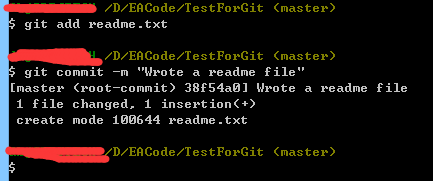

当然如果你可以add多个文件后再一次性commit，不过如果我们改动的文件很多的话，我们可以git add . 一次添加全部，但有一些是几百年都不变一次的又或者自动生成的，比如lib，gen，bin文件夹等等，我们可以在代码仓库的根目录下创建一个名为.gitignore的文件，然后编辑里面的内容，把不需提交的文件忽略掉！

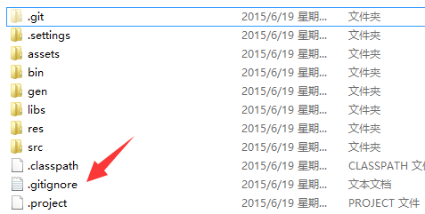

接着输入要提交时忽略的文件内容即可！


那么我们git add .的时候，这里的文件就不会add，另外可能你会觉的commit后面写-m "xxx"很麻烦，想偷懒，但还是写上吧！输入的是本次提交的一些声明，比如自己修改了些什么！就好像写代码的时候，你偷懒不写注释，过几天你连自己写的什么鬼都不知道...

------

### 3.查看修改内容

好吧，前面我们用git add提交了整个项目到本地仓库，接下来我们改点东西，然后使用git status可以查看 修改的部分，比如，我们删掉MainActivity.java里的菜单的代码以及多余的菜单相关的包！


他就会提示我们哪些文件发生了改变，但是还没有提交，如果我们想看下具体更改了什么，我们可以用到git diff命令，另外，按Q可以退回命令行输入！

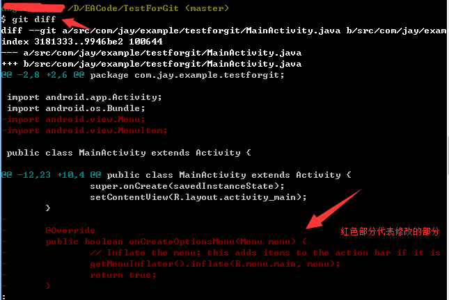

------

### 4.查看提交记录

当然随着我们项目的深入，Commit的次数也会越来越多，可能你早已忘记每次提交都修改了什么内容， 没事，Git帮你记着呢，使用git log即可查看历史提交信息！键入

```
git log
```

回车：

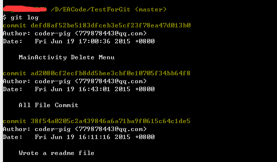

我们取其中一小部分来分析：

```
commit defd8af52be5183dfceb3e5cf23f78ea47d013b0
Author: coder-pig <779878443@qq.com>
Date:   Fri Jun 19 17:00:36 2015 +0800
MainActivity Delete Menu
```

依次是：

> - 此次提交对应的版本号
> - 提交人：姓名 邮箱
> - 提交的时间
> - 提交版本修改的内容：就是我们commit -m "xxx"里的xxx

### 5.撤销未提交的修改

比如我们刚提交了一个版本，然后又乱七八糟地写了一堆东西，突然发现不小心误删了一些东西，然后ctrl + s保存了，这个时候是不是欲哭无泪，不过有Git，只需一个checkout命令即可撤销更改，当然是你还没add的情况，比如我们在MainActivity里随便添加一条语句，然后ctrl + s保存代码！


然后命令行键入：git diff：


嗯，这里可以看到我们改的内容，我们可以回去把这句代码删掉，但是如果改的有上千行你怎么改， 于是乎这个时候我们可以使用

```
git checkout src/com/jay/example/testforgit/MainActivity.java
```

然后会神奇的发现，我们新写的代码没了！duang一下就没了，不信你可以自己试试


当然，如果我们已经add了的话，那么checkout是没任何作用的，我们要先取消添加才可以撤回提交，使用下述指令：

```
git reset HEAD src/com/jay/example/testforgit/MainActivity.java
git checkout src/com/jay/example/testforgit/MainActivity.java
```


### 6.版本回退

第五点我们教了大家撤销未提交的修改，但加入提交了，我们想回退到之前的某一个版本怎么办? 第四点中我们可以通过git log查看我们的提交记录，我们需要从这里获取一个版本号， 一般我们只需要前七位字符就够了；另外在Git中，用**HEAD**代表当前版本，上一个版本就是**HEAD^**， 再上一个版本就是**HEAD^^**依次类推！我们先Git Log看下版本历史先！

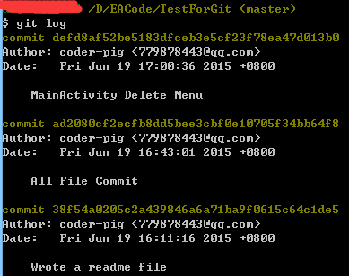

我们回到前一个提交的版本吧，依次键入下述指令：

```
 git reset --hard HEAD
 git reset --hard HEAD^
 git log
```

这时看下我们的控制台：

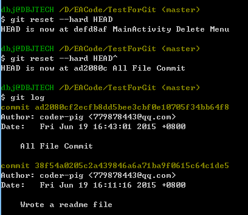

可以看到我们已经回退到了前一个版本了，当然你可以直接这样写：

```
git reset --hard ad2080c
```

就是这么简单！回退后，你突然后悔了，想回退回新的那个版本， 可是遗憾的是，你键入git log却发现没有了最新的那个版本号，这怎么办呢... 没事，Git中给你提供了这颗"后悔药"，Git记录着你输入的每一条指令呢！键入：

```
git reflog
```

你会发现，版本号就在这里：


然后键入：

```
git reset --hard ad2080c
```

可以看到我们又回到了最新的那个版本了，就是这么溜！


## 7.本节小节

> 本节给大家介绍了项目管理工具Git来管理我们的本地仓库，学习了一些基本的命令行操作，相信会给你的项目开发带来便利，当然本地远远是不够的，下一节我们将学习如何将我们的项目托管到GitHub上！敬请期待~