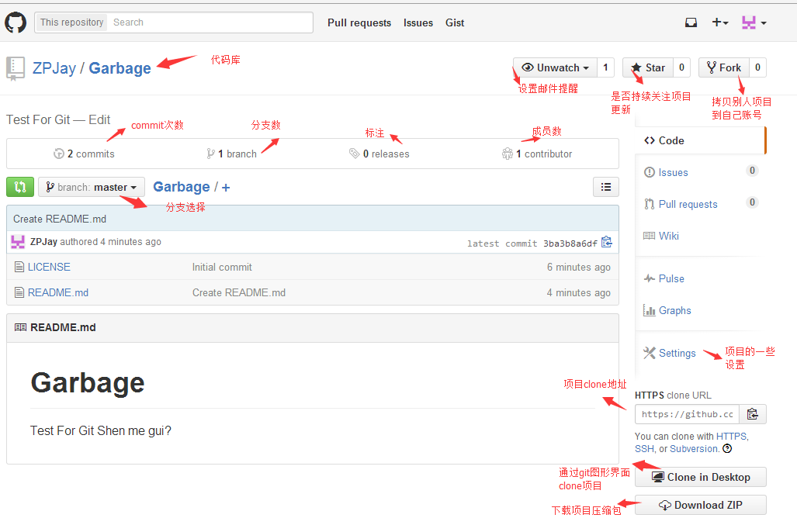

## 1.5.2 Git之使用GitHub搭建远程仓库


## 本节引言：

> 在上一节中，我们学习了如何使用Git，构建我们的本地仓库，轻松的实现了版本控制以及代码还原，修改日志查看等；读者肯定不满足与本地是吧，假如是多个人一起来开发一个程序呢？我们需要一个作为服务器的远程仓库！当然搭建一个服务器是需要成本的，为什么不把项目托管到Github上呢？作为开源代码库以及版本控制系统，Github拥有140多万开发者用户。随着越来越多的应用程序转移到了云上，Github已经成为了管理软件开发以及发现已有代码的首选方法，不需要任何成本，为何不使用呢？是吧！本节就来学习如何把我们的代码托管到Github上！

## 1.账号注册&仓库创建：

打开Github官网注册：[Github官网](https://github.com/)，填写注册相关信息：用户呢称，邮箱，密码


注册完，跳转到如下页面，选择仓库购买方式(私有仓库,别人不可以访问，要权限)，一般我们自己玩选Free: PS:对了，这时候你邮箱可能收到一封验证邮件，点下完成验证。


接下来，创建一个我们的代码仓库：

 


为自己的仓库添加点内容提示，就是项目的一些概述(可写可不写)


简单介绍下主页的一些东西：




------

## 2.Clone代码库到本地

当然，你可以直接用图形化界面克隆，不过我还是喜欢通过命令行来Clone，先复制下Clone的地址


然后在某个地方，有键打开Git Bash：


键入：

```
git clone https://github.com/ZPJay/Garbage.git
```

然后可以看到我们的代码库就下载完成了：


打开文件夹，可以看到下述内容：


------

## 3.分支管理

> 对于刚接触版本控制工具的朋友来说，分支可能比较陌生，但是他会给我们带来很大的便利！限于篇幅， 笔者直接丢个链接，大家看看图就知道了：[廖雪峰的官方网站：创建和合并分支](http://www.liaoxuefeng.com/wiki/0013739516305929606dd18361248578c67b8067c8c017b000/001375840038939c291467cc7c747b1810aab2fb8863508000)！写得真心很赞~建议收藏！

了解概念后,我们来熟悉与分支相关的几个命令：

**①创建分支(后者创建同时会切换分支):**

```
git branch v1.0.3 或 git checkout -b v1.0.4
```

**②查看版本库中所有分支：**

```
git branch -a
```


**③切换到某一分支：**

```
git checkout v1.0.3
```


**④删除某一分支：**

```
git branch -D v1.0.4
```

**⑤合并分支**

```
 git merge v1.0.3
```


------

## 4.本地仓库与远程仓库同步问题

前面执行的这些分支操作都是在本地进行的，说了项目托管到GitHub上，我们肯定要跟远程仓库有交流是吧！ 我们去年前面已经试过用clone命令把项目下载到本地，那么我们修改后如何把代码同步到Github上呢？我们先对我们的本地仓库做一点点修改，接着git add和git commit本地准备后，然后：

```
git push origin master 或者直接 git push
```

将我们本地的内容提交上去：


然后看下我们的Github,可以看到内容已经发生改变，而且提交者是我的另一个账号！


有同步到服务器，肯定有服务器同步到本地是吧，很简单，就一个

```
git pull
```

就可以

------

## 5.本节小结

好吧，本节就写那么多，相信你看到上面的Git教程还有一些冲突解决，分支管理，Bug分支等待高级的Git用法，考虑到这是入门教程，就不写那么深入了，有兴趣可以自己了解了解，说下自己公司目前的情况吧： ①使用Github作为我们的项目管理工具：我们都是把项目托管到Github上的，然后有两个分支：开发和测试两个分支，每个版本一个分支，最后发布时才把分支合并到master上！提bug也是在上面提的，还是比较便利的！ ②使用Trello来做流程控制，也是比较简洁高效的！有兴趣的可以了解了解！ 另外，国内访问Github可能比较缓慢，而且如果是私有仓库是要收费的，如果公司没有使用代理或者是私人开发，可能略显鸡肋，不过可以考虑下使用国产的开源仓库：Git@OSC，由开源中国提供的，提供了1000个私人仓库，好像，感觉还不错，有兴趣的可以考虑将代码托管到这里：http://git.oschina.net/！ 就到这里，如果文中有错误纰漏，欢迎指出，谢谢~