## 1.6 9(九妹)图片怎么玩

## 1.本节引言：

> **可能有的一些疑问：**
>
> **1.什么是.9图片？**
> 答：图片后缀名前有.9的图片,如pic1.9.png这样的图片
>
> **2. .9图片能干嘛？** 答： 在图片拉伸的时候特定的区域不会发生图片失真，而不失真的区域可以由我们自己绘制 
>
> **3. .9图片用什么做？** 答：工欲善其事，必先利其器，做.9图片的工具有：
>
> ①**Android SDK自带：draw9patch.bat**，不过这玩意出了好久，谷歌竟然没更新过...
>
> 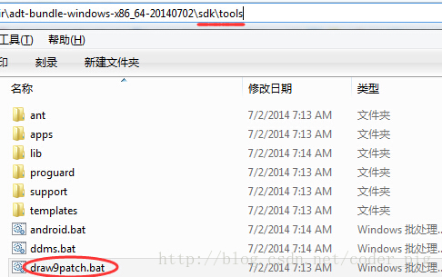
>
> ②**NinePatchEditor**，相比起自带的，做了一些优化，支持批量操作，而且界面看起来美观一点： 有兴趣的可以下载下，笔者平时用的这个，下载链接：[NinePatchEditor.zip](http://static.runoob.com/download/NinePatchEditor.zip)
>
> 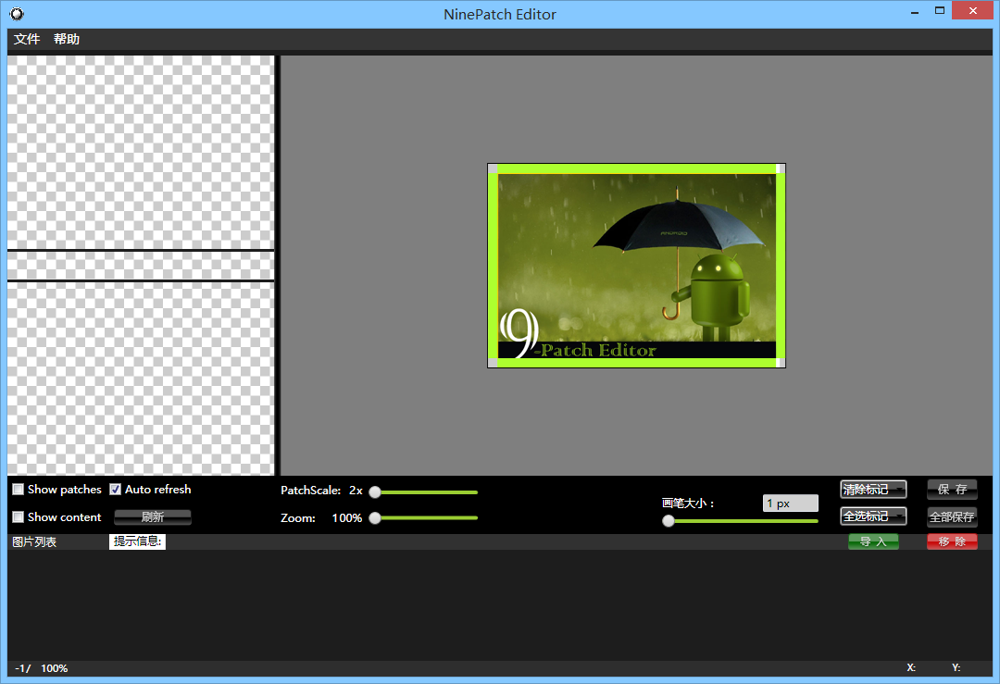 
>
> ③**NinePng九图神器**，手机版的.9处理工具，做得还是比较赞的，但是要连wifi互传图片，实际操作起来有点麻烦，功能还是比较强大的，有兴趣到相关应用市场搜索下载：
>
> 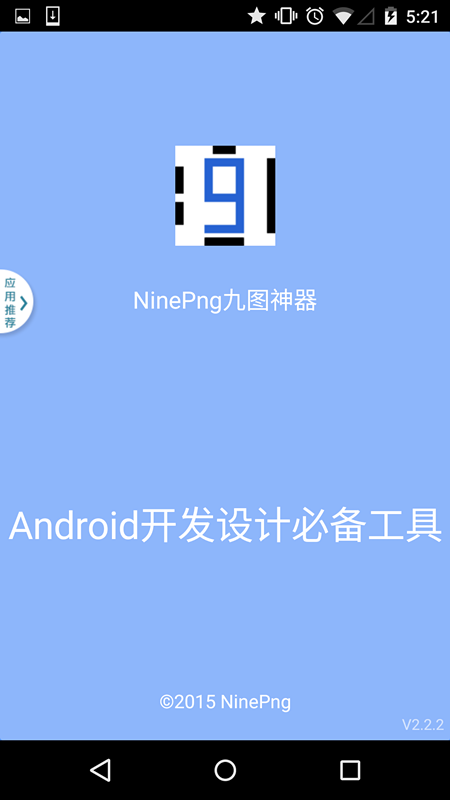
>
> ④**PhotoShop**，这就显得比较夸张了，一般用这个做.9图的都是美工，有兴趣的可搜下相关教程！

------

## 2. .9图片怎么做？

**！！核心要点：左上拉伸，右下内容！！！！！！** 其实核心就上面的内容！先来找个图片试试手！

------

### 1. draw9patch.bat制作.9图实例：

有这样的图片：，我们通过TextView的android:blackground可以设置为TextView的一个背景，内容少的时候还正常，一多起来就可能出现下面这种情况： 会发现图片被拉伸变形了,很明显,这不合我们的需求,于是乎我们需要对这个图片来进行一些处理,让圆角部分的不随长度拉伸,中间部分才拉伸

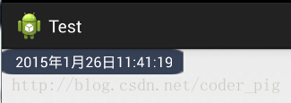

打开我们的draw9patch.bat，点击左上角File，来到对应目录打开我们要处理的图片素材， 接下来就可以看到我们工具的主界面了:

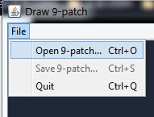

右面的预览区域分别是：纵向拉伸，横向拉伸，横纵都拉伸的预览

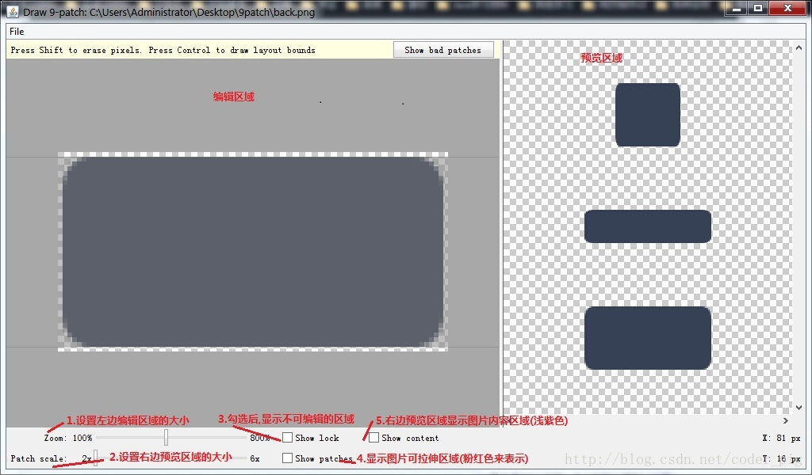

好的，接下来开始处理图片了：

> **Step 1.**调Zoom和Patch scale:设置自己适合的缩放比例,勾选show patch 可以让Zoom足够大,因为后面我们需要处理"斑马线"
>
> 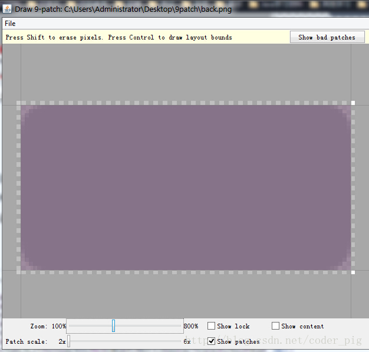
>
> **Step 2.**接下来我们只需要在"斑马线"上进行操作就可以了: PS:黑色那条线是一条条点出来的,如果想消除点的话:按住shift点即可！
>
> 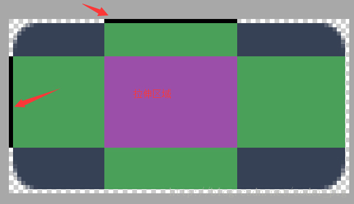
>
> **Step 3.**保存图片,以.9.png结尾 比如这里保存的文件名是back.9.png； 嘿嘿，然后把他加入我们的工程，设置为TextView的背景：
>
> 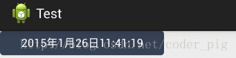
>
> 效果杠杠滴，接下来无论我们的显示的字符多长，都是图中这个结果，新技能get~

------

### 2.看下别人如何做.9图：

根据不同的情况我们可能需要做不同的.9图，下面欣赏下几个别人弄好的稍微复杂点的.9图的例子！ 例子：

1.原文链接：http://www.miued.com/2074/好吧，这素材我喜欢，可以没有QAQ！ 

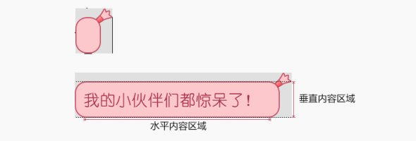

2.原文链接：http://blog.csdn.net/lizzy115/article/details/7950959

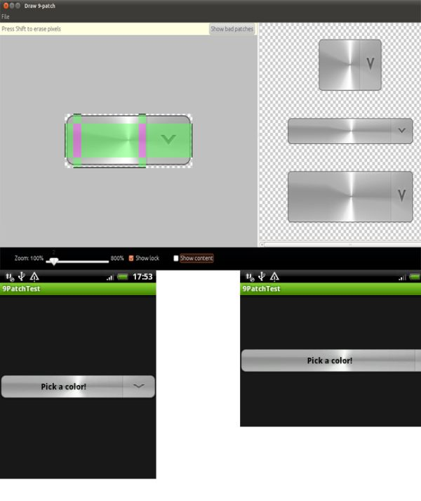

3.原文链接：http://www.cnblogs.com/vanezkw/archive/2012/07/19/2599092.html

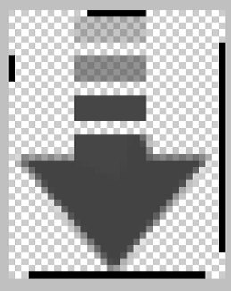

------

## 3.本节小结：

好的，本节关于.9制作可拉伸图片的教程就到这里，还是比较简单的，记住我们的口诀：左上拉伸，右下内容！ 做几个.9图后相信你就深有体会了，再见~