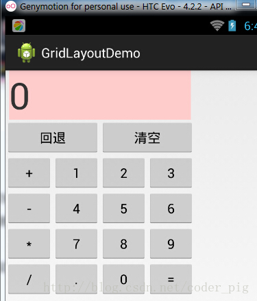
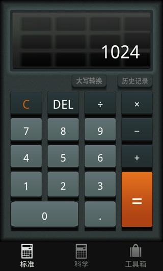
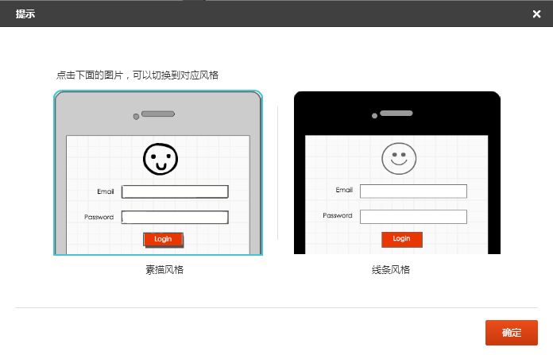
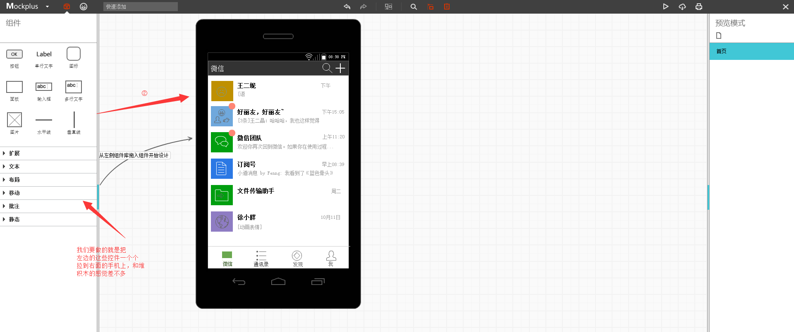
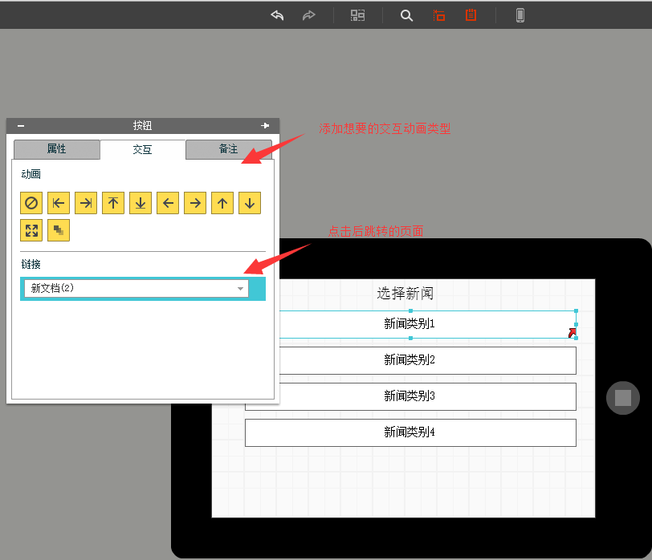
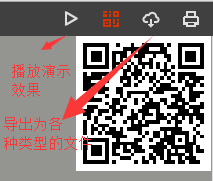
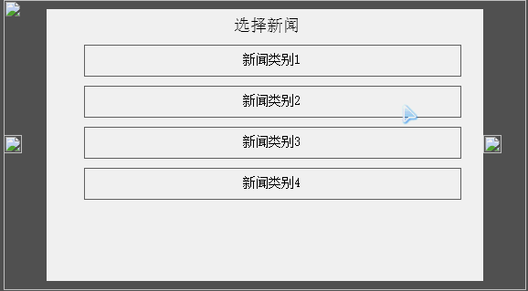
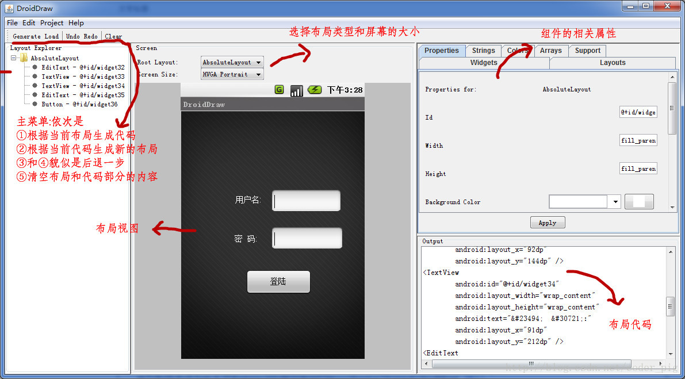

## 1.7 界面原型设计

## 本节引言：

引用锤子科技视觉设计总监——罗子雄在重庆TEDx活动上说的一小段话：

> 每当我们看到一些美妙的设计的时候，很多人心里面会有一种冲动，这种冲动会让你们想去创造一些新的东西，创造一些美妙的事物。

我们常说用户体验用户体验，用户使用你的软件，第一个会接触的是什么？没错，图形化界面(GUI)，简称UI，对于用户而言，最直观，给用户留下第一印像的是往往是程序的界面，而非功能！人，总喜欢美的东西，对吧？ 假如一样的功能，决定用户取向的，往往是UI！精美的UI！当然还有一些贴心的人性化操作等！ 下图两个计算机的App界面：

 

我们先不说功能，从UI上讲，你喜欢哪个？ 由此，一个产品的UI是非常重要的，而产品的界面原型设计一般是由公司的产品经理+美工来完成的，需求分析 ->界面原型设计 ->我们来写代码！可能你觉得界面原型对我们而言并不没什么作用，但假如你以后想自己开发App呢？又或者你升做产品经理呢？嘿嘿！世事无绝对，以后的事，谁知道呢？公司的话，大部分使用的都是Axure Rp，但是这个东西比较难用！除了这个以外还有其他很多的原型设计工具：

> - Pencil
> - Framer
> - Shireframe
> - UIDesigner
> - Balsamiq Mockups
> - Mockup Builder
> - Mockup
> - FrameBox
> - iPhone Mockup
> - GOOFLOW
> - WireframeSketcher
> - FluidIA
> - Indigo Studio
> - Origami
> - Quartz Composer
> - Justproto
> - Avocado
> - PaintCode
> - Mockplus(摩客)
> - 墨刀等....

笔者使用过的是两个国产的界面原型设计工具，他们分别是：Mockplus(摩客)和墨刀 本文会简要的介绍下Mockplus的用法！

------

## Mockplus原型工具的使用：

有网页版以及客户端版供你选择：[Mockplus官网](https://www.mockplus.cn/)

**Step 1：**注册一个你自己的账号，然后新建文件进入编辑界面！(时间关系，这里笔者直接试用) 然后弹出一个原型风格的对话框给我们选择：素描跟线条！

笔者选择线条：

我们要做的就是从左边的组件栏中啦控件到手机界面上，当然，我们可以双击某个控件，自定义我们 的样式，比如颜色，背景图片等！

**Step 2：**交互实现： 界面原型除了界面外，肯定是少不了交互的，这里我们做一个简单的新闻应用的交互例子给大家体验下： 我们在其中一个新闻类别中添加跳转链接，

接着我们可以点击右上角的播放按钮：

接下来我们就可以看具体的交互了，PS:这里可能是网页版的问题，有些图片显示不出来！ 

好了，大概的用法就这些，大家可以自己摸索摸索，另外，如果生成文档是要升级为付费用户的哦！一个月6元不贵，就一个早餐钱，当然如果是自己玩玩而已就没必要开了！

------

## Android自带DroidDraw工具设计Android界面：

其实Android也给我们提供了一个"老掉牙"的界面设计工具，跟上面这些高大上的界面原型工具相比，差几十条街，可以理解成一个分离的ADT，比ADT高级一点的功能就是自动生成代码...对于很少接触原型设计的朋友来说，花1，2分钟就可以掌握这个工具，还是比较值得！

**工具界面：**

图示已经写明相关的操作了,很简单,实践是检验真理的唯一标准,自己下来试试吧!!

软件下载：[droiddrawr.jar](http://static.runoob.com/download/droiddrawr.jar)

## 本节小结：

本节给大家介绍了下界面原型设计的概念，轻量级Mockplus(摩客)的简单实用，以及Android自带的DroidDraw工具，内容比较简单，还需大家自行实践理解！