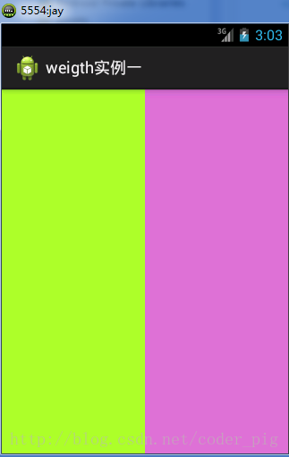
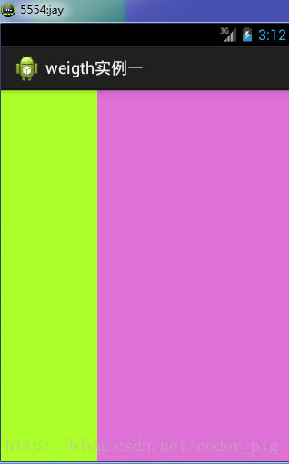
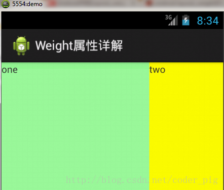
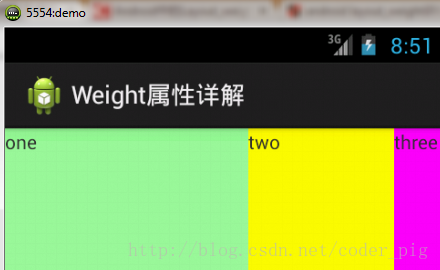
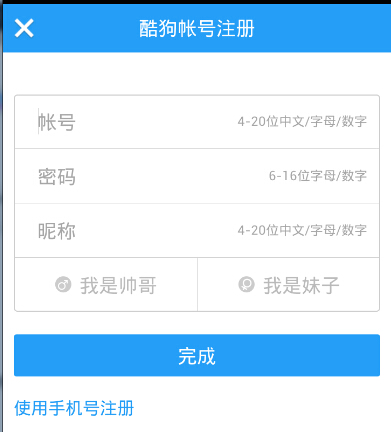
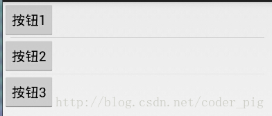
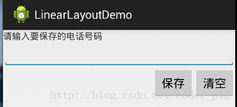

## 2.2.1 LinearLayout(线性布局)


## 本节引言

本节开始讲Android中的布局，Android中有六大布局, 分别是:  LinearLayout(线性布局)，RelativeLayout(相对布局)，TableLayout(表格布局) ，FrameLayout(帧布局)，AbsoluteLayout(绝对布局)，GridLayout(网格布局)。 而今天我们要讲解的就是第一个布局，LinearLayout(线性布局)，我们屏幕适配的使用的比较多的就是LinearLayout的weight(权重属性)，在这一节里，我们会详细地解析 LinearLayout，包括一些基本的属性，Weight属性的使用，以及比例如何计算， 另外还会说下一个用的比较少的属性: android:divider绘制下划线！

------

## 1.本节学习图


------

## 2.weight(权重)属性详解：

### ①最简单用法：

如图：





实现代码：

```
<LinearLayout xmlns:android="http://schemas.android.com/apk/res/android"    
    xmlns:tools="http://schemas.android.com/tools"    
    android:id="@+id/LinearLayout1"    
    android:layout_width="match_parent"    
    android:layout_height="match_parent"    
    android:orientation="horizontal">   
        
    <LinearLayout    
        android:layout_width="0dp"    // !!!!
        android:layout_height="fill_parent"    
        android:background="#ADFF2F"     
        android:layout_weight="1"/>    
       
        
    <LinearLayout    
        android:layout_width="0dp"    // !!!! 
        android:layout_height="fill_parent"    
        android:background="#DA70D6"     
        android:layout_weight="2"/>    
        
</LinearLayout>  
```

要实现第一个的1:1的效果, 只需要分别把两个LinearLayout的weight改成1和1就可以了 

用法归纳: 

​        按比例划分水平方向: (1) 将涉及到的View的android:width属性设置为0dp, (2)然后设置为android weight属性设置比例即可;

​        类推, 竖直方向, 只需设 android:height 为 0dp, 然后设 weight 属性即可！ 大家可以自己写个竖直方向的等比例划分的体验下简单用法！

### ②weight属性详解:

当然, 如果我们不适用上述那种设置为0dp的方式, 直接用wrap_content和match_parent的话,  则要接着解析weight属性了, 分为两种情况, wrap_content与match_parent！另外还要看 LinearLayout的orientation是水平还是竖直, 这个决定哪个方向等比例划分

**1) wrap_content比较简单,直接就按比例的了**


实现代码：

```
<LinearLayout xmlns:android="http://schemas.android.com/apk/res/android"    
    xmlns:tools="http://schemas.android.com/tools"    
    android:id="@+id/LinearLayout1"    
    android:layout_width="match_parent"    
    android:layout_height="match_parent"  
    android:orientation="horizontal" >    
    
    <TextView    
        android:layout_weight="1"    
        android:layout_width="wrap_content"    
        android:layout_height="fill_parent"    
        android:text="one"     
        android:background="#98FB98"    
     />    
     <TextView    
        android:layout_weight="2"    
        android:layout_width="wrap_content"    
        android:layout_height="fill_parent"    
        android:text="two"     
        android:background="#FFFF00"    
     />    
     <TextView    
        android:layout_weight="3"    
        android:layout_width="wrap_content"    
        android:layout_height="fill_parent"    
        android:text="three"     
        android:background="#FF00FF"    
     />    
    
</LinearLayout>  
 
```

**2) match_parent(fill_parent): 这个则需要计算了**

我们写这段简单的代码：

```
<LinearLayout xmlns:android="http://schemas.android.com/apk/res/android"    
    xmlns:tools="http://schemas.android.com/tools"    
    android:id="@+id/LinearLayout1"    
    android:layout_width="match_parent"    
    android:layout_height="match_parent" >    
    
    <TextView    
        android:layout_weight="1"    
        android:layout_width="fill_parent"    
        android:layout_height="fill_parent"    
        android:text="one"     
        android:background="#98FB98"    
     />    
     <TextView    
        android:layout_weight="2"    
        android:layout_width="fill_parent"    
        android:layout_height="fill_parent"    
        android:text="two"     
        android:background="#FFFF00"    
     />    
     <TextView    
        android:layout_weight="3"    
        android:layout_width="fill_parent"    
        android:layout_height="fill_parent"    
        android:text="three"     
        android:background="#FF00FF"    
     />    
    
</LinearLayout> 
 
```

运行效果图：



> 这个时候就会有疑问了, 怎么会这样, 这比例是 2:1 吧,那么three去哪了？代码里面明明有 three的啊, 还设置了3的, 而1和2的比例也不对耶,1:2:3却变成了2:1:0, 怎么会这样呢? 答: 这里其实没那么简单的, 还是需要我们计算的, 网上给出的算法有几种, 这里就给出笔者觉得比较容易理解的一种:
>
>  **step 1：**个个都是fill_parent, 但是屏幕只有一个啦, 那么1 - 3 = - 2 fill_parent 
>
> **step 2：**依次比例是1/6, 2/6, 3/6 
>
> **step 3：**先到先得,先分给one,计算: 1 - 2 * (1/6) = 2/3 fill_parent 接着到two,计算: 1 - 2 * (2/6) = 1/3 fill_parent 最后到three,计算 1 - 2 * (3/6) = 0 fill_parent **step 4：**所以最后的结果是:one占了两份,two占了一份,three什么都木有 以上就是为什么three没有出现的原因了,或许大家看完还是有点蒙,没事,我们举多几个例子试试就知道了！

**比例为：1：1：1**


按照上面的计算方法算一次,结果是:1/3 1/3 1/3, 没错（1-2*（1/3））

**接着我们再试下:2:3:4**

1-2*（2/9）= 5/9

1-2*（3/9）= 3/9

1-2*（4/9）= 1/9



计算结果: 5/9 3/9 1/9,对比效果图, 5:3:1, 也没错, 所以这个计算方法你可得mark下了!

### ③Java代码中设置weight属性：

```
setLayoutParams(new LayoutParams(LayoutParams.FILL_PARENT,     
        LayoutParams.WRAP_CONTENT, 1)); 
```

------

## 3.为LinearLayout设置分割线

很多界面开发中都会设置一些下划线,或者分割线, 从而使得界面更加整洁美观,比如下面的酷狗音乐的注册页面:



对于这种线,我们通常的做法有两种 **①直接在布局中添加一个view**,这个view的作用仅仅是显示出一条线,代码也很简单:

```
<View  
    android:layout_width="match_parent"  
    android:layout_height="1px"  
    android:background="#000000" />  
```

这个是水平方向上的黑线,当然你也可以改成其他颜色,或者使用图片


**②第二种则是使用LinearLayout的一个divider属性**, 直接为LinearLayout设置分割线。这里就需要你自己准备一张线的图片了

1）android:divider设置作为分割线的图片 

2）android:showDividers设置分割线的位置,none(无),beginning(开始),end(结束),middle(每两个组件间) 

3）dividerPadding设置分割线的Padding

使用示例：



实现代码：

```
<LinearLayout xmlns:android="http://schemas.android.com/apk/res/android"  
    xmlns:tools="http://schemas.android.com/tools"  
    android:id="@+id/LinearLayout1"  
    android:layout_width="match_parent"  
    android:layout_height="match_parent"  
    android:divider="@drawable/ktv_line_div"  
    android:orientation="vertical"  
    android:showDividers="middle"  
    android:dividerPadding="10dp"  
    tools:context="com.jay.example.linearlayoutdemo.MainActivity" >  
  
    <Button  
        android:layout_width="wrap_content"  
        android:layout_height="wrap_content"  
        android:text="按钮1" />  
  
    <Button  
        android:layout_width="wrap_content"  
        android:layout_height="wrap_content"  
        android:text="按钮2" />  
  
    <Button  
        android:layout_width="wrap_content"  
        android:layout_height="wrap_content"  
        android:text="按钮3" />  
  
</LinearLayout>
```

------

## 4.LinearLayout的简单例子:



实现代码如下：

```
<LinearLayout xmlns:android="http://schemas.android.com/apk/res/android"    
    xmlns:tools="http://schemas.android.com/tools"    
    android:id="@+id/LinearLayout1"    
    android:layout_width="fill_parent"    
    android:layout_height="fill_parent"    
    android:orientation="vertical"    
    tools:context=".MainActivity" >    
        
    <TextView    
        android:layout_width="wrap_content"    
        android:layout_height="wrap_content"    
        android:text="请输入要保存的电话号码"/>    
    <EditText    
        android:layout_width="fill_parent"    
        android:layout_height="wrap_content"/>    
    <LinearLayout    
        android:layout_width="fill_parent"    
        android:layout_height="wrap_content"    
        android:orientation="horizontal"    
        android:gravity="right">    
        <Button    
            android:layout_width="wrap_content"    
            android:layout_height="wrap_content"    
            android:text="保存"/>    
        <Button    
            android:layout_width="wrap_content"    
            android:layout_height="wrap_content"    
            android:text="清空"/>    
    </LinearLayout>    
</LinearLayout> 
```

## 5.注意事项:

使用Layout_gravity的一个很重要的问题!!! 问题内容: 在一个LinearLayout的水平方向中布置两个TextView,想让一个左,一个右,怎么搞? 或许你会脱口而出:"gravity设置一个left,一个right就可以啦!" 真的这么简单?你试过吗?写个简单的Layout你就会发现,事与愿违了: 代码如下：

```
<LinearLayout xmlns:android="http://schemas.android.com/apk/res/android"  
    xmlns:tools="http://schemas.android.com/tools"  
    android:layout_width="match_parent"  
    android:layout_height="match_parent"  
    android:orientation="horizontal"  
    tools:context="com.jay.example.getscreendemo.MainActivity" >  
  
    <TextView  
        android:layout_width="wrap_content"  
        android:layout_height="200dp"  
        android:layout_gravity="left"  
        android:background="#FF7878"  
        android:gravity="center"  
        android:text="O(∩_∩)O哈哈~" />  
  
    <TextView  
        android:layout_width="wrap_content"  
        android:layout_height="200dp"  
        android:layout_gravity="right"  
        android:background="#FF7428"  
        android:gravity="center"  
        android:text="(*^__^*) 嘻嘻……" />  
  
</LinearLayout>
```

运行结果图:


看到这里你会说:哎呀,真的不行耶,要不在外层LinearLayout加个gravity=left的属性,然后设置第二个 TextView的layout_gravity为right,恩,好我们试一下:

```
<LinearLayout xmlns:android="http://schemas.android.com/apk/res/android"  
    xmlns:tools="http://schemas.android.com/tools"  
    android:layout_width="match_parent"  
    android:layout_height="match_parent"  
    android:orientation="horizontal"  
    android:gravity="left"  
    tools:context="com.jay.example.getscreendemo.MainActivity" >  
  
    <TextView  
        android:layout_width="wrap_content"  
        android:layout_height="200dp"  
        android:background="#FF7878"  
        android:gravity="center"  
        android:text="O(∩_∩)O哈哈~" />  
  
    <TextView  
        android:layout_width="wrap_content"  
        android:layout_height="200dp"  
        android:layout_gravity="right"  
        android:background="#FF7428"  
        android:gravity="center"  
        android:text="(*^__^*) 嘻嘻……" />  
  
</LinearLayout> 
```

结果还是一样：


好吧,没辙了,怎么办好?

> **当 android:orientation="vertical" 时， 只有水平方向的设置才起作用，垂直方向的设置不起作用。 即：left，right，center_horizontal 是生效的。 当 android:orientation="horizontal" 时， 只有垂直方向的设置才起作用，水平方向的设置不起作用。 即：top，bottom，center_vertical 是生效的。**

然而，这方法好像并没有什么卵用。比如： 如果只能竖直方向设置左右对齐的话,就会出现下面的效果:


这显然不是我们要的结果把!  综上, 要么按照上述给出的规则来布局, 不过对于这种情况还是使用相对布局RelativeLayout把！ 网上没给出具体的原因, 都是说这样改有人说这个和orientation的优先级有关 , 暂且先mark下来吧, 后续如果知道原因的话再解释! 前面屏幕适配也说过了, **布局还是建议使用 RelativeLayout!**