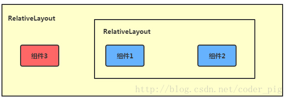
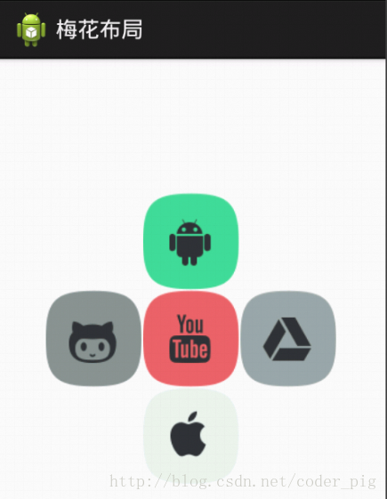
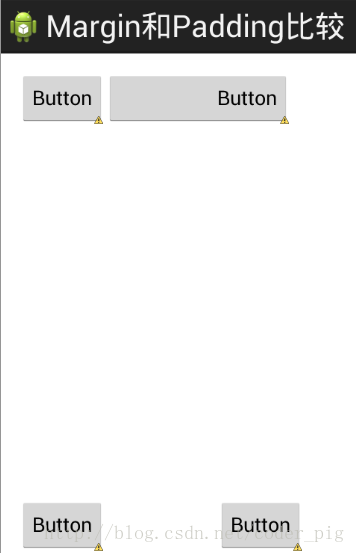
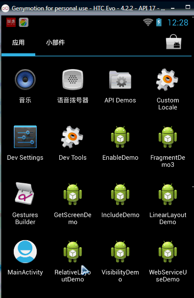

## 2.2.2 RelativeLayout(相对布局)

## 本节引言

------

在上一节中我们对LinearLayout进行了详细的解析，LinearLayout也是我们用的比较多的一个布局, 我们更多的时候更钟情于他的weight(权重)属性，等比例划分，对屏幕适配还是帮助蛮大的; 但是使用LinearLayout的时候也有一个问题，就是当界面比较复杂的时候，需要嵌套多层的 LinearLayout, 这样就会降低UI Render的效率(渲染速度), 而且如果是listview或者GridView上的item, 效率会更低, 另外太多层LinearLayout嵌套会占用更多的系统资源, 还有可能引发stackoverflow; 但是如果我们使用RelativeLayout的话, 可能仅仅需要一层就可以完成了, 以父容器或者兄弟组件参考+margin+padding就可以设置组件的显示位置, 是比较方便的! 当然, 也不是绝对的, 具体问题具体分析吧! 总结就是: **尽量使用RelativeLayout + LinearLayout的weight属性搭配使用**吧！

------

## 1.核心属性图


------

## 2.父容器定位属性示意图


------

## 3.根据兄弟组件定位

恩, 先说下什么是兄弟组件吧, 所谓的兄弟组件就是处于同一层次容器的组件, 如图



图中的组件1, 2就是兄弟组件了, 而组件3与组件1或组件2并不是兄弟组件, 所以组件3不能通过组件1或2来进行定位, 比如layout_toleftof = "组件1"这样是会报错的！切记！ 关于这个兄弟组件定位的最经典例子就是"梅花布局"了,下面代码实现下:

运行效果图：



实现代码：

```
<RelativeLayout xmlns:android="http://schemas.android.com/apk/res/android"    
    xmlns:tools="http://schemas.android.com/tools"    
    android:id="@+id/RelativeLayout1"    
    android:layout_width="match_parent"    
    android:layout_height="match_parent" >    
    
    <!-- 这个是在容器中央的 -->    
        
    <ImageView    
        android:id="@+id/img1"     
        android:layout_width="80dp"    
        android:layout_height="80dp"    
        android:layout_centerInParent="true"    
        android:src="@drawable/pic1"/>    
        
    <!-- 在中间图片的左边 -->    
    <ImageView    
        android:id="@+id/img2"     
        android:layout_width="80dp"    
        android:layout_height="80dp"    
        android:layout_toLeftOf="@id/img1"    
        android:layout_centerVertical="true"    
        android:src="@drawable/pic2"/>    
        
    <!-- 在中间图片的右边 -->    
    <ImageView    
        android:id="@+id/img3"     
        android:layout_width="80dp"    
        android:layout_height="80dp"    
        android:layout_toRightOf="@id/img1"    
        android:layout_centerVertical="true"    
        android:src="@drawable/pic3"/>    
        
    <!-- 在中间图片的上面-->    
    <ImageView    
        android:id="@+id/img4"     
        android:layout_width="80dp"    
        android:layout_height="80dp"    
        android:layout_above="@id/img1"    
        android:layout_centerHorizontal="true"    
        android:src="@drawable/pic4"/>    
        
    <!-- 在中间图片的下面 -->    
    <ImageView    
        android:id="@+id/img5"     
        android:layout_width="80dp"    
        android:layout_height="80dp"    
        android:layout_below="@id/img1"    
        android:layout_centerHorizontal="true"    
        android:src="@drawable/pic5"/>    
    
</RelativeLayout>
```

------

## 4.margin与padding的区别

初学者对于这两个属性可能会有一点混淆，这里区分下：首先margin代表的是偏移,  比如marginleft = "5dp"表示组件离容器左边缘偏移5dp; 而padding代表的则是填充, 而填充的对象针对的是组件中的元素, 比如TextView中的文字.  比如为TextView设置paddingleft = "5dp", 则是在组件里的元素的左边填充5dp的空间！ margin针对的是容器中的组件，而padding针对的是组件中的元素，要区分开来！ 下面通过简单的代码演示两者的区别:

比较示例代码如下：

```
<RelativeLayout xmlns:android="http://schemas.android.com/apk/res/android"    
    xmlns:tools="http://schemas.android.com/tools"    
    android:layout_width="match_parent"    
    android:layout_height="match_parent"    
    android:paddingBottom="@dimen/activity_vertical_margin"    
    android:paddingLeft="@dimen/activity_horizontal_margin"    
    android:paddingRight="@dimen/activity_horizontal_margin"    
    android:paddingTop="@dimen/activity_vertical_margin"    
    tools:context=".MainActivity" >    
    
    <Button    
        android:id="@+id/btn1"     
        android:layout_height="wrap_content"    
        android:layout_width="wrap_content"    
        android:text="Button"/>    
    <Button    
        android:paddingLeft="100dp"     
        android:layout_height="wrap_content"    
        android:layout_width="wrap_content"    
        android:text="Button"    
        android:layout_toRightOf="@id/btn1"/>    
        
    <Button    
        android:id="@+id/btn2"     
        android:layout_height="wrap_content"    
        android:layout_width="wrap_content"    
        android:text="Button"    
        android:layout_alignParentBottom="true"/>    
    <Button    
        android:layout_marginLeft="100dp"     
        android:layout_height="wrap_content"    
        android:layout_width="wrap_content"    
        android:text="Button"    
        android:layout_toRightOf="@id/btn2"     
        android:layout_alignParentBottom="true"/>    
        
</RelativeLayout> 
```

运行效果图比较：



------

## 5.很常用的一点: margin可以设置为负数

相信很多朋友都不知道一点吧，平时我们设置margin的时候都习惯了是正数的, 其实是可以用负数的, 下面写个简单的程序演示下吧, 模拟进入软件后, 弹出广告页面的, 右上角的cancle按钮的margin则是使用负数的！

效果图如下:



贴出的广告Activity的布局代码吧, 当然,如果你对这个有兴趣的话可以下下demo, 因为仅仅是实现效果, 所以代码会有些粗糙！

```
<RelativeLayout xmlns:android="http://schemas.android.com/apk/res/android"  
    xmlns:tools="http://schemas.android.com/tools"  
    android:layout_width="match_parent"  
    android:layout_height="match_parent"  
    tools:context="com.jay.example.relativelayoutdemo.MainActivity"   
    android:background="#00CCCCFF">  
  
    <ImageView  
        android:id="@+id/imgBack"  
        android:layout_width="200dp"  
        android:layout_height="200dp"  
        android:layout_centerInParent="true"  
        android:background="@drawable/myicon" />  
  
    <ImageView  
        android:id="@+id/imgCancle"  
        android:layout_width="28dp"  
        android:layout_height="28dp"  
        android:layout_alignRight="@id/imgBack"  
        android:layout_alignTop="@id/imgBack"  
        android:background="@drawable/cancel"  
        android:layout_marginTop="-15dp"  
        android:layout_marginRight="-10dp" />  
  
</RelativeLayout>  
```

------

## 本节小结：

关于RelativeLayout的详解就到这里，有什么纰漏，错误，好的建议，欢迎提出~ 最后提供下上面的demo代码供大家下载