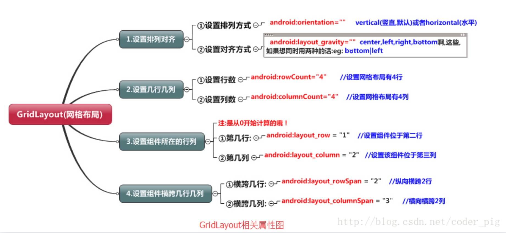

## 2.2.5 GridLayout(网格布局)


## 本节引言

今天要介绍的布局是Android 4.0以后引入的一个新的布局, 和前面所学的TableLayout(表格布局) 有点类似, 不过他有很多前者没有的东西, 也更加好用,

> - 可以自己设置布局中组件的排列方式
> - 可以自定义网格布局有多少行,多少列
> - 可以直接设置组件位于某行某列
> - 可以设置组件横跨几行或者几列

另外, 除了上述内容外, 本节还会给大家使用gridLayout时会遇到的问题, 以及如何解决低版本 sdk如何使用GridLayout的方法！接下来就开始本节的课程吧!

------

## 1.相关属性总结图



------

## 2.使用实例:计算器布局的实现:

**运行效果图：**


**实现代码:**

```
<GridLayout xmlns:android="http://schemas.android.com/apk/res/android"
    xmlns:tools="http://schemas.android.com/tools"
    android:id="@+id/GridLayout1"
    android:layout_width="wrap_content"
    android:layout_height="wrap_content"
    android:columnCount="4"
    android:orientation="horizontal"
    android:rowCount="6" >

    <TextView
        android:layout_columnSpan="4"
        android:layout_gravity="fill"
        android:layout_marginLeft="5dp"
        android:layout_marginRight="5dp"
        android:background="#FFCCCC"
        android:text="0"
        android:textSize="50sp" />

    <Button
        android:layout_columnSpan="2"
        android:layout_gravity="fill"
        android:text="回退" />

    <Button
        android:layout_columnSpan="2"
        android:layout_gravity="fill"
        android:text="清空" />

    <!-- 默认每个元素占据一个单元格，下面的元素各自占据一个单元格 -->
    <Button android:text="+" />

    <Button android:text="1" />

    <Button android:text="2" />

    <Button android:text="3" />

    <Button android:text="-" />

    <Button android:text="4" />

    <Button android:text="5" />

    <Button android:text="6" />

    <Button android:text="*" />

    <Button android:text="7" />

    <Button android:text="8" />

    <Button android:text="9" />

    <Button android:text="/" />

    <Button
        android:layout_width="wrap_content"
        android:text="." />

    <Button android:text="0" />

    <Button android:text="=" />

</GridLayout> 
```

**代码解析:** 代码很简单, 只是回退与清楚按钮横跨两列, 而其他的都是直接添加的, **默认每个组件都是占一行一列**, 另外还有一点要注意的: 我们通过:**android:layout_rowSpan**与**android:layout_columnSpan**设置了组件横跨多行或者多列的话, 如果你要让组件填满横越过的行或列的话,需要添加下面这个属性: **android:layout_gravity = "fill"**！！！就像这个计算机显示数字的部分!

------

## 3.用法归纳:

①GridLayout使用虚细线将布局划分为行, 列和单元格, 同时也支持在行, 列上进行交错排列 

②使用流程:

> - step 1:先定义组件的对齐方式 android:orientation 水平或者竖直, 设置多少行与多少列
> - step 2:设置组件所在的行或者列, 记得是从0开始算的, 不设置默认每个组件占一行一列
> - step 3:设置组件横跨几行或者几列; 设置完毕后, 需要在设置一个填充:android:layout_gravity = "fill"

------

## 4.使用GridLayout要注意的地方:

因为GirdLayout是4.0后才推出的, 所以minSDK版本要改为14或者以上的版本, 不然写布局代码的时候, 这玩意就会莫名其妙地出错, 说找不到这个GridLayout,  当然, 如果你要低版本兼容的话, 就要看下面的内容了！

------

## 5.低版本sdk如何使用GridLayout:

解决方法很简单:只需要导入v7包的gridlayout包即可! v7包一般在sdk下的:sdk\extras\android\support\v7\gridlayout目录下如果你没有的话, 也可以到这里下载: [gridlayout_v7_jay.rar ](https://www.runoob.com/wp-content/uploads/2015/07/gridlayout_v7_jay.rar)但是用的时候,标签却是这样写的:

```
<android.support.v7.widget.GridLayout>`
```

------

## 本节小结

关于GridLayout的介绍就到这里~