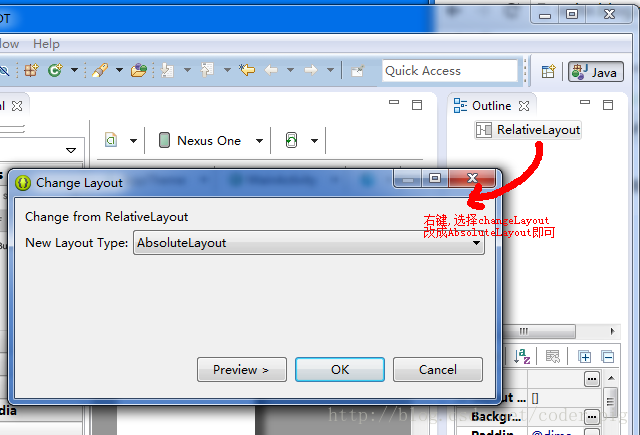
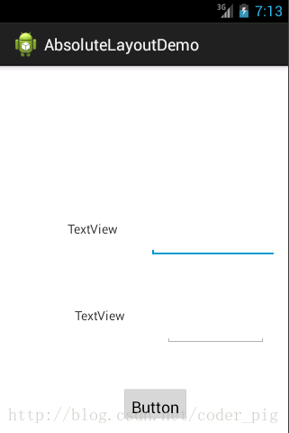
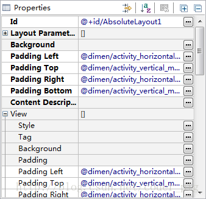
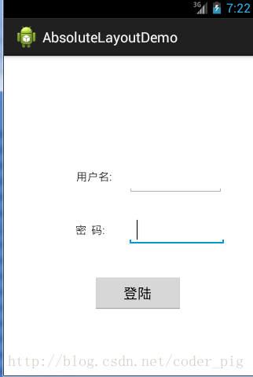
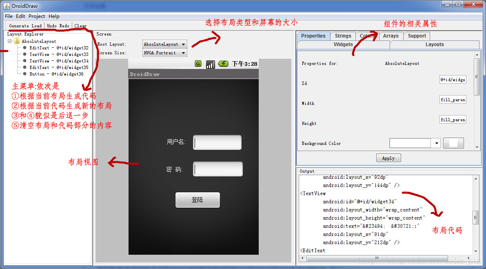

## 2.2.6 AbsoluteLayout(绝对布局)

## 本节引言

> 前面已经介绍了, Android中的五大布局, 在本节中会讲解第六个布局AbsoluteLayout(绝对布局), 之所以把这个放到最后, 是因为绝对布局, 我们基本上都是不会使用的, 当然你也可以直接跳过这一篇博文, 不过作为一个喜欢增长姿势的程序员, 我们还是可以了解这个AbsoluteLayout布局的,  相信大部分学过Java的都知道, 我们在Java swing(不是spring哦)都用过这个绝对布局, 但是Android 中我们用这个少的原因, 就是因为我们开发的应用需要在很多的机型上面进行一个适配,如果你使用了这个绝对布局的话, 可能你在4寸的手机上是显示正常的, 而换成5寸的手机,就可能出现偏移和变形, 所以的话, 这个还是不建议使用了, 当然, 如果你不会写代码的话, 又想玩玩android, 那么写布局的时候就可以通过ADT把需要的组件, 拖拉到界面上! 这个AbsoluteLayout是直接通过X, Y坐标来控制组件在Activity中的位置的！另外这个但单位是dp!

------

## 1.四大控制属性(单位都是dp):

**①控制大小:** **android:layout_width:**组件宽度 **android:layout_height:**组件高度 

**②控制位置:** **android:layout_x:**设置组件的X坐标 **android:layout_y:**设置组件的Y坐标

------

## 2.使用示例:

一个简单的登录界面,都是直接在ADT上拖拉出来的界面, 代码就不贴了:

①先设置成AbsoluteLayout绝对布局:

②从左边拖拉两个TextView和EditText以及一个按钮到界面上,拖来拖去,直到看上去好看点为止

拖拉拖去, 最后还是这个挫样, 估计是ADT的问题, 接下来你可以: ①进代码修改坐标,知道看上去好看点 ②当然,你也可以直接在右边设置坐标:

修改完后:

当然, 或许以上两种方法都不喜欢, 你想拖拉后就直接生成正确的代码~！ ok, 没问题, 推荐你使用前面界面原型那里给大家介绍的一个工具：DroidDraw 

------

## 本节小结

好的，Android中的六大布局都给大家介绍完了，还是建议使用：LinearLayout的weight权重属性 + RelativeLayout来构建我们的界面~嗯，就到这里，谢谢~