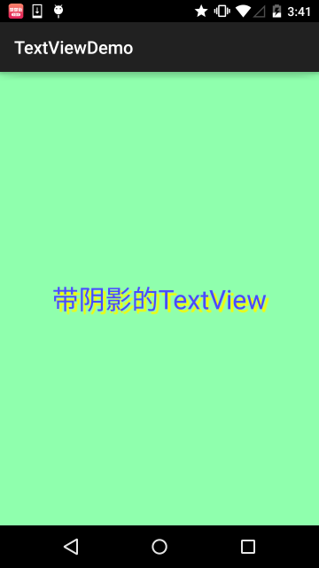
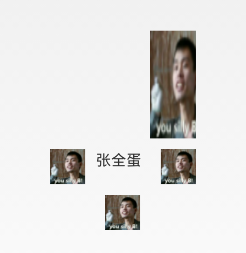

## 2.3.1 TextView(文本框)详解


## 本节引言：

> 学习完Android中的六大布局，从本节开始我们来一个个讲解Android中的UI控件，本节给大家带来的UI控件是：TextView(文本框)，用于显示文本的一个控件，另外声明一点，我不是翻译API文档，不会一个个属性的去扣，只学实际开发中常用的，有用的，大家遇到感觉到陌生的属性可以查询对应的API！当然，每一节开始都会贴这一节对应API文档的链接：[TextView API](https://developer.android.google.cn/reference/android/widget/TextView.html) 好了，在开始本节内容前，先要介绍下几个单位：
>
> **dp(dip):** device independent pixels(设备独立像素). 不同设备有不同的显示效果,这个和设备硬件有关，一般我们为了支持WVGA、HVGA和QVGA 推荐使用这个，不依赖像素。
>
> **px: pixels(像素)**. 不同设备显示效果相同，一般我们HVGA代表320x480像素，这个用的比较多。
>
>  **pt: point**，是一个标准的长度单位，1pt＝1/72英寸，用于印刷业，非常简单易用； 
>
> **sp: scaled pixels(放大像素)**. 主要用于字体显示best for textsize。

## 1.基础属性详解：

通过下面这个简单的界面，我们来了解几个最基本的属性：


布局代码：

```
<RelativeLayout xmlns:android="http://schemas.android.com/apk/res/android"
    xmlns:tools="http://schemas.android.com/tools"
    android:layout_width="match_parent"
    android:layout_height="match_parent"
    tools:context=".MainActivity"
    android:gravity="center"
    android:background="#8fffad">

    <TextView
        android:id="@+id/txtOne"
        android:layout_width="200dp"
        android:layout_height="200dp"
        android:gravity="center"
        android:text="TextView(显示框)"
        android:textColor="#EA5246"
        android:textStyle="bold|italic"
        android:background="#000000"
        android:textSize="18sp" />

</RelativeLayout>
```

上面的TextView中有下述几个属性:

- **id：**为TextView设置一个组件id，根据id，我们可以在Java代码中通过findViewById()的方法获取到该对象，然后进行相关属性的设置，又或者使用RelativeLayout时，参考组件用的也是id！
- **layout_width：**组件的宽度，一般写：**wrap_content**或者**match_parent(fill_parent)**，前者是控件显示的内容多大，控件就多大，而后者会填满该控件所在的父容器；当然也可以设置成特定的大小，比如我这里为了显示效果，设置成了200dp。
- **layout_height：**组件的高度，内容同上。
- **gravity：**设置控件中内容的对齐方向，TextView中是文字，ImageView中是图片等等。
- **text：**设置显示的文本内容，一般我们是把字符串写到string.xml文件中，然后通过@String/xxx取得对应的字符串内容的，这里为了方便我直接就写到""里，不建议这样写！！！
- **textColor：**设置字体颜色，同上，通过colors.xml资源来引用，别直接这样写！
- **textStyle：**设置字体风格，三个可选值：**normal**(无效果)，**bold**(加粗)，**italic**(斜体)
- **textSize：**字体大小，单位一般是用sp！
- **background：**控件的背景颜色，可以理解为填充整个控件的颜色，可以是图片哦！

------

## 2.实际开发例子

### 2.1 带阴影的TextView

涉及到的几个属性：

- **android:shadowColor:**设置阴影颜色,需要与shadowRadius一起使用哦!
- **android:shadowRadius:**设置阴影的模糊程度,设为0.1就变成字体颜色了,建议使用3.0
- **android:shadowDx:**设置阴影在水平方向的偏移,就是水平方向阴影开始的横坐标位置
- **android:shadowDy:**设置阴影在竖直方向的偏移,就是竖直方向阴影开始的纵坐标位置

效果图：



实现代码：

```
<TextView
        android:layout_width="wrap_content"
        android:layout_height="wrap_content"
        android:layout_centerInParent="true"
        android:shadowColor="#F9F900"
        android:shadowDx="10.0"
        android:shadowDy="10.0"
        android:shadowRadius="3.0"
        android:text="带阴影的TextView"
        android:textColor="#4A4AFF"
        android:textSize="30sp" />
```

------

### 2.2 带边框的TextView：

> 如果你想为TextView设置一个边框背景，普通矩形边框或者圆角边框！下面可能帮到你！ 另外TextView是很多其他控件的父类，比如Button，也可以设置这样的边框！ 实现原理很简单，自行编写一个ShapeDrawable的资源文件！然后TextView将blackgroung 设置为这个drawable资源即可！

简单说下shapeDrawable资源文件的几个节点以及属性：

> - <**solid** android:color = "xxx"> 这个是设置背景颜色的
> - <**stroke** android:width = "xdp" android:color="xxx"> 这个是设置边框的粗细,以及边框颜色的
> - <**padding** androidLbottom = "xdp"...> 这个是设置边距的
> - <**corners** android:topLeftRadius="10px"...> 这个是设置圆角的
> - <**gradient**> 这个是设置渐变色的,可选属性有: **startColor**:起始颜色 **endColor**:结束颜色 **centerColor**:中间颜色 **angle**:方向角度,**等于0时,从左到右,然后逆时针方向转,当angle = 90度时从下往上** **type**:设置渐变的类型

实现效果图：


代码实现：

Step 1:编写矩形边框的Drawable：

```
<?xml version="1.0" encoding="utf-8"?>
<shape xmlns:android="http://schemas.android.com/apk/res/android" >

    <!-- 设置一个黑色边框 -->
    <stroke android:width="2px" android:color="#000000"/>
    <!-- 渐变 -->
    <gradient
        android:angle="270"
        android:endColor="#C0C0C0"
        android:startColor="#FCD209" />
    <!-- 设置一下边距,让空间大一点 -->
    <padding
        android:left="5dp"
        android:top="5dp"
        android:right="5dp"
        android:bottom="5dp"/>

</shape> 
```

Step 2:编写圆角矩形边框的Drawable：

```
<?xml version="1.0" encoding="utf-8"?>
<shape xmlns:android="http://schemas.android.com/apk/res/android">

    <!-- 设置透明背景色 -->
    <solid android:color="#87CEEB" />

    <!-- 设置一个黑色边框 -->
    <stroke
        android:width="2px"
        android:color="#000000" />
    <!-- 设置四个圆角的半径 -->
    <corners
        android:bottomLeftRadius="10px"
        android:bottomRightRadius="10px"
        android:topLeftRadius="10px"
        android:topRightRadius="10px" />
    <!-- 设置一下边距,让空间大一点 -->
    <padding
        android:bottom="5dp"
        android:left="5dp"
        android:right="5dp"
        android:top="5dp" />
        
</shape>
```

Step 3:将TextView的blackground属性设置成上面这两个Drawable：

```
<LinearLayout xmlns:android="http://schemas.android.com/apk/res/android"
    xmlns:tools="http://schemas.android.com/tools"
    android:layout_width="match_parent"
    android:layout_height="match_parent"
    android:background="#FFFFFF"
    android:gravity="center"
    android:orientation="vertical"
    tools:context=".MainActivity">

    <TextView
        android:id="@+id/txtOne"
        android:layout_width="200dp"
        android:layout_height="64dp"
        android:textSize="18sp"
        android:gravity="center"
        android:background="@drawable/txt_rectborder"
        android:text="矩形边框的TextView" />

    <TextView
        android:id="@+id/txtTwo"
        android:layout_width="200dp"
        android:layout_height="64dp"
        android:layout_marginTop="10dp"
        android:textSize="18sp"
        android:gravity="center"
        android:background="@drawable/txt_radiuborder"
        android:text="圆角边框的TextView" />


</LinearLayout>
```

### 2.3 带图片(drawableXxx)的TextView：

在实际开发中，我们可能会遇到这种需求：


如图，要实现这种效果，可能你的想法是：一个ImageView用于显示图片 + 一个TextView用于显示文字，然后把他们丢到一个LinearLayout中，接着依次创建四个这样的小布局，再另外放到一个大的LinearLayout中，效果是可以实现，但是会不会有点繁琐呢？而且前面我们前面也说过，布局层次越少，性能越好！使用drawableXxx就可以省掉上面的过程，直接设置四个TextView就可以完成我们的需求！

**基本用法：**

设置图片的核心其实就是:**drawableXxx**; 可以设置四个方向的图片: **drawableTop**(上), **drawableButtom**(下), **drawableLeft**(左), **drawableRight**(右) 另外,你也可以使用**drawablePadding**来设置图片与文字间的间距！

**效果图**：(设置四个方向上的图片)


**实现代码：**

```
<RelativeLayout xmlns:android="http://schemas.android.com/apk/res/android"  
    xmlns:tools="http://schemas.android.com/tools"  
    android:layout_width="match_parent"  
    android:layout_height="match_parent"  
    tools:context="com.jay.example.test.MainActivity" >  
  
    <TextView  
        android:layout_width="wrap_content"  
        android:layout_height="wrap_content"  
        android:layout_centerInParent="true"  
        android:drawableTop="@drawable/show1"  
        android:drawableLeft="@drawable/show1"  
        android:drawableRight="@drawable/show1"  
        android:drawableBottom="@drawable/show1"  
        android:drawablePadding="10dp"  
        android:text="张全蛋" />  
  
</RelativeLayout> 
```

**一些问题：** 可能你会发现，我们这样设置的drawable并不能自行设置大小，在XML是无法直接设置的； 所以我们需要在Java代码中来进行一个修改！

示例代码如下：

```
package com.jay.example.test;  
  
import android.app.Activity;  
import android.graphics.drawable.Drawable;  
import android.os.Bundle;  
import android.widget.TextView;  
  
public class MainActivity extends Activity {  
    private TextView txtZQD;  
  
    @Override  
    protected void onCreate(Bundle savedInstanceState) {  
        super.onCreate(savedInstanceState);  
        setContentView(R.layout.activity_main);  
        txtZQD = (TextView) findViewById(R.id.txtZQD);  
        Drawable[] drawable = txtZQD.getCompoundDrawables();  
        // 数组下表0~3,依次是:左上右下  
        drawable[1].setBounds(100, 0, 200, 200);  
        txtZQD.setCompoundDrawables(drawable[0], drawable[1], drawable[2],  
                drawable[3]);  
    }  
} 
```

运行效果图：



**代码分析：**

> - ①Drawable[] drawable = txtZQD.getCompoundDrawables( ); 获得四个不同方向上的图片资源,数组元素依次是:左上右下的图片
> - ②drawable[1].setBounds(100, 0, 200, 200); 接着获得资源后,可以调用setBounds设置左上右下坐标点,比如这里设置了代表的是: 长是:从离文字最左边开始100dp处到200dp处 宽是:从文字上方0dp处往上延伸200dp!
> - ③txtZQD.setCompoundDrawables(drawable[0], drawable[1], drawable[2], drawable[3]);为TextView重新设置drawable数组!没有图片可以用null代替哦! PS：另外，从上面看出我们也可以直接在Java代码中调用setCompoundDrawables为 TextView设置图片！

------

### 2.4 使用autoLink属性识别链接类型

当文字中出现了URL，E-Mail，电话号码，地图的时候，我们可以通过设置autoLink属性；当我们点击文字中对应部分的文字，即可跳转至某默认APP，比如一串号码，点击后跳转至拨号界面！


看下效果图：


all就是全部都包含,自动识别协议头~ 在Java代码中可以调用setAutoLinkMask(Linkify.ALL); 这个时候可以不写协议头,autolink会自动识别，但是还要为这个TextView设置： setMovementMethod(LinkMovementMethod.getInstance()); 不然点击了是没效果的！

------

### 2.5 TextView玩转HTML

> 如题，除了显示普通文本外，TextView还预定义了一些类似于HTML的标签，通过这些标签，我们可以使 TextView显示不同的字体颜色，大小，字体，甚至是显示图片，或者链接等！我们只要使用HTML中的一些标签，加上android.text.HTML类的支持，即可完成上述功能！

PS:当然，并不是支持所有的标签，常用的有下述这些：

> - <**font**>：设置颜色和字体。
> - <**big**>：设置字体大号
> - <**small**>：设置字体小号
> - <**i**><**b**>：斜体粗体
> - <**a**>：连接网址
> - <**img**>：图片

如果直接setText的话是没作用的，我们需要调用Html.fromHtml()方法将字符串转换为CharSequence接口， 然后再进行设置，如果我们需要相应设置，需要为TextView进行设置，调用下述方法： `Java setMovementMethod(LinkMovementMethod.getInstance())`

嗯，接着我们写代码来试试：

**1）测试文本与超链接标签**

```
package jay.com.example.textviewdemo;

import android.os.Bundle;
import android.support.v7.app.AppCompatActivity;
import android.text.Html;
import android.text.method.LinkMovementMethod;
import android.text.util.Linkify;
import android.widget.TextView;

public class MainActivity extends AppCompatActivity {

    @Override
    protected void onCreate(Bundle savedInstanceState) {
        super.onCreate(savedInstanceState);
        setContentView(R.layout.activity_main);
        TextView t1 = (TextView)findViewById(R.id.txtOne);
        String s1 = "<font color='blue'><b>百度一下，你就知道~：</b></font><br>";
        s1 += "<a href = 'http://www.baidu.com'>百度</a>";
        t1.setText(Html.fromHtml(s1));
        t1.setMovementMethod(LinkMovementMethod.getInstance());
    }
}
```

运行效果图：


恩呢，测试完毕~

**2）测试src标签，插入图片：**

看下运行效果图：


接下来看下实现代码，实现代码看上去有点复杂，用到了反射(对了，别忘了在drawable目录下放一个icon的图片哦！)：

```
public class MainActivity extends AppCompatActivity {
    @Override
    protected void onCreate(Bundle savedInstanceState) {
        super.onCreate(savedInstanceState);
        setContentView(R.layout.activity_main);
        TextView t1 = (TextView)findViewById(R.id.txtOne);
        String s1 = "图片：<br>";
        t1.setText(Html.fromHtml(s1, new Html.ImageGetter() {
            @Override
            public Drawable getDrawable(String source) {
                Drawable draw = null;
                try {
                    Field field = R.drawable.class.getField(source);
                    int resourceId = Integer.parseInt(field.get(null).toString());
                    draw = getResources().getDrawable(resourceId);
                    draw.setBounds(0, 0, draw.getIntrinsicWidth(), draw.getIntrinsicHeight());
                } catch (Exception e) {
                    e.printStackTrace();
                }
                return draw;
            }
        }, null));
    }
}
```

嘿嘿，你也可以自己试试，比如为图片加上超链接，点击图片跳转这样~

### 2.6 SpannableString&SpannableStringBuilder定制文本

> 除了上面的HTML可以定制我们TextView的样式外，还可以使用SpannableString和SpannableStringBuilder来完成，两者区别：前者针对的是不可变文本，而后者则是针对可变文本，这里只讲解前者，对后者有兴趣可自行查阅文本！

SpannableString可供我们使用的API有下面这些：

> - **BackgroundColorSpan** 背景色
> - **ClickableSpan** 文本可点击，有点击事件
> - **ForegroundColorSpan** 文本颜色（前景色）
> - **MaskFilterSpan** 修饰效果，如模糊(BlurMaskFilter)、浮雕(EmbossMaskFilter)
> - **MetricAffectingSpan** 父类，一般不用
> - **RasterizerSpan** 光栅效果
> - **StrikethroughSpan** 删除线（中划线）
> - **SuggestionSpan** 相当于占位符
> - **UnderlineSpan** 下划线
> - **AbsoluteSizeSpan** 绝对大小（文本字体）
> - **DynamicDrawableSpan** 设置图片，基于文本基线或底部对齐。
> - **ImageSpan** 图片
> - **RelativeSizeSpan** 相对大小（文本字体）
> - **ReplacementSpan** 父类，一般不用
> - **ScaleXSpan** 基于x轴缩放
> - **StyleSpan** 字体样式：粗体、斜体等
> - **SubscriptSpan** 下标（数学公式会用到）
> - **SuperscriptSpan** 上标（数学公式会用到）
> - **TextAppearanceSpan** 文本外貌（包括字体、大小、样式和颜色）
> - **TypefaceSpan** 文本字体
> - **URLSpan** 文本超链接

好吧，还是蛮多的，这里给出个最简单的例子吧，其他的参数调用可自行百度谷歌~ 

**1）最简单例子：** 运行效果图：


实现代码：

```
public class MainActivity extends AppCompatActivity {

    @Override
    protected void onCreate(Bundle savedInstanceState) {
        super.onCreate(savedInstanceState);
        setContentView(R.layout.activity_main);
        TextView t1 = (TextView) findViewById(R.id.txtOne);
        TextView t2 = (TextView) findViewById(R.id.txtTwo);

        SpannableString span = new SpannableString("红色打电话斜体删除线绿色下划线图片:.");
        
        //1.设置背景色,setSpan时需要指定的flag,Spanned.SPAN_EXCLUSIVE_EXCLUSIVE(前后都不包括)
        span.setSpan(new ForegroundColorSpan(Color.RED), 0, 2, Spanned.SPAN_EXCLUSIVE_EXCLUSIVE);
        
        //2.用超链接标记文本
        span.setSpan(new URLSpan("tel:4155551212"), 2, 5, Spanned.SPAN_EXCLUSIVE_EXCLUSIVE);
        
        //3.用样式标记文本（斜体）
        span.setSpan(new StyleSpan(Typeface.BOLD_ITALIC), 5, 7, Spanned.SPAN_EXCLUSIVE_EXCLUSIVE);
        
        //4.用删除线标记文本
        span.setSpan(new StrikethroughSpan(), 7, 10, Spanned.SPAN_EXCLUSIVE_EXCLUSIVE);
        
        //5.用下划线标记文本
        span.setSpan(new UnderlineSpan(), 10, 16, Spanned.SPAN_EXCLUSIVE_EXCLUSIVE);
        
        //6.用颜色标记
        span.setSpan(new ForegroundColorSpan(Color.GREEN), 10, 13,Spanned.SPAN_EXCLUSIVE_EXCLUSIVE);
        
        //7.//获取Drawable资源
        Drawable d = getResources().getDrawable(R.drawable.icon);
        d.setBounds(0, 0, d.getIntrinsicWidth(), d.getIntrinsicHeight());
        
        //8.创建ImageSpan,然后用ImageSpan来替换文本
        ImageSpan imgspan = new ImageSpan(d, ImageSpan.ALIGN_BASELINE);
        span.setSpan(imgspan, 18, 19, Spannable.SPAN_INCLUSIVE_EXCLUSIVE);
        t1.setText(span);
    }
}
```

**2）实现部分可点击的TextView** 相信玩过QQ空间和微信朋友圈的朋友对下面的东东并不陌生吧，我们可以点击 对应的用户然后进入查看用户相关的信息是吧！


下面我们就来写个简单的例子来实现下效果：

```
public class MainActivity extends AppCompatActivity {

    @Override
    protected void onCreate(Bundle savedInstanceState) {
        super.onCreate(savedInstanceState);
        setContentView(R.layout.activity_main);
        TextView t1 = (TextView)findViewById(R.id.txtOne);

        StringBuilder sb = new StringBuilder();
        for (int i = 0; i < 20; i++) {
            sb.append("好友" + i + "，");
        }

        String likeUsers = sb.substring(0, sb.lastIndexOf("，")).toString();
        t1.setMovementMethod(LinkMovementMethod.getInstance());
        t1.setText(addClickPart(likeUsers), TextView.BufferType.SPANNABLE);
    }

    //定义一个点击每个部分文字的处理方法
    private SpannableStringBuilder addClickPart(String str) {
        //赞的图标，这里没有素材，就找个笑脸代替下~
        ImageSpan imgspan = new ImageSpan(MainActivity.this, R.drawable.ic_widget_face);
        SpannableString spanStr = new SpannableString("p.");
        spanStr.setSpan(imgspan, 0, 1, Spannable.SPAN_INCLUSIVE_EXCLUSIVE);

        //创建一个SpannableStringBuilder对象，连接多个字符串
        SpannableStringBuilder ssb = new SpannableStringBuilder(spanStr);
        ssb.append(str);
        String[] likeUsers = str.split("，");
        if (likeUsers.length > 0) {
            for (int i = 0; i < likeUsers.length; i++) {
                final String name = likeUsers[i];
                final int start = str.indexOf(name) + spanStr.length();
                ssb.setSpan(new ClickableSpan() {
                    @Override
                    public void onClick(View widget) {
                        Toast.makeText(MainActivity.this, name,
                                Toast.LENGTH_SHORT).show();
                    }

                    @Override
                    public void updateDrawState(TextPaint ds) {
                        super.updateDrawState(ds);
                        //删除下划线，设置字体颜色为蓝色
                        ds.setColor(Color.BLUE);
                        ds.setUnderlineText(false);
                    }
                }, start, start + name.length(), 0);
            }
        }
        return ssb.append("等" + likeUsers.length + "个人觉得很赞");
    }
}
```

运行效果图：


核心其实就是：ClickableSpan的设置而已~你可以自己捣鼓着写下QQ空间评论的那个自己写一个~

### 2.7 实现跑马灯效果的TextView

简单说下什么是跑马灯，就是类似于web一样，有一行字一直循环滚滚动这样，好吧还是看看实现效果图，一看就懂的了~

实现效果图：


代码实现：

```
<TextView
        android:id="@+id/txtOne"
        android:layout_width="match_parent"
        android:layout_height="wrap_content"
        android:textSize="18sp"
        android:singleLine="true"
        android:ellipsize="marquee"
        android:marqueeRepeatLimit="marquee_forever"
        android:focusable="true"
        android:focusableInTouchMode="true"
        android:text="你整天说着日了狗日了狗，但是你却没有来，呵呵呵呵呵呵呵呵呵呵~"/>
```

### 2.8 设置TextView字间距和行间距

就像我们平时编写文档的时候，我们需要排版，设置下行或者字之间的间距是吧： Android中的TextView也可以进行这样的设置：

**字间距：**

```
android:textScaleX：控制字体水平方向的缩放，默认值1.0f，值是float
Java中setScaleX(2.0f); 
```

**行间距：** Android系统中TextView默认显示中文时会比较紧凑，为了让每行保持的行间距

> **android:lineSpacingExtra：**设置行间距，如"3dp" 
>
> **android:lineSpacingMultiplier：**设置行间距的倍数，如"1.2"

Java代码中可以通过: **setLineSpacing**方法来设置

### 2.9 自动换行

自动换行通过 **android:singleLine** 设置，默认为 false。

如需要自动换行，可以用：

```
android:singleLine = "false"
```

如果要在一行显示完，不换行，可以用：

```
android:singleLine = "true"
```

除此之外，可以也设置多行显示不完，添加个maxLines的属性即可！

## 3.本节小结：

本节对Android中的TextView控件进行了详细的解析，提供了开发中常见的一些问题的解决方法，相信 会为你的实际开发带来大大的便利，另外，笔者能力有限，写出来的东西可能有些纰漏，欢迎指出， 不胜感激~另外，转载请注明出处：coder-pig！谢谢~

