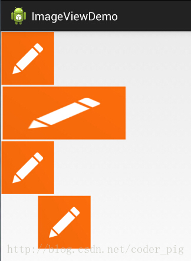
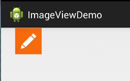
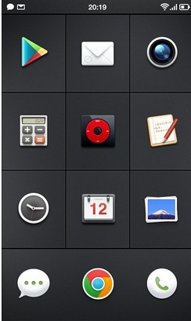
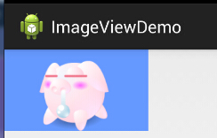
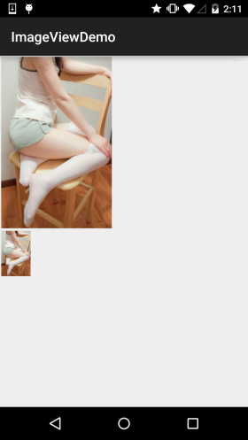
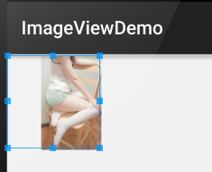
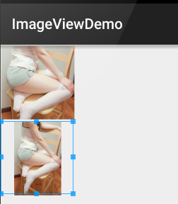
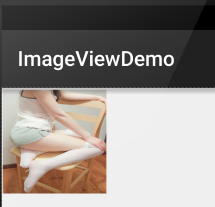
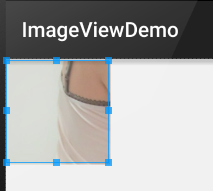
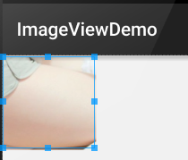

## 2.3.4 ImageView(图像视图)

### 

## 本节引言：

本节介绍的UI基础控件是：ImageView(图像视图)，见名知意，就是用来显示图像的一个View或者说控件！ 官方API:[ImageView](http://androiddoc.qiniudn.com/reference/android/widget/ImageView.html/androiddoc.qiniudn.com/reference/android/widget/ImageView.html);本节讲解的内容如下：

1. ImageView的src属性和blackground的区别；
2. adjustViewBounds设置图像缩放时是否按长宽比
3. scaleType设置缩放类型
4. 最简单的绘制圆形的ImageView

------

## 1.src属性和background属性的区别：

> 在API文档中我们发现ImageView有两个可以设置图片的属性，分别是：src和background
>
> **常识：**
>
> ①background通常指的都是**背景**,而src指的是**内容**!!
>
> ②当使用**src**填入图片时,是按照图片大小**直接填充**,并**不会进行拉伸**
>
> 而使用background填入图片,则是会根据ImageView给定的宽度来进行**拉伸**

### 1)写代码验证区别：

写个简单的布局测试下：

```
<LinearLayout xmlns:android="http://schemas.android.com/apk/res/android"  
    xmlns:tools="http://schemas.android.com/tools"  
    android:id="@+id/LinearLayout1"  
    android:layout_width="match_parent"  
    android:layout_height="match_parent"  
    android:orientation="vertical"  
    tools:context="com.jay.example.imageviewdemo.MainActivity" >  
  
    <ImageView  
        android:layout_width="wrap_content"  
        android:layout_height="wrap_content"  
        android:background="@drawable/pen" />  
  
    <ImageView  
        android:layout_width="200dp"  
        android:layout_height="wrap_content"  
        android:background="@drawable/pen" />  
  
    <ImageView  
        android:layout_width="wrap_content"  
        android:layout_height="wrap_content"  
        android:src="@drawable/pen" />  
  
    <ImageView  
        android:layout_width="200dp"  
        android:layout_height="wrap_content"  
        android:src="@drawable/pen" />  
  
</LinearLayout> 
```

**效果图如下：**



**结果分析：**

宽高都是wrap_content那就一样, 是原图大小, 但是,当我们固定了宽或者高的话, 差别就显而易见了 ,blackground完全填充了整个ImageView, 而src依旧是那么大, 而且他居中了哦, 这就涉及到了ImageView的另一个属性scaleType了! 另外还有一点, 这里我们说了只设置width或者height哦！加入我们同时设置了 width和height的话, blackground依旧填充, 但是, src的大小可能发生改变哦! 比如,我们测试下下面这段代码:

```
<ImageView  
        android:layout_width="100dp"  
        android:layout_height="50dp"  
        android:src="@drawable/pen" />
```

**运行效果图：**



PS:scaleType下面会讲~

------

### 2)解决background拉伸导致图片变形的方法

在前面的效果图中的第二个Imageview中我们可以看到图片已经被拉伸变形了,  正方形变成了长方形, 对于和我一样有轻微强迫症的人来说,显然是不可接受的, 有没有办法去设置呢? 答案肯定是有的, 笔者暂时知道的有以下两种方式:

- 这个适用于动态加载ImageView的, 代码也简单, 只要在添加View的时候, 把大小写死就可以了

  ```
  LinearLayout.LayoutParams layoutParam = new LinearLayout.LayoutParams(48, 48);    
          layout.addView(ibtnPen, layoutParam); 
  ```

- 除了动态加载view, 更多的时候, 我们还是会通过xml布局的方式引入ImageView的 解决方法也不难, 就是通过drawable的Bitmap资源文件来完成, 然后blackground属性设置为该文件即可! 这个xml文件在drawable文件夹下创建,这个文件夹是要自己创建的哦!！

**pen_bg.xml:**

```
<bitmap  
    xmlns:android="http://schemas.android.com/apk/res/android"  
    android:id="@id/pen_bg"  
    android:gravity="top"  
    android:src="@drawable/pen"  
    android:tileMode="disabled" >  
</bitmap>
```

> 上述代码并不难理解,估计大家最迷惑的是titleMode属性吧,这个属性是平铺,就是我们windows设置背景时候的平铺,多个小图标铺满整个屏幕捏！记得了吧！不记得自己可以试试!disabled就是把他给禁止了!
>
> 就是上面这串简单的代码,至于调用方法如下:
>
> 动态: ibtnPen.setBacklgroundResource(R.drawable.penbg);
>
> 静态: android:background = "@drawable/penbg"

------

### 3)设置透明度的问题

> 说完前面两个区别, 接着再说下setAlpha属性咯!这个很简单, 这个属性, **只有src时才是有效果的!!**

------

### 4)两者结合妙用:

网上的一张图：



一看去是一个简单的GridView, 每个item都是一个ImageView, 但是细心的你可能发现了, 上面的ICON都不是规则的, 而是圆形, 圆角矩形等等,于是乎这里用到了src + background了！ 要实现上述的效果, 你只需要两个操作: **找一张透明的png图片 + 设置一个黑色的背景** (当然你也可以设置png的透明度来实现,不过结果可能和预想的有出入哦!) 我们写个简单例子：



如图，呆萌呆萌的小猪就这样显示到ImageView上了, 哈哈, blackground设置了蓝色背景!

**实现代码：**

```
<ImageView  
    android:layout_width="150dp"  
    android:layout_height="wrap_content"  
    android:src="@drawable/pig"  
    android:background="#6699FF" /> 
```

PS: 当然你也可以用selctor实现点击效果,设置不同的情况设置不同的图片,以实现点击或者触摸效果!

------

### 5)Java代码中设置blackground和src属性:

> 前景(对应src属性): **setImageDrawable**( );
> 背景(对应background属性): **setBackgroundDrawable**( );

------

## 2. adjustViewBounds设置缩放是否保存原图长宽比

> ImageView为我们提供了**adjustViewBounds**属性，用于设置缩放时是否保持原图长宽比！ 单独设置不起作用，需要配合**maxWidth**和**maxHeight**属性一起使用！而后面这两个属性 也是需要adjustViewBounds为true才会生效的~
>
> - android:maxHeight: 设置ImageView的最大高度
> - android:maxWidth: 设置ImageView的最大宽度

代码示例：

```
<LinearLayout xmlns:android="http://schemas.android.com/apk/res/android"
    xmlns:tools="http://schemas.android.com/tools"
    android:layout_width="match_parent"
    android:layout_height="match_parent"
    android:orientation="vertical"
    tools:context=".MainActivity">

    <!-- 正常的图片 -->
    <ImageView
        android:id="@+id/imageView1"
        android:layout_width="wrap_content"
        android:layout_height="wrap_content"
        android:layout_margin="5px"
        android:src="@mipmap/meinv" />
    <!-- 限制了最大宽度与高度,并且设置了调整边界来保持所显示图像的长宽比-->
    <ImageView
        android:id="@+id/imageView2"
        android:layout_width="wrap_content"
        android:layout_height="wrap_content"
        android:layout_margin="5px"
        android:adjustViewBounds="true"
        android:maxHeight="200px"
        android:maxWidth="200px"
        android:src="@mipmap/meinv" />

</LinearLayout>
```

**运行效果图：**



**结果分析：** 大的那个图片是没有任何处理的图片, 尺寸是:541*374; 而下面的那个的话我们通过maxWidth和maxHeight 限制ImageView最大宽度与高度为200px，就是最多只能显示200*200的图片,我们又设置了一个 **adjustViewBounds = "true"**调整我们的边界来保持图片的长宽比, 此时的ImageView宽高为是128*200~

------

## 3.scaleType设置缩放类型

> android:scaleType用于设置显示的图片如何缩放或者移动以适应ImageView的大小 Java代码中可以通过imageView.setScaleType(ImageView.ScaleType.CENTER);来设置~ 可选值如下：
>
> - **fitXY**:对图像的横向与纵向进行独立缩放,使得该图片完全适应ImageView,但是图片的横纵比可能会发生改变
> - **fitStart**:保持纵横比缩放图片,知道较长的边与Image的编程相等,缩放完成后将图片放在ImageView的左上角
> - **fitCenter**:同上,缩放后放于中间;
> - **fitEnd**:同上,缩放后放于右下角;
> - **center**:保持原图的大小，显示在ImageView的中心。当原图的size大于ImageView的size，超过部分裁剪处理。
> - **centerCrop**:保持横纵比缩放图片,知道完全覆盖ImageView,可能会出现图片的显示不完全
> - **centerInside**:保持横纵比缩放图片,直到ImageView能够完全地显示图片
> - **matrix**:默认值，不改变原图的大小，从ImageView的左上角开始绘制原图， 原图超过ImageView的部分作裁剪处理

接下来我们一组组的来对比：

------

### 1)1.fitEnd,fitStart,fitCenter

这里以fitEnd为例，其他两个类似：

**示例代码：**

```
<!-- 保持图片的横纵比缩放,知道该图片能够显示在ImageView组件上,并将缩放好的图片显示在imageView的右下角 -->
    <ImageView
        android:id="@+id/imageView3"
        android:layout_width="300px"
        android:layout_height="300px"
        android:layout_margin="5px"
        android:scaleType="fitEnd"
        android:src="@mipmap/meinv" />
```

**运行效果图：**



------

### 2)centerCrop与centerInside

- centerCrop:按横纵比缩放,直接完全覆盖整个ImageView
- centerInside:按横纵比缩放,使得ImageView能够完全显示这个图片

示例代码：

```
<ImageView
        android:layout_width="300px"
        android:layout_height="300px"
        android:layout_margin="5px"
        android:scaleType="centerCrop"
        android:src="@mipmap/meinv" />

    <ImageView
        android:layout_width="300px"
        android:layout_height="300px"
        android:layout_margin="5px"
        android:scaleType="centerInside"
        android:src="@mipmap/meinv" />
```

**运行效果图：**



------

### 3)fitXY

不按比例缩放图片，目标是把图片塞满整个View

**示例代码：**

```
<ImageView
        android:layout_width="300px"
        android:layout_height="300px"
        android:layout_margin="5px"
        android:scaleType="fixXY"
        android:src="@mipmap/meinv" />
```

运行效果图：



好吧，明显扁了=-=~

------

### 4)matrix

从ImageView的左上角开始绘制原图，原图超过ImageView的部分作裁剪处理

示例代码：

```
<ImageView
        android:layout_width="300px"
        android:layout_height="300px"
        android:layout_margin="5px"
        android:scaleType="matrix"
        android:src="@mipmap/meinv" />
```

**运行效果图：**



------

### 5)center

保持原图的大小，显示在ImageView的中心。当原图的size大于ImageView的size，超过部分裁剪处理。

**示例代码：**

```
<ImageView
        android:layout_width="300px"
        android:layout_height="300px"
        android:layout_margin="5px"
        android:scaleType="center"
        android:src="@mipmap/meinv" />
```

运行效果图：



------

## 4.最简单的绘制圆形的ImageView

相信大家对圆形或者圆角的ImageView不陌生吧，现在很多的APP都很喜欢圆形的头像是吧~

这里就简单的写个圆形的ImageView吧，当然这只是一个示例，再不考虑性能与抗锯齿的情况下！！！

可以说是写来玩玩，实际项目的话可以考虑用Github上牛人写的控件，比如下面这两个：

git怎么玩前面已经教过大家了~把项目clone下来把相关文件复制到自己的项目即可~

[RoundedImageView](https://github.com/vinc3m1/RoundedImageView)

[CircleImageView](https://github.com/hdodenhof/CircleImageView)

代码示例：

运行效果图：


实现代码：

自定义ImageView：**RoundImageView.java

```
package com.jay.demo.imageviewdemo;

import android.content.Context;
import android.graphics.Bitmap;
import android.graphics.Canvas;
import android.graphics.Paint;
import android.graphics.PaintFlagsDrawFilter;
import android.graphics.Path;
import android.graphics.Rect;
import android.graphics.Region;
import android.util.AttributeSet;
import android.widget.ImageView;

/**
 * Created by coder-pig on 2015/7/18 0018.
 */
public class RoundImageView extends ImageView {

    private Bitmap mBitmap;
    private Rect mRect = new Rect();
    private PaintFlagsDrawFilter pdf = new PaintFlagsDrawFilter(0, Paint.ANTI_ALIAS_FLAG);
    private Paint mPaint = new Paint();
    private Path mPath=new Path();
    public RoundImageView(Context context, AttributeSet attrs) {
        super(context, attrs);
        init();
    }


    //传入一个Bitmap对象
    public void setBitmap(Bitmap bitmap) {
        this.mBitmap = bitmap;
    }


    private void init() {
        mPaint.setStyle(Paint.Style.STROKE);
        mPaint.setFlags(Paint.ANTI_ALIAS_FLAG);
        mPaint.setAntiAlias(true);// 抗锯尺
    }


    @Override
    protected void onDraw(Canvas canvas) {
        super.onDraw(canvas);
        if(mBitmap == null)
        {
            return;
        }
        mRect.set(0,0,getWidth(),getHeight());
        canvas.save();
        canvas.setDrawFilter(pdf);
        mPath.addCircle(getWidth() / 2, getWidth() / 2, getHeight() / 2, Path.Direction.CCW);
        canvas.clipPath(mPath, Region.Op.REPLACE);
        canvas.drawBitmap(mBitmap, null, mRect, mPaint);
        canvas.restore();
    }
}
```

布局代码：**activity_main.xml:**

```
<com.jay.demo.imageviewdemo.RoundImageView
        android:id="@+id/img_round"
        android:layout_width="200dp"
        android:layout_height="200dp"
        android:layout_margin="5px"/>
```

**MainActivity.java:**

```
package com.jay.demo.imageviewdemo;

import android.graphics.Bitmap;
import android.graphics.BitmapFactory;
import android.os.Bundle;
import android.support.v7.app.AppCompatActivity;

public class MainActivity extends AppCompatActivity {

    private RoundImageView img_round;

    @Override
    protected void onCreate(Bundle savedInstanceState) {
        super.onCreate(savedInstanceState);
        setContentView(R.layout.activity_main);
        img_round = (RoundImageView) findViewById(R.id.img_round);
        Bitmap bitmap = BitmapFactory.decodeResource(getResources(),R.mipmap.meinv);
        img_round.setBitmap(bitmap);
    }
}
```

------

## 本节小结：

> 本节讲解了ImageView(图像视图),内容看上很多，不过都是一些详述性的东西，知道即可~ 最后的自定义圆形ImageView也是，只是写来玩玩的，实际项目中还是建议使用那两个第三方的自定义控件吧~