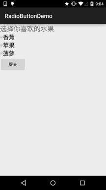

## 2.3.5.RadioButton(单选按钮)&Checkbox(复选框)

### 

## 本节引言：

> 本节给大家带来的是Andoird基本UI控件中的RadioButton和Checkbox; 先说下本节要讲解的内容是：RadioButton和Checkbox的
> **1.基本用法
> 2.事件处理；
> 3.自定义点击效果；
> 4.改变文字与选择框的相对位置；
> 5.修改文字与选择框的距离**

其实这两个控件有很多地方都是类似的，除了单选和多选，事件处理，其他的都是类似的！ 另外还有一个ListView上Checkbox的错位的问题，我们会在ListView那一章对这个问题进行 解决，好的，开始本节内容~ 本节官方文档API：[RadioButton](http://androiddoc.qiniudn.com/reference/android/widget/RadioButton.html)；[CheckBox](http://androiddoc.qiniudn.com/reference/android/widget/CheckBox.html)；

------

## 1.基本用法与事件处理：

------

### 1）RadioButton(单选按钮)

> 如题单选按钮，就是只能够选中一个，所以我们需要把RadioButton放到RadioGroup按钮组中，从而实现单选功能！先熟悉下如何使用RadioButton，一个简单的性别选择的例子： 另外我们可以为外层RadioGroup设置orientation属性然后设置RadioButton的排列方式，是竖直还是水平~

**效果图：**


PS:笔者的手机是Android 5.0.1的，这里的RadioButton相比起旧版本的RadioButton，稍微好看一点~

**布局代码如下：**

```
<LinearLayout xmlns:android="http://schemas.android.com/apk/res/android"
    xmlns:tools="http://schemas.android.com/tools"
    android:id="@+id/LinearLayout1"
    android:layout_width="match_parent"
    android:layout_height="match_parent"
    android:orientation="vertical"
    tools:context=".MainActivity" >

    <TextView
        android:layout_width="wrap_content"
        android:layout_height="wrap_content"
        android:text="请选择性别"
        android:textSize="23dp"
        />

    <RadioGroup
        android:id="@+id/radioGroup"
        android:layout_width="wrap_content"
        android:layout_height="wrap_content"
        android:orientation="horizontal">

        <RadioButton
            android:id="@+id/btnMan"
            android:layout_width="wrap_content"
            android:layout_height="wrap_content"
            android:text="男"
            android:checked="true"/>

        <RadioButton
            android:id="@+id/btnWoman"
            android:layout_width="wrap_content"
            android:layout_height="wrap_content"
            android:text="女"/>
    </RadioGroup>

    <Button
        android:id="@+id/btnpost"
        android:layout_width="wrap_content"
        android:layout_height="wrap_content"
        android:text="提交"/>

</LinearLayout>
```

**获得选中的值：**

这里有两种方法，

**第一种**是为RadioButton设置一个事件监听器setOnCheckChangeListener

**例子代码如下：**

```
RadioGroup radgroup = (RadioGroup) findViewById(R.id.radioGroup);
        //第一种获得单选按钮值的方法  
        //为radioGroup设置一个监听器:setOnCheckedChanged()  
        radgroup.setOnCheckedChangeListener(new OnCheckedChangeListener() {
            @Override
            public void onCheckedChanged(RadioGroup group, int checkedId) {
                RadioButton radbtn = (RadioButton) findViewById(checkedId);
                Toast.makeText(getApplicationContext(), "按钮组值发生改变,你选了" + radbtn.getText(), Toast.LENGTH_LONG).show();
            }
        });
```

**运行效果图：** 

PS：另外有一点要切记，要为每个RadioButton添加一个id，不然单选功能会生效！！！

**第二种**方法是通过单击其他按钮获取选中单选按钮的值，当然我们也可以直接获取，这个看需求~

**例子代码如下：**

```
        Button btnchange = (Button) findViewById(R.id.btnpost);
        RadioGroup radgroup = (RadioGroup) findViewById(R.id.radioGroup);
        //为radioGroup设置一个监听器:setOnCheckedChanged()  
        btnchange.setOnClickListener(new OnClickListener() {
            @Override
            public void onClick(View v) {
                for (int i = 0; i < radgroup.getChildCount(); i++) {
                    RadioButton rd = (RadioButton) radgroup.getChildAt(i);
                    if (rd.isChecked()) {
                        Toast.makeText(getApplicationContext(), "点击提交按钮,获取你选择的是:" + rd.getText(), Toast.LENGTH_LONG).show();
                        break;
                    }
                }
            }
        });
```

**运行效果图：**


**代码解析：** 这里我们为提交按钮设置了一个setOnClickListener事件监听器,每次点击的话遍历一次RadioGroup判断哪个按钮被选中我们可以通过下述方法获得RadioButton的相关信息！

- **getChildCount**( )获得按钮组中的单选按钮的数目；
- **getChinldAt**(i):根据索引值获取我们的单选按钮
- **isChecked**( ):判断按钮是否选中

------

### 2）CheckBox(复选框)

> 如题复选框，即可以同时选中多个选项，至于获得选中的值，同样有两种方式： 1.为每个CheckBox添加事件：setOnCheckedChangeListener 2.弄一个按钮，在点击后，对每个checkbox进行判断:isChecked()；

**运行效果图：**


**实现代码：**

```
public class MainActivity extends AppCompatActivity implements View.OnClickListener, CompoundButton.OnCheckedChangeListener{

    private CheckBox cb_one;
    private CheckBox cb_two;
    private CheckBox cb_three;
    private Button btn_send;

    @Override
    protected void onCreate(Bundle savedInstanceState) {
        super.onCreate(savedInstanceState);
        setContentView(R.layout.activity_main);

        cb_one = (CheckBox) findViewById(R.id.cb_one);
        cb_two = (CheckBox) findViewById(R.id.cb_two);
        cb_three = (CheckBox) findViewById(R.id.cb_three);
        btn_send = (Button) findViewById(R.id.btn_send);

        cb_one.setOnCheckedChangeListener(this);
        cb_two.setOnCheckedChangeListener(this);
        cb_three.setOnCheckedChangeListener(this);
        btn_send.setOnClickListener(this);

    }

    @Override
    public void onCheckedChanged(CompoundButton compoundButton, boolean b) {
       if(compoundButton.isChecked()) {
           Toast.makeText(this,compoundButton.getText().toString(),Toast.LENGTH_SHORT).show();
       }
    }

    @Override
    public void onClick(View view) {
        String choose = "";
        if(cb_one.isChecked())choose += cb_one.getText().toString() + "";
        if(cb_two.isChecked())choose += cb_two.getText().toString() + "";
        if(cb_three.isChecked())choose += cb_three.getText().toString() + "";
        Toast.makeText(this,choose,Toast.LENGTH_SHORT).show();
    }
}
```

------

## 2.自定义点击效果

> 虽然5.0后的RadioButton和Checkbox都比旧版本稍微好看了点，但是对于我们来说 可能还是不喜欢或者需求，需要自己点击效果！实现起来很简单，先编写一个自定义 的selctor资源，设置选中与没选中时的切换图片~！

实现效果图如下：



PS:这里素材的原因，有点小...

```
<?xml version="1.0" encoding="utf-8"?>
<selector xmlns:android="http://schemas.android.com/apk/res/android">
    <item
        android:state_enabled="true"
        android:state_checked="true"
        android:drawable="@mipmap/ic_checkbox_checked"/>
    <item
        android:state_enabled="true"
        android:state_checked="false"
        android:drawable="@mipmap/ic_checkbox_normal" />
</selector>
```

写好后，我们有两种方法设置，也可以说一种吧！你看看就知道了~

①android:button属性设置为上述的selctor

```
android:button="@drawable/rad_btn_selctor"
```

②在style中定义一个属性，然后通过android style属性设置，先往style添加下述代码：

```
    <style name="MyCheckBox" parent="@android:style/Widget.CompoundButton.CheckBox">
        <item name="android:button">@drawable/rad_btn_selctor</item>
    </style>
```

然后布局那里:

```
style="@style/MyCheckBox"
```

------

## 3.改变文字与选择框的相对位置

> 这个实现起来也很简单，还记得我们之前学TextView的时候用到的drawableXxx吗？ 要控制选择框的位置，两部即可！设置：
>
> **Step 1.** android:button="@null"
> **Step 2.** android:drawableTop="@android:drawable/btn_radio"
> 当然我们可以把drawableXxx替换成自己喜欢的效果！

------

## 4.修改文字与选择框的距离

> 有时，我们可能需要调节文字与选择框之间的距离，让他们看起来稍微没那么挤，我们可以：
> 1.在XML代码中控制： 使用android:paddingXxx = "xxx" 来控制距离
> 2.在Java代码中，稍微好一点，动态计算paddingLeft!

**示例代码如下：**

```
rb.setButtonDrawable(R.drawable.rad_btn_selctor);
int rb_paddingLeft = getResources().getDrawable(R.mipmap.ic_checkbox_checked).getIntrinsicWidth()+5; 
rb.setPadding(rb_paddingLeft, 0, 0, 0);
```

------

## 本节小结：

> 好的，关于RadioButton和Checkbox就讲到这里，如果有什么写得不对的，不好的，或者有好的建议欢迎指出 万分感激~谢谢...