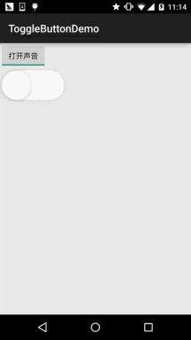

## 2.3.6 开关按钮ToggleButton和开关Switch

### 

## 本节引言：

> 本节给大家介绍的Android基本UI控件是: 开关按钮ToggleButton和开关Switch，可能大家对着两个组件并不熟悉，突然想起笔者的第一间外包公司，是否在wifi下联网的开关，竟然用的TextView，然后叫美工且两个切换前后的图，然后代码中进行设置，当然点击TextView的时候判断状态，然后设置对应的背景...
>
> 好吧，也是醉了，好吧...本节讲解的两个其实都是开关组件，只是后者需要在Android 4.0以后才能使用 所以AndroidManifest.xml文件中的minsdk需要 >= 14 否则会报错~，先来看看这两个控件长什么样先， Android 5.0后这两个控件相比以前来说好看了许多，先看下5.0前的样子：
>
> **5.0以前的ToggleButton和Switch：** 
>
> **5.0版本：**
>
> 好吧，鲜明的对比...接下来我们就来学习者两个控件的使用吧，其实两个的使用几乎是相同的。
>
> 开始之前贴下官方API先：[Switch](http://androiddoc.qiniudn.com/reference/android/widget/Switch.html)；[ToggleButton](http://androiddoc.qiniudn.com/reference/android/widget/ToggleButton.html)

------

## 1.核心属性讲解：

### 1）ToggleButton(开关按钮)

可供我们设置的属性：

> - **android:disabledAlpha**：设置按钮在禁用时的透明度
> - **android:textOff：**按钮没有被选中时显示的文字
> - **android:textOn：**按钮被选中时显示的文字. 另外，除了这个我们还可以自己写个selector，然后设置下Background属性即可~

### 2) Switch(开关)

可供我们设置的属性：

> - **android:showText：**设置on/off的时候是否显示文字,boolean
> - **android:splitTrack：**是否设置一个间隙，让滑块与底部图片分隔, boolean
> - **android:switchMinWidth：**设置开关的最小宽度
> - **android:switchPadding：**设置滑块内文字的间隔
> - **android:switchTextAppearance：**设置开关的文字外观，暂时没发现有什么用...
> - **android:textOff：**按钮没有被选中时显示的文字
> - **android:textOn：**按钮被选中时显示的文字
> - **android:textStyle：**文字风格，粗体，斜体写划线那些
> - **android:track：**底部的图片
> - **android:thumb：**滑块的图片
> - **android:typeface：**设置字体，默认支持这三种:sans, serif, monospace;除此以外还可以使用 其他字体文件(***.ttf**)，首先要将字体文件保存在assets/fonts/目录下，不过需要在Java代码中设置： **Typeface typeFace =Typeface.createFromAsset(getAssets(),"fonts/HandmadeTypewriter.ttf"); textView.setTypeface(typeFace);**

------

## 2.使用示例：

因为比较简单，所以我们把他们写到一起，另外，我们为Switch设置下滑块和底部的图片，实现 一个类似于IOS 7的滑块的效果，但是有个缺点就是不能在XML中对滑块和底部的大小进行设置， 就是素材多大，Switch就会多大，我们可以在Java中获得Drawable对象，然后对大小进行修改， 简单的例子：

**运行效果图：**



**实现代码：** 先是两个drawable的文件： **thumb_selctor.xml:**

```
<?xml version="1.0" encoding="utf-8"?>
<selector xmlns:android="http://schemas.android.com/apk/res/android">
    <item android:state_pressed="true" android:drawable="@drawable/switch_btn_pressed"/>
    <item android:state_pressed="false" android:drawable="@drawable/switch_btn_normal"/>
</selector>
```

**track_selctor.xml:**

```
<?xml version="1.0" encoding="utf-8"?>
<selector xmlns:android="http://schemas.android.com/apk/res/android">
    <item android:state_checked="true" android:drawable="@drawable/switch_btn_bg_green"/>
    <item android:state_checked="false" android:drawable="@drawable/switch_btn_bg_white"/>
</selector>
```

**布局文件:activity_main.xml:**

```
<LinearLayout xmlns:android="http://schemas.android.com/apk/res/android"
    xmlns:tools="http://schemas.android.com/tools"
    android:layout_width="match_parent"
    android:layout_height="match_parent"
    android:orientation="vertical"
    tools:context=".MainActivity">

    <ToggleButton
        android:id="@+id/tbtn_open"
        android:layout_width="wrap_content"
        android:layout_height="wrap_content"
        android:checked="true"
        android:textOff="关闭声音"
        android:textOn="打开声音" />

    <Switch
        android:id="@+id/swh_status"
        android:layout_width="wrap_content"
        android:layout_height="wrap_content"
        android:textOff=""
        android:textOn=""
        android:thumb="@drawable/thumb_selctor"
        android:track="@drawable/track_selctor" />

</LinearLayout>
```

**MainActivity.java：**

```
public class MainActivity extends AppCompatActivity implements CompoundButton.OnCheckedChangeListener{

    private ToggleButton tbtn_open;
    private Switch swh_status;

    @Override
    protected void onCreate(Bundle savedInstanceState) {
        super.onCreate(savedInstanceState);
        setContentView(R.layout.activity_main);

        tbtn_open = (ToggleButton) findViewById(R.id.tbtn_open);
        swh_status = (Switch) findViewById(R.id.swh_status);
        tbtn_open.setOnCheckedChangeListener(this);
        swh_status.setOnCheckedChangeListener(this);
    }

    @Override
    public void onCheckedChanged(CompoundButton compoundButton, boolean b) {
        switch (compoundButton.getId()){
            case R.id.tbtn_open:
                if(compoundButton.isChecked()) Toast.makeText(this,"打开声音",Toast.LENGTH_SHORT).show();
                else Toast.makeText(this,"打开声音",Toast.LENGTH_SHORT).show();
                break;
            case R.id.swh_status:
                if(compoundButton.isChecked()) Toast.makeText(this,"开关:ON",Toast.LENGTH_SHORT).show();
                else Toast.makeText(this,"开关:OFF",Toast.LENGTH_SHORT).show();
                break;

        }
    }
}
```