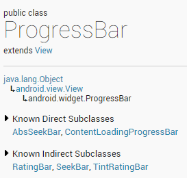
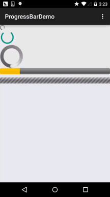
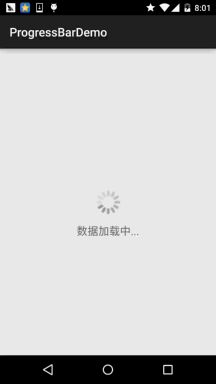
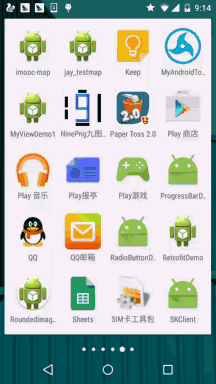

## 2.3.7 ProgressBar(进度条)

## 本节引言：

本节给大家带来的是Android基本UI控件中的ProgressBar(进度条)，ProgressBar的应用场景很多，比如用户登录时，后台在发请求，以及等待服务器返回信息，这个时候会用到进度条；或者当在进行一些比较耗时的操作，需要等待一段较长的时间，这个时候如果没有提示，用户可能会以为程序Carsh或者手机死机了，这样会大大降低用户体验，所以在需要进行耗时操作的地方，添加上进度条，让用户知道当前的程序在执行中，也可以直观的告诉用户当前任务的执行进度等！使用进度条可以给我带来这样的便利！ 好了，开始讲解本节内容~ 对了，ProgressBar官方API文档：[ProgressBar](http://androiddoc.qiniudn.com/reference/android/widget/ProgressBar.html)

------

## 1.常用属性讲解与基础实例

从官方文档，我们看到了这样一个类关系图：



ProgressBar继承于View类，直接子类有AbsSeekBar和ContentLoadingProgressBar， 其中AbsSeekBar的子类有SeekBar和RatingBar，可见这二者也是基于ProgressBar实现的

**常用属性详解：**

> - android:**max**：进度条的最大值
> - android:**progress**：进度条已完成进度值
> - android:**progressDrawable**：设置轨道对应的Drawable对象
> - android:**indeterminate**：如果设置成true，则进度条不精确显示进度
> - android:**indeterminateDrawable**：设置不显示进度的进度条的Drawable对象
> - android:**indeterminateDuration**：设置不精确显示进度的持续时间
> - android:**secondaryProgress**：二级进度条，类似于视频播放的一条是当前播放进度，一条是缓冲进度，前者通过progress属性进行设置！

对应的在Java中我们可调用下述方法：

> - **getMax**()：返回这个进度条的范围的上限
> - **getProgress**()：返回进度
> - **getSecondaryProgress**()：返回次要进度
> - **incrementProgressBy**(int diff)：指定增加的进度
> - **isIndeterminate**()：指示进度条是否在不确定模式下
> - **setIndeterminate**(boolean indeterminate)：设置不确定模式下

接下来来看看系统提供的默认的进度条的例子吧！

**系统默认进度条使用实例：**

**运行效果图：**



**实现布局代码：**

```
<LinearLayout xmlns:android="http://schemas.android.com/apk/res/android"
    xmlns:tools="http://schemas.android.com/tools"
    android:layout_width="match_parent"
    android:layout_height="match_parent"
    android:orientation="vertical"
    tools:context=".MainActivity">

    <!-- 系统提供的圆形进度条,依次是大中小 -->

    <ProgressBar
        style="@android:style/Widget.ProgressBar.Small"
        android:layout_width="wrap_content"
        android:layout_height="wrap_content" />

    <ProgressBar
        android:layout_width="wrap_content"
        android:layout_height="wrap_content" />

    <ProgressBar
        style="@android:style/Widget.ProgressBar.Large"
        android:layout_width="wrap_content"
        android:layout_height="wrap_content" />

    <!--系统提供的水平进度条-->
    <ProgressBar
        style="@android:style/Widget.ProgressBar.Horizontal"
        android:layout_width="match_parent"
        android:layout_height="wrap_content"
        android:max="100"
        android:progress="18" />

    <ProgressBar
        style="@android:style/Widget.ProgressBar.Horizontal"
        android:layout_width="match_parent"
        android:layout_height="wrap_content"
        android:layout_marginTop="10dp"
        android:indeterminate="true" />

</LinearLayout>
```

好吧，除了第二个能看，其他的就算了...系统提供的肯定是满足不了我们的需求的！ 下面我们就来讲解下实际开发中我们对进度条的处理！

------

## 2.使用动画来替代圆形进度条

第一个方案是，使用一套连续图片，形成一个帧动画，当需要进度图的时候，让动画可见，不需要 的时候让动画不可见即可！而这个动画，一般是使用AnimationDrawable来实现的！好的，我们来 定义一个AnimationDrawable文件：

PS:用到的图片素材：[进度条图片素材打包.zip](https://www.runoob.com/wp-content/uploads/2015/08/进度条动画素材打包.zip)

**运行效果图：**

 

实现步骤：


在res目录下新建一个:anim文件件，然后创建amin_pgbar.xml的资源文件：

```
<?xml version="1.0" encoding="utf-8"?>  
<animation-list xmlns:android="http://schemas.android.com/apk/res/android"  
    android:oneshot="false" >  
  
    <item  
        android:drawable="@drawable/loading_01"  
        android:duration="200"/>  
    <item  
        android:drawable="@drawable/loading_02"  
        android:duration="200"/>  
    <item  
        android:drawable="@drawable/loading_03"  
        android:duration="200"/>  
    <item  
        android:drawable="@drawable/loading_04"  
        android:duration="200"/>  
    <item  
        android:drawable="@drawable/loading_05"  
        android:duration="200"/>  
    <item  
        android:drawable="@drawable/loading_06"  
        android:duration="200"/>  
    <item  
        android:drawable="@drawable/loading_07"  
        android:duration="200"/>  
    <item  
        android:drawable="@drawable/loading_08"  
        android:duration="200"/>  
    <item  
        android:drawable="@drawable/loading_09"  
        android:duration="200"/>  
    <item  
        android:drawable="@drawable/loading_10"  
        android:duration="200"/>  
    <item  
        android:drawable="@drawable/loading_11"  
        android:duration="200"/>  
    <item  
        android:drawable="@drawable/loading_12"  
        android:duration="200"/>  
  
</animation-list> 
```

接着写个布局文件，里面仅仅有一个ImageView即可，用于显示进度条，把src设置为上述drawable资源即可！ 最后到MainActivity.java

```
public class MainActivity extends AppCompatActivity {

    private ImageView img_pgbar;
    private AnimationDrawable ad;

    @Override
    protected void onCreate(Bundle savedInstanceState) {
        super.onCreate(savedInstanceState);
        setContentView(R.layout.activity_main);
        img_pgbar = (ImageView) findViewById(R.id.img_pgbar);
        ad = (AnimationDrawable) img_pgbar.getDrawable();
        img_pgbar.postDelayed(new Runnable() {
            @Override
            public void run() {
                ad.start();
            }
        }, 100);
    }

}
```

这里只是写了如何启动动画，剩下的就你自己来了哦~在需要显示进度条的时候，让ImageView可见； 在不需要的时候让他隐藏即可！另外其实Progressbar本身有一个indeterminateDrawable，只需把这个参数设置成上述的动画资源即可，但是进度条条的图案大小是不能直接修改的，需要Java代码中修改，如果你设置了宽高，而且这个宽高过大的时候，你会看到有多个进度条...自己权衡下吧~

------

## 3.自定义圆形进度条

> 相信你看完2会吐槽，卧槽，这么坑爹，拿个动画来坑人，哈哈，实际开发中都这样，当然上述这种情况只适用于不用显示进度的场合，如果要显示进度的场合就没用处了，好吧，接下来看下网上一个简单的自定义圆形进度条！代码还是比较简单，容易理解，又兴趣可以看看，或者进行相关扩展~

**运行效果图：**



**实现代码：**

**自定义View类：**

```
/**
 * Created by Jay on 2015/8/5 0005.
 */
public class CirclePgBar extends View {


    private Paint mBackPaint;
    private Paint mFrontPaint;
    private Paint mTextPaint;
    private float mStrokeWidth = 50;
    private float mHalfStrokeWidth = mStrokeWidth / 2;
    private float mRadius = 200;
    private RectF mRect;
    private int mProgress = 0;
    //目标值，想改多少就改多少
    private int mTargetProgress = 90;
    private int mMax = 100;
    private int mWidth;
    private int mHeight;


    public CirclePgBar(Context context) {
        super(context);
        init();
    }

    public CirclePgBar(Context context, AttributeSet attrs) {
        super(context, attrs);
        init();
    }

    public CirclePgBar(Context context, AttributeSet attrs, int defStyleAttr) {
        super(context, attrs, defStyleAttr);
        init();
    }


    //完成相关参数初始化
    private void init() {
        mBackPaint = new Paint();
        mBackPaint.setColor(Color.WHITE);
        mBackPaint.setAntiAlias(true);
        mBackPaint.setStyle(Paint.Style.STROKE);
        mBackPaint.setStrokeWidth(mStrokeWidth);

        mFrontPaint = new Paint();
        mFrontPaint.setColor(Color.GREEN);
        mFrontPaint.setAntiAlias(true);
        mFrontPaint.setStyle(Paint.Style.STROKE);
        mFrontPaint.setStrokeWidth(mStrokeWidth);


        mTextPaint = new Paint();
        mTextPaint.setColor(Color.GREEN);
        mTextPaint.setAntiAlias(true);
        mTextPaint.setTextSize(80);
        mTextPaint.setTextAlign(Paint.Align.CENTER);
    }


    //重写测量大小的onMeasure方法和绘制View的核心方法onDraw()
    @Override
    protected void onMeasure(int widthMeasureSpec, int heightMeasureSpec) {
        super.onMeasure(widthMeasureSpec, heightMeasureSpec);
        mWidth = getRealSize(widthMeasureSpec);
        mHeight = getRealSize(heightMeasureSpec);
        setMeasuredDimension(mWidth, mHeight);

    }


    @Override
    protected void onDraw(Canvas canvas) {
        initRect();
        float angle = mProgress / (float) mMax * 360;
        canvas.drawCircle(mWidth / 2, mHeight / 2, mRadius, mBackPaint);
        canvas.drawArc(mRect, -90, angle, false, mFrontPaint);
        canvas.drawText(mProgress + "%", mWidth / 2 + mHalfStrokeWidth, mHeight / 2 + mHalfStrokeWidth, mTextPaint);
        if (mProgress < mTargetProgress) {
            mProgress += 1;
            invalidate();
        }

    }

    public int getRealSize(int measureSpec) {
        int result = 1;
        int mode = MeasureSpec.getMode(measureSpec);
        int size = MeasureSpec.getSize(measureSpec);

        if (mode == MeasureSpec.AT_MOST || mode == MeasureSpec.UNSPECIFIED) {
            //自己计算
            result = (int) (mRadius * 2 + mStrokeWidth);
        } else {
            result = size;
        }

        return result;
    }

    private void initRect() {
        if (mRect == null) {
            mRect = new RectF();
            int viewSize = (int) (mRadius * 2);
            int left = (mWidth - viewSize) / 2;
            int top = (mHeight - viewSize) / 2;
            int right = left + viewSize;
            int bottom = top + viewSize;
            mRect.set(left, top, right, bottom);
        }
    }


}
```

然后在布局文件中加上：

```
 <com.jay.progressbardemo.CirclePgBar
        android:layout_width="match_parent"
        android:layout_height="match_parent"/>
```

就是这么简单~

------

## 本节小结：

本节给大家介绍了Android中的常用控件：ProgressBar讲解了基本用法，以及实际开发中 对于进度条的两种实现方法，第二个自定义进度条可以自行完善，然后用到实际开发中~！ 好的，本节就到这里，谢谢~

