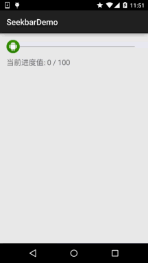
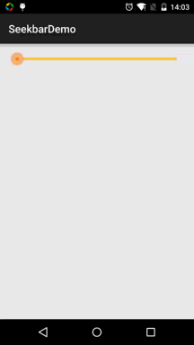

## 2.3.8 SeekBar(拖动条)

### 

## 本节引言：

> 本节我们继续来学习Android的基本UI控件中的拖动条——SeekBar，相信大家对他并不陌生，最常见的 地方就是音乐播放器或者视频播放器了，音量控制或者播放进度控制，都用到了这个SeekBar，我们 先来看看SeekBar的类结构，来到官方文档：[SeekBar](http://androiddoc.qiniudn.com/reference/android/widget/SeekBar.html)
>
> 
>
> 嘿嘿，这玩意是ProgressBar的子类耶，也就是ProgressBar的属性都可以用咯！ 而且他还有一个自己的属性就是：**android:thumb**，就是允许我们自定义滑块~ 好的，开始本节内容！

------

## 1.SeekBar基本用法

好吧，基本用法其实很简单，常用的属性无非就下面这几个常用的属性，Java代码里只要setXxx即可：

> **android:max**="100"                                         //滑动条的最大值
>
> **android:progress**="60"                                   //滑动条的当前值
>
> **android:secondaryProgress**="70"               //二级滑动条的进度
>
> **android:thumb** = "@mipmap/sb_icon"       //滑块的drawable

接着要说下SeekBar的事件了，**SeekBar.OnSeekBarChangeListener** 我们只需重写三个对应的方法：

> **onProgressChanged**：进度发生改变时会触发
>
> **onStartTrackingTouch**：按住SeekBar时会触发
>
> **onStopTrackingTouch**：放开SeekBar时触发

**简单的代码示例:**

**效果图:**



**实现代码：**

```
public class MainActivity extends AppCompatActivity {

    private SeekBar sb_normal;
    private TextView txt_cur;
    private Context mContext;

    @Override
    protected void onCreate(Bundle savedInstanceState) {
        super.onCreate(savedInstanceState);
        setContentView(R.layout.activity_main);
        mContext = MainActivity.this;
        bindViews();
    }

    private void bindViews() {
        sb_normal = (SeekBar) findViewById(R.id.sb_normal);
        txt_cur = (TextView) findViewById(R.id.txt_cur);
        sb_normal.setOnSeekBarChangeListener(new SeekBar.OnSeekBarChangeListener() {
            @Override
            public void onProgressChanged(SeekBar seekBar, int progress, boolean fromUser) {
                txt_cur.setText("当前进度值:" + progress + "  / 100 ");
            }

            @Override
            public void onStartTrackingTouch(SeekBar seekBar) {
                Toast.makeText(mContext, "触碰SeekBar", Toast.LENGTH_SHORT).show();
            }

            @Override
            public void onStopTrackingTouch(SeekBar seekBar) {
                Toast.makeText(mContext, "放开SeekBar", Toast.LENGTH_SHORT).show();
            }
        });
    }
}
```

------

## 2.简单SeekBar定制：

> 本来还想着自定义下SeekBar的，后来想想，还是算了，涉及到自定义View的一些东西，可能初学者并不了解，看起来也有点难度，关于自定义View的还是放到进阶那里吧，所以这里就只是简单的定制下SeekBar！ 定制的内容包括滑块，以及轨道！

**代码实例：**

**运行效果图：**



**代码实现：** **1.滑块状态Drawable：sb_thumb.xml**

```
<?xml version="1.0" encoding="utf-8"?>
<selector xmlns:android="http://schemas.android.com/apk/res/android">
    <item android:state_pressed="true" android:drawable="@mipmap/seekbar_thumb_pressed"/>
    <item android:state_pressed="false" android:drawable="@mipmap/seekbar_thumb_normal"/>
</selector>
```

**贴下素材：**


**2.条形栏Bar的Drawable：sb_bar.xml**

这里用到一个layer-list的drawable资源！其实就是层叠图片，依次是:背景，二级进度条，当前进度：

```
<?xml version="1.0" encoding="utf-8"?>
<layer-list
    xmlns:android="http://schemas.android.com/apk/res/android">
    <item android:id="@android:id/background">
        <shape>
            <solid android:color="#FFFFD042" />
        </shape>
    </item>
    <item android:id="@android:id/secondaryProgress">
        <clip>
            <shape>
                <solid android:color="#FFFFFFFF" />
            </shape>
        </clip>
    </item>
    <item android:id="@android:id/progress">
        <clip>
            <shape>
                <solid android:color="#FF96E85D" />
            </shape>
        </clip>
    </item>
</layer-list>
```

**3.然后布局引入SeekBar后，设置下progressDrawable与thumb即可！**

```
<SeekBar
        android:id="@+id/sb_normal"
        android:layout_width="match_parent"
        android:layout_height="wrap_content"
        android:maxHeight="5.0dp"
        android:minHeight="5.0dp"
        android:progressDrawable="@drawable/sb_bar"
        android:thumb="@drawable/sb_thumb"/>
```

就是这么简单！

------

## 本节小结：

好的，关于SeekBar就到这里，谢谢大家~