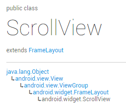
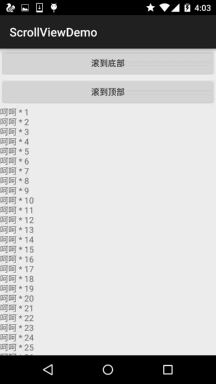

## 2.4.1 ScrollView(滚动条)

## 本节引言：

> 本节带来的是Android基本UI控件中的第十个：**ScrollView**(滚动条)，或者我们应该叫 竖直滚动条，对应的另外一个水平方向上的滚动条：**HorizontalScrollView**，先来一发官方文档 的链接：[ScrollView](http://androiddoc.qiniudn.com/reference/android/widget/ScrollView.html.com/reference/android/widget/ScrollView.html)，我们可以看到类的结构如下：
>
> 
>
> 嘿嘿，原来是一个FrameLayout的容器，不过在他的基础上添加了滚动，允许显示的比实际多的内容！
>
> 另外，只能够往里面放置**一个子元素**，可以是单一的组件，又或者一个布局包裹着的复杂的层次结构！
>
> 一般对于可能显示不完的情况，我们可以直接在布局的外层套上一个: ScrollView或者HorizontalScrollView！就这么简单~！

------

## 可能遇到的一些需求

好的，就不一个个扣文档了，直接说实际开发中可能会遇到的一些需求吧：

另外有一个很典型的问题就是:ScrollView和ListView的嵌套问题，这个放到ListView那一章节 再来讲解~

------

### 1.滚动到底部：

> 我们可以直接利用ScrollView给我们提供的:**fullScroll()方法**：
>
> scrollView.fullScroll(ScrollView.**FOCUS_DOWN**);滚动到底部
>
> scrollView.fullScroll(ScrollView.**FOCUS_UP**);滚动到顶部
>
> 另外用这玩意的时候要小心异步的玩意，就是addView后，有可能还没有显示完， 如果这个时候直接调用该方法的话，可能会无效，这就需要自己写handler来更新了~

**代码示例：**

**效果图：**



**实现代码：**

布局比较简单，就不贴了，直接贴MainActivity **MainActivity.java**

```
public class MainActivity extends AppCompatActivity implements View.OnClickListener {

    private Button btn_down;
    private Button btn_up;
    private ScrollView scrollView;
    private TextView txt_show;

    @Override
    public void onCreate(Bundle savedInstanceState) {
        super.onCreate(savedInstanceState);
        setContentView(R.layout.activity_main);
        bindViews();
    }


    private void bindViews() {
        btn_down = (Button) findViewById(R.id.btn_down);
        btn_up = (Button) findViewById(R.id.btn_up);
        scrollView = (ScrollView) findViewById(R.id.scrollView);
        txt_show = (TextView) findViewById(R.id.txt_show);
        btn_down.setOnClickListener(this);
        btn_up.setOnClickListener(this);

        StringBuilder sb = new StringBuilder();
        for (int i = 1; i <= 100; i++) {
            sb.append("呵呵 * " + i + "\n");
        }
        txt_show.setText(sb.toString());

    }

    @Override
    public void onClick(View v) {
        switch (v.getId()) {
            case R.id.btn_down:
                scrollView.fullScroll(ScrollView.FOCUS_DOWN);
                break;
            case R.id.btn_up:
                scrollView.fullScroll(ScrollView.FOCUS_UP);
                break;
        }
    }
}
```

当然除了这种方法还，你还可以使用另一种复杂一点的写法：

```
public static void scrollToBottom(final View scroll, final View inner) {
    Handler mHandler = new Handler();
    mHandler.post(new Runnable() {
        public void run() {
            if (scroll == null || inner == null) {
                return;
            }
            int offset = inner.getMeasuredHeight() - scroll.getHeight();
            if (offset < 0) {
                offset = 0;
            }
            scroll.scrollTo(0, offset);
        }
    });
}  
```

**scrollTo**()参数依次为x，y滚到对应的x，y位置！

------

### 2.设置滚动的滑块图片

> 这个更加简单： **垂直**方向滑块：android:**scrollbarThumbVertical**
> **水平**方向滑块：android:**scrollbarThumbHorizontal**

------

### 3.隐藏滑块

好吧，这个好像没什么卵用：

> 方法有两种： 
>
> 1.android:scrollbars="none"
> 2.Java代码设置：scrollview.setVerticalScrollBarEnabled(false);

------

### 4.设置滚动速度：

> 这个并没有给我们提供可以直接设置的方法，我们需要自己继承ScrollView，然后重写一个 public void fling (int velocityY)的方法：
>
> ```
> @Override
> public void fling(int velocityY) {
>     super.fling(velocityY / 2);    //速度变为原来的一半
> }
> ```

------

## 本节小结：

好的，能想到的ScrollView的东西就这么多，因为平时这个用得并不多，一般直接套在外面而已， 另外，问题最多的一般是ScrollView和ListView的嵌套问题~如果有什么补充欢迎提出，谢谢~