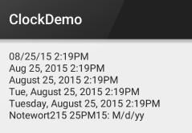
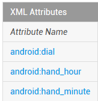
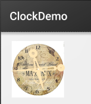
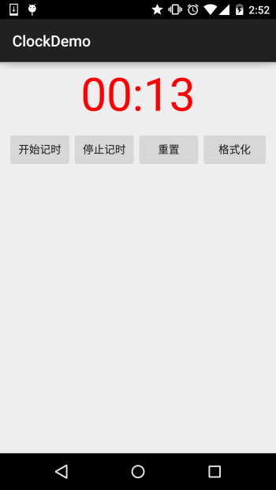

## 2.4.2 Date & Time组件(上)

### 

## 本节引言：

> 本节给大家带来的是Android给我们提供的显示时间的几个控件，他们分别是： TextClock，AnalogClock，Chronometer，另外其实还有个过时的DigitalClock就不讲解了！ 好的，开始本节内容！

------

## 1.TextClock(文本时钟)

> TextClock是在Android 4.2(API 17)后推出的用来替代DigitalClock的一个控件！
> TextClock可以以字符串格式显示当前的日期和时间，因此推荐在Android 4.2以后使用TextClock。
> 这个控件推荐在24进制的android系统中使用，TextClock提供了两种不同的格式， 一种是在24进制中显示时间和日期，另一种是在12进制中显示时间和日期。大部分人喜欢默认的设置。

可以通过调用：TextClock提供的is24HourModeEnabled()方法来查看，系统是否在使用24进制时间显示! 在24进制模式中：

- 如果没获取时间，首先通过getFormat24Hour()返回值；
- 获取失败则通过getFormat12Hour()获取返回值；
- 以上都获取失败则使用默认；

另外他给我们提供了下面这些方法，对应的还有get方法：

| Attribute Name           | Related Method                    | Description          |
| ------------------------ | --------------------------------- | -------------------- |
| **android:format12Hour** | **setFormat12Hour(CharSequence)** | **设置12时制的格式** |
| **android:format24Hour** | **setFormat24Hour(CharSequence)** | **设置24时制的格式** |
| **android:timeZone**     | **setTimeZone(String)**           | **设置时区**         |

其实更多的时间我们是花在时间形式定义上，就是里面这个CharSequence！ 这里提供下常用的写法以及结果：

```
<TextClock
        android:layout_width="wrap_content"
        android:layout_height="wrap_content"
        android:format12Hour="MM/dd/yy h:mmaa"/>
    <TextClock
        android:layout_width="wrap_content"
        android:layout_height="wrap_content"
        android:format12Hour="MMM dd, yyyy h:mmaa"/>
    <TextClock
        android:layout_width="wrap_content"
        android:layout_height="wrap_content"
        android:format12Hour="MMMM dd, yyyy h:mmaa"/>
    <TextClock
        android:layout_width="wrap_content"
        android:layout_height="wrap_content"
        android:format12Hour="E, MMMM dd, yyyy h:mmaa"/>
    <TextClock
        android:layout_width="wrap_content"
        android:layout_height="wrap_content"
        android:format12Hour="EEEE, MMMM dd, yyyy h:mmaa"/>
    <TextClock
        android:layout_width="wrap_content"
        android:layout_height="wrap_content"
        android:format12Hour="Noteworthy day: 'M/d/yy"/>
```

**运行结果：**



**PS:**另外minsdk 要大于或者等于17哦！

------

## 2.AnalogClock(模拟时钟)

就是下图这种：


官网中我们可以看到这样三个属性：



依次是：表背景，表时针，分时针的图片，我们可以自行定制：

**示例代码如下：**

```
<AnalogClock
        android:layout_width="100dp"
        android:layout_height="100dp"
        android:dial="@mipmap/ic_c_bg"
        android:hand_hour="@mipmap/zhen_shi"
        android:hand_minute="@mipmap/zhen_fen" />
```

**运行结果：**



------

## 3.Chronometer(计时器)

如题，就是一个简单的计时器，我们直接上使用示例吧：

**使用示例：**

**实现代码：**

**布局代码：**


```
<LinearLayout xmlns:android="http://schemas.android.com/apk/res/android"
    xmlns:tools="http://schemas.android.com/tools"
    android:layout_width="match_parent"
    android:layout_height="match_parent"
    android:orientation="vertical"
    tools:context=".MainActivity">


    <Chronometer
        android:id="@+id/chronometer"
        android:layout_width="fill_parent"
        android:layout_height="wrap_content"
        android:gravity="center"
        android:textColor="#ff0000"
        android:textSize="60dip" />

    <LinearLayout
        android:layout_width="fill_parent"
        android:layout_height="wrap_content"
        android:layout_margin="10dip"
        android:orientation="horizontal">

        <Button
            android:id="@+id/btnStart"
            android:layout_width="fill_parent"
            android:layout_height="wrap_content"
            android:layout_weight="1"
            android:text="开始记时" />

        <Button
            android:id="@+id/btnStop"
            android:layout_width="fill_parent"
            android:layout_height="wrap_content"
            android:layout_weight="1"
            android:text="停止记时" />

        <Button
            android:id="@+id/btnReset"
            android:layout_width="fill_parent"
            android:layout_height="wrap_content"
            android:layout_weight="1"
            android:text="重置" />

        <Button
            android:id="@+id/btn_format"
            android:layout_width="wrap_content"
            android:layout_height="wrap_content"
            android:text="格式化" />
    </LinearLayout>

</LinearLayout>
```

**MainActivity.java**

```
public class MainActivity extends AppCompatActivity implements View.OnClickListener,Chronometer.OnChronometerTickListener{

    private Chronometer chronometer;
    private Button btn_start,btn_stop,btn_base,btn_format;

    @Override
    protected void onCreate(Bundle savedInstanceState) {
        super.onCreate(savedInstanceState);
        setContentView(R.layout.activity_main);
        initView();
    }

    private void initView() {
        chronometer = (Chronometer) findViewById(R.id.chronometer);
        btn_start = (Button) findViewById(R.id.btnStart);
        btn_stop = (Button) findViewById(R.id.btnStop);
        btn_base = (Button) findViewById(R.id.btnReset);
        btn_format = (Button) findViewById(R.id.btn_format);

        chronometer.setOnChronometerTickListener(this);
        btn_start.setOnClickListener(this);
        btn_stop.setOnClickListener(this);
        btn_base.setOnClickListener(this);
        btn_format.setOnClickListener(this);

    }

    @Override
    public void onClick(View v) {
        switch (v.getId()){
            case R.id.btnStart:
                chronometer.start();// 开始计时
                break;
            case R.id.btnStop:
                chronometer.stop();// 停止计时
                break;
            case R.id.btnReset:
                chronometer.setBase(SystemClock.elapsedRealtime());// 复位
                break;
            case R.id.btn_format:
                chronometer.setFormat("Time：%s");// 更改时间显示格式
                break;
        }
    }

    @Override
    public void onChronometerTick(Chronometer chronometer) {
        String time = chronometer.getText().toString();
        if(time.equals("00:00")){
            Toast.makeText(MainActivity.this,"时间到了~",Toast.LENGTH_SHORT).show();
        }
    }
}
```

**运行截图：**



------

## 本节小结：

本节跟大家简单的介绍了TextClock，AnalogClock，Chronometer这三个组件，从篇幅就可以看出 其实这几个东西用得并不多，几乎是没用过...知道下就好，用法也超简单... 就这样吧，本节就到这里~谢谢