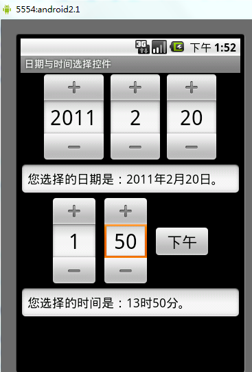
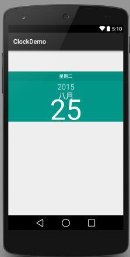
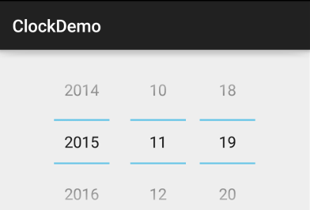
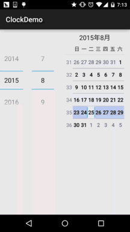
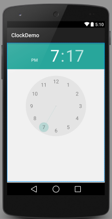
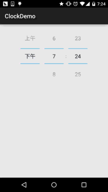
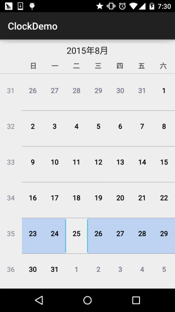
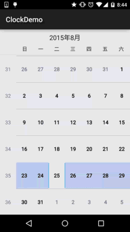

## 2.4.3 Date & Time组件(下)

### 

## 本节引言：

> 本节我们来继续学习Android系统给我们提供的几个原生的Date & Time组件，他们分别是： DatePicker(日期选择器)，TimePicker(时间选择器)，CalendarView(日期视图)，好吧， 其实一开始让我扣这几个玩意我是拒绝的，因为在我的印象里，他们是这样的：
>
> 
>
> 简直把我丑哭了，有木有，终于知道为什么那么多人喜欢自定义这种类型的控件了！但是毕竟提纲上写了，自己写的提纲，含着泪也要把他写完...当我把DatePicker写到布局中，然后看下预览图，哟：
>
> 
>
> 原来，看起来还不错，心情大好，哈哈，那么开始本节内容！

------

## 1.DatePicker(日期选择器)

可供我们使用的属性如下：

> - **android:calendarTextColor** ： 日历列表的文本的颜色
> - **android:calendarViewShown**：是否显示日历视图
> - **android:datePickerMode**：组件外观，可选值:spinner，calendar 前者效果如下，默认效果是后者 
> - **android:dayOfWeekBackground**：顶部星期几的背景颜色
> - **android:dayOfWeekTextAppearance**：顶部星期几的文字颜色
> - **android:endYear**：去年(内容)比如2010
> - **android:firstDayOfWeek**：设置日历列表以星期几开头
> - **android:headerBackground**：整个头部的背景颜色
> - **android:headerDayOfMonthTextAppearance**：头部日期字体的颜色
> - **android:headerMonthTextAppearance**：头部月份的字体颜色
> - **android:headerYearTextAppearance**：头部年的字体颜色
> - **android:maxDate**：最大日期显示在这个日历视图mm / dd / yyyy格式
> - **android:minDate**：最小日期显示在这个日历视图mm / dd / yyyy格式
> - **android:spinnersShown**：是否显示spinner
> - **android:startYear**：设置第一年(内容)，比如19940年
> - **android:yearListItemTextAppearance**：列表的文本出现在列表中。
> - **android:yearListSelectorColor**：年列表选择的颜色

属性就是上面这些，你想怎么玩就怎么玩，接下来我们说下他的DatePicker的事件： **DatePicker.OnDateChangedListener** 另外，奇怪的是，如果是上面这种mode为calendar的设置了事件并没有响应，看来上面这种只能选择完后获取对应的值了，如果你的mode未spinner的话，使用下述代码就可以完成事件监听：

**实现代码如下:**

```
public class MainActivity extends AppCompatActivity implements DatePicker.OnDateChangedListener{

    @Override
    protected void onCreate(Bundle savedInstanceState) {
        super.onCreate(savedInstanceState);
        setContentView(R.layout.activity_main);
        DatePicker dp_test = (DatePicker) findViewById(R.id.dp_test);
        Calendar calendar = Calendar.getInstance();
        int year=calendar.get(Calendar.YEAR);
        int monthOfYear=calendar.get(Calendar.MONTH);
        int dayOfMonth=calendar.get(Calendar.DAY_OF_MONTH);
        dp_test.init(year,monthOfYear,dayOfMonth,this);
    }

    @Override
    public void onDateChanged(DatePicker view, int year, int monthOfYear, int dayOfMonth) {
        Toast.makeText(MainActivity.this,"您选择的日期是："+year+"年"+(monthOfYear+1)+"月"+dayOfMonth+"日!",Toast.LENGTH_SHORT).show();
    }
}
```

**运行效果图：**



------

## 2.TimePicker(时间选择器)

> 先来看看5.0的TimePicker长什么样：
>
> 
>
> 样子还是蛮标致的哈，我们发现官方给我们提供的属性只有一个： **android:timePickerMode**：组件外观，同样可选值为:spinner和clock(默认) 前者是旧版本的TimePicker~ 而他对应的监听事件是：**TimePicker.OnTimeChangedListener**

**下面来个代码示例：**

```
public class MainActivity extends AppCompatActivity{

    @Override
    protected void onCreate(Bundle savedInstanceState) {
        super.onCreate(savedInstanceState);
        setContentView(R.layout.activity_main);
        TimePicker tp_test = (TimePicker) findViewById(R.id.tp_test);
        tp_test.setOnTimeChangedListener(new TimePicker.OnTimeChangedListener() {
            @Override
            public void onTimeChanged(TimePicker view, int hourOfDay, int minute) {
                Toast.makeText(MainActivity.this,"您选择的时间是："+hourOfDay+"时"+minute+"分!",Toast.LENGTH_SHORT).show();
            }
        });
    }

}
```

**运行效果图：** 可惜的是，同样需要旧版本的TimePicker才会触发这个事件！



------

## 3.CalendarView(日历视图)

> 好的，一样是看看样子先：
>
> 
>
> 嗯，好像变化不大，接下来我们简单的看下文档中给我们提供的属性：

- **android:firstDayOfWeek**：设置一个星期的第一天
- **android:maxDate** ：最大的日期显示在这个日历视图mm / dd / yyyy格式
- **android:minDate**：最小的日期显示在这个日历视图mm / dd / yyyy格式
- **android:weekDayTextAppearance**：工作日的文本出现在日历标题缩写

处理上面的还有其他，但是都是被弃用的... 对应的日期改变事件是：**CalendarView.OnDateChangeListener**

**示例代码：**

```
public class MainActivity extends AppCompatActivity{
    @Override
    protected void onCreate(Bundle savedInstanceState) {
        super.onCreate(savedInstanceState);
        setContentView(R.layout.activity_main);
        CalendarView cv_test = (CalendarView) findViewById(R.id.cv_test);
        cv_test.setOnDateChangeListener(new CalendarView.OnDateChangeListener() {
            @Override
            public void onSelectedDayChange(CalendarView view, int year, int month, int dayOfMonth) {
                Toast.makeText(MainActivity.this,"您选择的时间是："+ year + "年" + month + "月" + dayOfMonth + "日",Toast.LENGTH_SHORT).show();
            }
        });
    }
}
```

**运行效果图：**



------

## 本节小结：

> 好的，关于这三个控件的介绍就到这里，实际开发中这些控件我们一般都是自定义的， 在进阶系列我们会来自己写控件，敬请期待，谢谢~