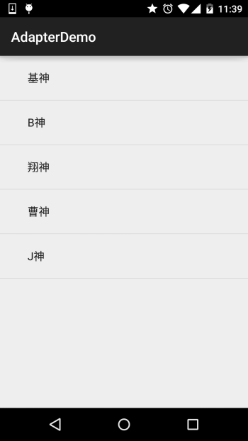
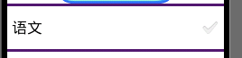
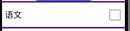
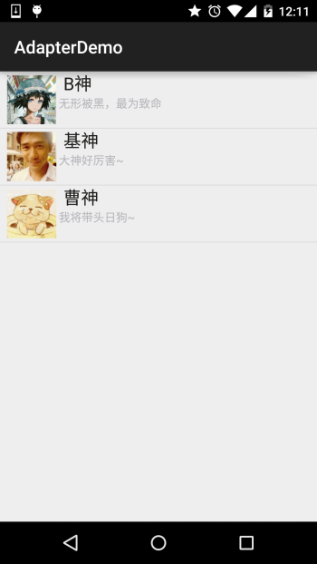
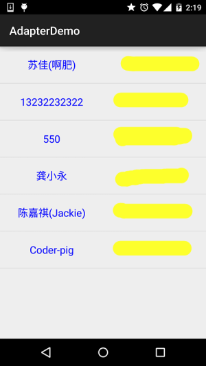

## 2.4.4 Adapter基础讲解

## 本节引言

> 从本节开始我们要讲的UI控件都是跟Adapter(适配器)打交道的，了解并学会使用这个Adapter很重要， Adapter是用来帮助填充数据的中间桥梁，简单点说就是：将各种数据以合适的形式显示到view上, 提供给用户看！

------

## 1.MVC模式的简单理解

> 在开始学习Adapter之前我们要来了解下这个MVC模式概念： 举个例子，大型的商业程序通常由多人一同开发完成, 比如有人负责操作接口的规划与设计, 有人负责程序代码的编写， 如果要能够做到程序项目的分工就必须在程序的结构上做适合的安排, 如果, 接口设计与修改都涉及到程序代码的改变的话, 那么两者的分工就会造成执行上的困难, 良好的程序架构师将整个程序项目划分为如图的三个部分:


**关系图解析：**

> - **Model**：通常可以理解为数据, 负责执行程序的核心运算与判断逻辑, 通过view获得用户输入的数据, 然后根据从数据库查询相关的信息, 最后进行运算和判断, 再将得到的结果交给view来显示
> - **view**: 用户的操作接口, 说白了就是GUI, 应该使用哪种接口组件, 组件间的排列位置与顺序都需要设计
> - **Controller**: 控制器, 作为model与view之间的枢纽, 负责控制程序的执行流程以及对象之间的一个互动

而这个Adapter则是中间的这个Controller的部分： **Model**(数据) ---> **Controller**(以什么方式显示到)---> **View**(用户界面) 这就是简单MVC组件的简单理解！

------

## 2.Adapter概念解析

官方文档：[Adapter](http://androiddoc.qiniudn.com/reference/android/widget/Adapter.html)

首先我们来看看他的继承结构图：


上面就是Adapter以及继承结构图了，接着我们介绍一下实际开发中还用到的几个Adapter吧！

> - **BaseAdapter**：抽象类，实际开发中我们会继承这个类并且重写相关方法，用得最多的一个Adapter！
> - **ArrayAdapter**：支持泛型操作，最简单的一个Adapter，只能展现一行文字~
> - **SimpleAdapter**：同样具有良好扩展性的一个Adapter，可以自定义多种效果！
> - **SimpleCursorAdapter**：用于显示简单文本类型的listView，一般在数据库那里会用到，不过有点过时， 不推荐使用！

其实一个BaseAdapter就够玩的了，至于其他的，实际开发中用得不多，后面用到在讲解~

------

## 3.代码示例：

好的，多说无益，写代码最实际，接下来我们来用写几个简单的Adapter实例， 帮助我们了解Adapter给我们带来的便利，另外，因为Adapter需要结合ListView， GridView等等控件讲解，一些高级一点的用法我们都放在ListView那里讲！ 这里就简单演示下效果，另外这里用到的控件是ListView，下一节就会讲解， 现在看不懂也没关系！

------

### 1）ArrayAdapter使用示例：

**运行效果图：**



**代码实现：**

```
public class MainActivity extends AppCompatActivity {

    @Override
    protected void onCreate(Bundle savedInstanceState) {
        super.onCreate(savedInstanceState);
        setContentView(R.layout.activity_main);
        //要显示的数据
        String[] strs = {"基神","B神","翔神","曹神","J神"};
        //创建ArrayAdapter
        ArrayAdapter<String> adapter = new ArrayAdapter<String>
        (
          this,
          android.R.layout.simple_expandable_list_item_1,
          strs
        );
        //获取ListView对象，通过调用setAdapter方法为ListView设置Adapter设置适配器
        ListView list_test = (ListView) findViewById(R.id.list_test);
        list_test.setAdapter(adapter);
    }
}
```

**一些相关的东西：**

**1.**除了通过数组外，我们还可以写到一个数组资源文件中：

比如：在res\valuse下创建一个数组资源的xml文件：**arrays.xml**：


```
<?xml version="1.0" encoding="utf-8" ?>  
<resources>  
    <string-array name="myarray">  
    <item>语文</item>  
    <item>数学</item>  
    <item>英语</item>  
    </string-array>      
</resources>
```

接着布局的listview属性设置下这个列表项：

```
<ListView  
        android:id="@+id/list_test"  
        android:layout_height="match_parent"  
        android:layout_width="match_parent"   
        android:entries="@array/myarray"/>
```

就可以了~

当然我们也可以在Java代码中这样写：

```
ArrayAdapter<CharSequence> adapter = ArrayAdapter.createFromResource
(
  this,
  R.array.myarray,
  android.R.layout.simple_list_item_multiple_choice
);
```

同样也是可以的！

**2.**一开始也说了这个ArrayAdapter支持泛型，那么集合必不可少啦，比如，这样写：

```
List<String> data = new ArrayList<String>();
data.add("基神");
data.add("B神")；
ArrayAdapter<String> adapter = new ArrayAdapter<String>
(
  this,
  android.R.layout.simple_expandable_list_item_1,
  data
);
```

就可以了~

**3.**我们看到了在实例化ArrayAdapter的第二个参数： **android.R.layout.simple_expandable_list_item_1** 其实这些是系统给我们提供好的一些ListView模板，有下面几种：

> **simple_list_item_1** : 单独一行的文本框  
>
> **simple_list_item_2** : 两个文本框组成  
>
> **simple_list_item_checked** : 每项都是由一个已选中的列表项  
>
> **simple_list_item_multiple_choice** : 都带有一个复选框  
>
> **simple_list_item_single_choice** : 都带有一个单选钮 

------

### 2）SimpleAdapter使用示例：

SimpleAdapter：简单的Adapter，看似简单，功能强大，下面我们来写个稍微复杂一点的列表布局吧！

**运行效果图：**



**代码实现：**

先来编写一个列表项目每一项的布局：

**list_item.xml**

```
<?xml version="1.0" encoding="utf-8"?>
<LinearLayout xmlns:android="http://schemas.android.com/apk/res/android"
    android:layout_width="match_parent"
    android:layout_height="match_parent"
    android:orientation="horizontal">

    <!-- 定义一个用于显示头像的ImageView -->
    <ImageView
        android:id="@+id/imgtou"
        android:layout_width="64dp"
        android:layout_height="64dp"
        android:baselineAlignBottom="true"
        android:paddingLeft="8dp" />

    <!-- 定义一个竖直方向的LinearLayout,把QQ呢称与说说的文本框设置出来 -->
    <LinearLayout
        android:layout_width="match_parent"
        android:layout_height="wrap_content"
        android:orientation="vertical">

        <TextView
            android:id="@+id/name"
            android:layout_width="wrap_content"
            android:layout_height="wrap_content"
            android:paddingLeft="8dp"
            android:textColor="#1D1D1C"
            android:textSize="20sp" />

        <TextView
            android:id="@+id/says"
            android:layout_width="wrap_content"
            android:layout_height="wrap_content"
            android:paddingLeft="8px"
            android:textColor="#B4B4B9"
            android:textSize="14sp" />

    </LinearLayout>

</LinearLayout>
```

接下来是**MainActivity.java**:

```
public class MainActivity extends AppCompatActivity {

    private String[] names = new String[]{"B神", "基神", "曹神"};
    private String[] says = new String[]{"无形被黑，最为致命", "大神好厉害~", "我将带头日狗~"};
    private int[] imgIds = new int[]{R.mipmap.head_icon1, R.mipmap.head_icon2, R.mipmap.head_icon3};

    @Override
    protected void onCreate(Bundle savedInstanceState) {
        super.onCreate(savedInstanceState);
        setContentView(R.layout.activity_main);

        List<Map<String, Object>> listitem = new ArrayList<Map<String, Object>>();
        for (int i = 0; i < names.length; i++) {
            Map<String, Object> showitem = new HashMap<String, Object>();
            showitem.put("touxiang", imgIds[i]);
            showitem.put("name", names[i]);
            showitem.put("says", says[i]);
            listitem.add(showitem);
        }

        //创建一个simpleAdapter
        SimpleAdapter myAdapter = new SimpleAdapter
        (
            getApplicationContext(), 
            listitem, 
            R.layout.list_item, 
            new String[]{"touxiang", "name", "says"}, 
            new int[]{R.id.imgtou, R.id.name, R.id.says}
        );
        
        ListView listView = (ListView) findViewById(R.id.list_test);
        listView.setAdapter(myAdapter);
    }
}
```

好的，上面就是SimpleAdapter的简单用法了，有点意思

------

### 3）SimpleCursorAdapter使用示例：

虽然这东西过时了，不过对于不怎么会SQLite的初学者来说，用起来还是蛮方便的！ 记得前面我们学ContentProivder写过的读取联系人的例子么？之前是通过打印Log的方式显示出来，现在我们通过这个SimpleCursorAdapter把它显示到ListView上！

**实现效果图**：



**代码实现**：

先写下listView每个item的布局：

**list_item.xml**:

```
<?xml version="1.0" encoding="utf-8"?>
<LinearLayout xmlns:android="http://schemas.android.com/apk/res/android"
    android:layout_width="match_parent"
    android:layout_height="match_parent"
    android:orientation="horizontal">


    <TextView
        android:id="@+id/list_name"
        android:layout_width="0dp"
        android:layout_height="64dp"
        android:layout_weight="1"
        android:gravity="center"
        android:text="小猪"
        android:textColor="#0000FF"
        android:textSize="18sp" />

    <TextView
        android:id="@+id/list_phone"
        android:layout_width="0dp"
        android:layout_height="64dp"
        android:layout_weight="1"
        android:gravity="center"
        android:text="13798989898"
        android:textColor="#EA5C4D"
        android:textSize="18sp" />


</LinearLayout>
```

接着activity_main布局和前面的一样，就是简单的ListView，然后是

**MainActivity.java**:

```
public class MainActivity extends AppCompatActivity {

    @Override
    protected void onCreate(Bundle savedInstanceState) {
        super.onCreate(savedInstanceState);
        setContentView(R.layout.activity_main);
        ListView list_test = (ListView) findViewById(R.id.list_test);
        //读取联系人
        Cursor cursor = getContentResolver()
                .query(ContactsContract.CommonDataKinds.Phone.CONTENT_URI, null, null, null, null);
        SimpleCursorAdapter spcAdapter = new SimpleCursorAdapter(this,R.layout.list_item,cursor,
                new String[]{ContactsContract.CommonDataKinds.Phone.DISPLAY_NAME,ContactsContract.CommonDataKinds.Phone.NUMBER},
                new int[]{R.id.list_name,R.id.list_phone});
        list_test.setAdapter(spcAdapter);
    }
}
```

最后AndroidManifest.xml里加个读联系人的权限就可以了！

```
<uses-permission android:name="android.permission.READ_CONTACTS"/>
```

**一问一答：**

> **问**：就这么简单？
> **——答**：是的，直接获取到Cursor，然后绑定就好了，无需你自己再写什么SQL语句！
> **问**：你说这东西过时了，那拿什么来代替？
> **——答**：一般的做法是自己重写BaseAdapter，获取到数据集合后跟对应的控件进行绑定！
> **问**：这个SimpleCursorAdapter还有没有要注意的地方？
> **——答**：有，使用SimpleCursorAdapter的话,绑定的数据库表中一定要有*id这个字段, 或者as* id;而且在绑定时取出的数据必须包含这个*id*项,否则的话会报以下错误! **java.lang.IllegalArgumentException: column '**id' does not exist**

------

## 本节小结：

> 好的，关于Adapter的基础讲解就到这里，当然我们这里讲解的三个Adapter，我们实际开发中... 基本上用不到，哈哈，除了SimpleAdapter偶尔可能会用下，一般我们都是重写BaseAdapter的！
> 另外，关于BaseAdapter的，有很多东西要讲解，就把他丢到ListView那里一起讲，毕竟Adapter 总是和View沾边，而且ListView是我们用得最多的一个空间~嗯，本节就到这里，谢谢~