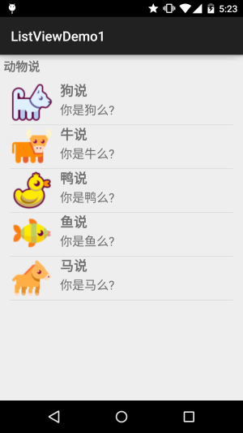
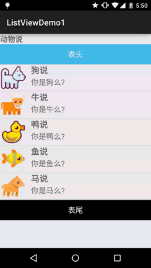
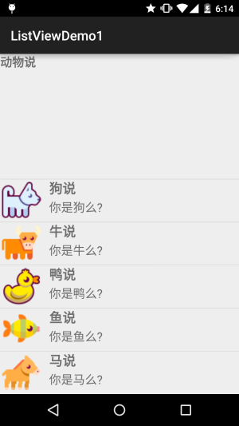

## 2.4.5 ListView简单实用


## 本节引言：

> 本节我们来继续学习没有讲完的UI控件部分， 回顾上一节，我们介绍了Adapter适配器的概念，然后学习了三个最简单的适配器的使用：
> ArrayAdapter，SimpleAdapter和SimpleCursorAdapter，而本节给大家讲解的是第一个需搭配Adapter使用的UI控件：ListView，不过在版本中被RecyclerView这个新控件替换掉了！
> 列表作为最常用的控件之一，还是有必要好好学习的，本节以一个初学者的角度来学习 ListView，ListView的属性，以及BaseAdapter简单定义，至于ListView优化这些， 我们一步步来~莫急！

------

## 1.自定义BaseAdapter，然后绑定ListView的最简单例子

先看看我们要实现的效果图：



一个很简单的ListView，自己写下Item，然后加载点数据这样~ 下面贴下关键代码：

**Animal.java**:

```
/**
 * Created by Jay on 2015/9/18 0018.
 */
public class Animal {
    private String aName;
    private String aSpeak;
    private int aIcon;

    public Animal() {
    }

    public Animal(String aName, String aSpeak, int aIcon) {
        this.aName = aName;
        this.aSpeak = aSpeak;
        this.aIcon = aIcon;
    }

    public String getaName() {
        return aName;
    }

    public String getaSpeak() {
        return aSpeak;
    }

    public int getaIcon() {
        return aIcon;
    }

    public void setaName(String aName) {
        this.aName = aName;
    }

    public void setaSpeak(String aSpeak) {
        this.aSpeak = aSpeak;
    }

    public void setaIcon(int aIcon) {
        this.aIcon = aIcon;
    }
}
```

**AnimalAdapter.java**：自定义的BaseAdapter：

```
/**
 * Created by Jay on 2015/9/18 0018.
 */
public class AnimalAdapter extends BaseAdapter {

    private LinkedList<Animal> mData;
    private Context mContext;

    public AnimalAdapter(LinkedList<Animal> mData, Context mContext) {
        this.mData = mData;
        this.mContext = mContext;
    }

    @Override
    public int getCount() {
        return mData.size();
    }

    @Override
    public Object getItem(int position) {
        return null;
    }

    @Override
    public long getItemId(int position) {
        return position;
    }

    @Override
    public View getView(int position, View convertView, ViewGroup parent) {
        convertView = LayoutInflater.from(mContext).inflate(R.layout.item_list_animal,parent,false);
        ImageView img_icon = (ImageView) convertView.findViewById(R.id.img_icon);
        TextView txt_aName = (TextView) convertView.findViewById(R.id.txt_aName);
        TextView txt_aSpeak = (TextView) convertView.findViewById(R.id.txt_aSpeak);
        img_icon.setBackgroundResource(mData.get(position).getaIcon());
        txt_aName.setText(mData.get(position).getaName());
        txt_aSpeak.setText(mData.get(position).getaSpeak());
        return convertView;
    }
}
```

最后是**MainActivity.java**：

```
public class MainActivity extends AppCompatActivity {

    private List<Animal> mData = null;
    private Context mContext;
    private AnimalAdapter mAdapter = null;
    private ListView list_animal;

    @Override
    protected void onCreate(Bundle savedInstanceState) {
        super.onCreate(savedInstanceState);
        setContentView(R.layout.activity_main);
        mContext = MainActivity.this;
        list_animal = (ListView) findViewById(R.id.list_animal);
        mData = new LinkedList<Animal>();
        mData.add(new Animal("狗说", "你是狗么?", R.mipmap.ic_icon_dog));
        mData.add(new Animal("牛说", "你是牛么?", R.mipmap.ic_icon_cow));
        mData.add(new Animal("鸭说", "你是鸭么?", R.mipmap.ic_icon_duck));
        mData.add(new Animal("鱼说", "你是鱼么?", R.mipmap.ic_icon_fish));
        mData.add(new Animal("马说", "你是马么?", R.mipmap.ic_icon_horse));
        mAdapter = new AnimalAdapter((LinkedList<Animal>) mData, mContext);
        list_animal.setAdapter(mAdapter);
    }

}
```

好的，自定义BaseAdapter以及完成数据绑定就是这么简单~
别问我拿示例的代码，刚开始学就会写出这些代码，我只是演示下流程，让大家熟悉 熟悉而已~另外，也是为下面的属性验证做准备~

------

## 2.表头表尾分割线的设置：

> listview作为一个列表控件，他和普通的列表一样，可以自己设置表头与表尾： 以及分割线，可供我们设置的属性如下：
>
> - **footerDividersEnabled**：是否在footerView(表尾)前绘制一个分隔条,默认为true
> - **headerDividersEnabled**:是否在headerView(表头)前绘制一个分隔条,默认为true
> - **divider**:设置分隔条,可以用颜色分割,也可以用drawable资源分割
> - **dividerHeight**:设置分隔条的高度
>
> 翻遍了了API发现并没有可以直接设置ListView表头或者表尾的属性，只能在Java中写代码 进行设置了，可供我们调用的方法如下：
>
> - **addHeaderView(View v)**：添加headView(表头),括号中的参数是一个View对象
> - **addFooterView(View v)**：添加footerView(表尾)，括号中的参数是一个View对象
> - **addHeaderView(headView, null, false)**：和前面的区别：设置Header是否可以被选中
> - **addFooterView(View,view,false)**：同上
>
> 对了，使用这个addHeaderView方法必须放在listview.setAdapter前面，否则会报错。

**使用示例**：

**运行效果图**：



**代码实现**：

先编写下表头与表尾的布局：

**view_header.xml**(表头),表尾一样，就不贴了：

```
<?xml version="1.0" encoding="utf-8"?>
<LinearLayout xmlns:android="http://schemas.android.com/apk/res/android"
    android:layout_width="match_parent"
    android:layout_height="match_parent"
    android:orientation="vertical"
    android:gravity="center">
    <TextView
        android:layout_width="match_parent"
        android:layout_height="48dp"
        android:textSize="18sp"
        android:text="表头"
        android:gravity="center"
        android:background="#43BBEB"
        android:textColor="#FFFFFF"/>
</LinearLayout>
```

**MainActivty.java**:

```
public class MainActivity extends AppCompatActivity implements AdapterView.OnItemClickListener{

    private List<Animal> mData = null;
    private Context mContext;
    private AnimalAdapter mAdapter = null;
    private ListView list_animal;
    private LinearLayout ly_content;

    @Override
    protected void onCreate(Bundle savedInstanceState) {
        super.onCreate(savedInstanceState);
        setContentView(R.layout.activity_main);
        mContext = MainActivity.this;
        list_animal = (ListView) findViewById(R.id.list_animal);
        //动态加载顶部View和底部View
        final LayoutInflater inflater = LayoutInflater.from(this);
        View headView = inflater.inflate(R.layout.view_header, null, false);
        View footView = inflater.inflate(R.layout.view_footer, null, false);

        mData = new LinkedList<Animal>();
        mData.add(new Animal("狗说", "你是狗么?", R.mipmap.ic_icon_dog));
        mData.add(new Animal("牛说", "你是牛么?", R.mipmap.ic_icon_cow));
        mData.add(new Animal("鸭说", "你是鸭么?", R.mipmap.ic_icon_duck));
        mData.add(new Animal("鱼说", "你是鱼么?", R.mipmap.ic_icon_fish));
        mData.add(new Animal("马说", "你是马么?", R.mipmap.ic_icon_horse));
        mAdapter = new AnimalAdapter((LinkedList<Animal>) mData, mContext);
        //添加表头和表尾需要写在setAdapter方法调用之前！！！
        list_animal.addHeaderView(headView);
        list_animal.addFooterView(footView);

        list_animal.setAdapter(mAdapter);
        list_animal.setOnItemClickListener(this);
    }

    @Override
    public void onItemClick(AdapterView<?> parent, View view, int position, long id) {
        Toast.makeText(mContext,"你点击了第" + position + "项",Toast.LENGTH_SHORT).show();
    }
}
```

好的，代码还是比较简单的，从上面我们看出来一个要注意的问题，就是：

> 添加表头表尾后，我们发现positon是从表头开始算的，就是你添加的第一个数据本来的 postion 是 0，但是此时却变成了 1，因为表头也算！！

------

## 3.列表从底部开始显示：stackFromBottom

> 如果你想让列表显示你列表的最下面的话，那么你可以使用这个属性，将stackFromBottom 属性设置为true即可，设置后的效果图如下：



------

## 4.设置点击颜色cacheColorHint

> 如果你为ListView设置了一个图片作为Background的话，当你拖动或者点击listView空白位置会发现 item都变成黑色了，这是时候我们可以通过这个**cacheColorHint**将颜色设置为透明:#00000000

------

## 5.隐藏滑动条

> 我们可以通过设置：android:scrollbars="none" 或者 setVerticalScrollBarEnabled(true); 解决这个问题！

------

## 本节小结：

> 好的，关于ListView的基本用法大概就这些，当然除了上述的这些属性外还有其他的， 实际遇到再查查吧~这里知道如何去重写BaseAdapter和完成数据绑定就好，下节我们来 教大家如何来优化这个BaseAdapter的编写~