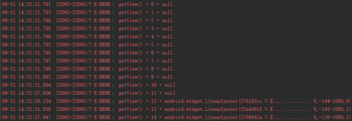

## 2.4.8 ListView之checkbox错位问题解决

### 

## 本节引言：

> 作为ListView经典问题之一，如果你尝试过自定义ListView的item，在上面带有一个checkbox的话，那么 当你的item数超过了一页的话，就会出现这个问题，下面我们来分析下出现这种问题的原因，以及如何来解决这个问题！

------

## 1.问题发生的原因：

这是网上找来的一幅关于ListView getView方法调用机制的一个图


上图中有一个**Recycler**的东东，平时我们ListView上可见的Item处于内存中，而且他的Item则放在这个Recycler中，第一次加载item时，当前页面中的convertView都为NULL，当滚出屏幕，这是时候 **ConvertView**不为空，所以新的一项会复用这个ConvertView！ 我们可以写个简单的例子，跟下log，下面是运行后的一些Log图！



从图中看出，Postion从12开始，ConvertView就不为空了，具体这里代表的是什么， 我也不知道，目测要走源码...我们知道这里ConvertView会缓存就好，就是因为这个原因造成的checkbox错位，所以第一个解决方式就是，不重用这个ConvertView，或者说每次getView都将这个ConvertView设置为null，但是如果需要显示的Item数目巨大的话， 这种方法就会显得非常臃肿，一般实际开发我们使用的是下面的解决方法： **找个东东来保存当前Item CheckBox的状态，初始化的时候进行判断，设置是否选中！**

------

## 2.解决方法示例：

> 好的存储这个Checkbox的方法有很多，你可以放到一个HashMap<Integer, Boolean>中， 每次初始化的时候根据postion取出对应的boolean值，然后再进行checkbox的状态设置； 而笔者的做法则是在entity类中加入了一个boolean值用于判断，下面是笔者一个项目中抽取出来的代码，代码比较简单，相信你看完会秒懂的~

Entity类：**Person.java**：

```
public class Person implements Serializable{
    private String name;
    private String number;
    private boolean checkStatus;
    
    public Person(String name, String number) {
        super();
        this.name = name;
        this.number = number;
        this.checkStatus = false;
    }

    public String getName() {
        return name;
    }

    public void setName(String name) {
        this.name = name;
    }

    public String getNumber() {
        return number;
    }

    public void setNumber(String number) {
        this.number = number;
    }

    public boolean getCheckStatus() {
        return checkStatus;
    }

    public void setCheckStatus(boolean checkStatus) {
        this.checkStatus = checkStatus;
    }
    
}
```

实现的Adapter类：**ContactListAdapter.java\**：\****

```
public class ContactListAdapter extends BaseAdapter implements CompoundButton.OnCheckedChangeListener{

    private List<Person> mData;
    private Context mContext;

    public ContactListAdapter(List<Person> data, Context context) {
        mData = data;
        mContext = context;
    }

    // 定义一个刷新数据的方法
    public void changeData(List<Person> data) {
        mData = data;
        notifyDataSetChanged();
    }

    @Override
    public int getCount() {
        return mData.size();
    }

    @Override
    public Person getItem(int position) {
        return mData.get(position);
    }

    @Override
    public long getItemId(int position) {
        return position;
    }

    @Override
    public View getView(int position, View convertView, ViewGroup parent) {
        final int index = position;
        ViewHolder viewHolder;
        if (convertView == null) {
            convertView = LayoutInflater.from(mContext).inflate(
                    R.layout.item_contact, parent, false);
            viewHolder = new ViewHolder();
            viewHolder.ly = (RelativeLayout) convertView
                    .findViewById(R.id.lyContactListItem);
            viewHolder.txtName = (TextView) convertView
                    .findViewById(R.id.txtName);
            viewHolder.txtNumber = (TextView) convertView
                    .findViewById(R.id.txtNumber);
            viewHolder.cbxStatus = (CheckBox) convertView
                    .findViewById(R.id.cbxStatus);
            convertView.setTag(viewHolder);
            viewHolder.cbxStatus.setTag(index);
        } else {
            viewHolder = (ViewHolder) convertView.getTag();
        }
        viewHolder.cbxStatus.setOnCheckedChangeListener(this);
        viewHolder.cbxStatus.setChecked(mData.get(position).getcheckStatus());
        viewHolder.txtName.setText(mData.get(index).getName());
        viewHolder.txtNumber.setText(mData.get(index).getNumber());
        return convertView;
    }

    @Override
    public void onCheckedChanged(CompoundButton buttonView, boolean isChecked) {
        int index = (int)buttonView.getTag();
        if (isChecked)
            mData.get(index).setCheckStatus(true);
        else
            mData.get(index).setCheckStatus(false);
    }


    private class ViewHolder {
        RelativeLayout ly;
        TextView txtName;
        TextView txtNumber;
        CheckBox cbxStatus;
    }
}

```

***嘿嘿，非常简单，另外别忘了一点： \*\*checkbox监听器的方法要添加在初始化Checkbox状态的代码之前哦~\*\*本节引言：好的，本节给大家讲解了ListView的一个经典问题，ListView中checkbox错位的 问题解决，只需简单的添加一个记录checkbox选择状态的值，然后重写checkbox 点击事件的时候，先做判断~谢谢~***


***\*← [2.4.7ListView的焦点问题](http://www.runoob.com/w3cnote/android-tutorial-listview-focus.html)[2.4.9 L](http://www.runoob.com/w3cnote/android-tutorial-listview-update.html)\****