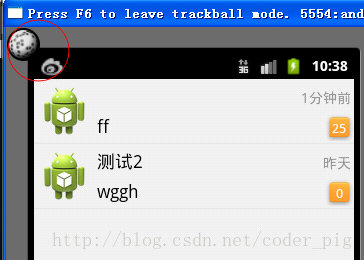
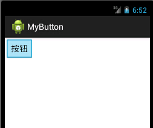
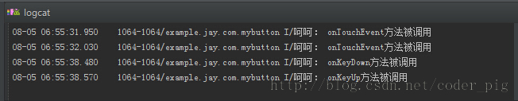
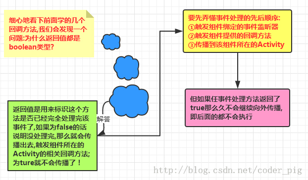
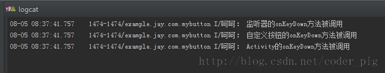

## 3.2 基于回调的事件处理机制

## 本节引言

> 在3.1中我们对Android中的一个事件处理机制——基于监听的事件处理机制进行了学习, 简单的说就是为我们的事件源(组件)添加一个监听器, 然后当用户触发了事件后, 交给监听器去处理, 根据不同的事件执行不同的操作; 那么基于回调的事件处理机制又是什么样的原理呢？好吧，还有一个问题: 你知道什么是**方法回调**吗？知道吗？相信很多朋友都是了解，但又说不出来吧！好了，带着这些疑问我们 对android事件处理机制中的回调事件处理机制进行解析吧！

------

## 1.什么是方法回调？

**文字表述：**

> 答:是将功能定义与功能分开的一种手段, 一种解耦合的设计思想; 在Java中回调是通过接口来实现的, 作为一种系统架构, 必须要有自己的运行环境, 且需要为用户提供实现接口; 实现依赖于客户, 这样就可以达到接口统一, 实现不同,   系统通过在不同的状态下"回调"我们的实现类,  从而达到接口和实现的分离！

**举个简单例子：**

> **比如：**你周五放学回家, 你问你老妈煮好饭没, 你妈说还没煮; 然后你跟她说: 老妈, 我看下喜羊羊, 你煮好饭叫我哈! **分析:** 你和老妈约定了一个接口,  你通过这个接口叫老妈煮饭, 当饭煮好了的时候, 你老妈又通过这个接口来反馈你, "饭煮好了"！

## 2.Android回调的事件处理机制详解：

在Android中基于回调的事件处理机制使用场景有两个：

### 1）自定义view

> 当用户在GUI组件上激发某个事件时, 组件有自己特定的方法会负责处理该事件
>
> 通常用法:继承基本的GUI组件, 重写该组件的事件处理方法, 即自定义view 
>
> **注意:在xml布局中使用自定义的view时, 需要使用"全限定类名"**

**常见View组件的回调方法：**

android为GUI组件提供了一些事件处理的回调方法, 以View为例, 有以下几个方法

> ①在该组件上触发屏幕事件: boolean **onTouchEvent**(MotionEvent event);
> ②在该组件上按下某个按钮时: boolean **onKeyDown**(int keyCode,KeyEvent event);
> ③松开组件上的某个按钮时: boolean **onKeyUp**(int keyCode,KeyEvent event);
> ④长按组件某个按钮时: boolean **onKeyLongPress**(int keyCode,KeyEvent event);
> ⑤键盘快捷键事件发生: boolean **onKeyShortcut**(int keyCode,KeyEvent event);
> ⑥在组件上触发轨迹球屏事件: boolean **onTrackballEvent**(MotionEvent event);
> ⑦当组件的焦点发生改变, 和前面的6个不同, 这个方法只能够在View中重写哦！ protected void **onFocusChanged**(boolean gainFocus, int direction, Rect previously FocusedRect)

另外，这了解释下什么是轨迹球，不过用处不大, 在以前黑莓的手机上可以看到; 当我们浏览网页的的时候 , 可以把轨迹球看作鼠标, 不过这样的操作, 我们用onTouchEvent就可以解决了, 而且不够美观, 所以现在用的很好, 基本不用, 如果你有兴趣想看看的话,可以在原始Android模拟器按f6就可以看到了！



**代码示例：** 我们自定义一个MyButton类继承Button类, 然后重写onKeyLongPress方法; 接着在xml文件中通过全限定类名调用自定义的view

**效果图如下：**



一个简单的按钮,点击按钮后触发onTouchEvent事件,当我们按模拟器上的键盘时, 按下触发onKeyDown,离开键盘时触发onKeyUp事件！我们通过Logcat进行查看！



**实现代码：** MyButton.java

```
public class MyButton extends Button {  
    private static String TAG = "呵呵";  
    public MyButton(Context context, AttributeSet attrs) {  
        super(context, attrs);  
    }  
  
    //重写键盘按下触发的事件  
    @Override  
    public boolean onKeyDown(int keyCode, KeyEvent event) {  
        super.onKeyDown(keyCode, event);  
        Log.i(TAG, "onKeyDown方法被调用");  
        return true;  
    }  
  
    //重写弹起键盘触发的事件  
    @Override  
    public boolean onKeyUp(int keyCode, KeyEvent event) {  
        super.onKeyUp(keyCode, event);  
        Log.i(TAG, "onKeyUp方法被调用");  
        return true;  
    }  
  
    //组件被触摸了  
    @Override  
    public boolean onTouchEvent(MotionEvent event) {  
        super.onTouchEvent(event);  
        Log.i(TAG, "onTouchEvent方法被调用");  
        return true;  
    }  
} 
```

**布局文件：**

```
<RelativeLayout xmlns:android="http://schemas.android.com/apk/res/android"  
    xmlns:tools="http://schemas.android.com/tools"  
    android:layout_width="match_parent"  
    android:layout_height="match_parent"  
    tools:context=".MyActivity">  
    
    <example.jay.com.mybutton.MyButton  
        android:layout_width="wrap_content"  
        android:layout_height="wrap_content"  
        android:text="按钮"/> 
```

**代码解析：**

> 因为我们直接重写了Button的三个回调方法, 当发生点击事件后就不需要我们在Java文件中进行事件监听器的绑定就可以完成回调, 即组件会处理对应的事件, 即事件由事件源(组件)自身处理！

------

### 2）基于回调的事件传播：



综上,就是如果是否向外传播取决于方法的返回值是时true还是false;

**代码示例：**

```
public class MyButton extends Button {  
    private static String TAG = "呵呵";  
    public MyButton(Context context, AttributeSet attrs) {  
        super(context, attrs);  
    }  
  
    //重写键盘按下触发的事件  
    @Override  
    public boolean onKeyDown(int keyCode, KeyEvent event) {  
        super.onKeyDown(keyCode, event);  
        Log.i(TAG, "自定义按钮的onKeyDown方法被调用");  
        return false;  
    }  
}
```

**main.xml:**

```
<LinearLayout xmlns:android="http://schemas.android.com/apk/res/android"  
    xmlns:tools="http://schemas.android.com/tools"  
    android:layout_width="match_parent"  
    android:layout_height="match_parent"  
    tools:context=".MyActivity">  
  
    <example.jay.com.mybutton.MyButton  
        android:layout_width="wrap_content"  
        android:layout_height="wrap_content"  
        android:text="自定义按钮"  
        android:id="@+id/btn_my"/>  
</LinearLayout>  
```

**MainActivity.java：**

```
public class MyActivity extends ActionBarActivity {  
    @Override  
    protected void onCreate(Bundle savedInstanceState) {  
        super.onCreate(savedInstanceState);  
        setContentView(R.layout.activity_my);  
  
        Button btn = (Button)findViewById(R.id.btn_my);  
        btn.setOnKeyListener(new View.OnKeyListener() {  
            @Override  
            public boolean onKey(View v, int keyCode, KeyEvent event) {  
                if(event.getAction() == KeyEvent.ACTION_DOWN)  
                {  
                    Log.i("呵呵", "监听器的onKeyDown方法被调用");  
                }  
                return false;  
            }  
        });  
    }  
  
    @Override  
    public boolean onKeyDown(int keyCode, KeyEvent event) {  
        super.onKeyDown(keyCode, event);  
        Log.i("呵呵", "Activity的onKeyDown方法被调用");  
        return false;  
    }  
} 
```

**运行截图：**



### 结果分析： 从上面的运行结果,我们就可以知道,传播的顺序是: **监听器**--->**view组件的回调方法**--->**Activity的回调方法了**;

------

## 本节小结

> 本节对Android事件处理机制中的基于回调的事件处理机制进行了讲解！核心就是事件传播的顺序 监听器优先，然后到View组件自身，最后再到Activity；返回值false继续传播，true终止传播~！

