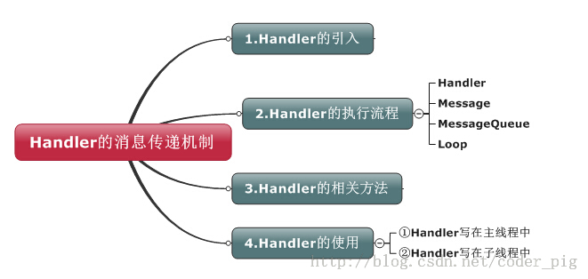
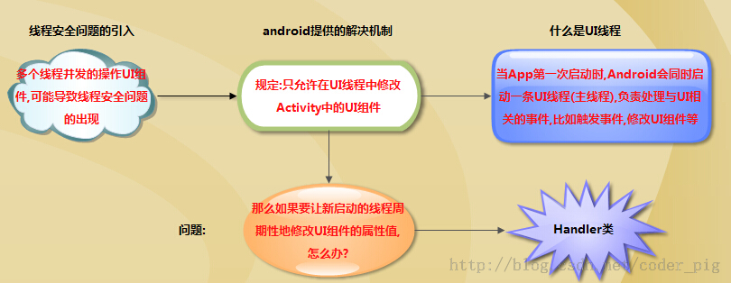
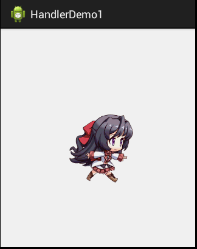

## 3.3 Handler消息传递机制浅析


## 本节引言

前两节中我们对Android中的两种事件处理机制进行了学习，事件响应就这两种；本节给大家讲解的是Activity中UI组件中的信息传递Handler，相信很多朋友都知道，Android为了线程安全，并不允许我们在UI线程外操作UI；很多时候我们做界面刷新都需要通过Handler来通知UI组件更新！除了用Handler完成界面更新外，还可以使用runOnUiThread()来更新，甚至更高级的事务总线，当然，这里我们只讲解Handler，什么是Handler，执行流程，相关方法，子线程与主线程中使用Handler的区别等！

------

## 1.学习路线图：



------

## 2.Handler类的引入:



------

## 3.Handler的执行流程图：


**流程图解析:** **相关名词**

> - **UI线程**:就是我们的主线程, **系统**在创建UI线程的时候会初始化一个Looper对象, 同时也会创建一个与其关联的MessageQueue;
> - **Handler**:作用就是发送与处理信息,  如果希望Handler正常工作, 在当前线程中要有一个Looper对象
> - **Message**:Handler接收与处理的消息对象
> - **MessageQueue**:消息队列, 先进先出管理Message, 在初始化Looper对象时会创建一个与之关联的MessageQueue;
> - **Looper**:每个线程只能够有一个Looper, 管理MessageQueue, 不断地从中取出Message分发给对应的Handler处理！

**简单点说：**

> 当我们的子线程想修改Activity中的UI组件时, 我们可以新建一个Handler对象, 通过这个对象向主线程发送信息; 而我们发送的信息会先到主线程的MessageQueue进行等待, 由Looper按先入先出顺序取出, 再根据message对象的what属性分发给对应的Handler进行处理！

------

## 4.Handler的相关方法:

> - void **handleMessage**(Message msg):处理消息的方法, 通常是用于被重写!
> - **sendEmptyMessage**(int what):发送空消息
> - **sendEmptyMessageDelayed**(int what, long delayMillis):指定延时多少毫秒后发送空信息
> - **sendMessage**(Message msg):立即发送信息
> - **sendMessageDelayed**(Message msg):指定延时多少毫秒后发送信息
> - final boolean **hasMessage**(int what):检查消息队列中是否包含what属性为指定值的消息. 如果是参数为(int what, Object object):除了判断what属性,还需要判断Object属性是否为指定对象的消息

------

## 5.Handler的使用示例：

### 1）Handler写在主线程中

> 在主线程中, 因为系统已经初始化了一个Looper对象, 所以我们直接创建Handler对象, 就可以进行信息的发送与处理了！

**代码示例：** 简单的一个定时切换图片的程序, 通过Timer定时器, 定时修改ImageView显示的内容, 从而形成帧动画

**运行效果图：**



**实现代码：**

```
<RelativeLayout xmlns:android="http://schemas.android.com/apk/res/android"  
    xmlns:tools="http://schemas.android.com/tools"  
    android:id="@+id/RelativeLayout1"  
    android:layout_width="match_parent"  
    android:layout_height="match_parent"  
    android:gravity="center"  
    tools:context="com.jay.example.handlerdemo1.MainActivity" >  
  
    <ImageView  
        android:id="@+id/imgchange"  
        android:layout_width="wrap_content"  
        android:layout_height="wrap_content"  
        android:layout_alignParentLeft="true"  
        android:layout_alignParentTop="true" />  
  
</RelativeLayout> 
```

**MainActivity.java：**

```
public class MainActivity extends Activity {  
  
    //定义切换的图片的数组id  
    int imgids[] = new int[]{  
        R.drawable.s_1, R.drawable.s_2, R.drawable.s_3,  
        R.drawable.s_4, R.drawable.s_5, R.drawable.s_6,  
        R.drawable.s_7, R.drawable.s_8  
    };  
    int imgstart = 0;  
      
    final Handler myHandler = new Handler()  
    {  
      @Override  
      // 重写handleMessage方法, 根据msg中what的值判断是否执行后续操作  
      public void handleMessage(Message msg) {  
        if(msg.what == 0x123)  
        {  
            imgchange.setImageResource(imgids[imgstart++ % 8]);  
        }  
      }  
    };  
    
      
    @Override  
    protected void onCreate(Bundle savedInstanceState) {  
        super.onCreate(savedInstanceState);  
        setContentView(R.layout.activity_main);  
        final ImageView imgchange = (ImageView) findViewById(R.id.imgchange);  
         
        //使用定时器,每隔200毫秒让handler发送一个空信息  
        new Timer().schedule(new TimerTask() {            
            @Override  
            public void run() {  
                myHandler.sendEmptyMessage(0x123);  
                  
            }  
        }, 0, 200);  
    }  
  
} 
```

------

### 2）Handler写在子线程中

如果是Handler写在了子线程中的话, 我们就需要自己创建一个Looper对象了!创建的流程如下:

> **1 )**直接调用Looper.prepare()方法即可为当前线程创建Looper对象, 而它的构造器会创建配套的MessageQueue; 
>
> **2 )**创建Handler对象, 重写handleMessage( )方法就可以处理来自于其他线程的信息了! 
>
> **3 )**调用Looper.loop()方法启动Looper

使用示例： 输入一个数，计算后通过Toast输出在这个范围内的所有质数

实现代码： **main.xml：**

```
<LinearLayout  
    xmlns:android="http://schemas.android.com/apk/res/android"  
    android:layout_width="match_parent"  
    android:layout_height="match_parent"  
    android:orientation="vertical">  
    <EditText  
        android:id="@+id/etNum"  
        android:inputType="number"  
        android:layout_width="match_parent"  
        android:layout_height="wrap_content"  
        android:hint="请输入上限"/>  
    <Button  
        android:layout_width="match_parent"  
        android:layout_height="wrap_content"  
        android:onClick="cal"  
        android:text="计算"/>    
</LinearLayout>  
```

**MainActivity.java:**

```
public class CalPrime extends Activity  
{  
    static final String UPPER_NUM = "upper";  
    EditText etNum;  
    CalThread calThread;  
    
    // 定义一个线程类  
    class CalThread extends Thread  
    {  
        public Handler mHandler;  
  
        public void run()  
        {  
            Looper.prepare();  
            mHandler = new Handler()  
            {  
                // 定义处理消息的方法  
                @Override  
                public void handleMessage(Message msg)  
                {  
                    if(msg.what == 0x123)  
                    {  
                        int upper = msg.getData().getInt(UPPER_NUM);  
                        List<Integer> nums = new ArrayList<Integer>();  
                        // 计算从2开始、到upper的所有质数  
                        outer:  
                        for (int i = 2 ; i <= upper ; i++)  
                        {  
                            // 用i处于从2开始、到i的平方根的所有数  
                            for (int j = 2 ; j <= Math.sqrt(i) ; j++)  
                            {  
                                // 如果可以整除，表明这个数不是质数  
                                if(i != 2 && i % j == 0)  
                                {  
                                    continue outer;  
                                }  
                            }  
                            nums.add(i);  
                        }  
                        // 使用Toast显示统计出来的所有质数  
                        Toast.makeText(CalPrime.this , nums.toString()  
                            , Toast.LENGTH_LONG).show();  
                    }  
                }  
            };  
            Looper.loop();  
        }  
    }  
    
    @Override  
    public void onCreate(Bundle savedInstanceState)  
    {  
        super.onCreate(savedInstanceState);  
        setContentView(R.layout.main);  
        etNum = (EditText)findViewById(R.id.etNum);  
        calThread = new CalThread();  
        // 启动新线程  
        calThread.start();  
    }
    
    // 为按钮的点击事件提供事件处理函数  
    public void cal(View source)  
    {  
        // 创建消息  
        Message msg = new Message();  
        msg.what = 0x123;  
        Bundle bundle = new Bundle();  
        bundle.putInt(UPPER_NUM ,  
            Integer.parseInt(etNum.getText().toString()));  
        msg.setData(bundle);  
        // 向新线程中的Handler发送消息  
        calThread.mHandler.sendMessage(msg);  
    }  
} 
```

PS:本例子来自于《Android疯狂讲义》~

------

## 本节小结

本节对Android中的Handler事件传递进行了简单的分析，要分清楚Handler，Message，MessageQueue， Loop的概念，以及Handler写在主线程中以及子线程中的区别！