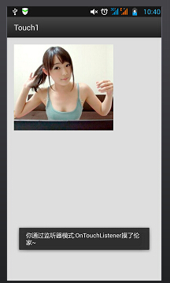
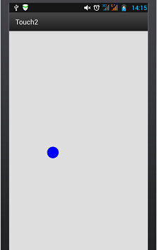
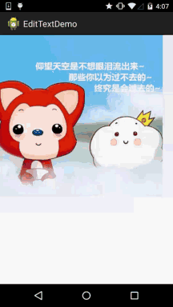

## 3.4 TouchListener PK OnTouchEvent + 多点触碰


## 本节引言：

> 如题，本节给大家带来的是**TouchListener**与**OnTouchEvent**的比较，以及多点触碰的知识点！ TouchListener是基于监听的，而OnTouchEvent则是基于回调的！下面通过两个简单的例子来加深 大家的理解！

## 1.基于监听的TouchListener

### 代码示例：

**实现效果图：**



**实现代码：** **main.xml**

```
<RelativeLayout xmlns:android="http://schemas.android.com/apk/res/android"  
    xmlns:tools="http://schemas.android.com/tools"  
    android:layout_width="match_parent"  
    android:layout_height="match_parent"  
    android:paddingLeft="@dimen/activity_horizontal_margin"  
    android:paddingRight="@dimen/activity_horizontal_margin"  
    android:paddingTop="@dimen/activity_vertical_margin"  
    android:paddingBottom="@dimen/activity_vertical_margin"  
    tools:context=".MyActivity">  
  
    <ImageView  
        android:layout_width="wrap_content"  
        android:layout_height="wrap_content"  
        android:id="@+id/imgtouch"  
        android:background="@drawable/touch"/>  
</RelativeLayout> 
```

**MainAcitivity.java**

```
public class MyActivity extends ActionBarActivity {  
  
    private ImageView imgtouch;  
  
    @Override  
    protected void onCreate(Bundle savedInstanceState) {  
        super.onCreate(savedInstanceState);  
        setContentView(R.layout.activity_my);  
  
        imgtouch = (ImageView)findViewById(R.id.imgtouch);  
        imgtouch.setOnTouchListener(new View.OnTouchListener() {  
            @Override  
            public boolean onTouch(View v, MotionEvent event) {  
                Toast.makeText(getApplicationContext(),"你通过监听器模式:OnTouchListener摸了伦家~",Toast.LENGTH_LONG).show();  
                return true;  
            }  
        });  
    }  
}
```

**代码解析：**

> 就是简单的设置一个ImageView, 然后setOnTouchListener, 重写onTouch方法即可! 很简单, 其实这个在帧布局那一节已经有个例子了，还记得那个随手指移动的萌妹子吗？

### OnTouchListener相关方法与属性:

> **onTouch**(View v, MotionEvent event):这里面的参数依次是触发触摸事件的组件, 触碰事件event 封装了触发事件的详细信息，同样包括事件的类型、触发时间等信息。比如event.getX(), event.getY()
> 我们也可以对触摸的动作类型进行判断, 使用event.getAction( )再进行判断; 如:
> event.getAction == MotionEvent.**ACTION_DOWN**：按下事件
> event.getAction == MotionEvent.**ACTION_MOVE**:移动事件
> event.getAction == MotionEvent.**ACTION_UP**:弹起事件

------

## 2.基于回调的onTouchEvent( )方法

> 同样是触碰事件,但是onTouchEvent更多的是用于自定义的view, 所有的view类中都重写了该方法, 而这种触摸事件是基于回调的,  也就是说: 如果我们返回的值是false的话, 那么事件会继续向外传播, 由外面的容器或者Activity进行处理! 当然还涉及到了手势(Gesture), 这个我们会在后面进行详细的讲解! onTouchEvent其实和onTouchListener是类似的, 只是处理机制不用, 前者是回调,后者是监听模式！

**代码示例：** 定义一个简单的view，绘制一个蓝色的小圆，可以跟随手指进行移动

**实现代码：** MyView.java

```
public class MyView extends View {  
    public float X = 50;  
    public float Y = 50;  
  
    //创建画笔  
    Paint paint = new Paint();  
  
    public MyView(Context context, AttributeSet set)  
    {  
        super(context, set);  
    }  
  
    @Override  
    public void onDraw(Canvas canvas) {  
        super.onDraw(canvas);  
        paint.setColor(Color.BLUE);  
        canvas.drawCircle(X, Y, 30, paint);  
    }  
  
    @Override  
    public boolean onTouchEvent(MotionEvent event) {  
        this.X = event.getX();  
        this.Y = event.getY();  
        //通知组件进行重绘  
        this.invalidate();  
        return true;  
    }  
}
```

**main.xml:**

```
<RelativeLayout xmlns:android="http://schemas.android.com/apk/res/android"  
    xmlns:tools="http://schemas.android.com/tools"  
    android:layout_width="match_parent"  
    android:layout_height="match_parent"  
    tools:context=".MyActivity"> 
    
    <example.jay.com.touch2.MyView  
        android:layout_width="wrap_content"  
        android:layout_height="wrap_content" />  
</RelativeLayout> 
```

**实现效果图：**



 

用手指触摸进行移动~

------

## 3.多点触碰

### 原理类的东西：

所谓的多点触碰就是多个手指在屏幕上进行操作，用的最多的估计是放大缩功能吧，比如很多的图片浏览器都支持缩放！理论上Android系统本身可以处理多达256个手指的触摸，当然这取决于手机硬件的支持；不过支持多点触摸的手机一般支持2-4个点，当然有些更多！我们发现前面两点都有用到MotionEvent，MotionEvent代表的是一个触摸事件；前我们可以根据**event.getAction() & MotionEvent.ACTION_MASK**来判断是哪种操作，除了上面介绍的三种单点操作外，还有两个多点专用的操作：

- MotionEvent.**ACTION_POINTER_DOWN**:当屏幕上已经有一个点被按住，此时再按下其他点时触发。
- MotionEvent.**ACTION_POINTER_UP**:当屏幕上有多个点被按住，松开其中一个点时触发（即非最后一个点被放开时）。

**简单的流程大概是这样：**

- 当我们一个手指触摸屏幕 ——> 触发ACTION_DOWN事件
- 接着有另一个手指也触摸屏幕 ——> 触发ACTION_POINTER_DOWN事件,如果还有其他手指触摸，继续触发
- 有一个手指离开屏幕 ——> 触发ACTION_POINTER_UP事件，继续有手指离开，继续触发
- 当最后一个手指离开屏幕 ——> 触发ACTION_UP事件
- 而且在整个过程中，ACTION_MOVE事件会一直不停地被触发

我们可以通过event.**getX**(int)或者event.**getY**(int)来获得不同触摸点的位置： 比如event.getX(0)可以获得第一个接触点的X坐标，event.getX(1)获得第二个接触点的X坐标这样... 另外，我们还可以在调用MotionEvent对象的**getPointerCount()**方法判断当前有多少个手指在触摸~

------

### 代码示例：

好吧，我们来写个最常见的单指拖动图片，双指缩放图片的示例吧：

**实现效果图：**



**实现代码：**

```
<?xml version="1.0" encoding="utf-8"?>
<RelativeLayout xmlns:android="http://schemas.android.com/apk/res/android"
    android:layout_width="match_parent"
    android:layout_height="match_parent" >

    <ImageView
        android:id="@+id/img_test"
        android:layout_width="match_parent"
        android:layout_height="match_parent"
        android:scaleType="matrix"
        android:src="@drawable/pic1" />

</RelativeLayout>
```

**MainActivity.java**

```
package com.jay.example.edittextdemo;

import android.app.Activity;
import android.graphics.Matrix;
import android.graphics.PointF;
import android.os.Bundle;
import android.util.FloatMath;
import android.view.MotionEvent;
import android.view.View;
import android.view.View.OnTouchListener;
import android.widget.ImageView;

public class MainActivity extends Activity implements OnTouchListener {

    private ImageView img_test;

    // 縮放控制
    private Matrix matrix = new Matrix();
    private Matrix savedMatrix = new Matrix();

    // 不同状态的表示：
    private static final int NONE = 0;
    private static final int DRAG = 1;
    private static final int ZOOM = 2;
    private int mode = NONE;

    // 定义第一个按下的点，两只接触点的重点，以及出事的两指按下的距离：
    private PointF startPoint = new PointF();
    private PointF midPoint = new PointF();
    private float oriDis = 1f;

    /*
     * (non-Javadoc)
     * 
     * @see android.app.Activity#onCreate(android.os.Bundle)
     */
    @Override
    protected void onCreate(Bundle savedInstanceState) {
        super.onCreate(savedInstanceState);
        setContentView(R.layout.activity_main);
        img_test = (ImageView) this.findViewById(R.id.img_test);
        img_test.setOnTouchListener(this);
    }

    @Override
    public boolean onTouch(View v, MotionEvent event) {
        ImageView view = (ImageView) v;
        switch (event.getAction() & MotionEvent.ACTION_MASK) {
        // 单指
        case MotionEvent.ACTION_DOWN:
            matrix.set(view.getImageMatrix());
            savedMatrix.set(matrix);
            startPoint.set(event.getX(), event.getY());
            mode = DRAG;
            break;
        // 双指
        case MotionEvent.ACTION_POINTER_DOWN:
            oriDis = distance(event);
            if (oriDis > 10f) {
                savedMatrix.set(matrix);
                midPoint = middle(event);
                mode = ZOOM;
            }
            break;
        // 手指放开
        case MotionEvent.ACTION_UP:
        case MotionEvent.ACTION_POINTER_UP:
            mode = NONE;
            break;
        // 单指滑动事件
        case MotionEvent.ACTION_MOVE:
            if (mode == DRAG) {
                // 是一个手指拖动
                matrix.set(savedMatrix);
                matrix.postTranslate(event.getX() - startPoint.x, event.getY() - startPoint.y);
            } else if (mode == ZOOM) {
                // 两个手指滑动
                float newDist = distance(event);
                if (newDist > 10f) {
                    matrix.set(savedMatrix);
                    float scale = newDist / oriDis;
                    matrix.postScale(scale, scale, midPoint.x, midPoint.y);
                }
            }
            break;
        }
        // 设置ImageView的Matrix
        view.setImageMatrix(matrix);
        return true;
    }

    // 计算两个触摸点之间的距离
    private float distance(MotionEvent event) {
        float x = event.getX(0) - event.getX(1);
        float y = event.getY(0) - event.getY(1);
        return FloatMath.sqrt(x * x + y * y);
    }

    // 计算两个触摸点的中点
    private PointF middle(MotionEvent event) {
        float x = event.getX(0) + event.getX(1);
        float y = event.getY(0) + event.getY(1);
        return new PointF(x / 2, y / 2);
    }

}
```

------

## 本节小结：

好的，**关于TouchListener**和**OnTouchEvent**以及多点触碰就到这里~