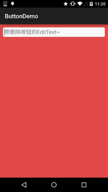
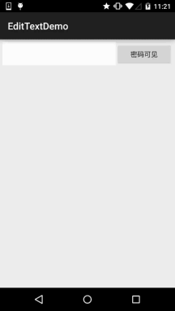

## 3.5 监听EditText的内容变化


## 本节引言：

在前面我们已经学过EditText控件了，本节来说下如何监听输入框的内容变化！ 这个在实际开发中非常实用，另外，附带着说下如何实现EditText的密码可见与不可见！好了，开始本节内容！

------

## 1.监听EditText的内容变化

> 由题可知，是基于监听的事件处理机制，好像前面的点击事件是OnClickListener，文本内容变化的监听器则是：TextWatcher，我们可以调用EditText.addTextChangedListener(mTextWatcher); 为EditText设置内容变化监听！

简单说下TextWatcher，实现该类需实现三个方法：

```
public void beforeTextChanged(CharSequence s, int start, int count, int after);   
public void onTextChanged(CharSequence s, int start, int before, int count);
public void afterTextChanged(Editable s);
```

依次会在下述情况中触发：

- 1.内容变化前
- 2.内容变化中
- 3.内容变化后

我们可以根据实际的需求重写相关方法，一般重写得较多的是第三个方法！

监听EditText内容变化的场合有很多： 限制字数输入，限制输入内容等等~

这里给大家实现一个简单的自定义EditText，输入内容后，右侧会显示一个叉叉的圆圈，用户点击后可以清空文本框~，当然你也可以不自定义，直接为EditText添加TextWatcher然后设置下删除按钮~

**实现效果图：**



自定义EditText：**DelEditText.java**

```
package demo.com.jay.buttondemo;

import android.content.Context;
import android.graphics.Rect;
import android.graphics.drawable.Drawable;
import android.text.Editable;
import android.text.TextWatcher;
import android.util.AttributeSet;
import android.view.MotionEvent;
import android.widget.EditText;

/**
 * Created by coder-pig on 2015/7/16 0016.
 */
public class DelEditText extends EditText {

    private Drawable imgClear;
    private Context mContext;

    public DelEditText(Context context, AttributeSet attrs) {
        super(context, attrs);
        this.mContext = context;
        init();
    }

    private void init() {
        imgClear = mContext.getResources().getDrawable(R.drawable.delete_gray);
        addTextChangedListener(new TextWatcher() {
            @Override
            public void beforeTextChanged(CharSequence s, int start, int count, int after) {

            }

            @Override
            public void onTextChanged(CharSequence s, int start, int before, int count) {

            }

            @Override
            public void afterTextChanged(Editable editable) {
                setDrawable();
            }
        });
    }


    //绘制删除图片
    private void setDrawable(){
        if (length() < 1)
            setCompoundDrawablesWithIntrinsicBounds(null, null, null, null);
        else
            setCompoundDrawablesWithIntrinsicBounds(null, null, imgClear, null);
    }


    //当触摸范围在右侧时，触发删除方法，隐藏叉叉
    @Override
    public boolean onTouchEvent(MotionEvent event) {
        if(imgClear != null && event.getAction() == MotionEvent.ACTION_UP)
        {
            int eventX = (int) event.getRawX();
            int eventY = (int) event.getRawY();
            Rect rect = new Rect();
            getGlobalVisibleRect(rect);
            rect.left = rect.right - 100;
            if (rect.contains(eventX, eventY))
                setText("");
        }
        return super.onTouchEvent(event);
    }


    @Override
    protected void finalize() throws Throwable {
        super.finalize();
    }

}
```

EditText的背景drawable：**bg_frame_search.xml**

```
<?xml version="1.0" encoding="utf-8"?>
<shape xmlns:android="http://schemas.android.com/apk/res/android" >
    <solid android:color="@color/background_white" />
    <corners android:radius="5dp" />
    <stroke android:width="1px" android:color="@color/frame_search"/>
</shape>
```

颜色资源:color.xml

```
<?xml version="1.0" encoding="utf-8"?>
<resources>
    <color name="reveal_color">#FFFFFF</color>
    <color name="bottom_color">#3086E4</color>
    <color name="bottom_bg">#40BAF8</color>
    <color name="frame_search">#ADAEAD</color>
    <color name="background_white">#FFFFFF</color>
    <color name="back_red">#e75049</color>
</resources>
```

布局文件：**activity_main.xml**

```
<LinearLayout xmlns:android="http://schemas.android.com/apk/res/android"
    xmlns:tools="http://schemas.android.com/tools"
    android:layout_width="match_parent"
    android:layout_height="match_parent"
    android:background="@color/back_red"
    android:orientation="vertical"
    tools:context=".MainActivity">

    <demo.com.jay.buttondemo.DelEditText
        android:id="@+id/edit_search"
        android:layout_width="match_parent"
        android:layout_height="32dp"
        android:layout_margin="10dp"
        android:background="@drawable/bg_frame_search"
        android:hint="带删除按钮的EditText~"
        android:maxLength="20"
        android:padding="5dp"
        android:singleLine="true" />


</LinearLayout>
```

PS:代码是非常简单的，就不解释了~

------

## 2.实现EditText的密码可见与不可见

这个也是一个很实用的需求，就是用户点击按钮后可让EditText中的密码可见或者不可见~

**实现效果图：**



实现代码： **activity_main.xml**

```
<LinearLayout xmlns:android="http://schemas.android.com/apk/res/android"
    xmlns:tools="http://schemas.android.com/tools"
    android:layout_width="match_parent"
    android:layout_height="match_parent"
    tools:context=".MainActivity"
    android:layout_margin="5dp"
    android:orientation="horizontal">

    <EditText
        android:id="@+id/edit_pawd"
        android:layout_width="0dp"
        android:layout_weight="2"
        android:layout_height="48dp"
        android:inputType="textPassword"
        android:background="@drawable/editborder"/>

    <Button
        android:id="@+id/btnChange"
        android:layout_width="0dp"
        android:layout_weight="1"
        android:layout_height="48dp"
        android:text="密码可见"/>

</LinearLayout>
```

**MainActivity.java**

```
package com.jay.demo.edittextdemo;

import android.support.v7.app.AppCompatActivity;
import android.os.Bundle;
import android.text.method.HideReturnsTransformationMethod;
import android.text.method.PasswordTransformationMethod;
import android.view.Menu;
import android.view.MenuItem;
import android.view.View;
import android.widget.Button;
import android.widget.EditText;

public class MainActivity extends AppCompatActivity {

    private EditText edit_pawd;
    private Button btnChange;
    private boolean flag = false;

    @Override
    protected void onCreate(Bundle savedInstanceState) {
        super.onCreate(savedInstanceState);
        setContentView(R.layout.activity_main);
        edit_pawd = (EditText) findViewById(R.id.edit_pawd);
        btnChange = (Button) findViewById(R.id.btnChange);
        edit_pawd.setHorizontallyScrolling(true);    //设置EditText不换行
        btnChange.setOnClickListener(new View.OnClickListener() {
            @Override
            public void onClick(View view) {
                if(flag == true){
                    edit_pawd.setTransformationMethod(HideReturnsTransformationMethod.getInstance());
                    flag = false;
                    btnChange.setText("密码不可见");
                }else{
                    edit_pawd.setTransformationMethod(PasswordTransformationMethod.getInstance());
                    flag = true;
                    btnChange.setText("密码可见");
                }
            }
        });
    }
}
```

**editborder.xml**

```
<?xml version="1.0" encoding="utf-8"?>  
<shape xmlns:android="http://schemas.android.com/apk/res/android" >  
  
    <!-- 设置透明背景色 -->  
    <solid android:color="#FFFFFF" />  
  
    <!-- 设置一个白色边框 -->  
    <stroke  
        android:width="1px"  
        android:color="#FFFFFF" />  
    <!-- 设置一下边距,让空间大一点 -->  
    <padding  
        android:bottom="5dp"  
        android:left="5dp"  
        android:right="5dp"  
        android:top="5dp" />  
  
</shape> 
```

------

## 本节小结：

本节就到这里，谢谢~