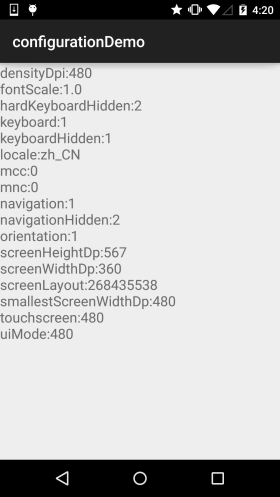
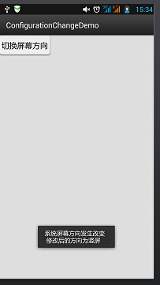
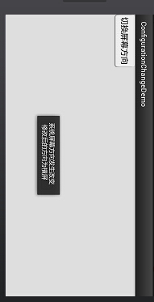

## 3.6 响应系统设置的事件(Configuration类)


## 本节引言：

> 本节给大家介绍的Configuration类是用来描述手机设备的配置信息的，比如屏幕方向， 触摸屏的触摸方式等，相信定制过ROM的朋友都应该知道我们可以在: frameworks/base/core/java/android/content/res/Configuration.java 找到这个类，然后改下相关设置，比如调整默认字体的大小！有兴趣可自行了解！ 本节讲解的Configuration类在我们Android开发中的使用~ API文档：[Configuration](http://androiddoc.qiniudn.com/reference/android/content/res/Configuration.html)

------

## 1.Configuration给我们提供的方法列表

> - **densityDpi**：屏幕密度
> - **fontScale**：当前用户设置的字体的缩放因子
> - **hardKeyboardHidden**：判断硬键盘是否可见，有两个可选值：HARDKEYBOARDHIDDEN_NO,HARDKEYBOARDHIDDEN_YES，分别是十六进制的0和1
> - **keyboard**：获取当前关联额键盘类型：该属性的返回值：KEYBOARD_12KEY（只有12个键的小键盘）、KEYBOARD_NOKEYS、KEYBOARD_QWERTY（普通键盘）
> - **keyboardHidden**：该属性返回一个boolean值用于标识当前键盘是否可用。该属性不仅会判断系统的硬件键盘，也会判断系统的软键盘（位于屏幕）。
> - **locale**：获取用户当前的语言环境
> - **mcc**：获取移动信号的国家码
> - **mnc**：获取移动信号的网络码
>   ps:国家代码和网络代码共同确定当前手机网络运营商
> - **navigation**：判断系统上方向导航设备的类型。该属性的返回值：NAVIGATION_NONAV（无导航）、 NAVIGATION_DPAD(DPAD导航）NAVIGATION_TRACKBALL（轨迹球导航）、NAVIGATION_WHEEL（滚轮导航）
> - **orientation**：获取系统屏幕的方向。该属性的返回值：ORIENTATION_LANDSCAPE（横向屏幕）、ORIENTATION_PORTRAIT（竖向屏幕）
> - **screenHeightDp**，**screenWidthDp**：屏幕可用高和宽，用dp表示
> - **touchscreen**：获取系统触摸屏的触摸方式。该属性的返回值：TOUCHSCREEN_NOTOUCH（无触摸屏）、TOUCHSCREEN_STYLUS（触摸笔式触摸屏）、TOUCHSCREEN_FINGER（接收手指的触摸屏）

------

## 2.写个简单例子测试下：

**运行截图：**



**代码实现：**

```
public class MainActivity extends AppCompatActivity {

    @Override
    protected void onCreate(Bundle savedInstanceState) {
        super.onCreate(savedInstanceState);
        setContentView(R.layout.activity_main);
        TextView txtResult = (TextView) findViewById(R.id.txtResult);
        StringBuffer status = new StringBuffer();
        //①获取系统的Configuration对象
        Configuration cfg = getResources().getConfiguration();
        //②想查什么查什么
        status.append("densityDpi:" + cfg.densityDpi + "\n");
        status.append("fontScale:" + cfg.fontScale + "\n");
        status.append("hardKeyboardHidden:" + cfg.hardKeyboardHidden + "\n");
        status.append("keyboard:" + cfg.keyboard + "\n");
        status.append("keyboardHidden:" + cfg.keyboardHidden + "\n");
        status.append("locale:" + cfg.locale + "\n");
        status.append("mcc:" + cfg.mcc + "\n");
        status.append("mnc:" + cfg.mnc + "\n");
        status.append("navigation:" + cfg.navigation + "\n");
        status.append("navigationHidden:" + cfg.navigationHidden + "\n");
        status.append("orientation:" + cfg.orientation + "\n");
        status.append("screenHeightDp:" + cfg.screenHeightDp + "\n");
        status.append("screenWidthDp:" + cfg.screenWidthDp + "\n");
        status.append("screenLayout:" + cfg.screenLayout + "\n");
        status.append("smallestScreenWidthDp:" + cfg.densityDpi + "\n");
        status.append("touchscreen:" + cfg.densityDpi + "\n");
        status.append("uiMode:" + cfg.densityDpi + "\n");
        txtResult.setText(status.toString());
    }
}
```

------

## 3.重写onConfigurationChanged响应系统设置更改

> 该方法用于监听系统设置的更改,是基于回调的时间处理方法,当系统的设置发生改变时就会自动触发; 但是要注意一点,使用下面的方法监控的话,targetSdkVersion属性最高只能设置为12,高于12的话,该方法不会被激发！这里写个横竖屏切换的例子给大家参考参考，其他的可自行谷歌~

**代码示例**：简单的一个按钮,点击后切换横竖屏,然后Toast提示

**运行效果图：**





**实现代码：**

```
public class MainActivity extends Activity {  
  
    @Override  
    protected void onCreate(Bundle savedInstanceState) {  
        super.onCreate(savedInstanceState);  
        setContentView(R.layout.activity_main);  
          
        Button btn = (Button) findViewById(R.id.btncahange);  
        btn.setOnClickListener(new OnClickListener() {  
              
            @Override  
            public void onClick(View v) {  
                Configuration config = getResources().getConfiguration();  
                //如果是横屏的话切换成竖屏  
                if(config.orientation == Configuration.ORIENTATION_LANDSCAPE)  
                {  
                    MainActivity.this.setRequestedOrientation(ActivityInfo.SCREEN_ORIENTATION_PORTRAIT);  
                }  
                //如果竖屏的话切换成横屏  
                if(config.orientation == Configuration.ORIENTATION_PORTRAIT)  
                {  
                    MainActivity.this.setRequestedOrientation(ActivityInfo.SCREEN_ORIENTATION_LANDSCAPE);  
                }  
            }  
        });  
    }  
      
    @Override  
    public void onConfigurationChanged(Configuration newConfig) {  
        super.onConfigurationChanged(newConfig);  
        String screen = newConfig.orientation == Configuration.ORIENTATION_LANDSCAPE?"横屏":"竖屏";  
        Toast.makeText(MainActivity.this, "系统屏幕方向发生改变 \n 修改后的方向为" + screen, Toast.LENGTH_SHORT).show();  
    }  
}  
```

另外，还需要在AndroidManifest.xml添加下述内容：

> 权限: **< uses-permission android:name="android.permission.CHANGE_CONFIGURATION" />** 在< activity标签中添加:**android:configChanges="orientation"** 将targetSdkVersion改为12以上的,12也可以

------

## 本节小结：

本节给大家讲解了：Configuration类以及onConfigurationChanged响应系统设置更改，有个大概了解即可 后续用到我们再继续深入~