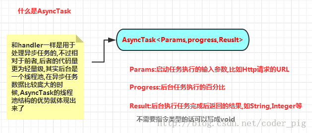
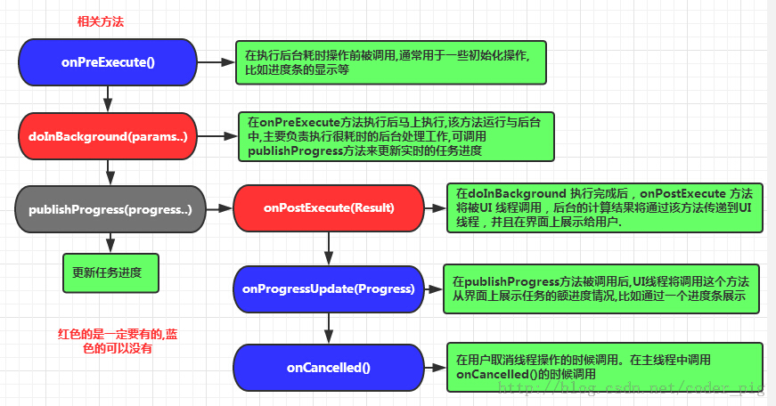
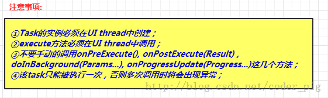
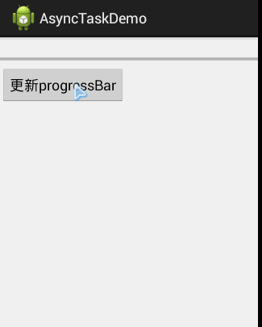

## 3.7 AsyncTask异步任务


## 本节引言：

本节给大家带来的是Android给我们提供的一个轻量级的用于处理异步任务的类: AsyncTask，我们一般是继承AsyncTask，然后在类中实现异步操作，然后将异步执行的进度，反馈给UI主线程~ 好吧，可能有些概念大家不懂，觉得还是有必要讲解下多线程的概念，那就先解释下一些概念性的东西吧！

------

## 1.相关概念

### 1）什么是多线程：

> 答：先要了解这几个名称：应用程序，进程，线程，多线程！！
>
> - **应用程序(Application)**：为了完成特定任务，用某种语言编写的一组指令集合(一组静态代码)
> - **进程(Process)** :**运行中的程序**，系统调度与资源分配的一个**独立单位**，操作系统会为每个进程分配一段内存空间，程序的依次动态执行，经理代码加载 -> 执行 -> 执行完毕的完整过程！
> - **线程(Thread)**：比进程更小的执行单元，每个进程可能有多条线程，**线程需要放在一个进程中才能执行！** 线程是由程序负责管理的！！！而进程则是由系统进行调度的！！！
> - **多线程概念(Multithreading)**：并行地执行多条指令，将CPU的**时间片**按照调度算法，分配给各个线程，实际上是**分时执行**的，只是这个切换的时间很短，用户感觉是同时而已！

**举个简单的例子：** 你挂着QQ，突然想去听歌，你需要把QQ关掉，然后再去启动XX播放器吗？答案是否定的，我们直接打开播放器放歌就好，QQ还在运行着，是吧！这就是简单的多线程~在实际开发中，也有这样的例子，比如应用正在运行， 发现新版本了，想后台更新，这个时候一般我们会开辟出一条后台线程，用于下载新版本的apk，但是这个时候我们还可以使用应用中的其他功能！这就是多线程的使用例子~

### 2）同步与异步的概念：

> 答: **同步**：当我们执行某个功能时，在没有得到结果之前，这个调用就不能返回！简单点就是说必须等前一件事做完才能做下一件事；举个简单的例子：比如你啪啪啪，为了避免弄出人命，肯定要先戴好套套， 然后再啪啪啪是吧~套套戴好 -> 然后啪啪啪，比如你没套套，那啪啪啪的操作就要等待了，直到你把套套买回来带上，这个时候就可以开始啪啪啪了~一个形象地例子，♪(^∇^*) **异步**：和同步则是相对的，当我们执行某个功能后，我们并不需要立即得到结果，我们额可以正常地 做其他操作，这个功能可以在完成后通知或者回调来告诉我们；还是上面那个后台下载的例子，后台下载， 我们执行下载功能后，我们就无需去关心它的下载过程，当下载完毕后通知我们就可以了~

### 3) Android 为什么要引入异步任务

> 答：因为Android程序刚启动时，会同时启动一个对应的主线程(Main Thread)，这个主线程主要负责处理与UI相关的事件！有时我们也把他称作UI线程！而在Android App时我们必须遵守这个单线程模型的规则： **Android UI操作并不是线程安全的并且这些操作都需要在UI线程中执行！** 假如我们在非UI线程中，比如在主线程中new Thread()另外开辟一个线程，然后直接在里面修改UI控件的值； 此时会抛出下述异常： **android.view.ViewRoot$CalledFromWrongThreadException: Only the original thread that created a view hierarchy can touch its views** 另外，还有一点，如果我们把耗时的操作都放在UI线程中的话，如果UI线程超过5s没有响应用于请求，那么 这个时候会引发ANR(Application Not Responding)异常，就是应用无响应~ 最后还有一点就是：Android 4.0后禁止在UI线程中执行网络操作~不然会报: **android.os.NetworkOnMainThreadException**

以上的种种原因都说明了Android引入异步任务的意义，当然实现异步也不可以不用到我们本节讲解的AsyncTask，我们可以自己开辟一个线程，完成相关操作后，通过下述两种方法进行UI更新：

> 1. 前面我们学的Handler，我们在Handler里写好UI更新，然后通过sendMessage()等的方法通知UI 更新，另外别忘了Handler写在主线程和子线程中的区别哦~
> 2. 利用Activity.runOnUiThread(Runnable)把更新ui的代码创建在Runnable中,更新UI时，把Runnable 对象传进来即可~

------

## 2.AsyncTask全解析：

------

### 1）为什么要用AsyncTask？

答:我们可以用上述两种方法来完成我们的异步操作，假如要我们写的异步操作比较多，或者较为繁琐， 难道我们new Thread()然后用上述方法通知UI更新么？程序员都是比较喜欢偷懒的，既然官方给我们提供了AsyncTask这个封装好的轻量级异步类，为什么不用呢？我们通过几十行的代码就可以完成我们的异步操作，而且进度可控；相比起Handler，AsyncTask显得更加简单，快捷~当然，这只适合简单的异步操作，另外，实际异步用的最多的地方就是网络操作，图片加载，数据传输等，AsyncTask 暂时可以满足初学者的需求，谢谢小应用，但是到了公司真正做项目以后，我们更多的使用第三发的框架，比如Volley,OkHttp,android-async-http,XUtils等很多，后面进阶教程我们会选1-2个框架进行学习，当然你可以自己找资料学习学习，但是掌握AsyncTask还是很有必要的！

------

### 2）AsyncTask的基本结构：

AsyncTask是一个抽象类，一般我们都会定义一个类继承AsyncTask然后重写相关方法~ 官方API:[AsyncTask](https://www.runoob.com/wp-content/uploads/2015/07/39584771.jpg)

> - **构建AsyncTask子类的参数：**



> - **相关方法与执行流程：**



> - **注意事项：**



------

## 3.AsyncTask使用示例：

> 因为我们还没学到Android网络那块，这里照顾下各位初学者，这里用延时线程来模拟文件下载的过程~后面讲到网络那里再给大家写几个例子~

**实现效果图：**



**布局文件:activity.xml：**

```
<LinearLayout xmlns:android="http://schemas.android.com/apk/res/android"  
    xmlns:tools="http://schemas.android.com/tools"  
    android:layout_width="match_parent"  
    android:layout_height="match_parent"  
    android:orientation="vertical"  
    tools:context=".MyActivity">  
    <TextView  
        android:id="@+id/txttitle"  
        android:layout_width="wrap_content"  
        android:layout_height="wrap_content" />  
    <!--设置一个进度条,并且设置为水平方向-->  
    <ProgressBar  
        android:layout_width="fill_parent"  
        android:layout_height="wrap_content"  
        android:id="@+id/pgbar"  
        style="?android:attr/progressBarStyleHorizontal"/>  
    <Button  
        android:layout_width="wrap_content"  
        android:layout_height="wrap_content"  
        android:id="@+id/btnupdate"  
        android:text="更新progressBar"/>  
</LinearLayout> 
```

**定义一个延时操作，用于模拟下载：**

```
public class DelayOperator {  
    //延时操作,用来模拟下载  
    public void delay()  
    {  
        try {  
            Thread.sleep(1000);  
        }catch (InterruptedException e){  
            e.printStackTrace();;  
        }  
    }  
}
```

**自定义AsyncTask:**

```
public class MyAsyncTask extends AsyncTask<Integer,Integer,String>  
{  
    private TextView txt;  
    private ProgressBar pgbar;  
  
    public MyAsyncTask(TextView txt, ProgressBar pgbar)  
    {  
        super();  
        this.txt = txt;  
        this.pgbar = pgbar;  
    }  
  
  
    //该方法不运行在UI线程中,主要用于异步操作,通过调用publishProgress()方法  
    //触发onProgressUpdate对UI进行操作  
    @Override  
    protected String doInBackground(Integer... params) {  
        DelayOperator dop = new DelayOperator();  
        int i = 0;  
        for (i = 10;i <= 100;i+=10)  
        {  
            dop.delay();  
            publishProgress(i);  
        }  
        return  i + params[0].intValue() + "";  
    }  
  
    //该方法运行在UI线程中,可对UI控件进行设置  
    @Override  
    protected void onPreExecute() {  
        txt.setText("开始执行异步线程~");  
    }  
  
  
    //在doBackground方法中,每次调用publishProgress方法都会触发该方法  
    //运行在UI线程中,可对UI控件进行操作  
    @Override  
    protected void onProgressUpdate(Integer... values) {  
        int value = values[0];  
        pgbar.setProgress(value);  
    }  
}
```

**MainActivity.java**：

```
public class MyActivity extends ActionBarActivity {  
  
    private TextView txttitle;  
    private ProgressBar pgbar;  
    private Button btnupdate;  
  
    @Override  
    protected void onCreate(Bundle savedInstanceState) {  
        super.onCreate(savedInstanceState);  
        setContentView(R.layout.activity_main);  
        txttitle = (TextView)findViewById(R.id.txttitle);  
        pgbar = (ProgressBar)findViewById(R.id.pgbar);  
        btnupdate = (Button)findViewById(R.id.btnupdate);  
        btnupdate.setOnClickListener(new View.OnClickListener() {  
            @Override  
            public void onClick(View v) {  
                MyAsyncTask myTask = new MyAsyncTask(txttitle, pgbar);  
                myTask.execute(1000);  
            }  
        });  
    }  
} 
```

------

## 本节小结：

> 好的，本节一开始给大家普及了下应用程序，进程，线程，多线程，异步，同步的概念；接着又讲解 了下Android中为何要引入异步操作，然后介绍了下AsyncTask的用法，当然上面也说了，异步操作在网络 操作用的较多，后面在讲解网络操作时会用到这个AsyncTask，敬请期待~本节就到这里，谢谢~