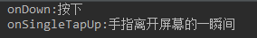
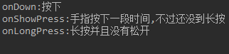
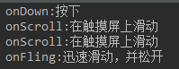
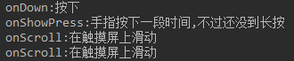
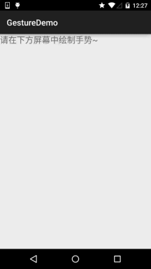

## 3.8 Gestures(手势)


## 本节引言：

周六不休息，刚剪完了个大平头回来，继续码字~

好的，本节给大家带来的是第三章的最后一节——Gestures(手势)， 用过魅族手机的朋友相信对手势肯定是不陌生的，在home键两侧像屏幕内滑动， 可以打开后台任务列表等等~在应用中通过手势来操作会大大提升用户体验， 比如Scroll手势在浏览器中个滚屏，Fling在浏览器中的换页等！

当然，有利也有弊，比如不当的手势操作引起APP Carsh，经常这样可是会引起用户不满的！ 所以是否要为你的应用增加手势，可要考虑清楚哦！另外手势要和前面学的单指/多指触碰相区分哦！

手势是:连续触碰的行为，比如左右上下滑动屏幕，又或者画一些不规则的几何图形！ Android对上述两种手势行为都提供了支持：

- Android提供手势检测，并为手势识别提供了相应的监听器！
- Android运行开发者自行添加手势，并且提供了相应的API识别用户手势！

如果你的手机是Android 4.x的原生Android系统的话，你可能可以在你的手机或者平板上看到谷歌 提供的一个Gesture Builder的APP，该应用允许用户以类似于涂鸦的方式绘制一个手写符号，使之对应一个字符串名称！当然，没有这样的手机也没关系，我们有模拟器嘛，自己开个4.0的系统试试就知道了，另外，我们可以到\mmt\sdcard\gestures获取到保存手势的文件！ 好了，唠唠叨叨那么多，开始讲正题吧！

对了，贴下官方API文档先:[GestureDetector](http://androiddoc.qiniudn.com/reference/android/view/GestureDetector.html)

------

## 1.Android中手势交互的执行顺序

> - 1.手指触碰屏幕时，触发MotionEvent事件！
> - 2.该事件被OnTouchListener监听，可在它的onTouch()方法中获得该MotionEvent对象！
> - 3.通过GestureDetector转发MotionEvent对象给OnGestureListener
> - 4.我们可以通过OnGestureListener获得该对象，然后获取相关信息，以及做相关处理！

我们来看下上述的三个类都是干嘛的: **MotionEvent**: 这个类用于封装手势、触摸笔、轨迹球等等的动作事件。 其内部封装了两个重要的属性X和Y，这两个属性分别用于记录横轴和纵轴的坐标。 **GestureDetector**: 识别各种手势。 **OnGestureListener**: 这是一个手势交互的监听接口，其中提供了多个抽象方法， 并根据GestureDetector的手势识别结果调用相对应的方法。

——上述资料摘自:http://www.jcodecraeer.com/a/anzhuokaifa/androidkaifa/2012/1020/448.html

## 2.GestureListener详解：

从1中我们知道了监听手势的关键是:GestureListener 他给我们提供了下述的回调方法：

> - 按下（onDown）： 刚刚手指接触到触摸屏的那一刹那，就是触的那一下。
> - 抛掷（onFling）： 手指在触摸屏上迅速移动，并松开的动作。
> - 长按（onLongPress）： 手指按在持续一段时间，并且没有松开。
> - 滚动（onScroll）： 手指在触摸屏上滑动。
> - 按住（onShowPress）： 手指按在触摸屏上，它的时间范围在按下起效，在长按之前。
> - 抬起（onSingleTapUp）：手指离开触摸屏的那一刹那。

知道了GestureListener的相关方法后，实现手势检测也很简单，步骤如下：

> - Step 1: 创建GestureDetector对象，创建时需实现GestureListener传入
> - Step 2: 将Activity或者特定组件上的TouchEvent的事件交给GestureDetector处理即可！ 我们写个简单的代码来验证这个流程，即重写对应的方法：

代码如下：

```
public class MainActivity extends AppCompatActivity {

    private MyGestureListener mgListener;
    private GestureDetector mDetector;
    private final static String TAG = "MyGesture";

    @Override
    protected void onCreate(Bundle savedInstanceState) {
        super.onCreate(savedInstanceState);
        setContentView(R.layout.activity_main);
        //实例化GestureListener与GestureDetector对象
        mgListener = new MyGestureListener();
        mDetector = new GestureDetector(this, mgListener);

    }

    @Override
    public boolean onTouchEvent(MotionEvent event) {
        return mDetector.onTouchEvent(event);
    }

    //自定义一个GestureListener,这个是View类下的，别写错哦！！！
    private class MyGestureListener implements GestureDetector.OnGestureListener {

        @Override
        public boolean onDown(MotionEvent motionEvent) {
            Log.d(TAG, "onDown:按下");
            return false;
        }

        @Override
        public void onShowPress(MotionEvent motionEvent) {
            Log.d(TAG, "onShowPress:手指按下一段时间,不过还没到长按");
        }

        @Override
        public boolean onSingleTapUp(MotionEvent motionEvent) {
            Log.d(TAG, "onSingleTapUp:手指离开屏幕的一瞬间");
            return false;
        }

        @Override
        public boolean onScroll(MotionEvent motionEvent, MotionEvent motionEvent1, float v, float v1) {
            Log.d(TAG, "onScroll:在触摸屏上滑动");
            return false;
        }

        @Override
        public void onLongPress(MotionEvent motionEvent) {
            Log.d(TAG, "onLongPress:长按并且没有松开");
        }

        @Override
        public boolean onFling(MotionEvent motionEvent, MotionEvent motionEvent1, float v, float v1) {
            Log.d(TAG, "onFling:迅速滑动，并松开");
            return false;
        }
    }

}
```

对应操作截图：

- 1.按下后立即松开:
- 2.长按后松开：
- 3.轻轻一滑，同时松开：
- 4.按住后不放持续做滑动操作：

PS:从上述结果来看，我们发现了一个问题： 我们实现OnGestureListener需要实现所有的手势，可能我针对的仅仅是滑动，但是你还是要去重载， 这显得很逗逼，是吧，官方肯定会给出解决方法滴，官方另外给我们提供了一个SimpleOnGestureListener类 只需把上述的OnGestureListener替换成SimpleOnGestureListener即可！

------

## 3.简单的例子:下滑关闭Activity，上滑启动新的Activity

这里就用上述的SimpleOnGestureListener来实现吧:

**运行效果图：**


**实现代码：**

```
public class MainActivity extends AppCompatActivity {

    private GestureDetector mDetector;
    private final static int MIN_MOVE = 200;   //最小距离
    private MyGestureListener mgListener;


    @Override
    protected void onCreate(Bundle savedInstanceState) {
        super.onCreate(savedInstanceState);
        setContentView(R.layout.activity_main);
        //实例化SimpleOnGestureListener与GestureDetector对象
        mgListener = new MyGestureListener();
        mDetector = new GestureDetector(this, mgListener);
    }

    @Override
    public boolean onTouchEvent(MotionEvent event) {
        return mDetector.onTouchEvent(event);
    }

    //自定义一个GestureListener,这个是View类下的，别写错哦！！！
    private class MyGestureListener extends GestureDetector.SimpleOnGestureListener {

        @Override
        public boolean onFling(MotionEvent e1, MotionEvent e2, float v, float v1) {
            if(e1.getY() - e2.getY() > MIN_MOVE){
                startActivity(new Intent(MainActivity.this, MainActivity.class));
                Toast.makeText(MainActivity.this, "通过手势启动Activity", Toast.LENGTH_SHORT).show();
            }else if(e1.getY() - e2.getY()  < MIN_MOVE){
                finish();
                Toast.makeText(MainActivity.this,"通过手势关闭Activity",Toast.LENGTH_SHORT).show();
            }
            return true;
        }
    }

}
```

**结果分析：** 从上面的对比就可以知道，相比起SimpleOnGestureListener使用SimpleOnGestureListener 显得更加的简单，想重写什么方法就重写什么方法，另外例子比较简单，大家可以自己试试 其他玩法，比如通过手势缩放图片~

------

## 4.手势添加与识别：

> 除了上面讲解的手势检测外，Android还运行我们将手势进行添加，然后提供了相关的识别API； Android中使用GestureLibrary来代表手势库，提供了GestureLibraries工具类来创建手势库！

**四个加载手势库的静态方法：**


获得GestureLibraries对象后，就可以使用该对象提供的下述方法来做相应操作了：

**相关方法：**

- public void **addGesture** (String entryName, Gesture gesture)：添加一个名为entryName的手势
- public Set<String> **getGestureEntries** ()：获得手势库中所有手势的名称
- public ArrayList<Gesture> **getGestures** (String entryName)：获得entryName名称对应的全部手势
- public ArrayList<Prediction> **recognize** (Gesture gesture): 从当前手势库中识别与gesture匹配的全部手势
- public void **removeEntry** (String entryName)：删除手势库中entryName名称对应的手势
- public void **removeGesture** (String entryName, Gesture gesture)：删除手势库中entryName和gesture都匹配的手势
- public abstract boolean **save** ()：想手势库中添加手势或从中删除手势后调用该方法保存手势库

**GestureOverlayView手势编辑组件：**

Android为GestureOverlayView提供了三种监听器接口，如下，一般常用的是:**OnGesturePerformedListener**;用于手势完成时提供响应！


------

## 5.手势添加示例：

PS：例子引用的是——李刚《Android疯狂讲义》的代码

**运行效果图：**



好吧，下面贴下实现代码：

两个布局文件：activity_main.xml和dialog_save.xml

activity_main.xml

```
<LinearLayout xmlns:android="http://schemas.android.com/apk/res/android"
    xmlns:tools="http://schemas.android.com/tools"
    android:layout_width="match_parent"
    android:layout_height="match_parent"
    android:orientation="vertical"
    tools:context=".MainActivity">

    <TextView
        android:layout_width="match_parent"
        android:layout_height="wrap_content"
        android:text="请在下方屏幕中绘制手势~"
        android:textSize="20sp"/>


    <!-- gestureStrokeType控制手势是否需要一笔完成,multiple表示允许多笔-->
    <android.gesture.GestureOverlayView
        android:id="@+id/gesture"
        android:layout_width="match_parent"
        android:layout_height="match_parent"
        android:gestureStrokeType="multiple" />

</LinearLayout>
```

dialog_save.xml

```
<?xml version="1.0" encoding="utf-8"?>
<LinearLayout xmlns:android="http://schemas.android.com/apk/res/android"
    android:layout_width="match_parent"
    android:layout_height="match_parent"
    android:orientation="vertical">

    <LinearLayout
        android:layout_width="match_parent"
        android:layout_height="wrap_content"
        android:orientation="horizontal">
        <TextView
            android:layout_width="wrap_content"
            android:layout_height="wrap_content"
            android:layout_marginRight="8dp"
            android:text="请填写手势名称："/>
        <EditText
            android:layout_width="match_parent"
            android:layout_height="wrap_content"
            android:id="@+id/edit_name"/>
    </LinearLayout>

    <ImageView
        android:id="@+id/img_show"
        android:layout_width="128dp"
        android:layout_height="128dp"
        android:layout_marginTop="10dp"/>

</LinearLayout>
```

**MainActivity.java:**

```
public class MainActivity extends AppCompatActivity {

    private EditText editText;
    private GestureOverlayView gesture;

    @Override
    protected void onCreate(Bundle savedInstanceState) {
        super.onCreate(savedInstanceState);
        setContentView(R.layout.activity_main);
        //获取手势编辑组件后，设置相关参数
        gesture = (GestureOverlayView) findViewById(R.id.gesture);
        gesture.setGestureColor(Color.GREEN);
        gesture.setGestureStrokeWidth(5);
        gesture.addOnGesturePerformedListener(new GestureOverlayView.OnGesturePerformedListener() {
            @Override
            public void onGesturePerformed(GestureOverlayView gestureOverlayView, final Gesture gesture) {
                View saveDialog = getLayoutInflater().inflate(R.layout.dialog_save,null,false);
                ImageView img_show = (ImageView) saveDialog.findViewById(R.id.img_show);
                final EditText edit_name = (EditText) saveDialog.findViewById(R.id.edit_name);
                Bitmap bitmap = gesture.toBitmap(128,128,10,0xffff0000);
                img_show.setImageBitmap(bitmap);
                new AlertDialog.Builder(MainActivity.this).setView(saveDialog)
                        .setPositiveButton("保存",new DialogInterface.OnClickListener()
                        {
                            @Override
                            public void onClick(DialogInterface dialogInterface, int i) {
                                //获取文件对应的手势库
                                GestureLibrary gestureLib = GestureLibraries.fromFile("/mnt/sdcard/mygestures");
                                gestureLib.addGesture(edit_name.getText().toString(),gesture);
                                gestureLib.save();
                            }
                        }).setNegativeButton("取消", null).show();
            }
        });
    }
}
```

最后还需要在AndroidManifest.xml中添加写入SD卡的权限：

```
<uses-permission android:name="android.permission.WRITE_EXTERNAL_STORAGE"/>
```

------

## 6.手势识别示例

实现代码：

```
public class MainActivity extends AppCompatActivity {

    private GestureOverlayView gesture;
    private GestureLibrary gestureLibrary;
    private Context mContext;

    @Override
    protected void onCreate(Bundle savedInstanceState) {
        super.onCreate(savedInstanceState);
        setContentView(R.layout.activity_main);
        mContext = MainActivity.this;
        gestureLibrary = GestureLibraries.fromFile("mmt/sdcard/mygestures");
        if (gestureLibrary.load()) {
            Toast.makeText(mContext, "手势库加载成功", Toast.LENGTH_SHORT).show();
        } else {
            Toast.makeText(mContext, "手势库加载失败", Toast.LENGTH_SHORT).show();
        }

        //获取手势编辑组件后，设置相关参数
        gesture = (GestureOverlayView) findViewById(R.id.gesture);
        gesture.setGestureColor(Color.GREEN);
        gesture.setGestureStrokeWidth(5);
        gesture.addOnGesturePerformedListener(new GestureOverlayView.OnGesturePerformedListener() {
            @Override
            public void onGesturePerformed(GestureOverlayView gestureOverlayView, final Gesture gesture) {
                //识别用户刚绘制的手势
                ArrayList<Prediction> predictions = gestureLibrary.recognize(gesture);
                ArrayList<String> result = new ArrayList<String>();
                //遍历所有找到的Prediction对象
                for (Prediction pred : predictions) {
                    if (pred.score > 2.0) {
                        result.add("与手势【" + pred.name + "】相似度为" + pred.score);
                    }
                }
                if (result.size() > 0) {
                    ArrayAdapter<Object> adapter = new ArrayAdapter<Object>(mContext,
                            android.R.layout.simple_dropdown_item_1line, result.toArray());
                    new AlertDialog.Builder(mContext).setAdapter(adapter,null).setPositiveButton("确定",null).show();
                }else{
                    Toast.makeText(mContext,"无法找到匹配的手势！",Toast.LENGTH_SHORT).show();
                }
            }
        });
    }
}
```

另外别忘了在AndroidManifest.xml文件中加入读SD卡的权限：

```
<uses-permission android:name="android.permission.READ_EXTERNAL_STORAGE"/>
```

------

## 本节小结：

好的，本节介绍了Android中的Gesture手势，讲解了手势判断，手势添加，手势识别三个内容 ，大部分例子来自于李刚老师的Android疯狂讲义，有兴趣的可以看看该书~谢谢