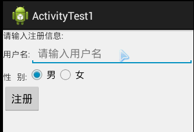
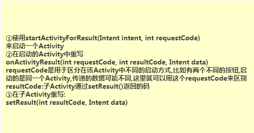
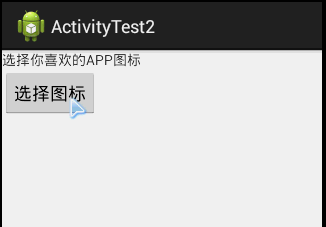
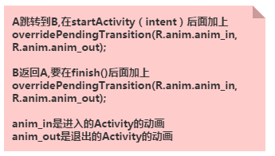
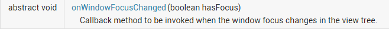

## 4.1.2 Activity初窥门径


## 本节引言：

上一节中我们对Activity一些基本的概念进行了了解，什么是Activity，Activity的生命周期，如何去启动一个Activity等，本节我们继续来学习Activity，前面也讲了一个App一般都是由多个Activity构成的，这就涉及到了多个Activity间数据传递的问题了，那么本节继续学习Activity的使用！另外关于传递集合，对象，数组，Bitmap的我们会在Intent那里进行讲解，这里只介绍如何传递基本数据！

------

## 1.Activity间的数据传递：


**代码示例：**

**效果图：**



**代码下载：**[ActivityTest1.zip](https://www.runoob.com/try/download/ActivityTest1.zip)

------

## 2.多个Activity间的交互(后一个传回给前一个)



**代码示例：**

**效果图：**



**代码下载：**[ActivityTest2.zip](https://www.runoob.com/try/download/ActivityTest2.zip)

------

## 3.知晓当前是哪个Activity


------

## 4.随时关闭所有Activity

> 有时我们可能会打开了很多个Activity，突然来个这样的需求，在某个页面可以关掉所有的Activity并退出程序！好吧，下面提供一个关闭所有Activity的方法， 就是用一个list集合来存储所有Activity!


**具体代码如下：**

```
public class ActivityCollector {  
    public static LinkedList<Activity> activities = new LinkedList<Activity>();  
    public static void addActivity(Activity activity)  
    {  
        activities.add(activity);  
    }  
    public static void removeActivity(Activity activity)  
    {  
        activities.remove(activity);  
    }  
    public static void finishAll()  
    {  
        for(Activity activity:activities)  
        {  
            if(!activity.isFinishing())  
            {  
                activity.finish();  
            }  
        }  
    }  
}  
```

------

## 5.完全退出App的方法

上面说的是关闭所有Activity的，但是有些时候我们可能想杀死整个App，连后台任务都杀得一干二净的话，可以使用搭配着下述代码使用：

**实现代码：**

```
/** 
 * 退出应用程序 
 */  
public void AppExit(Context context) {  
    try {  
        ActivityCollector.finishAll();  
        ActivityManager activityMgr = (ActivityManager) context  
                .getSystemService(Context.ACTIVITY_SERVICE);  
        activityMgr.killBackgroundProcesses(context.getPackageName());  
        System.exit(0);  
    } catch (Exception ignored) {}  
}  
```

------

## 6.双击退出程序的两种方法：

### 1）定义一个变量，来标识是否退出

```
// 定义一个变量，来标识是否退出
private static boolean isExit = false;
Handler mHandler = new Handler() {
    @Override
    public void handleMessage(Message msg) {
        super.handleMessage(msg);
        isExit = false;
    }
};

public boolean onKeyDown(int keyCode, KeyEvent event) {
    if (keyCode == KeyEvent.KEYCODE_BACK) {
        if (!isExit) {
            isExit = true;
            Toast.makeText(getApplicationContext(), "再按一次退出程序",
                    Toast.LENGTH_SHORT).show();
            // 利用handler延迟发送更改状态信息
            mHandler.sendEmptyMessageDelayed(0, 2000);
        } else {
            exit(this);
        }
        return false;
    }
return super.onKeyDown(keyCode, event);}
```

------

### 2）保存点击时间：

```
//保存点击的时间
private long exitTime = 0;
public boolean onKeyDown(int keyCode, KeyEvent event) {
    if (keyCode == KeyEvent.KEYCODE_BACK) {
        if ((System.currentTimeMillis() - exitTime) > 2000) {
            Toast.makeText(getApplicationContext(), "再按一次退出程序",
                    Toast.LENGTH_SHORT).show();
            exitTime = System.currentTimeMillis();
        } else {
                        exit();
                      }
        return false;
    }
        return super.onKeyDown(keyCode, event);
}
```

------

## 7.为Activity设置过场动画

> 所谓的过场动画就是切换到另外的Activity时加上一些切换动画，比如淡入淡出，放大缩小，左右互推等！ 当然，我们并不在这里详细讲解动画，后面有专门的章节来讲解这个，这里只教大家如何去加载动画，另外给大家提供了一些比较常用的过渡动画，只要将相关动画文件添加到res/anim目录下，然后下述方法二选一就可以实现Activity的切换动画了！

### 1）方法一：



### 2）方法二：

通过style进行配置，这个是全局的哦，就是所有的Activity都会加载这个动画！

**实现代码如下：**

**①在style.xml中自定义style：**

```
<!-- 默认Activity跳转动画 -->
<style name="default_animation" mce_bogus="1" parent="@android:style/Animation.Activity">
    <item name="android:activityOpenEnterAnimation">@anim/default_anim_in</item>
    <item name="android:activityOpenExitAnimation">@anim/anim_stay</item>
    <item name="android:activityCloseEnterAnimation">@anim/anim_stay</item>
    <item name="android:activityCloseExitAnimation">@anim/default_anim_out</item>
</style>
```

**解释：**

4个item分别代表:

- Activity A跳转到Activity B时Activity B进入动画;
- Activity A跳转到Activity B时Activity A退出动画;
- Activity B返回Activity A时Activity A的进入动画
- Activity B返回Activity A时ActivityB的退出动画

**②然后修改下AppTheme:**

```
<style name="AppTheme" mce_bogus="1" parent="@android:style/Theme.Light">
        <item name="android:windowAnimationStyle">@style/default_animation</item>
        <item name="android:windowNoTitle">true</item>
</style>
```

**③最后在appliction设置下：**

```
<application
   android:icon="@drawable/logo"
   android:label="@string/app_name"
   android:theme="@style/AppTheme" >
```

好的，动画特效就这样duang一声设置好了~

### 3）其他

好的，除了上面两种方法以外，还可以使用**TransitionManager**来实现，但是需求版本是API 19以上的， 另外还有一种**addOnPreDrawListener**的转换动画，这个用起来还是有点麻烦的，可能不是适合初学者 这里也不讲，最后提供下一些常用的动画效果打包，选择需要的特效加入工程即可！ [Activity常用过渡动画.zip](https://www.runoob.com/wp-content/uploads/2015/08/Activity常用过渡动画.zip)

------

## 8.Bundle传递数据的限制

> 在使用Bundle传递数据时，要注意，Bundle的大小是有限制的 < 0.5MB，如果大于这个值是会报TransactionTooLargeException异常的！！！

------

## 9.使用命令行查看当前所有Activity的命令：

> 使用下述命令即可，前提是你为SDK配置了环境变量:**adb shell dumpsys activity**

------

## 10.设置Activity全屏的方法：

### 1）代码隐藏ActionBar

在Activity的onCreate方法中调用getActionBar.hide();即可

### 2）通过requestWindowFeature设置

requestWindowFeature(Window.FEATURE_NO_TITLE); 该代码需要在setContentView ()之前调用，不然会报错！！！

> **注：** 把 requestWindowFeature(Window.FEATURE_NO_TITLE);放在super.onCreate(savedInstanceState);前面就可以隐藏ActionBar而不报错。

### 3）通过AndroidManifest.xml的theme

在需要全屏的Activity的标签内设置 theme = @android:style/Theme.NoTitleBar.FullScreen

------

## 11.onWindowFocusChanged方法妙用：

我们先来看下官方对这个方法的介绍：



就是，当Activity得到或者失去焦点的时候，就会回调该方法！ 如果我们想监控Activity是否加载完毕，就可以用到这个方法了~ 想深入了解的可移步到这篇文章： [onWindowFocusChanged触发简介](http://blog.csdn.net/yueqinglkong/article/details/44981449)

------

## 12.定义对话框风格的Activity

> 在某些情况下，我们可能需要将Activity设置成对话框风格的，Activity一般是占满全屏的， 而Dialog则是占据部分屏幕的！实现起来也很简单！

直接设置下Activity的theme:

```
android:theme="@android:style/Theme.Dialog"
```

这样就可以了，当然你可以再设置下标题，小图标！


```
//设置左上角小图标
requestWindowFeature(Window.FEATURE_LEFT_ICON);
setContentView(R.layout.main);
getWindow().setFeatureDrawableResource(Window.FEATURE_LEFT_ICON, android.R.drawable.ic_lion_icon);
//设置文字:
setTitle(R.string.actdialog_title);  //XML代码中设置:android:label="@string/activity_dialog"
```

------

## 本节小结：

好的，本节我们又学习了一下Activity在实际开发中的一些常见问题，相信在实际开发中会帮到大家的！ 下节我们来学习Activty的栈的概念，以及四种加载模式！敬请期待~谢谢~