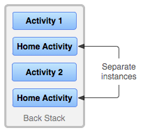

## 4.1.3 Activity登堂入室

### 

## 1.Activity，Window与View的关系

> 好吧，本来就想了解下他们几个的关系，然后手多多，然后就开始看起他们的调用过程来了...结果扣了两个小时，只理解了很小很小的一部分，果然，到底层撸源码的都是大神，比如老罗，还没到那个等级，下面是自己查阅资料，看了下一点源码的归纳所得，如果哪写错了欢迎指出！下面贴下小结图：


**流程解析：** Activity调用startActivity后最后会调用attach方法，然后在PolicyManager实现一个Ipolicy接口，接着实现一个Policy对象，接着调用makenewwindow(Context)方法，该方法会返回一个PhoneWindow对象，而PhoneWindow 是Window的子类，在这个PhoneWindow中有一个DecorView的内部类，是所有应用窗口的根View，即View的老大， 直接控制Activity是否显示(引用老司机原话..)，好吧，接着里面有一个LinearLayout，里面又有两个FrameLayout他们分别拿来装ActionBar和CustomView，而我们setContentView()加载的布局就放到这个CustomView中！

**总结下这三者的关系：** 打个牵强的比喻： 我们可以把这三个类分别堪称：画家，画布，画笔画出的东西； 画家通过画笔( **LayoutInflater.infalte**)画出图案，再绘制在画布(**addView**)上！ 最后显示出来(**setContentView**)

------

## 2.Activity，Task和Back Stack的一些概念

接着我们来了解Android中Activity的管理机制，这就涉及到了两个名词：Task和Back Stack了！

**概念解析：**

我们的APP一般都是由多个Activity构成的，而在Android中给我们提供了一个**Task(任务)**的概念， 就是将多个相关的Activity收集起来，然后进行Activity的跳转与返回！当然，这个Task只是一个 frameworker层的概念，而在Android中实现了Task的数据结构就是**Back Stack（回退堆栈）**！ 相信大家对于栈这种数据结构并不陌生，Java中也有个Stack的集合类！栈具有如下特点：

> **后进先出(LIFO)，常用操作入栈(push)，出栈(pop)，处于最顶部的叫栈顶，最底部叫栈底**

而Android中的Stack Stack也具有上述特点，他是这样来管理Activity的：

> 当切换到新的Activity，那么该Activity会被压入栈中，成为栈顶！ 而当用户点击Back键，栈顶的Activity出栈，紧随其后的Activity来到栈顶！

我们来看下官方文档给出的一个流程图：


**流程解析：**

应用程序中存在A1, A2, A3三个activity，当用户在Launcher或Home Screen点击应用程序图标时， 启动主A1，接着A1开启A2，A2开启A3，这时栈中有三个Activity，并且这三个Activity默认在同一个任务（Task）中，当用户按返回时，弹出A3，栈中只剩A1和A2，再按返回键， 弹出A2，栈中只剩A1，再继续按返回键，弹出A1，任务被移除，即程序退出！

接着在官方文档中又看到了另外两个图，处于好奇，我又看了下解释，然后跟群里的人讨论了下：





然后还有这段解释：


**然后总结下了结论：**

> Task是Activity的集合，是一个概念，实际使用的Back Stack来存储Activity，可以有多个Task，但是同一时刻只有一个栈在最前面，其他的都在后台！那栈是如何产生的呢？
>
> 答：当我们通过主屏幕，点击图标打开一个新的App，此时会创建一个新的Task！举个例子：
> 我们通过点击通信录APP的图标打开APP，这个时候会新建一个栈1，然后开始把新产生的Activity添加进来，可能我们在通讯录的APP中打开了短信APP的页面，但是此时不会新建一个栈，而是继续添加到栈1中，这是 Android推崇一种用户体验方式，即不同应用程序之间的切换能使用户感觉就像是同一个应用程序， 很连贯的用户体验，官方称其为seamless (无缝衔接）！ ——————这个时候假如我们点击Home键，回到主屏幕，此时栈1进入后台，我们可能有下述两种操作：
> 1）点击菜单键(正方形那个按钮)，点击打开刚刚的程序，然后栈1又回到前台了！ 又或者我们点击主屏幕上通信录的图标，打开APP，此时也不会创建新的栈，栈1回到前台！
> 2）如果此时我们点击另一个图标打开一个新的APP，那么此时则会创建一个新的栈2，栈2就会到前台， 而栈1继续呆在后台；
> \3) 后面也是这样...以此类推！

------

## 3.Task的管理

### 1）文档翻译：

好的，继续走文档，从文档中的ManagingTasks开始，大概的翻译如下：

------

### 1）文档翻译

继续走文档，从文档中的ManagingTasks开始，翻译如下：

> 如上面所述，Android会将新成功启动的Activity添加到同一个Task中并且按照以"先进先出"方式管理多个Task 和Back Stack，用户就无需去担心Activites如何与Task任务进行交互又或者它们是如何存在于Back Stack中！ 或许，你想改变这种正常的管理方式。比如，你希望你的某个Activity能够在一个新的Task中进行管理； 或者你只想对某个Activity进行实例化，又或者你想在用户离开任务时清理Task中除了根Activity所有Activities。你可以做这些事或者更多，只需要通过修改AndroidManifest.xml中 < activity >的相关属性值或者在代码中通过传递特殊标识的Intent给startActivity( )就可以轻松的实现 对Actvitiy的管理了。

**< activity >中我们可以使用的属性如下：**

> - **taskAffinity**
> - **launchMode**
> - **allowTaskReparenting**
> - **clearTaskOnLaunch**
> - **alwaysRetainTaskState**
> - **finishOnTaskLaunch**

**你能用的主要的Intent标志有：**

> - **FLAG_ACTIVITY_NEW_TASK**
> - **FLAG_ACTIVITY_CLEAR_TOP**
> - **FLAG_ACTIVITY_SINGLE_TOP**

好的，接下来逐个介绍这些怎么用：

------

### 2）taskAffinity和allowTaskReparenting

默认情况下，一个应用程序中的**所有activity都有一个Affinity**，这让它们属于同一个Task。 你可以理解为是否处于同一个Task的标志，然而，每个Activity可以通过 < activity>中的taskAffinity属性设置单独的Affinity。 不同应用程序中的Activity可以共享同一个Affinity，同一个应用程序中的不同Activity 也可以设置成不同的Affinity。 Affinity属性在2种情况下起作用：

> 1）当启动 activity的Intent对象包含**FLAG_ACTIVITY_NEW_TASK**标记： 当传递给startActivity()的Intent对象包含 FLAG_ACTIVITY_NEW_TASK标记时，系统会为需要启动的Activity寻找与当前Activity不同Task。如果要启动的 Activity的Affinity属性与当前所有的Task的Affinity属性都不相同，系统会新建一个带那个Affinity属性的Task，并将要启动的Activity压到新建的Task栈中；否则将Activity压入那个Affinity属性相同的栈中。
>
> 2）**allowTaskReparenting**属性设置为true 如果一个activity的allowTaskReparenting属性为true， 那么它可以从一个Task（Task1）移到另外一个有相同Affinity的Task（Task2）中（Task2带到前台时）。 如果一个.apk文件从用户角度来看包含了多个"应用程序"，你可能需要对那些 Activity赋不同的Affinity值。

------

### 3）launchMode：

四个可选值，启动模式我们研究的核心，下面再详细讲! 他们分别是：**standard**(默认)，**singleTop**，**singleTask**，**singleInstance**

------

### 4）清空栈

> 当用户长时间离开Task（当前task被转移到后台）时，系统会清除task中栈底Activity外的所有Activity 。这样，当用户返回到Task时，只留下那个task最初始的Activity了。我们可以通过修改下面这些属性来 改变这种行为！
>
> **alwaysRetainTaskState**： 如果栈底Activity的这个属性被设置为true，上述的情况就不会发生。 Task中的所有activity将被长时间保存。
>
> **clearTaskOnLaunch** 如果栈底activity的这个属性被设置为true，一旦用户离开Task， 则 Task栈中的Activity将被清空到只剩下栈底activity。这种情况刚好与 alwaysRetainTaskState相反。即使用户只是短暂地离开，task也会返回到初始状态 （只剩下栈底acitivty）。
>
> **finishOnTaskLaunch** 与clearTaskOnLaunch相似，但它只对单独的activity操 作，而不是整个Task。它可以结束任何Activity，包括栈底的Activity。 当它设置为true时，当前的Activity只在当前会话期间作为Task的一部分存在， 当用户退出Activity再返回时，它将不存在。

------

## 4.Activity的四种加载模式详解：

接下来我们来详细地讲解下四种加载模式： 他们分别是：**standard**(默认)，**singleTop**，**singleTask**，**singleInstance** 在泡在网上的日子看到一篇图文并茂的讲解启动模式的，很赞，可能更容易理解吧，这里借鉴下：

原文链接：[Activity启动模式图文详解：standard, singleTop, singleTask 以及 singleInstance](http://www.jcodecraeer.com/a/anzhuokaifa/androidkaifa/2015/0520/2897.html)

英文原文：[Understand Android Activity's launchMode: standard, singleTop, singleTask and singleInstance](http://inthecheesefactory.com/blog/understand-android-activity-launchmode/en) 另外还有一篇详细讲解加载模式的：[Android中Activity四种启动模式和taskAffinity属性详解](http://blog.csdn.net/zhangjg_blog/article/details/10923643)

**先来看看总结图：**


**模式详解：**

------

### standard模式：

标准启动模式，也是activity的默认启动模式。在这种模式下启动的activity可以被多次实例化，即在同一个任务中可以存在多个activity的实例，每个实例都会处理一个Intent对象。如果Activity A的启动模式为standard，并且A已经启动，在A中再次启动Activity A，即调用startActivity（new Intent（this，A.class）），会在A的上面再次启动一个A的实例，即当前的桟中的状态为A-->A。


------

### singleTop模式：

如果一个以singleTop模式启动的Activity的实例已经存在于任务栈的栈顶， 那么再启动这个Activity时，不会创建新的实例，而是重用位于栈顶的那个实例， 并且会调用该实例的**onNewIntent()**方法将Intent对象传递到这个实例中。 举例来说，如果A的启动模式为singleTop，并且A的一个实例已经存在于栈顶中， 那么再调用startActivity（new Intent（this，A.class））启动A时， 不会再次创建A的实例，而是重用原来的实例，并且调用原来实例的onNewIntent()方法。 这时任务栈中还是这有一个A的实例。如果以singleTop模式启动的activity的一个实例 已经存在与任务栈中，但是不在栈顶，那么它的行为和standard模式相同，也会创建多个实例。


------

### singleTask模式：

只允许在系统中有一个Activity实例。如果系统中已经有了一个实例， 持有这个实例的任务将移动到顶部，同时intent将被通过onNewIntent()发送。 如果没有，则会创建一个新的Activity并置放在合适的任务中。


官方文档中提到的一个问题：

> 系统会创建一个新的任务，并将这个Activity实例化为新任务的根部（root） 这个则需要我们对taskAffinity进行设置了，使用taskAffinity后的解雇：


------

------

### singleInstance模式

保证系统无论从哪个Task启动Activity都只会创建一个Activity实例,并将它加入新的Task栈顶 也就是说被该实例启动的其他activity会自动运行于另一个Task中。 当再次启动该activity的实例时，会重用已存在的任务和实例。并且会调用这个实例 的onNewIntent()方法，将Intent实例传递到该实例中。和singleTask相同， 同一时刻在系统中只会存在一个这样的Activity实例。


------

## 5.Activity拾遗

对于Activity可能有些东西还没讲到，这里预留一个位置，漏掉的都会在这里补上！ 首先是群友珠海-坤的建议，把开源中国的Activity管理类也贴上，嗯，这就贴上，大家可以直接用到 项目中~

### 1）开源中国客户端Activity管理类：

```
package net.oschina.app;

import java.util.Stack;

import android.app.Activity;
import android.app.ActivityManager;
import android.content.Context;


public class AppManager {
    
    private static Stack<Activity> activityStack;
    private static AppManager instance;
    
    private AppManager(){}
    /**
     * 单一实例
     */
    public static AppManager getAppManager(){
        if(instance==null){
            instance=new AppManager();
        }
        return instance;
    }
    /**
     * 添加Activity到堆栈
     */
    public void addActivity(Activity activity){
        if(activityStack==null){
            activityStack=new Stack<Activity>();
        }
        activityStack.add(activity);
    }
    /**
     * 获取当前Activity（堆栈中最后一个压入的）
     */
    public Activity currentActivity(){
        Activity activity=activityStack.lastElement();
        return activity;
    }
    /**
     * 结束当前Activity（堆栈中最后一个压入的）
     */
    public void finishActivity(){
        Activity activity=activityStack.lastElement();
        finishActivity(activity);
    }
    /**
     * 结束指定的Activity
     */
    public void finishActivity(Activity activity){
        if(activity!=null){
            activityStack.remove(activity);
            activity.finish();
            activity=null;
        }
    }
    /**
     * 结束指定类名的Activity
     */
    public void finishActivity(Class<?> cls){
        for (Activity activity : activityStack) {
            if(activity.getClass().equals(cls) ){
                finishActivity(activity);
            }
        }
    }
    /**
     * 结束所有Activity
     */
    public void finishAllActivity(){
        for (int i = 0, size = activityStack.size(); i < size; i++){
            if (null != activityStack.get(i)){
                activityStack.get(i).finish();
            }
        }
        activityStack.clear();
    }
    /**
     * 退出应用程序
     */
    public void AppExit(Context context) {
        try {
            finishAllActivity();
            ActivityManager activityMgr= (ActivityManager) context.getSystemService(Context.ACTIVITY_SERVICE);
            activityMgr.restartPackage(context.getPackageName());
            System.exit(0);
        } catch (Exception e) {    }
    }
}
```

------

## 本节小结：

好的，本节就到这里，东西都比较苦涩难懂，暂时知道下即可，总结下Task进行整体调度的 相关操作吧：

> - 按Home键，将之前的Task切换到后台
> - 长按Home键，会显示出最近执行过的Task列表
> - 在Launcher或HomeScreen点击app图标，开启一个新Task，或者是将已有的Task调度到前台
> - 启动singleTask模式的Activity时，会在系统中搜寻是否已经存在一个合适的Task，若存在，则会将这个Task调度到前台以重用这个Task。如果这个Task中已经存在一个要启动的Activity的实例，则清除这个实例之上的所有Activity，将这个实例显示给用户。如果这个已存在的Task中不存在一个要启动的Activity的实例，则在这个Task的顶端启动一个实例。若这个Task不存在，则会启动一个新的Task，在这个新的Task中启动这个singleTask模式的Activity的一个实例。
> - 启动singleInstance的Activity时，会在系统中搜寻是否已经存在一个这个Activity的实例，如果存在，会将这个实例所在的Task调度到前台，重用这个Activity的实例（该Task中只有这一个Activity），如果不存在，会开启一个新任务，并在这个新Task中启动这个singleInstance模式的Activity的一个实例。

好的本节就到这里，关于Task与Activity加载模式的东西还是比较复杂的，下面给大家贴下编写该文的 时候的一些参考文献，可以自己看看~

------

## 参考文献：

- 1.[Tasks and Back Stack](http://developer.android.com/intl/zh-cn/guide/components/tasks-and-back-stack.html#ManagingTasks)
- 2.[理解android中Activity和Task的关系](http://my.oschina.net/MrGuan/blog/75392)
- 3.[Activity启动模式图文详解：standard, singleTop, singleTask 以及 singleInstance](http://www.jcodecraeer.com/a/anzhuokaifa/androidkaifa/2015/0520/2897.html)
- 4.[Understand Android Activity's launchMode: standard, singleTop, singleTask and singleInstance](http://inthecheesefactory.com/blog/understand-android-activity-launchmode/en)
- 5.[Android中Activity四种启动模式和taskAffinity属性详解](http://blog.csdn.net/zhangjg_blog/article/details/10923643)
- 6.[Android的Activity和Tasks详解](http://blog.csdn.net/infsafe/article/details/5666964)
- 7.[Activity的四种启动模式和onNewIntent()](http://gundumw100.iteye.com/blog/2160467)
- 8.[译：Android任务和返回栈完全解析，细数那些你所不知道的细节](http://blog.csdn.net/guolin_blog/article/details/41087993)