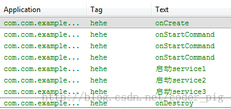
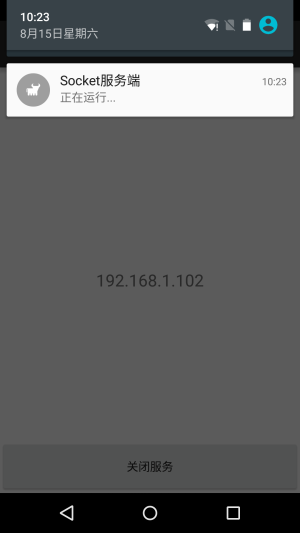

## 4.2.2 Service进阶

### 

## 本节引言

> 上节我们学习了Service的生命周期，以及两种启动Service的两种方法， 本节继续来深入了解Service中的IntentService，Service的使用实例： 前台服务与轮询的实现!

------

## 1.IntentService的使用

在上一节后我们已经知道了如何去定义和启动Service，但是如果我们直接把耗时线程放到Service中的onStart()方法中，虽然可以这样做，但是很容易会引起ANR异常(Application Not Responding)，而Android的官方在介绍 Service有下面这样一段话：


**直接翻译：**

> 1.Service不是一个单独的进程, 它和它的应用程序在同一个进程中
> 2.Service不是一个线程, 这样就意味着我们应该避免在Service中进行耗时操作

于是乎，Android给我们提供了解决上述问题的替代品，就是下面要讲的**IntentService**； IntentService是继承与Service并处理异步请求的一个类, 在IntentService中有 一个工作线程来处理耗时操作, 请求的Intent记录会加入队列

**工作流程：**

> 客户端通过startService(Intent)来启动IntentService; 我们并不需要手动地区控制IntentService, 当任务执行完后, IntentService会自动停止; 可以启动IntentService多次, 每个耗时操作会以工作队列的方式在IntentService的 onHandleIntent回调方法中执行, 并且每次只会执行一个工作线程, 执行完一，再到二这样!

再接着是代码演示, 网上大部分的代码都是比较Service与IntentService的, 定义足够长的休眠时间, 演示Service的ANR异常, 然后引出IntentService有多好! 这里就不演示Service了, 网上的都是自定义Service, 然后在onStart()方法 中Thread.sleep(20000)然后引发ANR异常, 有兴趣的可以自己写代码试试, 这里的话只演示下IntentService的用法！

**TestService3.java**

```
public class TestService3 extends IntentService {  
    private final String TAG = "hehe";  
    
    //必须实现父类的构造方法  
    public TestService3()  
    {  
        super("TestService3");  
    }  
  
    //必须重写的核心方法  
    @Override  
    protected void onHandleIntent(Intent intent) {  
        //Intent是从Activity发过来的，携带识别参数，根据参数不同执行不同的任务  
        String action = intent.getExtras().getString("param");  
        if(action.equals("s1"))Log.i(TAG,"启动service1");  
        else if(action.equals("s2"))Log.i(TAG,"启动service2");  
        else if(action.equals("s3"))Log.i(TAG,"启动service3");  
          
        //让服务休眠2秒  
        try{  
            Thread.sleep(2000);  
        }catch(InterruptedException e){e.printStackTrace();}          
    }  
  
    //重写其他方法,用于查看方法的调用顺序  
    @Override  
    public IBinder onBind(Intent intent) {  
        Log.i(TAG,"onBind");  
        return super.onBind(intent);  
    }  
  
    @Override  
    public void onCreate() {  
        Log.i(TAG,"onCreate");  
        super.onCreate();  
    }  
  
    @Override  
    public int onStartCommand(Intent intent, int flags, int startId) {  
        Log.i(TAG,"onStartCommand");  
        return super.onStartCommand(intent, flags, startId);  
    } 
  
  
    @Override  
    public void setIntentRedelivery(boolean enabled) {  
        super.setIntentRedelivery(enabled);  
        Log.i(TAG,"setIntentRedelivery");  
    }  
      
    @Override  
    public void onDestroy() {  
        Log.i(TAG,"onDestroy");  
        super.onDestroy();  
    }  
      
} 
```

**AndroidManifest.xml注册下Service**

```
<service android:name=".TestService3" android:exported="false">  
    <intent-filter >  
        <action android:name="com.test.intentservice"/>  
    </intent-filter>  
</service>  
```

**在MainActivity启动三次服务：**

```
public class MainActivity extends Activity {  
  
    @Override  
    protected void onCreate(Bundle savedInstanceState) {  
        super.onCreate(savedInstanceState);  
        setContentView(R.layout.activity_main);  
          
        Intent it1 = new Intent("com.test.intentservice");  
        Bundle b1 = new Bundle();  
        b1.putString("param", "s1");  
        it1.putExtras(b1);  
          
        Intent it2 = new Intent("com.test.intentservice");  
        Bundle b2 = new Bundle();  
        b2.putString("param", "s2");  
        it2.putExtras(b2);  
          
        Intent it3 = new Intent("com.test.intentservice");  
        Bundle b3 = new Bundle();  
        b3.putString("param", "s3");  
        it3.putExtras(b3);  
          
        //接着启动多次IntentService,每次启动,都会新建一个工作线程  
        //但始终只有一个IntentService实例  
        startService(it1);  
        startService(it2);  
        startService(it3);  
    }  
} 
```

**运行截图：**



**小结：**

> 当一个后台的任务, 需要分成几个子任务, 然后按先后顺序执行, 子任务 (简单的说就是异步操作), 此时如果我们还是定义一个普通Service然后在onStart方法中开辟线程, 然后又要去控制线程, 这样显得非常的繁琐;  此时应该自定义一个IntentService然后再onHandleIntent()方法中完成相关任务！

------

## 2.Activity与Service通信

我们前面的操作都是通过Activity启动和停止Service，假如我们启动的是一个下载的后台Service，而我们想知道Service中下载任务的进度！那么这肯定是需要Service 与Activity进行通信的，而他们之间交流的媒介就是Service中的onBind()方法！ 返回一个我们自定义的Binder对象！

基本流程如下：

- 1.自定义Service中，自定义一个Binder类，然后将需要暴露的方法都写到该类中！
- 2.Service类中，实例化这个自定义Binder类，然后重写onBind()方法，将这个Binder对象返回！
- 3.Activity类中实例化一个ServiceConnection对象，重写onServiceConnected()方法，然后获取Binder对象，然后调用相关方法即可！

------

## 3.一个简单前台服务的实现

学到现在，我们都知道Service一般都是运行在后台的，但是Service的系统优先级还是比较低的，当系统内存不足的时候，就有可能回收正在后台运行的Service， 对于这种情况我们可以使用前台服务，从而让Service稍微没那么容易被系统杀死， 当然还是有可能被杀死的...所谓的前台服务就是状态栏显示的Notification！

实现起来也很简单，最近做的项目刚好用到这个前台服务，就把核心的代码抠出来 分享下：

在自定义的Service类中，重写onCreate()，然后根据自己的需求定制Notification； 定制完毕后，调用startForeground(1, notification对象)即可！ **核心代码如下：**

```
public void onCreate()
{
    super.onCreate();
    Notification.Builder localBuilder = new Notification.Builder(this);
    localBuilder.setContentIntent(PendingIntent.getActivity(this, 0, new Intent(this, MainActivity.class), 0));
    localBuilder.setAutoCancel(false);
    localBuilder.setSmallIcon(R.mipmap.ic_cow_icon);
    localBuilder.setTicker("Foreground Service Start");
    localBuilder.setContentTitle("Socket服务端");
    localBuilder.setContentText("正在运行...");
    startForeground(1, localBuilder.getNotification());
}
```

**运行效果截图：**



------

## 4.简单定时后台线程的实现

除了上述的前台服务外，实际开发中Service还有一种常见的用法，就是执行定时任务， 比如轮询，就是每间隔一段时间就请求一次服务器，确认客户端状态或者进行信息更新 等！而Android中给我们提供的定时方式有两种使用Timer类与Alarm机制！

> 前者不适合于需要长期在后台运行的定时任务，CPU一旦休眠，Timer中的定时任务就无法运行；Alarm则不存在这种情况，他具有唤醒CPU的功能，另外，也要区分CPU 唤醒与屏幕唤醒！

**使用流程：**

> - **Step 1：获得Service:** AlarmManager manager = (AlarmManager) getSystemService(ALARM_SERVICE);
> - **Step 2：通过set方法设置定时任务** int anHour = 2 * 1000; long triggerAtTime = SystemClock.elapsedRealtime() + anHour; manager.set(AlarmManager.RTC_WAKEUP,triggerAtTime,pendingIntent);
> - **Step 3：定义一个Service** 在onStartCommand中开辟一条事务线程,用于处理一些定时逻辑
> - **Step 4：定义一个Broadcast(广播)，用于启动Service** 最后别忘了，在AndroidManifest.xml中对这Service与Boradcast进行注册！

**参数详解：** **set(int type,long startTime,PendingIntent pi)**

> **①type:** 有五个可选值:
> **AlarmManager.ELAPSED_REALTIME:** 闹钟在手机睡眠状态下不可用，该状态下闹钟使用相对时间（相对于系统启动开始），状态值为3;
> **AlarmManager.ELAPSED_REALTIME_WAKEUP** 闹钟在睡眠状态下会唤醒系统并执行提示功能，该状态下闹钟也使用相对时间，状态值为2；
> **AlarmManager.RTC** 闹钟在睡眠状态下不可用，该状态下闹钟使用绝对时间，即当前系统时间，状态值为1；
> **AlarmManager.RTC_WAKEUP** 表示闹钟在睡眠状态下会唤醒系统并执行提示功能，该状态下闹钟使用绝对时间，状态值为0;
> **AlarmManager.POWER_OFF_WAKEUP** 表示闹钟在手机关机状态下也能正常进行提示功能，所以是5个状态中用的最多的状态之一， 该状态下闹钟也是用绝对时间，状态值为4；不过本状态好像受SDK版本影响，某些版本并不支持；

PS:第一个参数决定第二个参数的类型,如果是REALTIME的话就用： SystemClock.elapsedRealtime( )方法可以获得系统开机到现在经历的毫秒数 如果是RTC的就用:System.currentTimeMillis()可获得从1970.1.1 0点到 现在做经历的毫秒数

> **②startTime：** 闹钟的第一次执行时间，以毫秒为单位，可以自定义时间，不过一般使用当前时间。 需要注意的是,本属性与第一个属性（type）密切相关,如果第一个参数对应的闹钟 使用的是相对时间（**ELAPSED_REALTIME**和**ELAPSED_REALTIME_WAKEUP**），那么本属 性就得使用相对时间（相对于系统启动时间来说）,比如当前时间就表示为: SystemClock.elapsedRealtime()；如果第一个参数对应的闹钟使用的是绝对时间 (RTC、RTC_WAKEUP、POWER_OFF_WAKEUP）,那么本属性就得使用绝对时间， 比如当前时间就表示为：System.currentTimeMillis()。
>
> **③PendingIntent:** 绑定了闹钟的执行动作，比如发送一个广播、给出提示等等。PendingIntent 是Intent的封装类。
> 需要注意的是，如果是通过启动服务来实现闹钟提示的话， PendingIntent对象的获取就应该采用Pending.getService (Context c,int i,Intent intent,int j)方法；
> 如果是通过广播来实现闹钟提示的话， PendingIntent对象的获取就应该采用 PendingIntent.getBroadcast (Context c,int i,Intent intent,int j)方法；
> 如果是采用Activity的方式来实现闹钟提示的话，PendingIntent对象的获取 就应该采用 PendingIntent.getActivity(Context c,int i,Intent intent,int j) 方法。
> 如果这三种方法错用了的话，虽然不会报错，但是看不到闹钟提示效果。

**另外:**

从4.4版本后(API 19),Alarm任务的触发时间可能变得不准确,有可能会延时,是系统 对于耗电性的优化,如果需要准确无误可以调用setExtra()方法~

**核心代码：**

```
public class LongRunningService extends Service {
    @Override
    public IBinder onBind(Intent intent) {
        return null;
    }

    @Override
    public int onStartCommand(Intent intent, int flags, int startId) {
        //这里开辟一条线程,用来执行具体的逻辑操作:
        new Thread(new Runnable() {
            @Override
            public void run() {
                Log.d("BackService", new Date().toString());
            }
        }).start();
        AlarmManager manager = (AlarmManager) getSystemService(ALARM_SERVICE);
        //这里是定时的,这里设置的是每隔两秒打印一次时间=-=,自己改
        int anHour = 2 * 1000;
        long triggerAtTime = SystemClock.elapsedRealtime() + anHour;
        Intent i = new Intent(this,AlarmReceiver.class);
        PendingIntent pi = PendingIntent.getBroadcast(this, 0, i, 0);
        manager.set(AlarmManager.ELAPSED_REALTIME_WAKEUP, triggerAtTime, pi);
        return super.onStartCommand(intent, flags, startId);
    }
}
```

**AlarmReceiver.java**

```
public class AlarmReceiver extends BroadcastReceiver {

    @Override
    public void onReceive(Context context, Intent intent) {
        Intent i = new Intent(context,LongRunningService.class);
        context.startService(i);
    }
}
```

------

## 本节小结：

本节我们继续对Service进行更深入的学习，IntentService以及Service 在实际开发中的两个常用的案例：前台Service的实现，以及Service后台 Service的实现！下一节中我们会继续研究Service的AIDL，跨进程通信， 敬请期待~

------

**参考文献：** 《第一行代码 Android》—— 郭霖：很好的一本Android入门书！