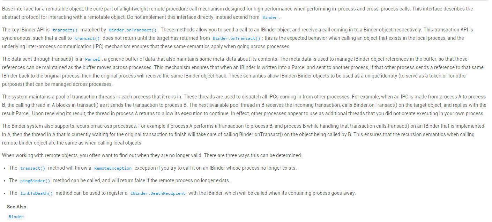
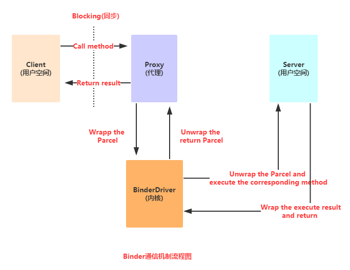
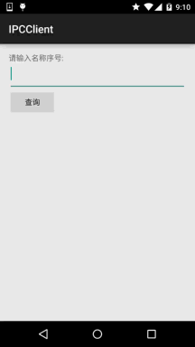

## 4.2.3 Service精通

### 

## 本节引言：

> 本节，我们继续来研究Service(服务)组件，本节将会学习下Android中的AIDL跨进程通信的一些概念，并不深入到源码层次，暂时知道是什么，会用即可！开始本节内容~ 本节对应官方文档：[Binder](http://developer.android.com/intl/zh-cn/reference/android/os/Binder.html)

------

## 1.Binder机制初涉

------

### 1）IBinder和Binder是什么鬼？

我们来看看官方文档怎么说：



中文翻译：

> IBinder是远程对象的基本接口，是为了高性能而设计的轻量级远程调用机制的核心部分。但他不仅用于远程调用，也用于进程内调用。该接口定义了与远程对象间交互的协议。但不要直接实现这个接口，而是**继承**(extends)**Binder**。
>
> IBinder主要的API是**transact()**，与之对应的API是**Binder.onTransact()**。通过前者，你能 想远程IBinder对象发送发出调用，后者使你的远程对象能够响应接收到的调用。IBinder的API都是 **Syncronous(同步)**执行的，比如**transact()**直到对方的**Binder.onTransact()**方法调用玩 后才返回。 调用发生在进程内时无疑是这样的，而在进程间时，在**IPC**的帮助下，也是同样的效果。
>
> 通过**transact()**发送的数据是**Parcel**，Parcel是一种一般的缓冲区，除了有数据外还带有 一些描述它内容的元数据。元数据用于管理IBinder对象的引用，这样就能在缓冲区从一个进程移动 到另一个进程时保存这些引用。这样就保证了当一个IBinder被写入到Parcel并发送到另一个进程中， 如果另一个进程把同一个IBinder的引用回发到原来的进程，那么这个原来的进程就能接收到发出的 那个IBinder的引用。这种机制使IBinder和Binder像唯一标志符那样在进程间管理。
>
> 系统为每个进程维护一个存放交互线程的线程池。这些交互线程用于派送所有从另外进程发来的IPC 调用。例如：当一个IPC从进程Ａ发到进程Ｂ，Ａ中那个发出调用的线程(这个应该不在线程池中)就阻塞 在**transact()**中了。进程Ｂ中的交互线程池中的一个线程接收了这个调用，它调用 **Binder.onTransact()**，完成后用一个Parcel来做为结果返回。然后进程Ａ中的那个等待的线程在 收到返回的Parcel后得以继续执行。实际上，另一个进程看起来就像是当前进程的一个线程， 但不是当前进程创建的。
>
> Binder机制还支持进程间的递归调用。例如，进程Ａ执行自己的IBinder的transact()调用进程Ｂ 的Binder，而进程Ｂ在其Binder.onTransact()中又用transact()向进程Ａ发起调用，那么进程Ａ 在等待它发出的调用返回的同时，还会用Binder.onTransact()响应进程Ｂ的transact()。 总之Binder造成的结果就是让我们感觉到跨进程的调用与进程内的调用没什么区别。
>
> 当操作远程对象时，你经常需要查看它们是否有效，有三种方法可以使用：
>
> - １ transact()方法将在IBinder所在的进程不存在时抛出RemoteException异常。
> - ２ 如果目标进程不存在，那么调用pingBinder()时返回false。
> - ３ 可以用linkToDeath()方法向IBinder注册一个IBinder.DeathRecipient， 在IBinder代表的进程退出时被调用。
>
> PS:中文翻译摘自 : [Android开发：什么是IBinder](http://blog.csdn.net/niu_gao/article/details/6453218)

好吧，估计你看完上这一串东西可能云里雾里的，这里简单的小结下：

**IBinder是Android给我们提供的一个进程间通信的一个接口，而我们一般是不直接实现这个接口的，** **而是通过继承Binder类来实现进程间通信！是Android中实现IPC(进程间通信)的一种方式！**

------

### 2）Binder机制浅析

> Android中的Binder机制由一系列系统组件构成： **Client、Server、Service Manager和Binder驱动程序**

大概调用流程如下，另外Service Manager比较复杂，这里并不详细研究！



**流程解析：**

> **->** Client调用某个代理接口中的方法时，代理接口的方法会将Client传递的参数打包成Parcel对象；
> **->** 然后代理接口把该Parcel对象发送给内核中的Binder driver；；
> **->** 然后Server会读取Binder Driver中的请求数据，假如是发送给自己的，解包Parcel对象， 处理并将结果返回；
> PS:代理接口中的定义的方法和Server中定义的方法是一一对应的， 另外，整个调用过程是一个同步的，即Server在处理时，Client会被Block(锁)住! 而这里说的代理接口的定义就是等下要说的**AIDL**(Android接口描述语言)！

------

### 3）为何Android使用Binder机制来实现进程间的通信？

> 1. **可靠性**：在移动设备上，通常采用基于Client-Server的通信方式来实现互联网与设备间的内部通信。目前linux支持IPC包括传统的管道，System V IPC，即消息队列/共享内存/信号量，以及socket中只有socket支持Client-Server的通信方式。Android系统为开发者提供了丰富进程间通信的功能接口，媒体播放，传感器，无线传输。这些功能都由不同的server来管理。开发都只关心将自己应用程序的client与server的通信建立起来便可以使用这个服务。毫无疑问，如若在底层架设一套协议来实现Client-Server通信，增加了系统的复杂性。在资源有限的手机 上来实现这种复杂的环境，可靠性难以保证。
> 2. **传输性能**：socket主要用于跨网络的进程间通信和本机上进程间的通信，但传输效率低，开销大。消息队列和管道采用存储-转发方式，即数据先从发送方缓存区拷贝到内核开辟的一块缓存区中，然后从内核缓存区拷贝到接收方缓存区，其过程至少有两次拷贝。虽然共享内存无需拷贝，但控制复杂。比较各种IPC方式的数据拷贝次数。共享内存：0次。Binder：1次。Socket/管道/消息队列：2次。
> 3. **安全性**：Android是一个开放式的平台，所以确保应用程序安全是很重要的。Android对每一个安装应用都分配了UID/PID,其中进程的UID是可用来鉴别进程身份。传统的只能由用户在数据包里填写UID/PID，这样不可靠，容易被恶意程序利用。而我们要求由内核来添加可靠的UID。 所以，出于可靠性、传输性、安全性。android建立了一套新的进程间通信方式。 ——摘自:[Android中的Binder机制的简要理解](http://www.linuxidc.com/Linux/2012-07/66195.htm)

当然，作为一个初级的开发者我们并不关心上述这些，Binder机制给我们带来的最直接的好处就是： **我们无需关心底层如何实现，只需按照AIDL的规则，自定义一个接口文件，** **然后调用调用接口中的方法，就可以完成两个进程间的通信了！**

------

## 2.AIDL使用详解

------

### 1）AIDL是什么？

> 嘿嘿，前面我们讲到**IPC**这个名词，他的全名叫做：**跨进程通信(interprocess communication)**， 因为在Android系统中,个个应用程序都运行在自己的进程中,进程之间一般是无法直接进行数据交换的, 而为了实现跨进程，Android给我们提供了上面说的Binder机制，而这个机制使用的接口语言就是: **AIDL**(Android Interface Definition Language)，他的语法很简单，而这种接口语言并非真正的编程 语言，只是定义两个进程间的通信接口而已！而生成符合通信协议的Java代码则是由Android SDK的 platform-tools目录下的**aidl.exe**工具生成，生成对应的接口文件在:gen目录下，一般是:Xxx.java的接口！ 而在该接口中包含一个**Stub**的内部类，该类中实现了在该类中实现了**IBinder**接口与自定义的通信接口, 这个类将会作为远程Service的回调类——实现了IBinder接口,所以可作为Service的onBind( )方法的返回值！

------

### 2）AIDL实现两个进程间的简单通信

在开始编写AIDL接口文件前，我们需要了解下编写AIDL的一些注意事项：

**AIDL注意事项：**

> - 接口名词需要与aidl文件名相同
> - 接口和方法前面**不要加访问权限修饰符**：public ,private,protected等，也不能用static final!
> - AIDL默认支持的类型包括**Java基本类型**，**String**，**List**，**Map**，**CharSequence**，除此之外的其他类型都 需要import声明，对于使用自定义类型作为参数或者返回值，自定义类型需要实现Parcelable接口， 详情请看后面的传递复杂数据类型
> - 自定义类型和AIDL生成的其它接口类型在aidl描述文件中，应该显式import，即便在该类和定义 的包在同一个包中。
>
> 另外，如果编写aidl你用的编译器是:Eclipse的话要注意： 不要直接new file然后建立哦!这样的话是打不开文件,从而不能编写代码哦！
> ①直接新建一个txt文件,编写好后保存为.aidl格式,然后复制到对应路径下
> ②因为aidl和接口类似,所以直接new interface,编写好内容后,来到对应java文件所在目录下修改文件后缀名;
>
> 假如你使用的是Android Studio的话，不同于Eclipse，如果你按照Eclipse那样创建一个AIDL文件，会发现 并没有编译生成对应的XXX.java文件，AS下创建AIDL需要在main目录下新建一个aidl文件夹，然后定义一个 和aidl包名相同的包，最后创建一个aidl文件，接着按ctrl + f9重新编译，就可以了！
>
> 
>
> 上面两者成功编译的结果如下，你可以分别在对应目录下找到对应的AIDL文件
>
> 


> 


------

**1.服务端：**

**Step 1：**创建AIDL文件：

**IPerson.aidl**

```
package com.jay.aidl;

interface IPerson {
    String queryPerson(int num);
}
```

**我们打开IPerson.java看看里面的代码：**

**IPerson.java**

```
/*
 * This file is auto-generated.  DO NOT MODIFY.
 * Original file: C:\\Code\\ASCode\\AIDLServer\\app\\src\\main\\aidl\\com\\jay\\aidl\\IPerson.aidl
 */
package com.jay.aidl;
public interface IPerson extends android.os.IInterface
{
/** Local-side IPC implementation stub class. */
public static abstract class Stub extends android.os.Binder implements com.jay.aidl.IPerson
{
private static final java.lang.String DESCRIPTOR = "com.jay.aidl.IPerson";
/** Construct the stub at attach it to the interface. */
public Stub()
{
this.attachInterface(this, DESCRIPTOR);
}
/**
 * Cast an IBinder object into an com.jay.aidl.IPerson interface,
 * generating a proxy if needed.
 */
public static com.jay.aidl.IPerson asInterface(android.os.IBinder obj)
{
if ((obj==null)) {
return null;
}
android.os.IInterface iin = obj.queryLocalInterface(DESCRIPTOR);
if (((iin!=null)&&(iin instanceof com.jay.aidl.IPerson))) {
return ((com.jay.aidl.IPerson)iin);
}
return new com.jay.aidl.IPerson.Stub.Proxy(obj);
}
@Override public android.os.IBinder asBinder()
{
return this;
}
@Override public boolean onTransact(int code, android.os.Parcel data, android.os.Parcel reply, int flags) throws android.os.RemoteException
{
switch (code)
{
case INTERFACE_TRANSACTION:
{
reply.writeString(DESCRIPTOR);
return true;
}
case TRANSACTION_queryPerson:
{
data.enforceInterface(DESCRIPTOR);
int _arg0;
_arg0 = data.readInt();
java.lang.String _result = this.queryPerson(_arg0);
reply.writeNoException();
reply.writeString(_result);
return true;
}
}
return super.onTransact(code, data, reply, flags);
}
private static class Proxy implements com.jay.aidl.IPerson
{
private android.os.IBinder mRemote;
Proxy(android.os.IBinder remote)
{
mRemote = remote;
}
@Override public android.os.IBinder asBinder()
{
return mRemote;
}
public java.lang.String getInterfaceDescriptor()
{
return DESCRIPTOR;
}
@Override public java.lang.String queryPerson(int num) throws android.os.RemoteException
{
android.os.Parcel _data = android.os.Parcel.obtain();
android.os.Parcel _reply = android.os.Parcel.obtain();
java.lang.String _result;
try {
_data.writeInterfaceToken(DESCRIPTOR);
_data.writeInt(num);
mRemote.transact(Stub.TRANSACTION_queryPerson, _data, _reply, 0);
_reply.readException();
_result = _reply.readString();
}
finally {
_reply.recycle();
_data.recycle();
}
return _result;
}
}
static final int TRANSACTION_queryPerson = (android.os.IBinder.FIRST_CALL_TRANSACTION + 0);
}
public java.lang.String queryPerson(int num) throws android.os.RemoteException;
}
```

这里我们关注的只是**asInterface(IBinder)**和我们定义的接口中的**queryPerson()**方法!

该方法会把IBinder类型的对象转换成IPerson类型的,必要时生成一个代理对象返回结果！

其他的我们可以不看，直接跳过，进行下一步。

**Step 2：\**自定义我们的Service类,完成下述操作:**

1)继承Service类,同时也自定义了一个PersonQueryBinder类用来**继承IPerson.Stub类** 就是**实现了IPerson接口和IBinder接口**

2)实例化自定义的Stub类,并重写Service的onBind方法,返回一个binder对象!

**AIDLService.java**

```
package com.jay.aidlserver;

import android.app.Service;
import android.content.Intent;
import android.os.IBinder;
import android.os.RemoteException;
import com.jay.aidl.IPerson.Stub;

/**
 * Created by Jay on 2015/8/18 0018.
 */
public class AIDLService extends Service {

    private IBinder binder = new PersonQueryBinder();
    private String[] names = {"B神","艹神","基神","J神","翔神"};

    private String query(int num)
    {
        if(num > 0 && num < 6){
            return names[num - 1];
        }
        return null;
    }

    @Override
    public IBinder onBind(Intent intent) {
        return null;
    }

    private final class PersonQueryBinder extends Stub{
        @Override
        public String queryPerson(int num) throws RemoteException {
            return query(num);
        }
    }
}
```

**Step 3：**在AndroidManifest.xml文件中注册Service

```
<service android:name=".AIDLService">
            <intent-filter>
                <action android:name="android.intent.action.AIDLService" />
                <category android:name="android.intent.category.DEFAULT" />
            </intent-filter>
        </service>
```

这里我们并没有提供Activity界面，但是改应用提供的Service可以供其他app来调用！

------

**2.客户端**
直接把服务端的那个aidl文件复制过来，然后我们直接在MainActivity中完成，和绑定本地Service的操作
有点类似，流程如下：
1)自定义PersonConnection类**实现ServiceConnection接口**
2)以PersonConnection对象作为参数,调用bindService绑定远程Service
**bindService(service,conn,BIND_AUTO_CREATE);**
ps:第三个参数是设置如果服务没有启动的话,自动创建
3)和本地Service不同，**绑定远程Service的ServiceConnection并不能直接获取Service的onBind( )方法**
返回的IBinder对象，只能返回**onBind( )**方法所返回的**代理对象**，需要做如下处理:
**iPerson = IPerson.Stub.asInterface(service);**
再接着完成初始化,以及按钮事件等就可以了

具体代码如下：

**MainActivity.java**

```
package com.jay.aidlclient;

import android.content.ComponentName;
import android.content.Intent;
import android.content.ServiceConnection;
import android.os.Bundle;
import android.os.IBinder;
import android.os.RemoteException;
import android.support.v7.app.AppCompatActivity;
import android.view.View;
import android.widget.Button;
import android.widget.EditText;
import android.widget.TextView;

import com.jay.aidl.IPerson;

public class MainActivity extends AppCompatActivity implements View.OnClickListener{

    private EditText edit_num;
    private Button btn_query;
    private TextView txt_name;
    private IPerson iPerson;
    private PersonConnection conn = new PersonConnection();


    @Override
    protected void onCreate(Bundle savedInstanceState) {
        super.onCreate(savedInstanceState);
        setContentView(R.layout.activity_main);
        bindViews();
        //绑定远程Service
        Intent service = new Intent("android.intent.action.AIDLService");
        service.setPackage("com.jay.aidlserver");

        bindService(service, conn, BIND_AUTO_CREATE);
        btn_query.setOnClickListener(this);
    }

    private void bindViews() {
        edit_num = (EditText) findViewById(R.id.edit_num);
        btn_query = (Button) findViewById(R.id.btn_query);
        txt_name = (TextView) findViewById(R.id.txt_name);
    }

    @Override
    public void onClick(View v) {
        String number = edit_num.getText().toString();
        int num = Integer.valueOf(number);
        try {
            txt_name.setText(iPerson.queryPerson(num));
        } catch (RemoteException e) {
            e.printStackTrace();
        }
        edit_num.setText("");
    }

    private final class PersonConnection implements ServiceConnection {
        public void onServiceConnected(ComponentName name, IBinder service) {
            iPerson = IPerson.Stub.asInterface(service);
        }
        public void onServiceDisconnected(ComponentName name) {
            iPerson = null;
        }
    }
}
```

接下来先启动AIDLServivce，然后再启动AIDLClient，输入查询序号，即可获得对应姓名！ 当然也可以直接启动AIDLClient，也会获得同样效果：

**效果图如下：**


------

### 3）传递复杂数据的AIDL Service

> 上面的例子我们传递的只是要给int类型的参数，然后服务端返回一个String类型的参数，看似满足 我们的基本需求，不过实际开发中，我们可能需要考虑传递复杂数据类型的情况！下面我们来学习下 如何向服务端传递复杂数据类型的数据！开始之前我们先来了解**Parcelable接口**！

**——Parcelable接口简介：**

相信用过序列化的基本上都知道这个接口了，除了他还有另外一个Serializable，同样是用于序列化的， 只是Parcelable更加轻量级，速度更快！但是写起来就有点麻烦了，当然如果你用的as的话可以用 的插件来完成序列化，比如：**Android Parcelable Code Generator** 当然，这里我们还是手把手教大家来实现这个接口~

**首先**需要实现：**writeToParcel**和**readFromPacel**方法 写入方法将对象写入到包裹(parcel)中,而读取方法则从包裹中读取对象, 请注意,写入属性顺序需与读取顺序相同

**接着**需要在：该类中添加一个名为**CREATOR**的**static final**属性 改属性需要实现：android.os.Parcelable.Creator接口

**再接着**需要从写接口中的两个方法： **createFromParcel**(Parcel source)方法:实现从source创建出JavaBean实例的功能 **newArray**(int size):创建一个类型为T,长度为size的数组,只有一个简单的return new T[size]; (这里的T是Person类)

**最后，describeContents()**:这个我也不知道是拿来干嘛的,直接返回0即可！不用理他

**——另外**，**非原始类型中**，除了**String**和**CharSequence**以外，其余均需要一个**方向指示符**。 方向指示符包括 **in**、**out**、**和inout**。in表示由客户端设置，out表示由服务端设置，inout表示客户端和服务端都设置了该值。

------

好的，接着来写代码试试(AS这里自定义类型有点问题，暂时还没解决，就用回Eclipse~)：

**代码示例：**

自定义两种对象类型:Person与Salary,Person作为调用远程的Service的参数,Salary作为返回值! 那么首先要做的就是创建Person与Salary类,同时需要实现Parcelable接口

**1.——服务端**

**Step 1**：创建Person.aidl和Salary.aidl的文件，因为他们需要实现Parcelable接口，所以就下面一条语句：

```
Person.aidl:     parcelable Person; 
Salary.aidl:     parcelable Salary; 
```

**Step 2**：分别建立Person类与Salary类，需实现Parcelable接口，重写对应的方法!


> PS:因为我们后面是根据Person对象来获取Map集合中的数据,所以Person.java中我们重写了hashcode和equals 的方法;而Salary类则不需要!

**Person.java:**

```
package com.jay.example.aidl; 

import android.os.Parcel;
import android.os.Parcelable;

/**
 * Created by Jay on 2015/8/18 0018.
 */
public class Person implements Parcelable{

    private Integer id;
    private String name;

    public Person() {}

    public Person(Integer id, String name) {
        this.id = id;
        this.name = name;
    }

    public Integer getId() {
        return id;
    }

    public void setId(Integer id) {
        this.id = id;
    }

    public void setName(String name) {
        this.name = name;
    }

    public String getName() {
        return name;
    }


    //实现Parcelable必须实现的方法,不知道拿来干嘛的,直接返回0就行了
    @Override
    public int describeContents() {
        return 0;
    }


    //写入数据到Parcel中的方法
    @Override
    public void writeToParcel(Parcel dest, int flags) {
        //把对象所包含的数据写入到parcel中
        dest.writeInt(id);
        dest.writeString(name);
    }

    //必须提供一个名为CREATOR的static final属性 该属性需要实现
    //android.os.Parcelable.Creator<T>接口
    public static final Parcelable.Creator<Person> CREATOR = new Parcelable.Creator<Person>() {
        //从Parcel中读取数据,返回Person对象
        @Override
        public Person createFromParcel(Parcel source) {
            return new Person(source.readInt(),source.readString());
        }
        @Override
        public Person[] newArray(int size) {
            return new Person[size];
        }
    };

    //因为我们集合取出元素的时候是根据Person对象来取得,所以比较麻烦,
    //需要我们重写hashCode()和equals()方法
    @Override
    public int hashCode()
    {
        final int prime = 31;
        int result = 1;
        result = prime * result + ((name == null) ? 0 : name.hashCode());
        return result;
    }
    @Override
    public boolean equals(Object obj)
    {
        if (this == obj)
            return true;
        if (obj == null)
            return false;
        if (getClass() != obj.getClass())
            return false;
        Person other = (Person) obj;
        if (name == null)
        {
            if (other.name != null)
                return false;
        }
        else if (!name.equals(other.name))
            return false;
        return true;
    }
}
<pre><p><strong>Salary.java</strong>~照葫芦画瓢</p>

<pre>
package com.jay.example.aidl; 

import android.os.Parcel;
import android.os.Parcelable;

/**
 * Created by Jay on 2015/8/18 0018.
 */
public class Salary implements Parcelable {

    private String type;
    private Integer salary;

    public Salary() {
    }

    public Salary(String type, Integer salary) {
        this.type = type;
        this.salary = salary;
    }

    public String getType() {
        return type;
    }

    public Integer getSalary() {
        return salary;
    }

    public void setType(String type) {
        this.type = type;
    }

    public void setSalary(Integer salary) {
        this.salary = salary;
    }

    @Override
    public int describeContents() {
        return 0;
    }

    @Override
    public void writeToParcel(Parcel dest, int flags) {
        dest.writeString(type);
        dest.writeInt(salary);
    }

    public static final Parcelable.Creator<Salary> CREATOR = new Parcelable.Creator<Salary>() {
        //从Parcel中读取数据,返回Person对象
        @Override
        public Salary createFromParcel(Parcel source) {
            return new Salary(source.readString(), source.readInt());
        }

        @Override
        public Salary[] newArray(int size) {
            return new Salary[size];
        }
    };

    public String toString() {
        return "工作:" + type + "    薪水: " + salary;
    }
}
```

**Step 3**：创建一个ISalary.aidl的文件，在里面写一个简单的获取工资信息的方法：

```
package com.jay.example.aidl;
  
import com.jay.example.aidl.Salary;  
import com.jay.example.aidl.Person;  
interface ISalary  
{  
    //定义一个Person对象作为传入参数  
    //接口中定义方法时,需要制定新参的传递模式,这里是传入,所以前面有一个in  
    Salary getMsg(in Person owner);  
}  
```

**ps:**这里可以记得如果使用的是自定义的数据类型的话,需要import哦！！！切记！！！

**Step 4：**核心Service的编写： 定义一个SalaryBinder类继承Stub,从而实现ISalary和IBinder接口;定义一个存储信息的Map集合! 重新onBind方法,返回SalaryBinder类的对象实例!

**AidlService.java**

```
package com.jay.example.aidl_complexservice;  
  
import java.util.HashMap;  
import java.util.Map;  
import com.jay.example.aidl.ISalary.Stub;  
import com.jay.example.aidl.Person;  
import com.jay.example.aidl.Salary;  
import android.app.Service;  
import android.content.Intent;  
import android.os.IBinder;  
import android.os.RemoteException;  
  
public class AidlService extends Service {  
  
    private SalaryBinder salaryBinder;  
    private static Map<Person,Salary> ss = new HashMap<Person, Salary>();  
    //初始化Map集合,这里在静态代码块中进行初始化,当然你可也以在构造方法中完成初始化  
    static  
    {  
        ss.put(new Person(1, "Jay"), new Salary("码农", 2000));  
        ss.put(new Person(2, "GEM"), new Salary("歌手", 20000));  
        ss.put(new Person(3, "XM"), new Salary("学生", 20));  
        ss.put(new Person(4, "MrWang"), new Salary("老师", 2000));  
    }  
      
      
    @Override  
    public void onCreate() {  
        super.onCreate();  
        salaryBinder = new SalaryBinder();  
    }  
      
    @Override  
    public IBinder onBind(Intent intent) {  
        return salaryBinder;  
    }  
  
      
    //同样是继承Stub,即同时实现ISalary接口和IBinder接口  
    public class SalaryBinder extends Stub  
    {  
        @Override  
        public Salary getMsg(Person owner) throws RemoteException {  
            return ss.get(owner);  
        }  
    }  
      
    @Override  
    public void onDestroy() {  
        System.out.println("服务结束！");  
        super.onDestroy();  
    }  
}  
```

**注册下Service:**

```
<service android:name=".AidlService">  
    <intent-filter>    
        <action android:name="android.intent.action.AIDLService" />  
        <category android:name="android.intent.category.DEFAULT" />  
    </intent-filter>    
</service>
```

------

**2——客户端编写**

**Step 1：**把服务端的AIDL文件拷贝下，拷贝后目录如下：


**Step 2**：编写简单的布局,再接着就是核心MainActvitiy的实现了 定义一个ServciceConnection对象,重写对应方法,和前面的普通数据的类似 再接着在bindService,然后再Button的点击事件中获取Salary对象并显示出来！

**MainActivity.java**

```
package com.jay.example.aidl_complexclient;  
  
import com.jay.example.aidl.ISalary;  
import com.jay.example.aidl.Person;  
import com.jay.example.aidl.Salary;  
  
import android.app.Activity;  
import android.app.Service;  
import android.content.ComponentName;  
import android.content.Intent;  
import android.content.ServiceConnection;  
import android.os.Bundle;  
import android.os.IBinder;  
import android.os.RemoteException;  
import android.view.View;  
import android.view.View.OnClickListener;  
import android.widget.Button;  
import android.widget.EditText;  
import android.widget.TextView;  
  
  
public class MainActivity extends Activity {  
  
    private ISalary salaryService;  
    private Button btnquery;  
    private EditText editname;  
    private TextView textshow;  
    private ServiceConnection conn = new ServiceConnection() {  
          
        @Override  
        public void onServiceDisconnected(ComponentName name) {  
            salaryService = null;  
        }  
          
        @Override  
        public void onServiceConnected(ComponentName name, IBinder service) {  
            //返回的是代理对象,要调用这个方法哦!  
            salaryService = ISalary.Stub.asInterface(service);  
        }  
    };  
      
      
    @Override  
    protected void onCreate(Bundle savedInstanceState) {  
        super.onCreate(savedInstanceState);  
        setContentView(R.layout.activity_main);  
          
        btnquery = (Button) findViewById(R.id.btnquery);  
        editname = (EditText) findViewById(R.id.editname);  
        textshow = (TextView) findViewById(R.id.textshow);  
          
        Intent it = new Intent();  
        it.setAction("com.jay.aidl.AIDL_SERVICE");  
        bindService(it, conn, Service.BIND_AUTO_CREATE);  
          
        btnquery.setOnClickListener(new OnClickListener() {           
            @Override  
            public void onClick(View v) {  
                try  
                {  
                    String name = editname.getText().toString();  
                    Salary salary = salaryService.getMsg(new Person(1,name));  
                    textshow.setText(name + salary.toString());  
                }catch(RemoteException e){e.printStackTrace();}  
            }  
        });  
          
    }  
    @Override  
    protected void onDestroy() {  
        super.onDestroy();  
        this.unbindService(conn);  
    }  
      
} 
```

**运行截图：**


**PS：** 这里的代码是之前用Eclipse写的代码，Android Studio下自定义类型有点问题， 暂时没找到解决方法，如果知道的朋友请告知下！！！万分感激！！！ 出现的问题如下： 


两个实例的代码下载(基于Eclipse的)：
1)[使用AIDL完成进程间的简单通信](https://www.runoob.com/try/download/AIDL-sample-demo.zip)
2）[传递复杂数据的AIDL Service的实现](https://www.runoob.com/try/download/complex-data-AIDL.zip)

------

## 3.直接通过Binder的onTransact完成跨进程通信

上面讲过Android可以通过Binder的onTrensact方法来完成通信，下面就来简单试下下，还是前面那个根据 序号查询名字的例子：

**服务端实现**：

```
/**
 * Created by Jay on 2015/8/18 0018.
 */
public class IPCService extends Service{

    private static final String DESCRIPTOR = "IPCService";
    private final String[] names = {"B神","艹神","基神","J神","翔神"};
    private MyBinder mBinder = new MyBinder();


    private class MyBinder extends Binder {
        @Override
        protected boolean onTransact(int code, Parcel data, Parcel reply, int flags) throws RemoteException {
            switch (code){
                case 0x001: {
                    data.enforceInterface(DESCRIPTOR);
                    int num = data.readInt();
                    reply.writeNoException();
                    reply.writeString(names[num]);
                    return true;
                }
            }
            return super.onTransact(code, data, reply, flags);
        }
    }

    @Override
    public IBinder onBind(Intent intent) {
        return mBinder;
    }
}
```

**客户端实现**：

```
public class MainActivity extends AppCompatActivity implements View.OnClickListener{

    private EditText edit_num;
    private Button btn_query;
    private TextView txt_result;
    private IBinder mIBinder;
    private ServiceConnection PersonConnection  = new ServiceConnection()
    {
        @Override
        public void onServiceDisconnected(ComponentName name)
        {
            mIBinder = null;
        }

        @Override
        public void onServiceConnected(ComponentName name, IBinder service)
        {
            mIBinder = service;
        }
    };

    @Override
    protected void onCreate(Bundle savedInstanceState) {
        super.onCreate(savedInstanceState);
        setContentView(R.layout.activity_main);
        bindViews();

        //绑定远程Service
        Intent service = new Intent("android.intent.action.IPCService");
        service.setPackage("com.jay.ipcserver");
        bindService(service, PersonConnection, BIND_AUTO_CREATE);
        btn_query.setOnClickListener(this);
    }

    private void bindViews() {
        edit_num = (EditText) findViewById(R.id.edit_num);
        btn_query = (Button) findViewById(R.id.btn_query);
        txt_result = (TextView) findViewById(R.id.txt_result);
    }

    @Override
    public void onClick(View v) {
        int num = Integer.parseInt(edit_num.getText().toString());
        if (mIBinder == null)
        {
            Toast.makeText(this, "未连接服务端或服务端被异常杀死", Toast.LENGTH_SHORT).show();
        } else {
            android.os.Parcel _data = android.os.Parcel.obtain();
            android.os.Parcel _reply = android.os.Parcel.obtain();
            String _result = null;
            try{
                _data.writeInterfaceToken("IPCService");
                _data.writeInt(num);
                mIBinder.transact(0x001, _data, _reply, 0);
                _reply.readException();
                _result = _reply.readString();
                txt_result.setText(_result);
                edit_num.setText("");
            }catch (RemoteException e)
            {
                e.printStackTrace();
            } finally
            {
                _reply.recycle();
                _data.recycle();
            }
        }
    }
}
```

**运行截图：**



代码比较简单，就不多解释了~用到自己改改即可！ **PS**:代码参考于:[Android aidl Binder框架浅析](http://blog.csdn.net/lmj623565791/article/details/38461079#t9)

------

## 4.Android 5.0后Service一些要注意的地方：

> 今天在隐式启动Service的时候，遇到这样一个问题 
>
>  然后程序一启动就崩了,后来苦扣良久才发下是Android 5.0惹的祸， 原来5.0后有个新的特性，就是： **Service Intent must be explitict！** 好吧，就是不能隐式去启动Service咯，解决的方法也很简单！ 比如StartService的：
>
> **startService(new Intent(getApplicationContext(), "com.aaa.xxxserver"));** 这样写程序直接crash掉，要写成下面这样： **startService(new Intent(getApplicationContext(), LoadContactsService.class));**
>
> 如果是BindService的： **Intent service = new Intent("android.intent.action.AIDLService");** 的基础上，要加上包名： **service.setPackage("com.jay.ipcserver");** 这样就可以了~

官方文档：http://developer.android.com/intl/zh-cn/guide/components/intents-filters.html#Types 文档说明处:

------

## 本节小结：

> 好的，关于Service的最后一节就到这里，本节讲解了Binder的基本概念以及实现进程间通信的 两种方式：通过AIDL以及Binder.onTransact()来实现跨进程通信！最后还讲解了下Android 5.0后 使用Service不能隐式启动的注意事项！就到这里，谢谢~