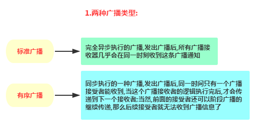
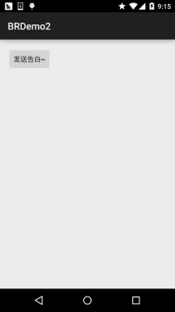

## 4.3.1 BroadcastReceiver牛刀小试

### 

## 本节引言

本节我们将来学习Android四大组件中的第三个：BroadcastReceiver(广播接收者)，嘿嘿，刚一直在想如何写开头语，于是乎翻了手头的两本Android基础书，发现两本书都没有对BroadcastReceiver的介绍， 不知道是巧合还是作者觉得这东西用得不多，没必要讲！不过，他们不讲，小猪却会讲，还要详细讲咧！ 好的，开始本节内容~ PS:对了，在Android官网上，点开API Guides -> App Components也没发现有BroadcastReceiver的踪迹， 恩呢，那就直接搜BroadcastReceiver，对应文档地址：[BroadcastReceiver](http://androiddoc.qiniudn.com/reference/android/content/BroadcastReceiver.html)

------

## 1.BroadcastReceiver是什么鬼？

> 答：Broadcast直译广播，我们举个形象的例子来帮我理解下BroadcastReceiver，记得以前读书的时候，每个班级都会有一个挂在墙上的大喇叭，用来广播一些通知，比如，开学要去搬书，广播： "每个班级找几个同学教务处拿书"，发出这个广播后，所有同学都会在同一时刻收到这条广播通知， 收到，但不是每个同学都会去搬书，一般去搬书的都是班里的"大力士"，这群"大力士"接到这条广播后就会动身去把书搬回可是！
> ——好吧，上面这个就是一个广播传递的一个很形象的例子：
> 大喇叭--> 发送广播 --> 所有学生都能收到广播 --> 大力士处理广播
> 回到我们的概念，其实BroadcastReceiver就是应用程序间的全局大喇叭，即通信的一个手段， 系统自己在很多时候都会发送广播，比如电量低或者充足，刚启动完，插入耳机，输入法改变等， 发生这些事件，系统都会发送广播，这个叫系统广播，每个APP都会收到，如果你想让你的应用在接收到这个广播的时候做一些操作，比如：系统开机后，偷偷后台跑服务~哈哈，这个时候你只需要为你的应用注册一个用于监视开机的BroadcastReceiver，当接收到开机广播就做写偷偷摸摸的勾当~ 当然我们也可以自己发广播，比如：接到服务端推送信息，用户在别处登录，然后应该强制用户下线回到登陆界面，并提示在别处登录~当然，这些等下都会写一个简单的示例帮大家了解广播给我们带来的好处~

------

## 2.两种广播类型：



------

## 3.接收系统广播

### 1）两种注册广播的方式

> 前面也讲了，系统在某些时候会发送相应的系统广播，下面我们就来让我们的APP接收系统广播， 接收之前，还需要为我们的APP注册广播接收器哦！而注册的方法又分为以下两种：动态与静态！


下面我们分别通过代码来演示两者的用法以及不同之处：

### 2）动态注册实例(监听网络状态变化)

**代码示例：**

**效果图：**


好的，一开始是没有联网的，即没有打开wifi，点击打开wifi过了一会儿就出现Toast提示了~ 实现起来也很简单！

**代码实现：**

自定义一个 BroadcastReceiver，在 onReceive() 方法中完成广播要处理的事务，比如这里的提示 Toast 信息： MyBRReceiver.java

```
public class MyBRReceiver extends BroadcastReceiver {
    @Override
    public void onReceive(Context context, Intent intent) {
        Toast.makeText(context, "网络状态发生改变~", Toast.LENGTH_SHORT).show();
    }
}
```

**MainActivity.java**中动态注册广播：

```
public class MainActivity extends AppCompatActivity {
    MyBRReceiver myReceiver;

    @Override
    protected void onCreate(Bundle savedInstanceState) {
        super.onCreate(savedInstanceState);
        setContentView(R.layout.activity_main);

        //核心部分代码：
        myReceiver = new MyBRReceiver();
        IntentFilter itFilter = new IntentFilter();

        itFilter.addAction("android.net.conn.CONNECTIVITY_CHANGE");
        registerReceiver(myReceiver, itFilter);
    }

    //别忘了将广播取消掉哦~
    @Override
    protected void onDestroy() {
        super.onDestroy();
        unregisterReceiver(myReceiver);
    }
}
```

动态注册简单吧~但是动态注册有个缺点就是需要程序启动才可以接收广播，假如我们需要程序没有启动，但是还是能接收广播的话，那么就需要注册静态广播了！

------

### 3）静态注册实例(接收开机广播)

**代码示例：**

**这里就没有示意图了~，直接看代码实现吧~**

**代码实现：**

**1.自定义一个BroadcastReceiver，重写onReceive完成事务处理**

```
public class BootCompleteReceiver extends BroadcastReceiver {
    private final String ACTION_BOOT = "android.intent.action.BOOT_COMPLETED";
    
    @Override
    public void onReceive(Context context, Intent intent) {
    if (ACTION_BOOT.equals(intent.getAction())) {
        Toast.makeText(context, "开机完毕~", Toast.LENGTH_LONG).show();
    }
}
```

**2.在AndroidManifest.xml中对该BroadcastReceiver进行注册，添加开机广播的intent-filter!**

**对了，别忘了加上android.permission.RECEIVE_BOOT_COMPLETED的权限哦！**

```
<receiver android:name=".BootCompleteReceiver">
    <intent-filter>
        <action android:name="android.intent.cation.BOOT_COMPLETED">
    </intent-filter>
</receiver>

<!-- 权限 -->
<uses-permission android:name="android.permission.RECEIVE_BOOT_COMPLETED"/>
```

好的，然后你重启下手机会发现过了一会儿，就会弹出开机完毕这个Toast的了~ 另外，Android 4.3以上的版本，是允许将程序安装到SD卡上的，假如你的程序是安装在SD上 的，就会收不到开机广播，具体原因以及解决方法下一节再详细讲解！

------

### 4)使用广播的注意事项：

嘿嘿，广播好用吧，又简单，但是使用广播要注意：

> 不要在广播里添加过多逻辑或者进行任何耗时操作, 因为在广播中是不允许开辟线程的, 当onReceiver( )方法运行较长时间(超过10秒)还没有结束的话, 那么程序会报错(ANR), 广播更多的时候扮演的是一个打开其他组件的角色, 比如启动Service, Notification提示, Activity等！

------

## 4.发送广播

> 嗯，上面我们都是接收系统的广播，系统发我们收，我们不能老这么被动，总得主动点是吧！ 另外，明天七夕，程序猿们好好把握，争取脱单，哈哈！好的，说回广播，我们自己主动发广播！ 下面我们就来看下怎么实现！

**如何发送：** 发送广播前，要先定义一个接收器，先确定目标，然后再告白！~(●'◡'●)~


**代码示例：(标准广播)**

**MyBroadcastReceiver.java**

```
public class MyBroadcastReceiver extends BroadcastReceiver {
    private final String ACTION_BOOT = "com.example.broadcasttest.MY_BROADCAST";
    @Override
    public void onReceive(Context context, Intent intent) {
        if(ACTION_BOOT.equals(intent.getAction())) {
          Toast.makeText(context, "收到告白啦~",Toast.LENGTH_SHORT).show();
        }
    }
}
```

**然后AndroidManifest.xml中注册下，写上Intent-filter：**

```
<receiver android:name=".MyBroadcastReceiver">
    <intent-filter>
        <action android:name="com.example.broadcasttest.MY_BROADCAST"/>
    </intent-filter>
</receiver>
```

好的，接下来我们把上面这个程序项目运行下，然后关掉，接下来我们新建一个项目， 在这个项目里完成广播发送~新建Demo2，布局就一个简单按钮，然后在MainActivity中完成广播发送：

**MainActivity.java:**

```
public class MainActivity extends AppCompatActivity {
    @Override
    protected void onCreate(Bundle savedInstanceState) {
        super.onCreate(savedInstanceState);
        setContentView(R.layout.activity_main);
        Button btn_send = (Button) findViewById(R.id.btn_send);
        btn_send.setOnClickListener(new View.OnClickListener() {
            @Override
            public void onClick(View v) {
                sendBroadcast(new Intent("com.example.broadcasttest.MY_BROADCAST"));
            }
        });
    }
}
```

**嘿嘿，看下运行截图：**



------

## 本节小结：

> 好的，BroadcastReceiver的简单使用就是那么简单，不过我们这里用到的都是全局广播，也就是其他应用也能收到我们的广播，这样可能会引起一些安全性问题，不过没事，下一节我们来教大家如何用本地广播，以及Android 4.3后如何应用安装到SD卡上，如何监听开机启动~好的，本节就到这里，谢谢~