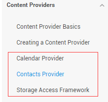

## 4.4.2 ContentProvider再探——Document Provider

### 

## 本节引言：

> 学完上一节，相信你已经知道如何去使用系统提供的ContentProvider或者自定义ContentProvider了， 已经基本满足日常开发的需求了，有趣的是，我在官方文档上看到了另外这几个Provider：
>
> 
>
> **Calendar Provider**：日历提供者，就是针对针对日历相关事件的一个资源库，通过他提供的API，我们 可以对日历，时间，会议，提醒等内容做一些增删改查！
> **Contacts Provider**：联系人提供者，这个就不用说了，这个用得最多~后面有时间再回头翻译下这篇文章吧！
> **Storage Access Framework(SAF)**：存储访问框架，4.4以后引入的一个新玩意，为用户浏览手机中的 存储内容提供了便利，可供访问的内容不仅包括：文档，图片，视频，音频，下载，而且包含所有由 由特定ContentProvider（须具有约定的API）提供的内容。不管这些内容来自于哪里，不管是哪个应 用调用浏览系统文件内容的命令，系统都会用一个统一的界面让你去浏览。
> 其实就是一个内置的应用程序，叫做DocumentsUI，因为它的IntentFilter不带有LAUNCHER，所以我们并没有在桌面上找到这个东东！嘿嘿，试下下面的代码，这里我们选了两个手机来对比： 分别是4.2的Lenovo S898T 和 5.0.1的Nexus 5做对比，执行下述代码：

```
 Intent intent = new Intent(Intent.ACTION_OPEN_DOCUMENT);
        intent.addCategory(Intent.CATEGORY_OPENABLE);
        intent.setType("image/*");
        startActivity(intent);
```

下面是运行结果：


 


右面这个就是4.4给我们带来的新玩意了，一般我们获取文件Url的时候就可以用到它~ 接下来简单的走下文档吧~

------

## 2.简单走下文档：

### 1）SAF框架的组成：

> - **Document provider**：一个特殊的ContentProvider，让一个存储服务(比如Google Drive)可以 对外展示自己所管理的文件。它是**DocumentsProvider**的子类，另外，document-provider的存储格式 和传统的文件存储格式一致，至于你的内容如何存储，则完全决定于你自己，Android系统已经内置了几个 这样的Document provider，比如关于下载，图片以及视频的Document provider！
> - **Client app**：一个普通的客户端软件，通过触发**ACTION_OPEN_DOCUMENT** 和/或 **ACTION_CREATE_DOCUMENT**就可以接收到来自于Document provider返回的内容，比如选择一个图片， 然后返回一个Uri。
> - **Picker**：类似于文件管理器的界面，而且是系统级的界面，提供额访问客户端过滤条件的 Document provider内容的通道，就是起说的那个DocumentsUI程序！

**一些特性：**

> - 用户可以浏览所有document provider提供的内容，而不仅仅是单一的应用程序
> - 提供了长期、持续的访问document provider中文件的能力以及数据的持久化， 用户可以实现添加、删除、编辑、保存document provider所维护的内容
> - 支持多用户以及临时性的内容服务，比如USB storage providers只有当驱动安装成功才会出现

------

### 2）概述：

SAF的核心是实现了DocumentsProvider的子类，还是一个ContentProvider。在一个document provider 中是以传统的文件目录树组织起来的：


### 3）流程图：

如上面所述，document provider data是基于传统的文件层次结构的，不过那只是对外的表现形式， 如何存储你的数据，取决于你自己，只要你对海外的接口能够通过DocumentsProvider的api访问就可以。 下面的流程图展示了一个photo应用使用SAF可能的结构：


分析：

> 从上图，我们可以看出Picker是链接调用者和内容提供者的一个桥梁！他提供并告诉调用者，可以选择 哪些内容提供者，比如这里的DriveDocProvider，UsbDocProvider，CloundDocProvider。
> 当客户端触发了**ACTION_OPEN_DOCUMENT**或**ACTION_CREATE_DOCUMENT**的Intent，就会发生上述交互。 当然我们还可以在Intent中增加过滤条件，比如限制MIME type的类型为"image"!


就是上面这些东西，如果你还安装了其他看图的软件的话，也会在这里看到！ 简单点说就是：客户端发送了上面两种Action的Intent后，会打开Picker UI，在这里会显示相关可用的 Document Provider，供用户选择，用户选择后可以获得文件的相关信息！

------

### 4）客户端调用，并获取返回的Uri

**实现代码如下：**

```
public class MainActivity extends AppCompatActivity implements View.OnClickListener {
    private static final int READ_REQUEST_CODE = 42;

    @Override
    protected void onCreate(Bundle savedInstanceState) {
        super.onCreate(savedInstanceState);
        setContentView(R.layout.activity_main);
        Button btn_show = (Button) findViewById(R.id.btn_show);
        btn_show.setOnClickListener(this);
    }

    @Override
    public void onClick(View v) {
        Intent intent = new Intent(Intent.ACTION_OPEN_DOCUMENT);
        intent.addCategory(Intent.CATEGORY_OPENABLE);
        intent.setType("image/*");
        startActivityForResult(intent, READ_REQUEST_CODE);
    }

    @Override
    protected void onActivityResult(int requestCode, int resultCode, Intent data) {
        if (requestCode == READ_REQUEST_CODE && resultCode == Activity.RESULT_OK) {
            Uri uri;
            if (data != null) {
                uri = data.getData();
                Log.e("HeHe", "Uri: " + uri.toString());
            }
        }
    }
}
```

**运行结果：** 比如我们选中那只狗，然后Picker UI自己会关掉，然后Logcat上可以看到这样一个uri:


------

### 5）根据uri获取文件参数

**核心代码如下：**

```
public void dumpImageMetaData(Uri uri) {
    Cursor cursor = getContentResolver()
            .query(uri, null, null, null, null, null);
    try {
        if (cursor != null && cursor.moveToFirst()) {
            String displayName = cursor.getString(
                    cursor.getColumnIndex(OpenableColumns.DISPLAY_NAME));
            Log.e("HeHe", "Display Name: " + displayName);
            int sizeIndex = cursor.getColumnIndex(OpenableColumns.SIZE);
            String size = null;
            if (!cursor.isNull(sizeIndex)) {
                size = cursor.getString(sizeIndex);
            }else {
                size = "Unknown";
            }
            Log.e("HeHe", "Size: " + size);
        }
    }finally {
        cursor.close();
    }
}
```

**运行结果：** 还是那只狗，调用方法后会输入文件名以及文件大小，以byte为单位


------

### 6）根据Uri获得Bitmap

**核心代码如下：**

```
private Bitmap getBitmapFromUri(Uri uri) throws IOException {
        ParcelFileDescriptor parcelFileDescriptor =
        getContentResolver().openFileDescriptor(uri, "r");
        FileDescriptor fileDescriptor = parcelFileDescriptor.getFileDescriptor();
        Bitmap image = BitmapFactory.decodeFileDescriptor(fileDescriptor);
        parcelFileDescriptor.close();
        return image;
}
```

**运行结果**：


### 7）根据Uri获取输入流

**核心代码如下：**

```
private String readTextFromUri(Uri uri) throws IOException {
    InputStream inputStream = getContentResolver().openInputStream(uri);
    BufferedReader reader = new BufferedReader(new InputStreamReader(
            inputStream));
    StringBuilder stringBuilder = new StringBuilder();
    String line;
    while ((line = reader.readLine()) != null) {
        stringBuilder.append(line);
    }
    fileInputStream.close();
    parcelFileDescriptor.close();
    return stringBuilder.toString();
}
```

上述的内容只告诉你通过一个Uri你可以知道什么，而Uri的获取则是通过SAF得到的！

------

### 8） 创建新文件以及删除文件：

**创建文件：**

```
private void createFile(String mimeType, String fileName) {
    Intent intent = new Intent(Intent.ACTION_CREATE_DOCUMENT);
    intent.addCategory(Intent.CATEGORY_OPENABLE);
    intent.setType(mimeType);
    intent.putExtra(Intent.EXTRA_TITLE, fileName);
    startActivityForResult(intent, WRITE_REQUEST_CODE);
}
```

可在onActivityResult()中获取被创建文件的uri

**删除文件：**

前提是Document.COLUMN_FLAGS包含**SUPPORTS_DELETE**

```
DocumentsContract.deleteDocument(getContentResolver(), uri);
```

------

### 9）编写一个自定义的Document Provider

如果你希望自己应用的数据也能在documentsui中打开，你就需要写一个自己的document provider。 下面介绍自定义DocumentsProvider的步骤：

> - API版本为19或者更高
> - 在manifest.xml中注册该Provider
> - Provider的name为类名加包名，比如： **com.example.android.storageprovider.MyCloudProvider**
> - Authority为包名+provider的类型名，如： **com.example.android.storageprovider.documents**
> - **android:exported属性的值为ture**

下面是Provider的例子写法：

```
<manifest... >
    ...
    <uses-sdk
        android:minSdkVersion="19"
        android:targetSdkVersion="19" />
        ....
        <provider
            android:name="com.example.android.storageprovider.MyCloudProvider"
            android:authorities="com.example.android.storageprovider.documents"
            android:grantUriPermissions="true"
            android:exported="true"
            android:permission="android.permission.MANAGE_DOCUMENTS"
            android:enabled="@bool/atLeastKitKat">
            <intent-filter>
                <action android:name="android.content.action.DOCUMENTS_PROVIDER" />
            </intent-filter>
        </provider>
    </application>

</manifest>
```

### 10 )DocumentsProvider的子类

至少实现如下几个方法：

> - queryRoots()
> - queryChildDocuments()
> - queryDocument()
> - openDocument()

还有些其他的方法，但并不是必须的。下面演示一个实现访问文件（file）系统的 DocumentsProvider的大致写法。

**Implement queryRoots**

```
@Override
public Cursor queryRoots(String[] projection) throws FileNotFoundException {

    // Create a cursor with either the requested fields, or the default
    // projection if "projection" is null.
    final MatrixCursor result =
            new MatrixCursor(resolveRootProjection(projection));

    // If user is not logged in, return an empty root cursor.  This removes our
    // provider from the list entirely.
    if (!isUserLoggedIn()) {
        return result;
    }

    // It's possible to have multiple roots (e.g. for multiple accounts in the
    // same app) -- just add multiple cursor rows.
    // Construct one row for a root called "MyCloud".
    final MatrixCursor.RowBuilder row = result.newRow();
    row.add(Root.COLUMN_ROOT_ID, ROOT);
    row.add(Root.COLUMN_SUMMARY, getContext().getString(R.string.root_summary));

    // FLAG_SUPPORTS_CREATE means at least one directory under the root supports
    // creating documents. FLAG_SUPPORTS_RECENTS means your application's most
    // recently used documents will show up in the "Recents" category.
    // FLAG_SUPPORTS_SEARCH allows users to search all documents the application
    // shares.
    row.add(Root.COLUMN_FLAGS, Root.FLAG_SUPPORTS_CREATE |
            Root.FLAG_SUPPORTS_RECENTS |
            Root.FLAG_SUPPORTS_SEARCH);

    // COLUMN_TITLE is the root title (e.g. Gallery, Drive).
    row.add(Root.COLUMN_TITLE, getContext().getString(R.string.title));

    // This document id cannot change once it's shared.
    row.add(Root.COLUMN_DOCUMENT_ID, getDocIdForFile(mBaseDir));

    // The child MIME types are used to filter the roots and only present to the
    //  user roots that contain the desired type somewhere in their file hierarchy.
    row.add(Root.COLUMN_MIME_TYPES, getChildMimeTypes(mBaseDir));
    row.add(Root.COLUMN_AVAILABLE_BYTES, mBaseDir.getFreeSpace());
    row.add(Root.COLUMN_ICON, R.drawable.ic_launcher);

    return result;
}
```

**Implement queryChildDocuments**

```
public Cursor queryChildDocuments(String parentDocumentId, String[] projection,
                              String sortOrder) throws FileNotFoundException {

    final MatrixCursor result = new
            MatrixCursor(resolveDocumentProjection(projection));
    final File parent = getFileForDocId(parentDocumentId);
    for (File file : parent.listFiles()) {
        // Adds the file's display name, MIME type, size, and so on.
        includeFile(result, null, file);
    }
    return result;
}
```

**Implement queryDocument**

```
@Override
public Cursor queryDocument(String documentId, String[] projection) throws
        FileNotFoundException {

    // Create a cursor with the requested projection, or the default projection.
    final MatrixCursor result = new
            MatrixCursor(resolveDocumentProjection(projection));
    includeFile(result, documentId, null);
    return result;
}
```

好吧，文档中的内容大概就是这些了： 一开始是想自己翻译的，后来在泡在网上的日子上找到了这一篇文档的中文翻译，就偷下懒了~

中文翻译链接：[android存储访问框架Storage Access Framework](http://www.jcodecraeer.com/a/anzhuokaifa/androidkaifa/2014/1026/1845.html727.jpg)

------

## 3.Android 4.4 获取资源路径问题：

其实这个SAF我们用得较多的地方无非是获取图片的Uri而已，而从上面的例子我们也发现了： 我们这样获取的链接是这样的：

```
content://com.android.providers.media.documents/document/image%3A69983
```

这样的链接，我们直接通过上面的方法获得uri即可！

当然，这个是4.4 或者以上版本的~！

如果是以前的版本：uri可能是这样的：

```
content://media/external/images/media/image%3A69983
```

这里贴下在别的地方看到的一个全面的方案，原文链接：[Android4.4中获取资源路径问题](http://blog.csdn.net/huangyanan1989/article/details/17263203)

```
public static String getPath(final Context context, final Uri uri) {
    final boolean isKitKat = Build.VERSION.SDK_INT >= Build.VERSION_CODES.KITKAT;
    // DocumentProvider  
    if (isKitKat && DocumentsContract.isDocumentUri(context, uri)) {
        // ExternalStorageProvider  
        if (isExternalStorageDocument(uri)) {
            final String docId = DocumentsContract.getDocumentId(uri);
            final String[] split = docId.split(":");
            final String type = split[0];

            if ("primary".equalsIgnoreCase(type)) {
                return Environment.getExternalStorageDirectory() + "/" + split[1];
            }

            // TODO handle non-primary volumes  
        }
        // DownloadsProvider  
        else if (isDownloadsDocument(uri)) {

            final String id = DocumentsContract.getDocumentId(uri);
            final Uri contentUri = ContentUris.withAppendedId(
                    Uri.parse("content://downloads/public_downloads"), Long.valueOf(id));

            return getDataColumn(context, contentUri, null, null);
        }
        // MediaProvider  
        else if (isMediaDocument(uri)) {
            final String docId = DocumentsContract.getDocumentId(uri);
            final String[] split = docId.split(":");
            final String type = split[0];
            Uri contentUri = null;
            if ("image".equals(type)) {
                contentUri = MediaStore.Images.Media.EXTERNAL_CONTENT_URI;
            } else if ("video".equals(type)) {
                contentUri = MediaStore.Video.Media.EXTERNAL_CONTENT_URI;
            } else if ("audio".equals(type)) {
                contentUri = MediaStore.Audio.Media.EXTERNAL_CONTENT_URI;
            }
            final String selection = "_id=?";
            final String[] selectionArgs = new String[] {
                    split[1]
            };
            return getDataColumn(context, contentUri, selection, selectionArgs);
        }
    }
    // MediaStore (and general)  
    else if ("content".equalsIgnoreCase(uri.getScheme())) {
        return getDataColumn(context, uri, null, null);
    }
    // File  
    else if ("file".equalsIgnoreCase(uri.getScheme())) {
        return uri.getPath();
    }
    return null;
}

/**
 * Get the value of the data column for this Uri. This is useful for 
 * MediaStore Uris, and other file-based ContentProviders. 
 *
 * @param context The context. 
 * @param uri The Uri to query. 
 * @param selection (Optional) Filter used in the query. 
 * @param selectionArgs (Optional) Selection arguments used in the query. 
 * @return The value of the _data column, which is typically a file path. 
 */
public static String getDataColumn(Context context, Uri uri, String selection,
                                   String[] selectionArgs) {

    Cursor cursor = null;
    final String column = "_data";
    final String[] projection = {
            column
    };

    try {
        cursor = context.getContentResolver().query(uri, projection, selection, selectionArgs,
                null);
        if (cursor != null && cursor.moveToFirst()) {
            final int column_index = cursor.getColumnIndexOrThrow(column);
            return cursor.getString(column_index);
        }
    } finally {
        if (cursor != null)
            cursor.close();
    }
    return null;
}


/**
 * @param uri The Uri to check. 
 * @return Whether the Uri authority is ExternalStorageProvider. 
 */
public static boolean isExternalStorageDocument(Uri uri) {
    return "com.android.externalstorage.documents".equals(uri.getAuthority());
}

/**
 * @param uri The Uri to check. 
 * @return Whether the Uri authority is DownloadsProvider. 
 */
public static boolean isDownloadsDocument(Uri uri) {
    return "com.android.providers.downloads.documents".equals(uri.getAuthority());
}

/**
 * @param uri The Uri to check. 
 * @return Whether the Uri authority is MediaProvider. 
 */
public static boolean isMediaDocument(Uri uri) {
    return "com.android.providers.media.documents".equals(uri.getAuthority());
}
```

## 本节小结：

> 好的，关于本节android存储访问框架SAF就到这里吧，没什么例子，后面用到再深入研究吧， 知道下就好，4.4后获取文件路径就简单多了~