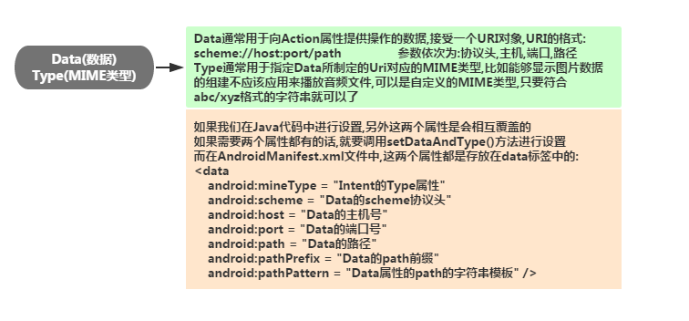
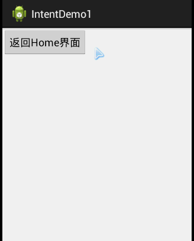
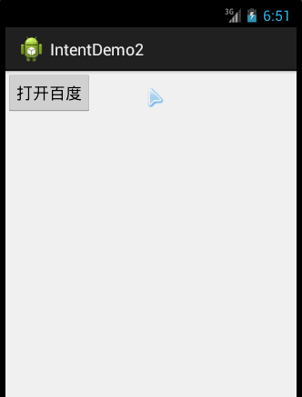
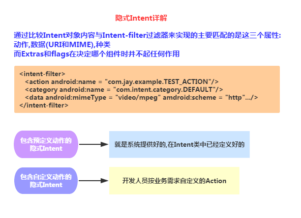
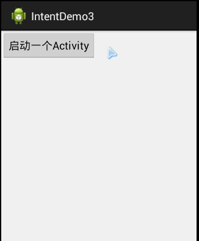
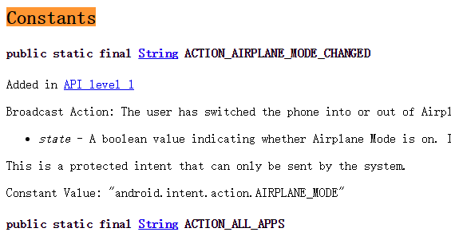

## 4.5.1 Intent的基本使用

### 

## 本节引言：

在上一节结束后意味着Android的四大组件我们都已经学习完毕了~，而本节我们要学习的是四大组件间的枢纽——Intent(意图)，Android通信的桥梁，比如我们可以通过:

> - **startActivity**(Intent)/**startActivityForResult**(Intent)：来启动一个Activity
> - **startService**(Intent)/**bindService**(Intent)：来启动一个Service
> - **sendBroadcast**：发送广播到指定BroadcastReceiver
> - 另外别忘了我们在注册四大组件时，写得很多的**Intent-Filter**哦~

好吧，话不多说，开始本节内容！另外前面我们已经用过Intent了，就不在讲述概念性的东西了~ 老规矩，官方API：[Intent](http://androiddoc.qiniudn.com/guide/components/intents-filters.html)

------

## 1.显式Intent与隐式Intent的区别

> - **显式Intent**：通过组件名指定启动的目标组件,比如startActivity(new Intent(A.this,B.class)); 每次启动的组件只有一个~
> - **隐式Intent**:不指定组件名,而指定Intent的Action,Data,或Category,当我们启动组件时, 会去匹配AndroidManifest.xml相关组件的Intent-filter,逐一匹配出满足属性的组件,当不止一个满足时, 会弹出一个让我们选择启动哪个的对话框~

------

## 2.Intent的七个属性：

------

### 1）ComponentName(组件名称)


------

### 2）Action(动作)


------

### 3）Category(类别)


------

### 4）Data(数据)，Type(MIME类型)



------

### 5）Extras(额外)


------

### 6）Flags(标记)


------

## 3.显式Intent使用示例：

这个用得很多，直接就上例子了：

**例子1：**点击按钮返回Home界面： **运行效果图：**



**核心代码：**

```
Intent it = new Intent();
it.setAction(Intent.ACTION_MAIN);
it.addCategory(Intent.CATEGORY_HOME);
startActivity(it);
```

**例子2：**点击按钮打开百度页面： **运行效果图：**



**核心代码：**

```
Intent it = new Intent();
it.setAction(Intent.ACTION_VIEW);
it.setData(Uri.parse("http://www.baidu.com"));
startActivity(it);
```

------

## 4.隐式Intent详解



------

### 1）预定义动作的隐式Intent示例：

**代码示例:**点击按钮后,所有Action为VIEW的Activity被筛选出来,由用户进一步选择:

**核心代码：**

建立第二个Activity的布局,与对应的Activity,在第一个Activity的按钮点击事件中添加一下代码:

```
Intent it = new Intent();
it.setAction(Intent.ACTION_VIEW);
startActivity(it);
```

最后在第二个Activity的Intent中添加以下代码:

```
<activity android:name=".SecondActivity"
            android:label="第二个Activity">
    <intent-filter>
        <action android:name="android.intent.action.VIEW"/>
        <category android:name="android.intent.category.DEFAULT"/>
    </intent-filter>           
 </activity>
 
```

**运行效果图：**



------

### 2）自定义动作的隐式Intent示例：

**代码示例：**使用自定义的Action与category来激活另一个Activity

**核心代码：** 建立第二个Activity的布局,与对应的Activity,在第一个Activity的按钮点击事件中添加一下代码:

```
Intent it = new Intent();
it.setAction("my_action");
it.addCategory("my_category");
startActivity(it);    
```

最后在第二个Activity的Intent中添加以下代码:

```
<activity android:name=".SecondActivity"
        android:label="第二个Activity">
    <intent-filter>
        <action android:name="my_action"/>
        <category android:name="my_category"/>
        <category android:name="android.intent.category.DEFAULT"/>
    </intent-filter>           
</activity>
```

注意虽然我们自定义了一个category,但是还是要把这个默认的加上,不然会报错的：

```
<category android:name="android.intent.category.DEFAULT"/>
```

------

## 5.常用系统Intent合集

大家贴下常用的系统Intent的合集吧，上面没有的欢迎提出~

```
//===============================================================
//1.拨打电话
// 给移动客服10086拨打电话
Uri uri = Uri.parse("tel:10086");
Intent intent = new Intent(Intent.ACTION_DIAL, uri);
startActivity(intent);

//===============================================================

//2.发送短信
// 给10086发送内容为“Hello”的短信
Uri uri = Uri.parse("smsto:10086");
Intent intent = new Intent(Intent.ACTION_SENDTO, uri);
intent.putExtra("sms_body", "Hello");
startActivity(intent);

//3.发送彩信（相当于发送带附件的短信）
Intent intent = new Intent(Intent.ACTION_SEND);
intent.putExtra("sms_body", "Hello");
Uri uri = Uri.parse("content://media/external/images/media/23");
intent.putExtra(Intent.EXTRA_STREAM, uri);
intent.setType("image/png");
startActivity(intent);

//===============================================================

//4.打开浏览器:
// 打开百度主页
Uri uri = Uri.parse("http://www.baidu.com");
Intent intent  = new Intent(Intent.ACTION_VIEW, uri);
startActivity(intent);

//===============================================================

//5.发送电子邮件:(阉割了Google服务的没戏!!!!)
// 给someone@domain.com发邮件
Uri uri = Uri.parse("mailto:someone@domain.com");
Intent intent = new Intent(Intent.ACTION_SENDTO, uri);
startActivity(intent);
// 给someone@domain.com发邮件发送内容为“Hello”的邮件
Intent intent = new Intent(Intent.ACTION_SEND);
intent.putExtra(Intent.EXTRA_EMAIL, "someone@domain.com");
intent.putExtra(Intent.EXTRA_SUBJECT, "Subject");
intent.putExtra(Intent.EXTRA_TEXT, "Hello");
intent.setType("text/plain");
startActivity(intent);
// 给多人发邮件
Intent intent=new Intent(Intent.ACTION_SEND);
String[] tos = {"1@abc.com", "2@abc.com"}; // 收件人
String[] ccs = {"3@abc.com", "4@abc.com"}; // 抄送
String[] bccs = {"5@abc.com", "6@abc.com"}; // 密送
intent.putExtra(Intent.EXTRA_EMAIL, tos);
intent.putExtra(Intent.EXTRA_CC, ccs);
intent.putExtra(Intent.EXTRA_BCC, bccs);
intent.putExtra(Intent.EXTRA_SUBJECT, "Subject");
intent.putExtra(Intent.EXTRA_TEXT, "Hello");
intent.setType("message/rfc822");
startActivity(intent);

//===============================================================

//6.显示地图:
// 打开Google地图中国北京位置（北纬39.9，东经116.3）
Uri uri = Uri.parse("geo:39.9,116.3");
Intent intent = new Intent(Intent.ACTION_VIEW, uri);
startActivity(intent);

//===============================================================

//7.路径规划
// 路径规划：从北京某地（北纬39.9，东经116.3）到上海某地（北纬31.2，东经121.4）
Uri uri = Uri.parse("http://maps.google.com/maps?f=d&saddr=39.9 116.3&daddr=31.2 121.4");
Intent intent = new Intent(Intent.ACTION_VIEW, uri);
startActivity(intent);

//===============================================================

//8.多媒体播放:
Intent intent = new Intent(Intent.ACTION_VIEW);
Uri uri = Uri.parse("file:///sdcard/foo.mp3");
intent.setDataAndType(uri, "audio/mp3");
startActivity(intent);

//获取SD卡下所有音频文件,然后播放第一首=-= 
Uri uri = Uri.withAppendedPath(MediaStore.Audio.Media.INTERNAL_CONTENT_URI, "1");
Intent intent = new Intent(Intent.ACTION_VIEW, uri);
startActivity(intent);

//===============================================================

//9.打开摄像头拍照:
// 打开拍照程序
Intent intent = new Intent(MediaStore.ACTION_IMAGE_CAPTURE); 
startActivityForResult(intent, 0);
// 取出照片数据
Bundle extras = intent.getExtras(); 
Bitmap bitmap = (Bitmap) extras.get("data");

//另一种:
//调用系统相机应用程序，并存储拍下来的照片
Intent intent = new Intent(MediaStore.ACTION_IMAGE_CAPTURE); 
time = Calendar.getInstance().getTimeInMillis();
intent.putExtra(MediaStore.EXTRA_OUTPUT, Uri.fromFile(new File(Environment
.getExternalStorageDirectory().getAbsolutePath()+"/tucue", time + ".jpg")));
startActivityForResult(intent, ACTIVITY_GET_CAMERA_IMAGE);

//===============================================================

//10.获取并剪切图片
// 获取并剪切图片
Intent intent = new Intent(Intent.ACTION_GET_CONTENT);
intent.setType("image/*");
intent.putExtra("crop", "true"); // 开启剪切
intent.putExtra("aspectX", 1); // 剪切的宽高比为1：2
intent.putExtra("aspectY", 2);
intent.putExtra("outputX", 20); // 保存图片的宽和高
intent.putExtra("outputY", 40); 
intent.putExtra("output", Uri.fromFile(new File("/mnt/sdcard/temp"))); // 保存路径
intent.putExtra("outputFormat", "JPEG");// 返回格式
startActivityForResult(intent, 0);
// 剪切特定图片
Intent intent = new Intent("com.android.camera.action.CROP"); 
intent.setClassName("com.android.camera", "com.android.camera.CropImage"); 
intent.setData(Uri.fromFile(new File("/mnt/sdcard/temp"))); 
intent.putExtra("outputX", 1); // 剪切的宽高比为1：2
intent.putExtra("outputY", 2);
intent.putExtra("aspectX", 20); // 保存图片的宽和高
intent.putExtra("aspectY", 40);
intent.putExtra("scale", true);
intent.putExtra("noFaceDetection", true); 
intent.putExtra("output", Uri.parse("file:///mnt/sdcard/temp")); 
startActivityForResult(intent, 0);

//===============================================================

//11.打开Google Market 
// 打开Google Market直接进入该程序的详细页面
Uri uri = Uri.parse("market://details?id=" + "com.demo.app");
Intent intent = new Intent(Intent.ACTION_VIEW, uri);
startActivity(intent);

//===============================================================

//12.进入手机设置界面:
// 进入无线网络设置界面（其它可以举一反三）  
Intent intent = new Intent(android.provider.Settings.ACTION_WIRELESS_SETTINGS);  
startActivityForResult(intent, 0);

//===============================================================

//13.安装apk:
Uri installUri = Uri.fromParts("package", "xxx", null);   
returnIt = new Intent(Intent.ACTION_PACKAGE_ADDED, installUri);

//===============================================================

//14.卸载apk:
Uri uri = Uri.fromParts("package", strPackageName, null);      
Intent it = new Intent(Intent.ACTION_DELETE, uri);      
startActivity(it); 

//===============================================================

//15.发送附件:
Intent it = new Intent(Intent.ACTION_SEND);      
it.putExtra(Intent.EXTRA_SUBJECT, "The email subject text");      
it.putExtra(Intent.EXTRA_STREAM, "file:///sdcard/eoe.mp3");      
sendIntent.setType("audio/mp3");      
startActivity(Intent.createChooser(it, "Choose Email Client"));

//===============================================================

//16.进入联系人页面:
Intent intent = new Intent();
intent.setAction(Intent.ACTION_VIEW);
intent.setData(People.CONTENT_URI);
startActivity(intent);

//===============================================================


//17.查看指定联系人:
Uri personUri = ContentUris.withAppendedId(People.CONTENT_URI, info.id);//info.id联系人ID
Intent intent = new Intent();
intent.setAction(Intent.ACTION_VIEW);
intent.setData(personUri);
startActivity(intent);

//===============================================================

//18.调用系统编辑添加联系人（高版本SDK有效）：
Intent it = newIntent(Intent.ACTION_INSERT_OR_EDIT);    
it.setType("vnd.android.cursor.item/contact");    
//it.setType(Contacts.CONTENT_ITEM_TYPE);    
it.putExtra("name","myName");    
it.putExtra(android.provider.Contacts.Intents.Insert.COMPANY, "organization");    
it.putExtra(android.provider.Contacts.Intents.Insert.EMAIL,"email");    
it.putExtra(android.provider.Contacts.Intents.Insert.PHONE,"homePhone");    
it.putExtra(android.provider.Contacts.Intents.Insert.SECONDARY_PHONE,"mobilePhone");    
it.putExtra( android.provider.Contacts.Intents.Insert.TERTIARY_PHONE,"workPhone");    
it.putExtra(android.provider.Contacts.Intents.Insert.JOB_TITLE,"title");    
startActivity(it);

//===============================================================

//19.调用系统编辑添加联系人（全有效）：
Intent intent = newIntent(Intent.ACTION_INSERT_OR_EDIT);    
intent.setType(People.CONTENT_ITEM_TYPE);    
intent.putExtra(Contacts.Intents.Insert.NAME, "My Name");    
intent.putExtra(Contacts.Intents.Insert.PHONE, "+1234567890");    
intent.putExtra(Contacts.Intents.Insert.PHONE_TYPE,Contacts.PhonesColumns.TYPE_MOBILE);    
intent.putExtra(Contacts.Intents.Insert.EMAIL, "com@com.com");    
intent.putExtra(Contacts.Intents.Insert.EMAIL_TYPE, Contacts.ContactMethodsColumns.TYPE_WORK);    
startActivity(intent);

//===============================================================

//20.打开另一程序 
Intent i = new Intent();     
ComponentName cn = new ComponentName("com.example.jay.test",     
"com.example.jay.test.MainActivity");     
i.setComponent(cn);     
i.setAction("android.intent.action.MAIN");     
startActivityForResult(i, RESULT_OK);

//===============================================================

//21.打开录音机
Intent mi = new Intent(Media.RECORD_SOUND_ACTION);     
startActivity(mi);

//===============================================================

//22.从google搜索内容 
Intent intent = new Intent();     
intent.setAction(Intent.ACTION_WEB_SEARCH);     
intent.putExtra(SearchManager.QUERY,"searchString")     
startActivity(intent);

//===============================================================
```

------

## 6.Action在哪里查？

本来想直接贴以前收集到的Intent Action的，后来想想还是算了，授之以鱼，还不如授之以渔， 如果你下载了Android的文档的话，可以在下述路径：

sdk-->docs-->reference-->android--->content--->Intent.html

找到这个玩意，然后从这个Constants开始就是了：



遇到陌生的自己来这里查即可~

------

## 本节小结：

> 好的，关于Intent的基本使用就到这里，下一节我们会来继续学习在日常开发中使用Intent可能会遇到 的一些问题或者说需求吧，敬请期待，谢谢~