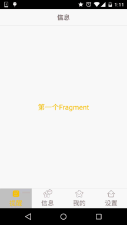

## 5.2.2 Fragment实例精讲——底部导航栏的实现(方法2)

### 

## 本节引言：

> 上一节中我们使用LinearLayout + TextView实现了底部导航栏的效果，每次点击我们都要重置所有TextView的状态，然后选中点击的TextView，有点麻烦是吧，接下来我们用另一种方法： RadioGroup + RadioButton来实现我们上一节的效果！

------

## 1.一些碎碎念

本节用到的是实现单选效果的RadioButton，如果你不熟悉，或者没用过，可先移步到：[RadioButton](http://blog.csdn.net/coder_pig/article/details/47035625) 简单点说就是我们就是一个RadioGroup包着四个RadioButton，和前面一样用比例来划分:1:1:1:1；
另外我们只需重写RadioGroup的onCheckedChange，判断checkid即可知道点击的是哪个RadioButton！ 好的，下面开始堆码！

------

## 2.实现流程

**PS:**这里的素材什么的，直接使用的是上一节中的素材！另外drawable类的资源都是将selected 状态修改成checked！

------

### Step 1：写底部选项的一些资源文件

图片Drawable资源（四个tab选中状态对应的图案）：**tab_menu_channel.xml**

```
<?xml version="1.0" encoding="utf-8"?>
<selector xmlns:android="http://schemas.android.com/apk/res/android">
    <item android:drawable="@mipmap/tab_channel_pressed" android:state_checked="true" />
    <item android:drawable="@mipmap/tab_channel_normal" />
</selector>
```

其他三个照葫芦画瓢！

文字资源（四个tab选中状态的文本颜色）：**tab_menu_text.xml**

```
<?xml version="1.0" encoding="utf-8"?>
<selector xmlns:android="http://schemas.android.com/apk/res/android">
    <item android:color="@color/text_yellow" android:state_checked="true" />
    <item android:color="@color/text_gray" />
</selector>
```

背景资源（tab选中状态阴影）：**tab_menu_bg.xml**

```
<?xml version="1.0" encoding="utf-8"?>
<selector xmlns:android="http://schemas.android.com/apk/res/android">
    <item android:state_selected="true">
        <shape>
            <solid android:color="#FFC4C4C4" />
        </shape>
    </item>
    <item>
        <shape>
            <solid android:color="@color/transparent" />
        </shape>
    </item>
</selector>
```

### Step 2：编写我们的Activity布局

> 在前面用TextView实现底部导航栏我们就发现了一个问题，每个TextView的属性都几乎是差不多 的，而在建议那里我们也说让大家把相同的属性抽取出来写到Style中，可能部分朋友懒或者不知道 如何抽取出来，以及用，这里就给大家示范下：

首先我们取出其中一个RadioGroup的标签：

```
<RadioButton
            android:id="@+id/rb_channel"
            android:layout_width="0dp"
            android:layout_height="match_parent"
            android:layout_weight="1"
            android:background="@drawable/tab_menu_bg"           // 会根据选中状态切换样式
            android:button="@null"
            android:drawableTop="@drawable/tab_menu_channel"     // 不同的状态也有不同的图案
            android:gravity="center"
            android:paddingTop="3dp"
            android:text="@string/tab_menu_alert"
            android:textColor="@drawable/tab_menu_text"          // 不同的状态有不同的颜色
            android:textSize="18sp" />
```

我们可以把每个RadioButton都相同的属性抽取出来，写到**style.xml**文件中：

```
<style name="tab_menu_item">
    <item name="android:layout_width">0dp</item>
    <item name="android:layout_weight">1</item>
    <item name="android:layout_height">match_parent</item>
    <item name="android:background">@drawable/tab_menu_bg</item>  // 不同的状态有不同的颜色
    <item name="android:button">@null</item>
    <item name="android:gravity">center</item>
    <item name="android:paddingTop">3dp</item>
    <item name="android:textColor">@drawable/tab_menu_text</item> // 不同的状态有不同的颜色
    <item name="android:textSize">18sp</item>
</style>
```

然后我们的activity_main.xml中的RadioButton就用不着次次都写相同的代码了， 只需让RadioButton的**style="@style/tab_menu_item"**就可以了！

**activity_main.xml:**

```
<RelativeLayout xmlns:android="http://schemas.android.com/apk/res/android"
    xmlns:tools="http://schemas.android.com/tools"
    android:layout_width="match_parent"
    android:layout_height="match_parent"
    android:background="@color/bg_gray"
    tools:context=".MainActivity">

    <!-- 顶部bar -->
    <RelativeLayout
        android:id="@+id/ly_top_bar"
        android:layout_width="match_parent"
        android:layout_height="48dp"
        android:background="@color/bg_topbar">

        <TextView
            android:id="@+id/txt_topbar"
            android:layout_width="match_parent"
            android:layout_height="match_parent"
            android:layout_centerInParent="true"
            android:gravity="center"
            android:text="信息"
            android:textColor="@color/text_topbar"
            android:textSize="18sp" />

        <View
            android:layout_width="match_parent"
            android:layout_height="2px"
            android:layout_alignParentBottom="true"
            android:background="@color/div_white" />

    </RelativeLayout>

    <!-- tab 项 --> 
    <RadioGroup
        android:id="@+id/rg_tab_bar"
        android:layout_width="match_parent"
        android:layout_height="56dp"
        android:layout_alignParentBottom="true"
        android:background="@color/bg_white"
        android:orientation="horizontal">

        <RadioButton
            android:id="@+id/rb_channel"
            style="@style/tab_menu_item"
            android:drawableTop="@drawable/tab_menu_channel"     // 不同选中状态会有不同的图案
            android:text="@string/tab_menu_alert" />

        <RadioButton
            android:id="@+id/rb_message"
            style="@style/tab_menu_item"
            android:drawableTop="@drawable/tab_menu_message"
            android:text="@string/tab_menu_profile" />

        <RadioButton
            android:id="@+id/rb_better"
            style="@style/tab_menu_item"
            android:drawableTop="@drawable/tab_menu_better"
            android:text="@string/tab_menu_pay" />

        <RadioButton
            android:id="@+id/rb_setting"
            style="@style/tab_menu_item"
            android:drawableTop="@drawable/tab_menu_setting"
            android:text="@string/tab_menu_setting"/>

    </RadioGroup>

    <!-- tabbar 顶部的阴影 -->
    <View
        android:id="@+id/div_tab_bar"
        android:layout_width="match_parent"
        android:layout_height="2px"
        android:layout_above="@id/rg_tab_bar"
        android:background="@color/div_white" />
    <!-- 主要内容区域占位 -->
    <FrameLayout
        android:id="@+id/ly_content"
        android:layout_width="match_parent"
        android:layout_height="match_parent"
        android:layout_above="@id/div_tab_bar"
        android:layout_below="@id/ly_top_bar"></FrameLayout>

</RelativeLayout>
```

------

### Step 3：隐藏顶部导航栏

**AndroidManifest.xml设置下theme属性**

```
android:theme="@style/Theme.AppCompat.NoActionBar"
```

------

### Step 4：创建一个Fragment的简单布局与类：

直接照搬上一节的布局跟Fragment：

**fg_content.xml:**

```
<?xml version="1.0" encoding="utf-8"?>
<LinearLayout xmlns:android="http://schemas.android.com/apk/res/android"
    android:orientation="vertical" android:layout_width="match_parent"
    android:layout_height="match_parent"
    android:background="@color/bg_white">

    <TextView
        android:id="@+id/txt_content"
        android:layout_width="match_parent"
        android:layout_height="match_parent"
        android:gravity="center"
        android:text="呵呵"
        android:textColor="@color/text_yellow"
        android:textSize="20sp"/>

</LinearLayout>
```

**MyFragment.java:**

```
/**
 * Created by Coder-pig on 2015/8/29 0028.
 */
public class MyFragment extends Fragment {

    private String content;
    public MyFragment(String content) {
        this.content = content;
    }

    @Override
    public View onCreateView(LayoutInflater inflater, ViewGroup container, Bundle savedInstanceState) {
        View view = inflater.inflate(R.layout.fg_content,container,false);
        TextView txt_content = (TextView) view.findViewById(R.id.txt_content);
        txt_content.setText(content);
        return view;
    }
}
```

------

### Step 5：编写MainActivity.java

这个比起TextView实现简单多了，就不详细讲解了，很简单，直接上代码：

**MainActivity.java**

```
/**
 * Created by Coder-pig on 2015/8/29 0028.
 */
public class MainActivity extends AppCompatActivity implements RadioGroup.OnCheckedChangeListener{

    private RadioGroup rg_tab_bar;
    private RadioButton rb_channel;

    //Fragment Object
    private MyFragment fg1,fg2,fg3,fg4;
    private FragmentManager fManager;

    @Override
    protected void onCreate(Bundle savedInstanceState) {
        super.onCreate(savedInstanceState);
        setContentView(R.layout.activity_main);
        fManager = getFragmentManager();
        rg_tab_bar = (RadioGroup) findViewById(R.id.rg_tab_bar);
        rg_tab_bar.setOnCheckedChangeListener(this);
        //获取第一个单选按钮，并设置其为选中状态
        rb_channel = (RadioButton) findViewById(R.id.rb_channel);
        rb_channel.setChecked(true);
    }


    @Override
    public void onCheckedChanged(RadioGroup group, int checkedId) {
        FragmentTransaction fTransaction = fManager.beginTransaction();
        hideAllFragment(fTransaction);
        switch (checkedId){
            case R.id.rb_channel:
                if(fg1 == null){
                    fg1 = new MyFragment("第一个Fragment");
                    fTransaction.add(R.id.ly_content,fg1);
                }else{
                    fTransaction.show(fg1);
                }
                break;
            case R.id.rb_message:
                if(fg2 == null){
                    fg2 = new MyFragment("第二个Fragment");
                    fTransaction.add(R.id.ly_content,fg2);
                }else{
                    fTransaction.show(fg2);
                }
                break;
            case R.id.rb_better:
                if(fg3 == null){
                    fg3 = new MyFragment("第三个Fragment");
                    fTransaction.add(R.id.ly_content,fg3);
                }else{
                    fTransaction.show(fg3);
                }
                break;
            case R.id.rb_setting:
                if(fg4 == null){
                    fg4 = new MyFragment("第四个Fragment");
                    fTransaction.add(R.id.ly_content,fg4);
                }else{
                    fTransaction.show(fg4);
                }
                break;
        }
        fTransaction.commit();
    }

    //隐藏所有Fragment
    private void hideAllFragment(FragmentTransaction fragmentTransaction){
        if(fg1 != null)fragmentTransaction.hide(fg1);
        if(fg2 != null)fragmentTransaction.hide(fg2);
        if(fg3 != null)fragmentTransaction.hide(fg3);
        if(fg4 != null)fragmentTransaction.hide(fg4);
    }

}
```

**PS:**在上一节忘记讲一点了，FragmentTransaction只能使用一次，每次使用都要调用FragmentManager 的beginTransaction()方法获得FragmentTransaction事务对象哦！

------

## 3.运行效果图

其实和上一节实现的效果是一样的：



------

## 4.代码下载：

**FragmentDemo2.zip**：[FragmentDemo2.zip 下载](https://www.runoob.com/try/download/FragmentDemo2.zip)

------

## 5.本节小结：

> 本节讲解的是实现底部导航栏的第二种方法:RadioGroup + RadioButton，有了单选，我们 就不用像TextView一样，每次点击后先重置所有TextView的Selected状态，再让点击的TextView 的Selected为true，这样就可以写少一点代码了~本节就到这里~谢谢