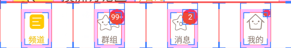
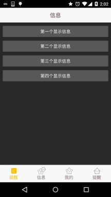

## 5.2.3 Fragment实例精讲——底部导航栏的实现(方法3)

## 本节引言

> 前面我们已经跟大家讲解了实现底部导航栏的两种方案，但是这两种方案只适合普通的情况，如果是像新浪微博那样的，想在底部导航栏上的item带有一个红色的小点，然后加上一个消息数目这样， 前面两种方案就显得无力了，我们来看看别人的APP是怎么做的，打开手机的开发者选项，勾选里面的： **显示布局边界**，然后打开我们参考的那个App，可以看到底部导航栏是这样的：
>
> 
>
>  
>
> 
>
> 从上面这个图我们就可以看出，这种底部导航栏不是简单的TextView或者RadioGroup构成的， 大概布局方案可能是：外层一个LinearLayout，中间一个RelativeLayout，而在中间有一个TextView， 然后再在TextView的右上角有一个红色圆圈背景的TextView或者一个红色的小点； 大概就这样，而这些小点平时的时候应该设置的不可见，当收到信息推送，即有相关类别信息的时候再可见，并且显示对应的信息数目！那么下面我们就来实现下这种底部导航栏的效果， 另外，为了方便演示，这里就不演示Fragment的切换效果了！另外顺道复习下Fragment获得Activity 中的组件的知识点！

------

## 1.实现效果图：

为了方便理解，这里通过点击按钮的形式，模拟收到推送信息，然后显示红色点！

**运行效果图：**



## 2.实现流程：

好的，接下来我们就来实现上面这个效果~

### Step 1：相关资源文件的准备：

和前面一样，准备好drawable系列的资源：

文字资源(文本选中状态颜色)：**tab_menu_text.xml**

```
<?xml version="1.0" encoding="utf-8"?>
<selector xmlns:android="http://schemas.android.com/apk/res/android">
    <item android:color="@color/text_yellow" android:state_selected="true" />
    <item android:color="@color/text_gray" />
</selector>
```

图标资源（图标不同选中状态）：**tab_menu_better.xml**

```
<?xml version="1.0" encoding="utf-8"?>
<selector xmlns:android="http://schemas.android.com/apk/res/android">
    <item android:drawable="@mipmap/tab_better_pressed" android:state_selected="true" />
    <item android:drawable="@mipmap/tab_better_normal" />
</selector>
```

照着把其他三个也撸出来~！

------

### Step 2：编写activity的布局代码：

因为四个选项的TextView以及右上角的红点数字属性都差不多，如下：

```
 <TextView
     android:id="@+id/tab_menu_channel"
     android:layout_marginTop="5dp"
     android:layout_width="wrap_content"
     android:layout_height="48dp"
     android:layout_centerInParent="true"
     android:textColor="@drawable/tab_menu_text"
     android:drawableTop="@drawable/tab_menu_channel"
     android:text="@string/tab_menu_alert"/>
 <TextView
     android:layout_width="20dp"
     android:layout_height="20dp"
     android:background="@mipmap/bg_num"
     android:layout_toRightOf="@+id/tab_menu_channel"
     android:layout_marginLeft="-10dp"
     android:text="99+"
     android:textSize="12sp"
     android:gravity="center"
     android:textColor="@color/text_white"/>
```

我们将他们抽取出来，写到style.xml里：

```
<style name="tab_menu_text">
    <item name="android:layout_marginTop">5dp</item>
    <item name="android:layout_width">wrap_content</item>
    <item name="android:layout_height">48dp</item>
    <item name="android:layout_centerInParent">true</item>
    <item name="android:textColor">@drawable/tab_menu_text</item>
</style>


<style name="tab_menu_bgnum">
    <item name="android:layout_width">20dp</item>
    <item name="android:layout_height">20dp</item>
    <item name="android:background">@mipmap/bg_num</item>
    <item name="android:layout_marginLeft">-10dp</item>
    <item name="android:textSize">12sp</item>
    <item name="android:gravity">center</item>
    <item name="android:textColor">@color/text_white</item>
</style>
```

然后开始编写我们的activity.xml布局：

```
<RelativeLayout xmlns:android="http://schemas.android.com/apk/res/android"
    xmlns:tools="http://schemas.android.com/tools"
    android:layout_width="match_parent"
    android:layout_height="match_parent"
    tools:context=".MainActivity">


    <RelativeLayout
        android:id="@+id/ly_top_bar"
        android:layout_width="match_parent"
        android:layout_height="48dp"
        android:background="@color/bg_topbar">

        <TextView
            android:id="@+id/txt_topbar"
            android:layout_width="match_parent"
            android:layout_height="match_parent"
            android:layout_centerInParent="true"
            android:gravity="center"
            android:text="信息"
            android:textColor="@color/text_topbar"
            android:textSize="18sp" />

        <View
            android:layout_width="match_parent"
            android:layout_height="2px"
            android:layout_alignParentBottom="true"
            android:background="@color/div_white" />

    </RelativeLayout>


    <LinearLayout
        android:id="@+id/ly_tab_menu"
        android:layout_width="match_parent"
        android:layout_height="56dp"
        android:layout_alignParentBottom="true"
        android:background="@color/bg_white"
        android:orientation="horizontal">

        <LinearLayout
            android:id="@+id/ly_tab_menu_channel"
            android:layout_width="0dp"
            android:layout_height="match_parent"
            android:layout_weight="1"
            android:gravity="center">

            <RelativeLayout
                android:layout_width="wrap_content"
                android:layout_height="match_parent"
                android:padding="5dp">

                <TextView
                    android:id="@+id/tab_menu_channel"
                    style="@style/tab_menu_text"
                    android:drawableTop="@drawable/tab_menu_channel"
                    android:text="@string/tab_menu_alert" />

                <TextView
                    android:id="@+id/tab_menu_channel_num"
                    style="@style/tab_menu_bgnum"
                    android:layout_toRightOf="@+id/tab_menu_channel"
                    android:text="99+"
                    android:visibility="gone" />
            </RelativeLayout>
        </LinearLayout>

        <LinearLayout
            android:id="@+id/ly_tab_menu_message"
            android:layout_width="0dp"
            android:layout_height="match_parent"
            android:layout_weight="1"
            android:gravity="center">

            <RelativeLayout
                android:layout_width="wrap_content"
                android:layout_height="match_parent"
                android:padding="5dp">

                <TextView
                    android:id="@+id/tab_menu_message"
                    style="@style/tab_menu_text"
                    android:drawableTop="@drawable/tab_menu_message"
                    android:text="@string/tab_menu_profile" />

                <TextView
                    android:id="@+id/tab_menu_message_num"
                    style="@style/tab_menu_bgnum"
                    android:layout_toRightOf="@+id/tab_menu_message"
                    android:text="99+"
                    android:visibility="gone" />
            </RelativeLayout>
        </LinearLayout>


        <LinearLayout
            android:id="@+id/ly_tab_menu_better"
            android:layout_width="0dp"
            android:layout_height="match_parent"
            android:layout_weight="1"
            android:gravity="center">

            <RelativeLayout
                android:layout_width="wrap_content"
                android:layout_height="match_parent"
                android:padding="5dp">

                <TextView
                    android:id="@+id/tab_menu_better"
                    style="@style/tab_menu_text"
                    android:drawableTop="@drawable/tab_menu_better"
                    android:text="@string/tab_menu_pay" />

                <TextView
                    android:id="@+id/tab_menu_better_num"
                    style="@style/tab_menu_bgnum"
                    android:layout_toRightOf="@+id/tab_menu_better"
                    android:text="99+"
                    android:visibility="gone" />
            </RelativeLayout>
        </LinearLayout>


        <LinearLayout
            android:id="@+id/ly_tab_menu_setting"
            android:layout_width="0dp"
            android:layout_height="match_parent"
            android:layout_weight="1"
            android:gravity="center">

            <RelativeLayout
                android:layout_width="wrap_content"
                android:layout_height="match_parent"
                android:padding="5dp">

                <TextView
                    android:id="@+id/tab_menu_setting"
                    style="@style/tab_menu_text"
                    android:drawableTop="@drawable/tab_menu_setting"
                    android:text="@string/tab_menu_alert" />

                <ImageView
                    android:id="@+id/tab_menu_setting_partner"
                    android:layout_width="12dp"
                    android:layout_height="12dp"
                    android:layout_marginLeft="-5dp"
                    android:layout_toRightOf="@id/tab_menu_setting"
                    android:visibility="gone"
                    android:src="@mipmap/partner_red" />

            </RelativeLayout>
        </LinearLayout>

    </LinearLayout>

    <View
        android:id="@+id/div_tab_bar"
        android:layout_width="match_parent"
        android:layout_height="2px"
        android:layout_above="@id/ly_tab_menu"
        android:background="@color/div_white" />


    <FrameLayout
        android:id="@+id/ly_content"
        android:layout_width="match_parent"
        android:layout_height="match_parent"
        android:layout_above="@id/div_tab_bar"
        android:layout_below="@id/ly_top_bar"/>


</RelativeLayout>
```

------

### Step 3：编写Fragment界面布局以及类

Fragment布局由四个普通按钮构成：

**fg_my.xml**:

```
<?xml version="1.0" encoding="utf-8"?>
<LinearLayout xmlns:android="http://schemas.android.com/apk/res/android"
    android:layout_width="match_parent"
    android:layout_height="match_parent"
    android:orientation="vertical"
    android:padding="5dp">

    <Button
        android:id="@+id/btn_one"
        android:layout_width="match_parent"
        android:layout_height="wrap_content"
        android:text="第一个显示信息"/>

    <Button
        android:id="@+id/btn_two"
        android:layout_width="match_parent"
        android:layout_height="wrap_content"
        android:text="第二个显示信息"/>

    <Button
        android:id="@+id/btn_three"
        android:layout_width="match_parent"
        android:layout_height="wrap_content"
        android:text="第三个显示信息"/>

    <Button
        android:id="@+id/btn_four"
        android:layout_width="match_parent"
        android:layout_height="wrap_content"
        android:text="第四个显示信息"/>

</LinearLayout>
```

接着是自定义的Fragment类，这里的话我们通过getActivity.findViewById()来获得Activity 中的小红点，这里仅仅是简单的控制显示而已！ **MyFragment.java**:

```
public class MyFragment extends Fragment implements View.OnClickListener{

    private Context mContext;
    private Button btn_one;
    private Button btn_two;
    private Button btn_three;
    private Button btn_four;

    public MyFragment() {

    }

    @Override
    public View onCreateView(LayoutInflater inflater, ViewGroup container, Bundle savedInstanceState) {
        View view = inflater.inflate(R.layout.fg_my,container,false);
        //UI Object
        btn_one = (Button) view.findViewById(R.id.btn_one);
        btn_two = (Button) view.findViewById(R.id.btn_two);
        btn_three = (Button) view.findViewById(R.id.btn_three);
        btn_four = (Button) view.findViewById(R.id.btn_four);
        //Bind Event
        btn_one.setOnClickListener(this);
        btn_two.setOnClickListener(this);
        btn_three.setOnClickListener(this);
        btn_four.setOnClickListener(this);
        return view;
    }

    @Override
    public void onClick(View v) {
        switch (v.getId()){
            case R.id.btn_one:
                TextView tab_menu_channel_num = (TextView) getActivity ().findViewById(R.id.tab_menu_channel_num);
                tab_menu_channel_num.setText("11");
                tab_menu_channel_num.setVisibility(View.VISIBLE);
                break;
            case R.id.btn_two:
                TextView tab_menu_message_num = (TextView) getActivity ().findViewById(R.id.tab_menu_message_num);
                tab_menu_message_num.setText("20");
                tab_menu_message_num.setVisibility(View.VISIBLE);
                break;
            case R.id.btn_three:
                TextView tab_menu_better_num = (TextView) getActivity ().findViewById(R.id.tab_menu_better_num);
                tab_menu_better_num.setText("99+");
                tab_menu_better_num.setVisibility(View.VISIBLE);
                break;
            case R.id.btn_four:
                ImageView tab_menu_setting_partner = (ImageView) getActivity ().findViewById(R.id.tab_menu_setting_partner);
                tab_menu_setting_partner.setVisibility(View.VISIBLE);
                break;
        }
    }
}
```

------

### Step 4：编写MainActivity

我们在这里完成主要的逻辑实现，有些部分和前面TextView实现底部导航栏的效果类似， 就不具体讲解了，代码如下：

**MainActivity.java**：

```
/**
 * Created by Coder-pig on 2015/8/30 0030.
 */
public class MainActivity extends AppCompatActivity implements View.OnClickListener {

    //Activity UI Object
    private LinearLayout ly_tab_menu_channel;
    private TextView tab_menu_channel;
    private TextView tab_menu_channel_num;
    private LinearLayout ly_tab_menu_message;
    private TextView tab_menu_message;
    private TextView tab_menu_message_num;
    private LinearLayout ly_tab_menu_better;
    private TextView tab_menu_better;
    private TextView tab_menu_better_num;
    private LinearLayout ly_tab_menu_setting;
    private TextView tab_menu_setting;
    private ImageView tab_menu_setting_partner;
    private FragmentManager fManager;
    private FragmentTransaction fTransaction;
    private MyFragment fg1;


    @Override
    protected void onCreate(Bundle savedInstanceState) {
        super.onCreate(savedInstanceState);
        setContentView(R.layout.activity_main);
        bindViews();
        ly_tab_menu_channel.performClick();
        fg1 = new MyFragment();
        fManager = getFragmentManager();
        fTransaction = fManager.beginTransaction();
        fTransaction.add(R.id.ly_content, fg1).commit();

    }

    private void bindViews() {
        ly_tab_menu_channel = (LinearLayout) findViewById(R.id.ly_tab_menu_channel);
        tab_menu_channel = (TextView) findViewById(R.id.tab_menu_channel);
        tab_menu_channel_num = (TextView) findViewById(R.id.tab_menu_channel_num);
        ly_tab_menu_message = (LinearLayout) findViewById(R.id.ly_tab_menu_message);
        tab_menu_message = (TextView) findViewById(R.id.tab_menu_message);
        tab_menu_message_num = (TextView) findViewById(R.id.tab_menu_message_num);
        ly_tab_menu_better = (LinearLayout) findViewById(R.id.ly_tab_menu_better);
        tab_menu_better = (TextView) findViewById(R.id.tab_menu_better);
        tab_menu_better_num = (TextView) findViewById(R.id.tab_menu_better_num);
        ly_tab_menu_setting = (LinearLayout) findViewById(R.id.ly_tab_menu_setting);
        tab_menu_setting = (TextView) findViewById(R.id.tab_menu_setting);
        tab_menu_setting_partner = (ImageView) findViewById(R.id.tab_menu_setting_partner);

        ly_tab_menu_channel.setOnClickListener(this);
        ly_tab_menu_message.setOnClickListener(this);
        ly_tab_menu_better.setOnClickListener(this);
        ly_tab_menu_setting.setOnClickListener(this);

    }

    @Override
    public void onClick(View v) {
        switch (v.getId()) {
            case R.id.ly_tab_menu_channel:
                setSelected();
                tab_menu_channel.setSelected(true);
                tab_menu_channel_num.setVisibility(View.INVISIBLE);
                break;
            case R.id.ly_tab_menu_message:
                setSelected();
                tab_menu_message.setSelected(true);
                tab_menu_message_num.setVisibility(View.INVISIBLE);
                break;
            case R.id.ly_tab_menu_better:
                setSelected();
                tab_menu_better.setSelected(true);
                tab_menu_better_num.setVisibility(View.INVISIBLE);
                break;
            case R.id.ly_tab_menu_setting:
                setSelected();
                tab_menu_setting.setSelected(true);
                tab_menu_setting_partner.setVisibility(View.INVISIBLE);
                break;
        }
    }

    //重置所有文本的选中状态
    private void setSelected() {
        tab_menu_channel.setSelected(false);
        tab_menu_message.setSelected(false);
        tab_menu_better.setSelected(false);
        tab_menu_setting.setSelected(false);
    }


}
```

好的，至此，就大功告成了~

------

## 3.代码下载：

**FragmentDemo3.zip**：[FragmentDemo3.zip下载](https://www.runoob.com/try/download/FragmentDemo3.zip)

------

## 4.本节小结：

> 好的，本节相比前面两节稍微复杂了一点，不过还是比较容易弄懂的！ 另外，关于实现普通底部导航栏的实现例子就写这么多吧，下一节开始我们来写下在此基础上的根据手势操作切换页面的例子，嗯，就说这么多，谢谢~