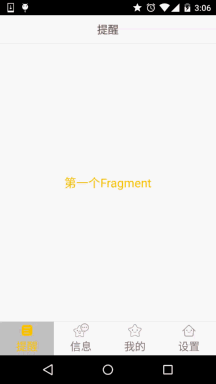
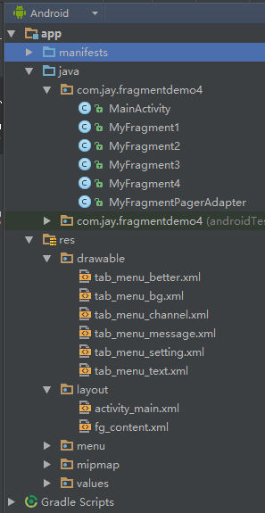

## 5.2.4 Fragment实例精讲——底部导航栏+ViewPager滑动切换页面

### 

> 前三节我们分别用不同的方式实现了普通底部导航栏的效果，而本节我们将会在第二个实例的基础上加上ViewPager来实现滑动切换页面的效果！大部分朋友都知道这个ViewPager是什么东西吧，如果不知道没关系，下面我们简单的来介绍一个这个控件！

------

## 1.ViewPager简单介绍

------

### 1）是怎么样的一个控件？

> 答：一个页面切换的组件，我们可以往里面填充多个View，然后我们可以通过触摸屏幕左右滑动切换不同的View，和前面学习的ListView一样，我们需要一个Adapter(适配器)，将要显示的View和我们的ViewPager进行绑定，而ViewPager有他自己特定的Adapter——PagerAdapter！另外，Google 官方是建议我们使用Fragment来填充ViewPager的,这样可以更加方便的生成每个Page以及管理每个Page的生命周期! 当然它给我们提供了两个不同的Adapter，他们分别是： **FragmentPageAdapter**和**FragmentStatePagerAdapter**！ 而我们本节用到的则是前者：FragmentPageAdapter！ 另外要说一点的是**ViewPager的缓存机制**： ViewPager会缓存当前页，前一页，以及后一页，比如有1，2，3，4这四个页面： 当我们处于第一页：缓存1，2
> ——> 处于第二页：缓存 1，2，3
> ——> 处于第三页：缓存2，3，4 ——> 处于第四页缓存3，4这样！

### 2）使用PagerAdapter要重写相关方法：

> - **getCount( )**: 获得viewpager中有多少个view
> - **destroyItem( )**: 移除一个给定位置的页面。适配器有责任从容器中删除这个视图。这是为了确保在finishUpdate(viewGroup)返回时视图能够被移除。
> - **instantiateItem( )**: ①将给定位置的view添加到ViewGroup(容器)中, 创建并显示出来 ②返回一个代表新增页面的Object(key), 通常都是直接返回view本身就可以了, 当然你也可以自定义自己的key, 但是key和每个view要一一对应的关系
> - **isViewFromObject**( ): 判断instantiateItem(ViewGroup, int)函数所返回来的Key与一个页面视图是否是代表的同一个视图(即它俩是否是对应的，对应的表示同一个View),通常我们直接写 return view == object；就可以了, 至于为什么要这样讲起来比较复杂, 后面有机会进行了解吧。貌似是ViewPager中有个存储view状态信息的ArrayList, 根据View取出对应信息的吧!

**PS: **不一定要重写所有方法~

------

## 2.实现效果图以及工程目录结构：

先来看下我们要实现的效果吧



接下来看下我们的项目结构：



------

## 3.代码实现：

------

### Step 1：相关资源文件的准备：

PS：我们是在实现底部导航栏方法2的基础上来写的，所以资源文件照搬即可！ 这里就不贴多次了~！

### Step 2：编写activity_main.xml的布局文件：

PS：只是把前面的FrameLayout替换成了：android.support.v4.view.ViewPager而已：

**activity_mian.xml**：

```
<RelativeLayout xmlns:android="http://schemas.android.com/apk/res/android"
    xmlns:tools="http://schemas.android.com/tools"
    android:layout_width="match_parent"
    android:layout_height="match_parent"
    tools:context=".MainActivity">

    <RelativeLayout
        android:id="@+id/ly_top_bar"
        android:layout_width="match_parent"
        android:layout_height="48dp"
        android:background="@color/bg_topbar">

        <TextView
            android:id="@+id/txt_topbar"
            android:layout_width="match_parent"
            android:layout_height="match_parent"
            android:layout_centerInParent="true"
            android:gravity="center"
            android:text="提醒"
            android:textColor="@color/text_topbar"
            android:textSize="18sp" />

        <View
            android:layout_width="match_parent"
            android:layout_height="2px"
            android:layout_alignParentBottom="true"
            android:background="@color/div_white" />

    </RelativeLayout>


    <RadioGroup
        android:id="@+id/rg_tab_bar"
        android:layout_width="match_parent"
        android:layout_height="56dp"
        android:layout_alignParentBottom="true"
        android:background="@color/bg_white"
        android:orientation="horizontal">

        <RadioButton
            android:id="@+id/rb_channel"
            style="@style/tab_menu_item"
            android:drawableTop="@drawable/tab_menu_channel"
            android:text="@string/tab_menu_alert" />

        <RadioButton
            android:id="@+id/rb_message"
            style="@style/tab_menu_item"
            android:drawableTop="@drawable/tab_menu_message"
            android:text="@string/tab_menu_profile" />

        <RadioButton
            android:id="@+id/rb_better"
            style="@style/tab_menu_item"
            android:drawableTop="@drawable/tab_menu_better"
            android:text="@string/tab_menu_pay" />

        <RadioButton
            android:id="@+id/rb_setting"
            style="@style/tab_menu_item"
            android:drawableTop="@drawable/tab_menu_setting"
            android:text="@string/tab_menu_setting" />

    </RadioGroup>

    <View
        android:id="@+id/div_tab_bar"
        android:layout_width="match_parent"
        android:layout_height="2px"
        android:layout_above="@id/rg_tab_bar"
        android:background="@color/div_white" />

    <android.support.v4.view.ViewPager
        android:id="@+id/vpager"
        android:layout_width="match_parent"
        android:layout_height="match_parent"
        android:layout_above="@id/div_tab_bar"
        android:layout_below="@id/ly_top_bar" />


</RelativeLayout>
```

### Step 3：编写Fragment的布局以及代码：

PS：这里为了顺便演示ViewPager的机制，特意写成了四个Fragment！在onCreateView中打印创建Log！

**fg_content.xml:**

```
<?xml version="1.0" encoding="utf-8"?>
<LinearLayout xmlns:android="http://schemas.android.com/apk/res/android"
    android:layout_width="match_parent"
    android:layout_height="match_parent"
    android:background="@color/bg_white"
    android:orientation="vertical">

    <TextView
        android:id="@+id/txt_content"
        android:layout_width="match_parent"
        android:layout_height="match_parent"
        android:gravity="center"
        android:text="呵呵"
        android:textColor="@color/text_yellow"
        android:textSize="20sp" />

</LinearLayout>
```

**MyFragment1.java**:

```
/**
 * Created by Jay on 2015/8/28 0028.
 */
public class MyFragment1 extends Fragment {

    public MyFragment1() {
    }

    @Override
    public View onCreateView(LayoutInflater inflater, ViewGroup container, Bundle savedInstanceState) {
        View view = inflater.inflate(R.layout.fg_content, container, false);
        TextView txt_content = (TextView) view.findViewById(R.id.txt_content);
        txt_content.setText("第一个Fragment");
        Log.e("HEHE", "1日狗");
        return view;
    }
}
```

其他三个照葫芦画瓢，换点东西就好！

### Step 4：自定义FragmentPagerAdapter类：

代码很简单，只需传递一个FragmentManager过来，其他都在这里完成！

```
/**
 * Created by Jay on 2015/8/31 0031.
 */
public class MyFragmentPagerAdapter extends FragmentPagerAdapter {

    private final int PAGER_COUNT = 4;
    private MyFragment1 myFragment1 = null;
    private MyFragment2 myFragment2 = null;
    private MyFragment3 myFragment3 = null;
    private MyFragment4 myFragment4 = null;


    public MyFragmentPagerAdapter(FragmentManager fm) {
        super(fm);
        myFragment1 = new MyFragment1();
        myFragment2 = new MyFragment2();
        myFragment3 = new MyFragment3();
        myFragment4 = new MyFragment4();
    }


    @Override
    public int getCount() {
        return PAGER_COUNT;
    }

    @Override
    public Object instantiateItem(ViewGroup vg, int position) {
        return super.instantiateItem(vg, position);
    }

    @Override
    public void destroyItem(ViewGroup container, int position, Object object) {
        System.out.println("position Destory" + position);
        super.destroyItem(container, position, object);
    }

    @Override
    public Fragment getItem(int position) {
        Fragment fragment = null;
        switch (position) {
            case MainActivity.PAGE_ONE:
                fragment = myFragment1;
                break;
            case MainActivity.PAGE_TWO:
                fragment = myFragment2;
                break;
            case MainActivity.PAGE_THREE:
                fragment = myFragment3;
                break;
            case MainActivity.PAGE_FOUR:
                fragment = myFragment4;
                break;
        }
        return fragment;
    }

}
```

### Step 5：MainActivity的编写：

逻辑很简单，自己看~

**MainActivity.java:**

```
package com.jay.fragmentdemo4;

import android.os.Bundle;
import android.support.v4.view.ViewPager;
import android.support.v7.app.AppCompatActivity;
import android.widget.RadioButton;
import android.widget.RadioGroup;
import android.widget.TextView;


/**
 * Created by Coder-pig on 2015/8/28 0028.
 */
public class MainActivity extends AppCompatActivity implements RadioGroup.OnCheckedChangeListener,
        ViewPager.OnPageChangeListener {

    //UI Objects
    private TextView txt_topbar;
    private RadioGroup rg_tab_bar;
    private RadioButton rb_channel;
    private RadioButton rb_message;
    private RadioButton rb_better;
    private RadioButton rb_setting;
    private ViewPager vpager;

    private MyFragmentPagerAdapter mAdapter;

    //几个代表页面的常量
    public static final int PAGE_ONE = 0;
    public static final int PAGE_TWO = 1;
    public static final int PAGE_THREE = 2;
    public static final int PAGE_FOUR = 3;


    @Override
    protected void onCreate(Bundle savedInstanceState) {
        super.onCreate(savedInstanceState);
        setContentView(R.layout.activity_main);
        mAdapter = new MyFragmentPagerAdapter(getSupportFragmentManager());
        bindViews();
        rb_channel.setChecked(true);
    }

    private void bindViews() {
        txt_topbar = (TextView) findViewById(R.id.txt_topbar);
        rg_tab_bar = (RadioGroup) findViewById(R.id.rg_tab_bar);
        rb_channel = (RadioButton) findViewById(R.id.rb_channel);
        rb_message = (RadioButton) findViewById(R.id.rb_message);
        rb_better = (RadioButton) findViewById(R.id.rb_better);
        rb_setting = (RadioButton) findViewById(R.id.rb_setting);
        rg_tab_bar.setOnCheckedChangeListener(this);

        vpager = (ViewPager) findViewById(R.id.vpager);
        vpager.setAdapter(mAdapter);
        vpager.setCurrentItem(0);
        vpager.addOnPageChangeListener(this);
    }

    @Override
    public void onCheckedChanged(RadioGroup group, int checkedId) {
        switch (checkedId) {
            case R.id.rb_channel:
                vpager.setCurrentItem(PAGE_ONE);
                break;
            case R.id.rb_message:
                vpager.setCurrentItem(PAGE_TWO);
                break;
            case R.id.rb_better:
                vpager.setCurrentItem(PAGE_THREE);
                break;
            case R.id.rb_setting:
                vpager.setCurrentItem(PAGE_FOUR);
                break;
        }
    }


    //重写ViewPager页面切换的处理方法
    @Override
    public void onPageScrolled(int position, float positionOffset, int positionOffsetPixels) {
    }

    @Override
    public void onPageSelected(int position) {
    }

    @Override
    public void onPageScrollStateChanged(int state) {
        //state的状态有三个，0表示什么都没做，1正在滑动，2滑动完毕
        if (state == 2) {
            switch (vpager.getCurrentItem()) {
                case PAGE_ONE:
                    rb_channel.setChecked(true);
                    break;
                case PAGE_TWO:
                    rb_message.setChecked(true);
                    break;
                case PAGE_THREE:
                    rb_better.setChecked(true);
                    break;
                case PAGE_FOUR:
                    rb_setting.setChecked(true);
                    break;
            }
        }
    }
}
```


PS：嘿嘿，上面我把导包部分的代码也贴出来了，就是害怕你们导错包，然后出现一些莫名其妙的错误！ 因为ViewPager是v4包下面的，所以Fragment，FragmentManager，FragmentTransaction都是需要使用 V4包下的哦！另外获取FragmentManager的方法不是直接用getFragmentManager()而是使用 getSupportFragmentManager(）哦！

注意：如果 ViewPager 放在 RadioButton 后，RadioButton 的点击事件会失效。

------

## 4.代码下载：

**FragmentDemo4**：[下载FragmentDemo4.zip](https://www.runoob.com/try/download/FragmentDemo4.zip)

------

## 本节小结：

> 好的，上面就是底部导航栏 + ViewPager实现简单滑动切换Fragment的实现过程了！ 就说这么多，谢谢