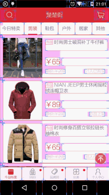
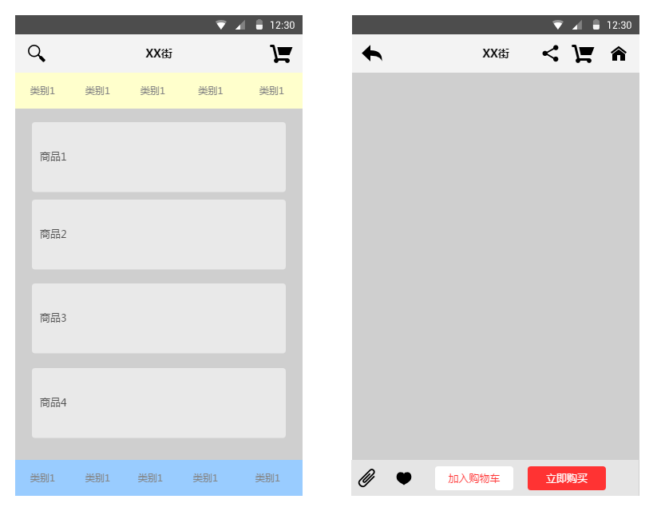

## 5.2.5 Fragment实例精讲——新闻(购物)类App列表Fragment的简单实现

### 

## 本节引言：

> 相信大家对点击列表，然后进入详情这种App并不陌生吧，在购物类App和新闻类App中最为常见： 下面我们简单来讲一下流程逻辑！

------

## 1.逻辑流程讲解：

刚好公司测试妹子的测试机上装了楚楚街9块9的APP，呵呵，直接就照这个来研究吧：



嘿嘿，市面上很多APP都是这种样子的，而这个可以用我们学到的Fragment来实现： 可能gif动画看不清，笔者用界面原型工具画个大概吧：



大概就这样，中间区域是一个布局容器，一般是FrameLayout，然后我们将一个Fragment replace 到这个容器中或者add也行，而这个Fragment中有一个listview，当我们点击这个ListView中的一项， 中间容器中的Fragment就会被replace成对应详细信息的Fragment所替代，如果我们只是replace的话， 就不会保存第一个Fragment的状态，用户又得从头开始浏览，这肯定是很不方便的，这里我们可以 通过Fragment栈的addtobackStack和popbackstack来解决这个问题！当replace的同时，我们将被替换的Fragment添加到stack中，当用户点击回退按钮时，调用popbackstack弹出栈，具体实现见下述代码 示例！

------

## 2.代码示例：简单新闻类APP列表和内容切换的实现

**运行效果图**：


**实现代码**：

**Step 1**:先把两个Fragment以及Activity的布局实现了

**fg_newlist.xml**:

```
<?xml version="1.0" encoding="utf-8"?>
<LinearLayout xmlns:android="http://schemas.android.com/apk/res/android"
    android:layout_width="match_parent"
    android:layout_height="match_parent"
    android:background="@color/white"
    android:orientation="horizontal">

    <ListView
        android:id="@+id/list_news"
        android:layout_width="match_parent"
        android:layout_height="match_parent" />

</LinearLayout>
```

**fg_context.xml**:

```
<?xml version="1.0" encoding="utf-8"?>
<LinearLayout xmlns:android="http://schemas.android.com/apk/res/android"
    android:layout_width="match_parent"
    android:layout_height="match_parent"
    android:orientation="vertical">

    <TextView
        android:id="@+id/txt_content"
        android:layout_width="match_parent"
        android:layout_height="match_parent"
        android:gravity="center"
        android:textColor="@color/blue"
        android:textSize="20sp" />

</LinearLayout>
```

**activity_main.xml**:

```
<RelativeLayout xmlns:android="http://schemas.android.com/apk/res/android"
    xmlns:tools="http://schemas.android.com/tools"
    android:layout_width="match_parent"
    android:layout_height="match_parent"
    tools:context=".MainActivity">

    <TextView
        android:id="@+id/txt_title"
        android:layout_width="match_parent"
        android:layout_height="56dp"
        android:background="@color/blue"
        android:textColor="@color/white"
        android:text="新闻列表"
        android:textSize="20sp"
        android:textStyle="bold"
        android:gravity="center"/>

    <FrameLayout
        android:id="@+id/fl_content"
        android:layout_width="match_parent"
        android:layout_height="match_parent"
        android:layout_below="@id/txt_title"/>

</RelativeLayout>
```

------

**Step 2**:实现我们的业务Bean类和自定义BaseAdapter类：

**Data.java:**

```
/**
 * Created by Jay on 2015/9/6 0006.
 */
public class Data {

    private String new_title;
    private String new_content;

    public Data(){}

    public Data(String new_title, String new_content) {
        this.new_title = new_title;
        this.new_content = new_content;
    }

    public String getNew_title() {
        return new_title;
    }

    public String getNew_content() {
        return new_content;
    }

    public void setNew_title(String new_title) {
        this.new_title = new_title;
    }

    public void setNew_content(String new_content) {
        this.new_content = new_content;
    }
}
```

**MyAdapter.java**:

```
/**
 * Created by Jay on 2015/9/6 0006.
 */
public class MyAdapter extends BaseAdapter {

    private List<Data> mData;
    private Context mContext;

    public MyAdapter(List<Data> mData, Context mContext) {
        this.mData = mData;
        this.mContext = mContext;
    }

    @Override
    public int getCount() {
        return mData.size();
    }

    @Override
    public Object getItem(int position) {
        return null;
    }

    @Override
    public long getItemId(int position) {
        return position;
    }

    @Override
    public View getView(int position, View convertView, ViewGroup parent) {
        ViewHolder viewHolder;
        if(convertView == null) {
            convertView = LayoutInflater.from(mContext).inflate(R.layout.list_item,parent,false);
            viewHolder = new ViewHolder();
            viewHolder.txt_item_title = (TextView) convertView.findViewById(R.id.txt_item_title);
            convertView.setTag(viewHolder);
        } else {
            viewHolder = (ViewHolder) convertView.getTag();
        }
        viewHolder.txt_item_title.setText(mData.get(position).getNew_title());
        return convertView;
    }

    private class ViewHolder{
        TextView txt_item_title;
    }

}
```

------

**Step 3**:MainActivity的实现

**MainActivity.java**:

```
public class MainActivity extends AppCompatActivity {

    private TextView txt_title;
    private FrameLayout fl_content;
    private Context mContext;
    private ArrayList<Data> datas = null;
    private FragmentManager fManager = null;
    private long exitTime = 0;


    @Override
    protected void onCreate(Bundle savedInstanceState) {
        super.onCreate(savedInstanceState);
        setContentView(R.layout.activity_main);
        mContext = MainActivity.this;
        fManager = getFragmentManager();
        bindViews();

        datas = new ArrayList<Data>();
        for (int i = 1; i <= 20; i++) {
            Data data = new Data("新闻标题" + i, i + "~新闻内容~~~~~~~~");
            datas.add(data);
        }
        NewListFragment nlFragment = new NewListFragment(fManager, datas);
        FragmentTransaction ft = fManager.beginTransaction();
        ft.replace(R.id.fl_content, nlFragment);
        ft.commit();
    }


    private void bindViews() {
        txt_title = (TextView) findViewById(R.id.txt_title);
        fl_content = (FrameLayout) findViewById(R.id.fl_content);
    }


    //点击回退键的处理：判断Fragment栈中是否有Fragment
    //没，双击退出程序，否则像是Toast提示
    //有，popbackstack弹出栈
    @Override
    public void onBackPressed() {
        if (fManager.getBackStackEntryCount() == 0) {
            if ((System.currentTimeMillis() - exitTime) > 2000) {
                Toast.makeText(getApplicationContext(), "再按一次退出程序",
                        Toast.LENGTH_SHORT).show();
                exitTime = System.currentTimeMillis();
            } else {
                super.onBackPressed();
            }
        } else {
            fManager.popBackStack();
            txt_title.setText("新闻列表");
        }
    }
}
```

------

**Step 4**:列表Fragment的实现：

**NewListFragment.java**：

```
package com.jay.fragmentdemo4;

import android.app.Fragment;
import android.app.FragmentManager;
import android.app.FragmentTransaction;
import android.os.Bundle;
import android.view.LayoutInflater;
import android.view.View;
import android.view.ViewGroup;
import android.widget.AdapterView;
import android.widget.ListView;
import android.widget.TextView;

import java.util.ArrayList;

/**
 * Created by Jay on 2015/9/6 0006.
 */
public class NewListFragment extends Fragment implements AdapterView.OnItemClickListener {
    private FragmentManager fManager;
    private ArrayList<Data> datas;
    private ListView list_news;

    public NewListFragment(FragmentManager fManager, ArrayList<Data> datas) {
        this.fManager = fManager;
        this.datas = datas;
    }

    @Override
    public View onCreateView(LayoutInflater inflater, ViewGroup container, Bundle savedInstanceState) {
        View view = inflater.inflate(R.layout.fg_newlist, container, false);
        list_news = (ListView) view.findViewById(R.id.list_news);
        MyAdapter myAdapter = new MyAdapter(datas, getActivity());
        list_news.setAdapter(myAdapter);
        list_news.setOnItemClickListener(this);
        return view;
    }


    @Override
    public void onItemClick(AdapterView<?> parent, View view, int position, long id) {
        FragmentTransaction fTransaction = fManager.beginTransaction();
        NewContentFragment ncFragment = new NewContentFragment();
        Bundle bd = new Bundle();
        bd.putString("content", datas.get(position).getNew_content());
        ncFragment.setArguments(bd);
        //获取Activity的控件
        TextView txt_title = (TextView) getActivity().findViewById(R.id.txt_title);
        txt_title.setText(datas.get(position).getNew_content());
        //加上Fragment替换动画
        fTransaction.setCustomAnimations(R.anim.fragment_slide_left_enter, R.anim.fragment_slide_left_exit);
        fTransaction.replace(R.id.fl_content, ncFragment);
        //调用addToBackStack将Fragment添加到栈中
        fTransaction.addToBackStack(null);
        fTransaction.commit();
    }
}
```

------

**Step 5**:内容Fragment的实现：

**NewContentFragment.java**:

```
/**
 * Created by Jay on 2015/9/6 0006.
 */
public class NewContentFragment extends Fragment {

    NewContentFragment() {
    }

    @Override
    public View onCreateView(LayoutInflater inflater, ViewGroup container, Bundle savedInstanceState) {
        View view = inflater.inflate(R.layout.fg_content, container, false);
        TextView txt_content = (TextView) view.findViewById(R.id.txt_content);
        //getArgument获取传递过来的Bundle对象
        txt_content.setText(getArguments().getString("content"));
        return view;
    }

}
```

代码很简单，就不慢慢解释了~

------

## 3.代码下载

**FragmentDemo5.zip**：[下载 FragmentDemo5.zip](https://www.runoob.com/try/download/FragmentDemo5.zip)

------

## 本节小结：

> 因为时间的关系，并没有详细的去做过多的讲解，示例代码也很简单，方便各位初学者理解！ 如果要用到实际项目中还需要对此进行一番修改~！好的，本节就到这里，谢谢~