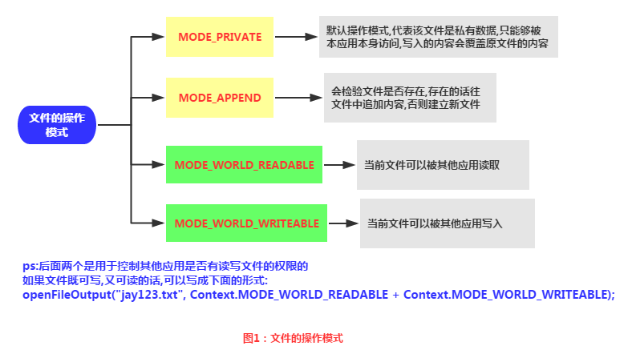
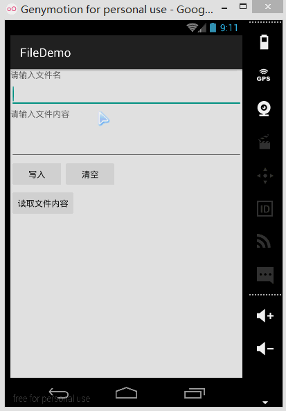
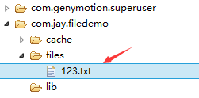
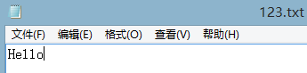
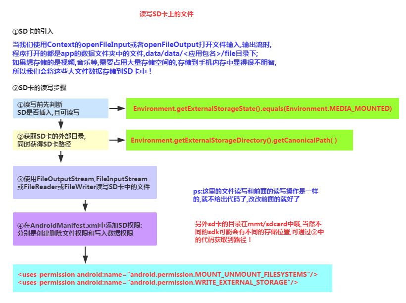
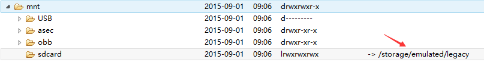
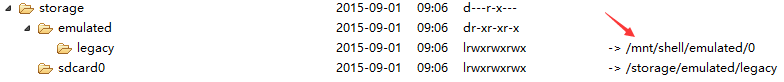
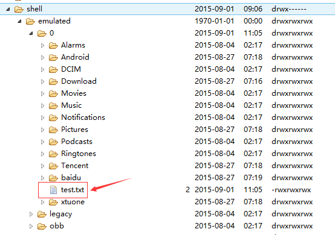
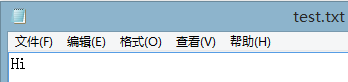
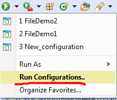

## 6.1 数据存储与访问之——文件存储读写

### 

## 本节引言：

> 嘿嘿，看到这个题目，相信部分读者会问，你前面的Fragment写完了吗？嗯，没写完，因为想例子，需要 一点时间，为了提高效率，所以决定像多线程一样，并发的来写教程，这样可能可以加快写教程的进度， 到现在为止，刚好写了60篇，离完成入门教程还很远呢，而前面也说过，想在一个半到两个月之内完成 这套教程，今天已经9.1号了，要加吧劲~好的，废话就这么多，本节给大家介绍的是Android数据存储与访问方式中的一个——文件存储与读写，当然除了这种方式外，我们可以存到SharedPreference，数据库， 或者Application中，当然这些后面都会讲，嗯，开始本节内容~

------

## 1.Android文件的操作模式

> 学过Java的同学都知道，我们新建文件，然后就可以写入数据了，但是Android却不一样，因为Android是 基于Linux的，我们在读写文件的时候，还需加上文件的操作模式，Android中的操作模式如下：



------

## 2.文件的相关操作方法


## 3.文件读写的实现

> Android中的文件读写和Java中的文件I/O相同，流程也很简单，下面我们来写个简单的示例：

**实现效果图：**



**PS:**这里用的是模拟器，因为笔者的N5并没有root，看不到文件的存储目录，下面我们打开DDMS 的File Exploer可以看到，在data/data/<包名>/file中有我们写入的文件：



我们可以点击右上角的响应图标将文件导入到电脑中，并且打开验证写入的内容：

 

**代码实现：**

首先是布局文件:**main_activity.xml**

```
<LinearLayout xmlns:android="http://schemas.android.com/apk/res/android"
    xmlns:tools="http://schemas.android.com/tools"
    android:id="@+id/LinearLayout1"
    android:layout_width="match_parent"
    android:layout_height="match_parent"
    android:orientation="vertical"
    tools:context="com.jay.example.filedemo1.MainActivity">

    <TextView
        android:layout_width="wrap_content"
        android:layout_height="wrap_content"
        android:text="@string/nametitle" />

    <EditText
        android:id="@+id/editname"
        android:layout_width="match_parent"
        android:layout_height="wrap_content" />

    <TextView
        android:layout_width="wrap_content"
        android:layout_height="wrap_content"
        android:text="@string/detailtitle" />

    <EditText
        android:id="@+id/editdetail"
        android:layout_width="match_parent"
        android:layout_height="wrap_content"
        android:minLines="2" />

    <LinearLayout
        android:layout_width="fill_parent"
        android:layout_height="wrap_content"
        android:orientation="horizontal">

        <Button
            android:id="@+id/btnsave"
            android:layout_width="wrap_content"
            android:layout_height="wrap_content"
            android:text="@string/btnwrite" />

        <Button
            android:id="@+id/btnclean"
            android:layout_width="wrap_content"
            android:layout_height="wrap_content"
            android:text="@string/btnclean" />
    </LinearLayout>

    <Button
        android:id="@+id/btnread"
        android:layout_width="wrap_content"
        android:layout_height="wrap_content"
        android:text="@string/btnread" />

</LinearLayout>
```

然后我们来写一个文件协助类：**FileHelper.java**

```
/**
 * Created by Jay on 2015/9/1 0001.
 */
public class FileHelper {

    private Context mContext;

    public FileHelper() {
    }

    public FileHelper(Context mContext) {
        super();
        this.mContext = mContext;
    }

    /*
    * 这里定义的是一个文件保存的方法，写入到文件中，所以是输出流
    * */
    public void save(String filename, String filecontent) throws Exception {
        //这里我们使用私有模式,创建出来的文件只能被本应用访问,还会覆盖原文件哦
        FileOutputStream output = mContext.openFileOutput(filename, Context.MODE_PRIVATE);
        output.write(filecontent.getBytes());  //将String字符串以字节流的形式写入到输出流中
        output.close();         //关闭输出流
    }


    /*
    * 这里定义的是文件读取的方法
    * */
    public String read(String filename) throws IOException {
        //打开文件输入流
        FileInputStream input = mContext.openFileInput(filename);
        byte[] temp = new byte[1024];
        StringBuilder sb = new StringBuilder("");
        int len = 0;
        //读取文件内容:
        while ((len = input.read(temp)) > 0) {
            sb.append(new String(temp, 0, len));
        }
        //关闭输入流
        input.close();
        return sb.toString();
    }

}
```

最后是**MainActivity.java**，我们在这里完成相关操作：

```
public class MainActivity extends AppCompatActivity implements View.OnClickListener {

    private EditText editname;
    private EditText editdetail;
    private Button btnsave;
    private Button btnclean;
    private Button btnread;
    private Context mContext;

    @Override
    protected void onCreate(Bundle savedInstanceState) {
        super.onCreate(savedInstanceState);
        setContentView(R.layout.activity_main);
        mContext = getApplicationContext();
        bindViews();
    }


    private void bindViews() {
        editdetail = (EditText) findViewById(R.id.editdetail);
        editname = (EditText) findViewById(R.id.editname);
        btnclean = (Button) findViewById(R.id.btnclean);
        btnsave = (Button) findViewById(R.id.btnsave);
        btnread = (Button) findViewById(R.id.btnread);

        btnclean.setOnClickListener(this);
        btnsave.setOnClickListener(this);
        btnread.setOnClickListener(this);
    }


    @Override
    public void onClick(View v) {
        switch (v.getId()) {
            case R.id.btnclean:
                editdetail.setText("");
                editname.setText("");
                break;
            case R.id.btnsave:
                FileHelper fHelper = new FileHelper(mContext);
                String filename = editname.getText().toString();
                String filedetail = editdetail.getText().toString();
                try {
                    fHelper.save(filename, filedetail);
                    Toast.makeText(getApplicationContext(), "数据写入成功", Toast.LENGTH_SHORT).show();
                } catch (Exception e) {
                    e.printStackTrace();
                    Toast.makeText(getApplicationContext(), "数据写入失败", Toast.LENGTH_SHORT).show();
                }
                break;
            case R.id.btnread:
                String detail = "";
                FileHelper fHelper2 = new FileHelper(getApplicationContext());
                try {
                    String fname = editname.getText().toString();
                    detail = fHelper2.read(fname);
                } catch (IOException e) {
                    e.printStackTrace();
                }
                Toast.makeText(getApplicationContext(), detail, Toast.LENGTH_SHORT).show();
                break;
        }
    }
}
```

## 4.读取SD卡上的文件

**读取流程图**：



**代码示例**：

**运行效果图**：


同样打开DDMS的File Explorer，在旧版本的系统上我们可以直接在mmt\sdcard上找到，但是新版本 的就可能需要我们自己找找了，首先我们来到这个路径下：



点开sdcard，但是没东西，我们继续找唠叨后面这个/storage/emulated/legacy下找：



好吧，他又跳到别的地方去了，我们继续找/storage/shell/emilated/0



果然找到了，我们在SD卡里生成的test.txt！导出到电脑看下里面的内容：



嘿嘿，果然读写SD卡成功~接下来我们来看下代码是怎么写的：

**代码实现：**

**main_activity.xml**:

```
<LinearLayout xmlns:android="http://schemas.android.com/apk/res/android"
    xmlns:tools="http://schemas.android.com/tools"
    android:id="@+id/LinearLayout1"
    android:layout_width="match_parent"
    android:layout_height="match_parent"
    android:orientation="vertical"
    tools:context="com.jay.example.filedemo2.MainActivity">

    <TextView
        android:layout_width="wrap_content"
        android:layout_height="wrap_content"
        android:text="清输入文件名" />

    <EditText
        android:id="@+id/edittitle"
        android:layout_width="match_parent"
        android:layout_height="wrap_content"
        android:hint="文件名" />


    <TextView
        android:layout_width="wrap_content"
        android:layout_height="wrap_content"
        android:text="清输入文件内容" />

    <EditText
        android:id="@+id/editdetail"
        android:layout_width="match_parent"
        android:layout_height="wrap_content"
        android:hint="文件内容" />

    <Button
        android:id="@+id/btnsave"
        android:layout_width="wrap_content"
        android:layout_height="wrap_content"
        android:text="保存到SD卡" />

    <Button
        android:id="@+id/btnclean"
        android:layout_width="wrap_content"
        android:layout_height="wrap_content"
        android:text="清空" />

    <Button
        android:id="@+id/btnread"
        android:layout_width="wrap_content"
        android:layout_height="wrap_content"
        android:text="读取sd卡中的文件" />

</LinearLayout>
```

接着我们来写一个SD操作类： **SDFileHelper.java**

```
/**
 * Created by Jay on 2015/9/1 0001.
 */
public class SDFileHelper {

    private Context context;

    public SDFileHelper() {
    }

    public SDFileHelper(Context context) {
        super();
        this.context = context;
    }

    //往SD卡写入文件的方法
    public void savaFileToSD(String filename, String filecontent) throws Exception {
        //如果手机已插入sd卡,且app具有读写sd卡的权限
        if (Environment.getExternalStorageState().equals(Environment.MEDIA_MOUNTED)) {
            filename = Environment.getExternalStorageDirectory().getCanonicalPath() + "/" + filename;
            //这里就不要用openFileOutput了,那个是往手机内存中写数据的
            FileOutputStream output = new FileOutputStream(filename);
            output.write(filecontent.getBytes());
            //将String字符串以字节流的形式写入到输出流中
            output.close();
            //关闭输出流
        } else Toast.makeText(context, "SD卡不存在或者不可读写", Toast.LENGTH_SHORT).show();
    }

    //读取SD卡中文件的方法
    //定义读取文件的方法:
    public String readFromSD(String filename) throws IOException {
        StringBuilder sb = new StringBuilder("");
        if (Environment.getExternalStorageState().equals(Environment.MEDIA_MOUNTED)) {
            filename = Environment.getExternalStorageDirectory().getCanonicalPath() + "/" + filename;
            //打开文件输入流
            FileInputStream input = new FileInputStream(filename);
            byte[] temp = new byte[1024];

            int len = 0;
            //读取文件内容:
            while ((len = input.read(temp)) > 0) {
                sb.append(new String(temp, 0, len));
            }
            //关闭输入流
            input.close();
        }
        return sb.toString();
    }


}
```

接着**MainActivity.java**实现相关逻辑：

```
public class MainActivity extends AppCompatActivity implements View.OnClickListener{

    private EditText editname;
    private EditText editdetail;
    private Button btnsave;
    private Button btnclean;
    private Button btnread;
    private Context mContext;

    @Override
    protected void onCreate(Bundle savedInstanceState) {
        super.onCreate(savedInstanceState);
        setContentView(R.layout.activity_main);
        mContext = getApplicationContext();
        bindViews();
    }

    private void bindViews() {
        editname = (EditText) findViewById(R.id.edittitle);
        editdetail = (EditText) findViewById(R.id.editdetail);
        btnsave = (Button) findViewById(R.id.btnsave);
        btnclean = (Button) findViewById(R.id.btnclean);
        btnread = (Button) findViewById(R.id.btnread);

        btnsave.setOnClickListener(this);
        btnclean.setOnClickListener(this);
        btnread.setOnClickListener(this);
    }

    @Override
    public void onClick(View v) {
        switch (v.getId()){
            case R.id.btnclean:
                editdetail.setText("");
                editname.setText("");
                break;
            case R.id.btnsave:
                String filename = editname.getText().toString();
                String filedetail = editdetail.getText().toString();
                SDFileHelper sdHelper = new SDFileHelper(mContext);
                try
                {
                    sdHelper.savaFileToSD(filename, filedetail);
                    Toast.makeText(getApplicationContext(), "数据写入成功", Toast.LENGTH_SHORT).show();
                }
                catch(Exception e){
                    e.printStackTrace();
                    Toast.makeText(getApplicationContext(), "数据写入失败", Toast.LENGTH_SHORT).show();
                }
                break;
            case R.id.btnread:
                String detail = "";
                SDFileHelper sdHelper2 = new SDFileHelper(mContext);
                try
                {
                    String filename2 = editname.getText().toString();
                    detail = sdHelper2.readFromSD(filename2);
                }
                catch(IOException e){e.printStackTrace();}
                Toast.makeText(getApplicationContext(), detail, Toast.LENGTH_SHORT).show();
                break;
        }
    }
}
```

最后别忘记在**AndroidManifest.xml**写上读写SD卡的权限哦！

```
<!-- 在SDCard中创建与删除文件权限 -->
<uses-permission android:name="android.permission.MOUNT_UNMOUNT_FILESYSTEMS"/>
<!-- 往SDCard写入数据权限 -->
<uses-permission android:name="android.permission.WRITE_EXTERNAL_STORAGE"/>
```

------

## 5.关于原生模拟器SD卡的问题

> 如果是真机调试的话通常都是可以的,对于原生虚拟机的话就问题多多了,再我们前面使用 Environment.getExternalStorageState().equals(Environment.MEDIA_MOUNTED)可能 一直返回的是false，就是SD卡不存在，这个是主要的问题，现在新版本的SDK都会在 创建AVD的时候会同时申请一块SD卡的存储区域的
>
> 
>
> 对于旧版本的sdk或者其他原因可能需要手动关联下sd卡,设置如下:
> ①找到创建好的avd的镜像的路径:
> 点击打开avd界面,点击detail,查看avd镜像的目录下
>
> 
>
> ②来到avd镜像所在的路径下,复制sdcard.img的路径:
> 比如我的:-sdcard C:\Users\Administrator.android\avd\Jay4.2.avd\sdcard.img
>
> ③接着点击 来到以下界面:
>
> 
>
> 最后apply以下,然后Run就可以了!

------

## 6.读取raw和assets文件夹下的文件

> 相信大家对两个文件夹并不陌生，如果我们不想自己的文件被编译成二进制文件的话， 我们可以把文件放到这两个目录下，而两者的区别如下：
>
> - **res/raw**：文件会被映射到R.java文件中，访问的时候直接通过资源ID即可访问，而且 他不能有目录结构，就是不能再创建文件夹
> - **assets**：不会映射到R.java文件中，通过AssetManager来访问，能有目录结构，即， 可以自行创建文件夹

**读取文件资源：**

**res/raw**：

```
InputStream is =getResources().openRawResource(R.raw.filename);  
```

**assets**：

```
AssetManager am =  getAssets();  
InputStream is = am.open("filename");
```

------

## 代码下载：

- **FileDemo.zip：[下载 FileDemo.zip](https://www.runoob.com/try/download/FileDemo.zip)**
- **FileDemo2.zip：[下载 FileDemo2.zip](https://www.runoob.com/try/download/FileDemo2.zip)**

------

## 本节小结：

> 好的，关于Android的数据存储与访问的第一节——文件读写就到这里，如果在学习本文中 遇到什么问题，或者觉得有些纰漏的地方，欢迎提出，万分感激，谢谢~