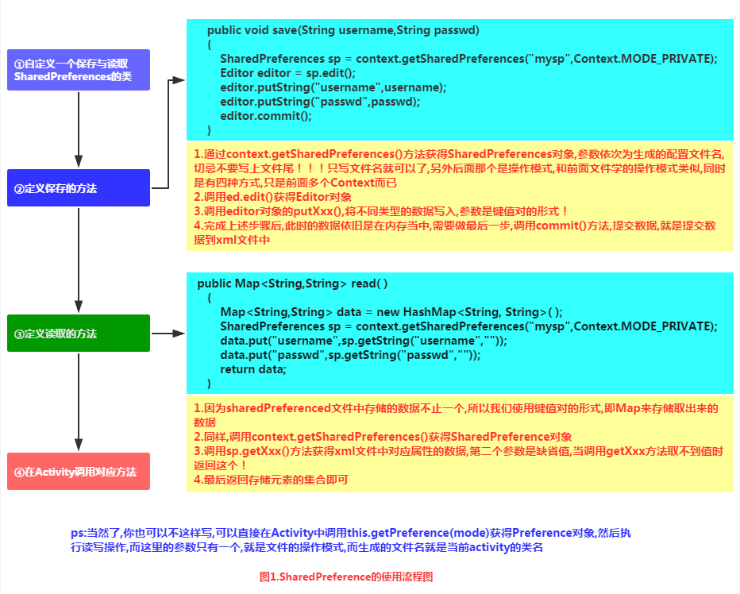
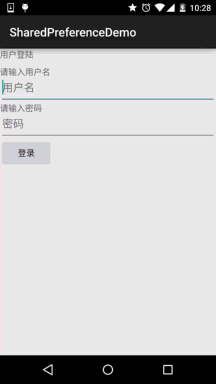
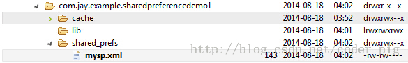
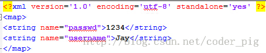
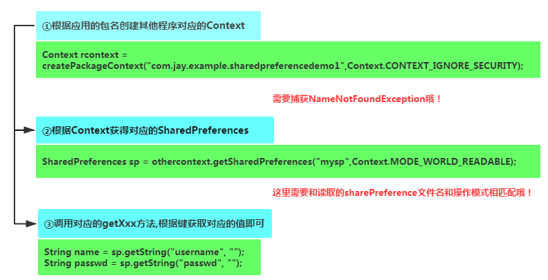
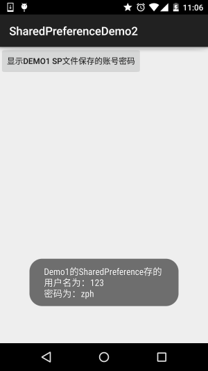
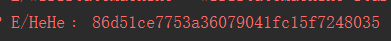
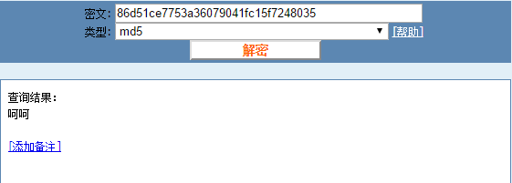
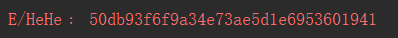
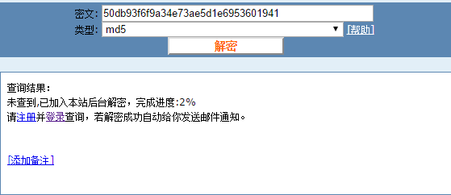

## 6.2 数据存储与访问之——SharedPreferences保存用户偏好参数

### 

## 本节引言：

> 本节给大家介绍的是第二种存储用户数据的方式，使用SharedPreferences(保存用户偏好参数)保存数据， 当我们的应用想要保存用户的一些偏好参数，比如是否自动登陆，是否记住账号密码, 是否在Wifi下才能联网等相关信息, 如果使用数据库的话, 显得有点大材小用了！我们把上面这些配置信息称为用户的偏好设置，就是用户偏好的设置，而这些配置信息通常是保存在特定的文件中！比如windows使用ini文件， 而J2SE中使用properties属性文件与xml文件来保存软件的配置信息; 而在Android中我们通常使用 一个轻量级的存储类——SharedPreferences来保存用户偏好的参数！SharedPreferences也是使用xml文件, 然后类似于Map集合, 使用键-值的形式来存储数据; 我们只需要调用SharedPreferences的getXxx(name),  就可以根据键获得对应的值！使用起来很方便！

------

## 1.SharedPreferences使用示例：

**使用流程图**：



**实现代码示例**：

**运行效果图**：

流程是输入账号密码后点击登录,将信息保存到SharedPreference文件中, 然后重启app,看到数据已经显示在文本框中了



另外保存后，我们可以在File Expoler打开data/data/<包名>可以看到在shared_prefs目录下 生成了一个xml文件(因为N5没root，这里找了以前的效果图)：



点击导出到桌面可以看到里面的内容:



**代码实现**：

布局文件**activity_main.xml**的编写：

```
<LinearLayout xmlns:android="http://schemas.android.com/apk/res/android"
    xmlns:tools="http://schemas.android.com/tools"
    android:layout_width="match_parent"
    android:layout_height="match_parent"
    android:orientation="vertical"
    tools:context=".MyActivity">

    <TextView
        android:layout_width="wrap_content"
        android:layout_height="wrap_content"
        android:text="用户登陆" />

    <TextView
        android:layout_width="wrap_content"
        android:layout_height="wrap_content"
        android:layout_marginTop="10dp"
        android:text="请输入用户名" />

    <EditText
        android:id="@+id/editname"
        android:layout_width="match_parent"
        android:layout_height="wrap_content"
        android:hint="用户名" />

    <TextView
        android:layout_width="wrap_content"
        android:layout_height="wrap_content"
        android:text="请输入密码" />

    <EditText
        android:id="@+id/editpasswd"
        android:layout_width="match_parent"
        android:layout_height="wrap_content"
        android:hint="密码"
        android:inputType="textPassword" />

    <Button
        android:id="@+id/btnlogin"
        android:layout_width="wrap_content"
        android:layout_height="wrap_content"
        android:text="登录" />
</LinearLayout>
```

编写简单的SP工具类：**SharedHelper.java**：

```
/**
 * Created by Jay on 2015/9/2 0002.
 */
public class SharedHelper {

    private Context mContext;

    public SharedHelper() {
    }

    public SharedHelper(Context mContext) {
        this.mContext = mContext;
    }


    //定义一个保存数据的方法
    public void save(String username, String passwd) {
        SharedPreferences sp = mContext.getSharedPreferences("mysp", Context.MODE_PRIVATE);
        SharedPreferences.Editor editor = sp.edit();
        editor.putString("username", username);
        editor.putString("passwd", passwd);
        editor.commit();
        Toast.makeText(mContext, "信息已写入SharedPreference中", Toast.LENGTH_SHORT).show();
    }

    //定义一个读取SP文件的方法
    public Map<String, String> read() {
        Map<String, String> data = new HashMap<String, String>();
        SharedPreferences sp = mContext.getSharedPreferences("mysp", Context.MODE_PRIVATE);
        data.put("username", sp.getString("username", ""));
        data.put("passwd", sp.getString("passwd", ""));
        return data;
    }
}
```

最后是**MainActivity.java**实现相关逻辑：

```
public class MainActivity extends AppCompatActivity {

    private EditText editname;
    private EditText editpasswd;
    private Button btnlogin;
    private String strname;
    private String strpasswd;
    private SharedHelper sh;
    private Context mContext;

    @Override
    protected void onCreate(Bundle savedInstanceState) {
        super.onCreate(savedInstanceState);
        setContentView(R.layout.activity_main);
        mContext = getApplicationContext();
        sh = new SharedHelper(mContext);
        bindViews();
    }

    private void bindViews() {
        editname = (EditText)findViewById(R.id.editname);
        editpasswd = (EditText)findViewById(R.id.editpasswd);
        btnlogin = (Button)findViewById(R.id.btnlogin);
        btnlogin.setOnClickListener(new View.OnClickListener() {
            @Override
            public void onClick(View v) {
                strname = editname.getText().toString();
                strpasswd = editpasswd.getText().toString();
                sh.save(strname, strpasswd);
            }
        });
    }

    @Override
    protected void onStart() {
        super.onStart();
        Map<String,String> data = sh.read();
        editname.setText(data.get("username"));
        editpasswd.setText(data.get("passwd"));
    }
}
```

------

## 2.读取其他应用的SharedPreferences

> **核心**： 获得其他app的Context, 而这个Context代表访问该app的全局信息的接口, 而决定应用的唯一标识是应用的包名, 所以我们可以通过应用包名获得对应app的Context 另外有一点要注意的是：其他应用的SP文件是否能被读写的前提就是SP文件是否指定了可读或者可写的权限，我们上面创建的是MODE_PRIVATE的就不可以了~所以说你像读别人的SP里的数据， 很难，另外，一些关键的信息，比如密码保存到SP里，一般都是会做加密的，所以只能自己写自己玩~ 等下会讲下常用的MD5加密方法！

**实现流程图**：



**代码示例：**

**运行效果图**：



**代码实现**：

我们读取SP的操作放在MainActivity.java中完成，点击按钮后读取SP，并通过Toast显示出来：

```
public class MainActivity extends AppCompatActivity {

    private Context othercontext;
    private SharedPreferences sp;

    @Override
    protected void onCreate(Bundle savedInstanceState) {
        super.onCreate(savedInstanceState);
        setContentView(R.layout.activity_main);
        Button btnshow = (Button) findViewById(R.id.btnshow);
        btnshow.setOnClickListener(new View.OnClickListener() {
            @Override
            public void onClick(View v) {
                //获得第一个应用的包名,从而获得对应的Context,需要对异常进行捕获
                try {
                    othercontext = createPackageContext("com.jay.sharedpreferencedemo", Context.CONTEXT_IGNORE_SECURITY);
                } catch (PackageManager.NameNotFoundException e) {
                    e.printStackTrace();
                }
                //根据Context取得对应的SharedPreferences
                sp = othercontext.getSharedPreferences("mysp", Context.MODE_WORLD_READABLE);
                String name = sp.getString("username", "");
                String passwd = sp.getString("passwd", "");
                Toast.makeText(getApplicationContext(), "Demo1的SharedPreference存的\n用户名为：" + name + "\n密码为：" + passwd, Toast.LENGTH_SHORT).show();
            }
        });
    }
}
```

------

## 3.使用MD5对SharedPreference的重要数据进行加密

> 嘿嘿，上面我们这样直接把账号密码保存到sp里，如果没root的手机，别的应用倒无法访问手机， 如果root了，然后数据给其他应用获取到，然后造成了一些后果，这...就不怪我们了，哈哈， 谁叫你root了~，这锅我们不背，的确是这样！但是作为一名有责任心的APP开发人员，我们总不能这样是吧，我们可以使用一些加密算法对用户密码进行加密，另外我们一般加密的都是用户密码！ 下面我们简画个简单的图帮助大家理解下加密的处理的流程：

### 1.简单的加密处理流程

**流程图如下**：


**流程图解析**：

> - **Step 1**.用户注册账号密码，账号密码校验后(账号是否重复，密码位数 > 6位等)， 即账号密码有效，注册成功后，我们提交给服务器的账号，以及本地加密过的密码！
> - **Step 2**.服务器端将用户提交的账号，加密过的密码保存到服务端的数据库中，也就是服务端并不会保存我们的明文密码(原始)密码！
> - **Step 3**.说回客户端，如果注册成功或者登陆成功，你想保存账号密码到SP中，保存的的密码也需要走一趟加密流程！即明文密码——>加密，再保存！如果不保存，每次请求的时候，明文密码也要走一趟家里流程，然后拿着加密后的密码来请求服务器！
> - **Step 4**.服务器验证账号以及加密密码，成功，分配客户端一个session标识，后续客户端可以拿着这个session来访问服务端提供的相关服务！

嘿嘿，理解了吧，加密的方法有很多种，小猪也不是这方面的高玩，以前使用过的加密方法是MD5 加密，本节也给大家简单介绍一下这个MD5加密，以及演示下用法~

### 2.MD5简单介绍：

**1）MD5是什么鬼？：**

> 答：Message Digest Algorithm MD5（中文名为消息摘要算法第五版）为计算机安全领域广泛使用的一种散列函数，用以提供消息的完整性保护——摘自《百度百科》 简单点说就是一种加密算法，可以将一个字符串，或者文件，压缩包，执行MD5加密后， 就可以生产一个固定长度为128bit的串！这个串基本唯一！另外我们都知道:一个十六进制需要用4个bit来表示，那么对应的MD5的字符串长度就为：128 / 4 = 32位了！另外可能你看到一些md5是16位的，只是将32位MD5码去掉了前八位以及后八位！不信么，我们来试试百度一下：md5在线解密，第一个：http://www.cmd5.com/
>
> 

**2）MD5能破解吗？**

> 答：MD5不可逆，就是说没有对应的算法，无法从生成的md5值逆向得到原始数据！ 当然暴力破解除外，简单的MD5加密后可以查MD5库~

**3）MD5值唯一吗？**

> 答：不唯一，一个原始数据只对应一个MD5值，但是一个MD5值可能对应多个原始数据！

------

### 3.MD5加密实现例子：

其实网上有很多写好的MD5的例子，百度或者谷歌一搜一大堆，这里提供下小猪用的MD5加密工具类！

**Md5Util.java**：

```
/**
 * Created by Jay on 2015/9/2 0002.
 */
public class MD5 {
    public static String getMD5(String content) {
        try {
            MessageDigest digest = MessageDigest.getInstance("MD5");
            digest.update(content.getBytes());
            return getHashString(digest);
        } catch (NoSuchAlgorithmException e) {
            e.printStackTrace();
        }
        return null;
    }

    private static String getHashString(MessageDigest digest) {
        StringBuilder builder = new StringBuilder();
        for (byte b : digest.digest()) {
            builder.append(Integer.toHexString((b >> 4) & 0xf));
            builder.append(Integer.toHexString(b & 0xf));
        }
        return builder.toString();
    }
}
```

**MainActivity.java**直接调用getMD5这个静态方法：

```
Log.e("HeHe", MD5.getMD5("呵呵"));
```

我们可以看到Logcat上打印出：




这就是加密过后的呵呵了，我们可以把这串密文拷贝到上面这个md5的在线解密网站：



嘿嘿，果然，只是这样加密一次，就直接破解了，有点不安全的样子，那就加密100次咯， 就是将加密后的字符串再加密，重复100次，我们在原先的基础上加个加密一百次的方法：

```
public static String getMD5x100(String content){
    String s1 = content;
    for(int i = 0;i < 100;i++){
        s1 = getMD5(s1);
    }
    return s1;
}
```

然后调用下，发现打印这个的Log：



复制界面网站上：



好的，装B成功~

------

## 4.SharedPreference工具类：

> 每次都要自行实例化SP相关的类，肯定很麻烦，这里贴个SP的工具类，大家可以贴到自己的项目中，工具类来源于鸿洋大神的blog~

**SPUtils.java**

```
package com.jay.sharedpreferencedemo3;

import android.content.Context;
import android.content.SharedPreferences;

import java.util.Map;

/**
 * Created by Jay on 2015/9/2 0002.
 */
public class SPUtils {
    /**
     * 保存在手机里的SP文件名
     */
    public static final String FILE_NAME = "my_sp";

    /**
     * 保存数据
     */
    public static void put(Context context, String key, Object obj) {
        SharedPreferences sp = context.getSharedPreferences(FILE_NAME, context.MODE_PRIVATE);
        SharedPreferences.Editor editor = sp.edit();
        if (obj instanceof Boolean) {
            editor.putBoolean(key, (Boolean) obj);
        } else if (obj instanceof Float) {
            editor.putFloat(key, (Float) obj);
        } else if (obj instanceof Integer) {
            editor.putInt(key, (Integer) obj);
        } else if (obj instanceof Long) {
            editor.putLong(key, (Long) obj);
        } else {
            editor.putString(key, (String) obj);
        }
        editor.commit();
    }


    /**
     * 获取指定数据
     */
    public static Object get(Context context, String key, Object defaultObj) {
        SharedPreferences sp = context.getSharedPreferences(FILE_NAME, context.MODE_PRIVATE);
        if (defaultObj instanceof Boolean) {
            return sp.getBoolean(key, (Boolean) defaultObj);
        } else if (defaultObj instanceof Float) {
            return sp.getFloat(key, (Float) defaultObj);
        } else if (defaultObj instanceof Integer) {
            return sp.getInt(key, (Integer) defaultObj);
        } else if (defaultObj instanceof Long) {
            return sp.getLong(key, (Long) defaultObj);
        } else if (defaultObj instanceof String) {
            return sp.getString(key, (String) defaultObj);
        }
        return null;
    }

    /**
     * 删除指定数据
     */
    public static void remove(Context context, String key) {
        SharedPreferences sp = context.getSharedPreferences(FILE_NAME, context.MODE_PRIVATE);
        SharedPreferences.Editor editor = sp.edit();
        editor.remove(key);
        editor.commit();
    }


    /**
     * 返回所有键值对
     */
    public static Map<String, ?> getAll(Context context) {
        SharedPreferences sp = context.getSharedPreferences(FILE_NAME, context.MODE_PRIVATE);
        Map<String, ?> map = sp.getAll();
        return map;
    }

    /**
     * 删除所有数据
     */
    public static void clear(Context context) {
        SharedPreferences sp = context.getSharedPreferences(FILE_NAME, context.MODE_PRIVATE);
        SharedPreferences.Editor editor = sp.edit();
        editor.clear();
        editor.commit();
    }

    /**
     * 检查key对应的数据是否存在
     */
    public static boolean contains(Context context, String key) {
        SharedPreferences sp = context.getSharedPreferences(FILE_NAME, context.MODE_PRIVATE);
        return sp.contains(key);
    }

}
```

------

## 5.代码下载：

**SharedPreferenceDemo.zip**：[下载 SharedPreferenceDemo.zip](https://www.runoob.com/try/download/SharedPreferenceDemo.zip) **SharedPreferenceDemo2.zip**：[下载 SharedPreferenceDemo2.zip](https://www.runoob.com/try/download/SharedPreferenceDemo2.zip) **SharedPreferenceDemo3.zip**：[下载 SharedPreferenceDemo3.zip](https://www.runoob.com/try/download/SharedPreferenceDemo3.zip)

------

## 本节小结：

> 好的，关于Android存储数据的第二种方式：SharedPreference保存用户偏好参数的内容就这么多， 应该可以满足你日常开发使用SP的需求，如果有什么遗漏，欢迎提出，谢谢~