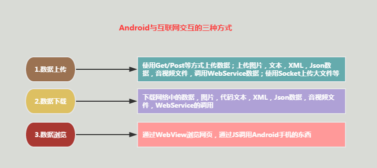
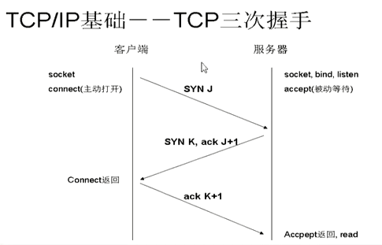
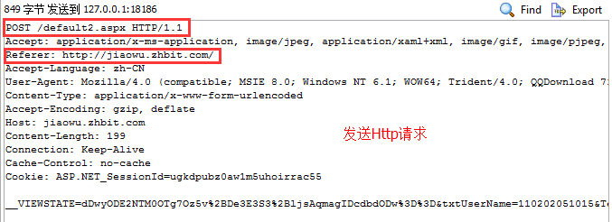
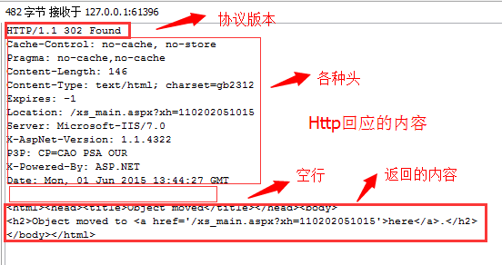
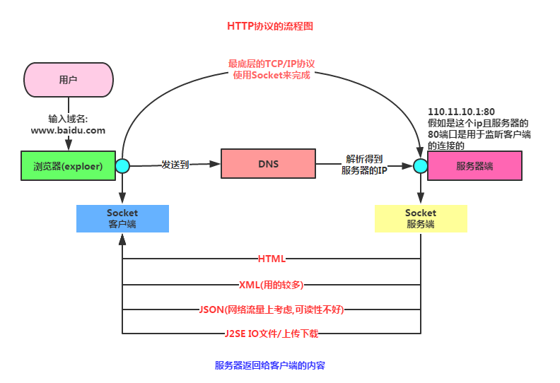

## 7.1.1 Android网络编程要学的东西与Http协议学习

### 

## 本节引言：

> 不知不觉终于来到Android网络编程这一章节，前面我们玩的都是单机，肯定是不过瘾是吧， 本节开始我们来学习Android网络编程相关的一些东西：Android端网络编程要干嘛？Http协议的学习，使用自带扣脚Json解析类解析Json，XML解析的几种常用方式，HttpUrlConnection和 HttpClient的使用，文件的上传，下载；WebService的使用，WebView，Socket通信的使用等！
>
> 另外我们是客户端，服务端的内容不在我们的范畴，而且小猪也不擅长，我们的最低要求是： **能够掌握获取与解析服务器反馈的数据的能力！** 好的，话不多说，开始本节内容！

------

## 1.Android与互联网交互的三种方式

------

## 2.初识Http协议

> 实际开发中我们和服务端打交道一般用得都是基于Http协议的通信，所以学好Http协议是非常重要的，当然，我们不用过于考究一些细节的东西，有个大体的了解即可！都是一些概念性的东西！

------

### 1）什么是Http协议？

> 答：hypertext transfer protocol（超文本传输协议），TCP/IP协议的一个应用层协议，用于定义WEB浏览器与WEB服务器之间交换数据的过程。客户端连上web服务器后，若想获得web服务器中的某个web资源，需遵守一定的通讯格式，HTTP协议用于定义客户端与web服务器通迅的格式。

### 2）Http 1.0 与 Http 1.1的区别

> 答：1.0协议，客户端与web服务器建立连接后，只能获得一个web资源！ 而1.1协议，允许客户端与web服务器建立连接后，在一个连接上获取多个web资源！

### 3）Http协议的底层工作流程：

> 答：我们先要知道两个名词：
>
> - **SYN**(synchronous): TCP/IP建立连接时使用的握手信号
> - **ACK**(Acknowledgement): 确认字符，确认发来的数据已经接受无误
>
> 接着就到**TCP/IP三次握手**的概念：
>
> - 客户端发送syn包(syn = j)到服务器，进入SYN_SEND状态，然后等待服务器确认
> - 服务器收到syn包, 确认客户的syn(ack = j + 1), 同时在自己也发送一个SYN包(syn=k)， 即SYN + ACK包，服务器进入SYN_RECV状态
> - 客户端收到SYN + ACK包，向服务器发送确认包ACK(ack = k +1), 发送完毕后，客户端与服务端 进入ESTABLISHED状态，完成三次握手，然后两者开始传送数据
>
> 如果还不是很清晰，我们再来看三次握手的示意图：
>
> 
>
> 了解了是吧，然后我们就来看看Http操作的一个流程了：
>
> - 用户点击浏览器上的url(超链接)，Web浏览器与Web服务器建立连接
> - 建立连接后，客户端发送请求给服务器，请求的格式为: 统一资源标识符(URL)+协议版本号(一般是1.1)+MIME信息(多个消息头)+一个空行
> - 服务端收到请求后，给予相应的返回信息，返回格式为: 协议版本号 + 状态行(处理结果) + 多个信息头 + 空行 + 实体内容(比如返回的HTML)
> - 客户端接收服务端返回信息，通过浏览器显示出来，然后与服务端断开连接；当然如果中途某步发生错误的话，错误信息会返回到客户端，并显示，比如：经典的404错误！
>
> 对于上面的流程如果还不清晰，我们可以使用HttpWatch或者firefox抓下包： PS:测试网站是小猪的学校的教务系统，输入账号密码后请求登陆，我们可以看到下述信息：
>
> **HTTP请求包含的内容:**
>
> 
>
> **HTTP响应包括的内容:**
>
> 
>
> 这就一目了然了是吧！

### 4）Http协议的业务流程

### 5）Http的几种请求方式

> 实际开发中我们用得较多的方式是Get和Post，但是实际开发可能还会用到其他请求方式，比如PUT， 小猪的实际项目中就用到了，下面为了方便大家，就把所有的请求方式列出来吧：
>
> - **Get**：请求获取Request-URI所标识的资源
> - **POST**：在Request-URI所标识的资源后附加新的数据
> - **HEAD** 请求获取由Request-URI所标识的资源的响应信息报头
> - **PUT**：请求服务器存储一个资源，并用Request-URI作为其标识
> - **DELETE**：请求服务器删除Request-URI所标识的资源
> - **TRACE**：请求服务器回送收到的请求信息，主要用于测试或诊断
> - **CONNECT**：保留将来使用
> - **OPTIONS**：请求查询服务器的性能，或者查询与资源相关的选项

### 6）Get和Post的对比

> 用得最多的两个，当然要做下对比啦！
>
> - **GET**：在请求的URL地址后以?的形式带上交给服务器的数据，多个数据之间以&进行分隔， 但数据容量通常不能超过2K，比如:http://xxx?username=…&pawd=…这种就是GET
> - **POST**: 这个则可以在请求的实体内容中向服务器发送数据，传输没有数量限制
> - 另外要说一点，这两个玩意都是发送数据的，只是发送机制不一样，不要相信网上说的 "GET获得服务器数据，POST向服务器发送数据"!!另外GET安全性非常低，Post安全性较高， 但是执行效率却比Post方法好，一般查询的时候我们用GET，数据增删改的时候用POST！！

------

### 7）Http状态码合集

> 当然，这些状态码只是要给参考，实际上**决定权在服务器端(后台的)**手上，一种方案是请求后， 服务器返回给我们的是状态，或者另一种，在应用不用弄多语言版本的时候最好用，直接返回 一串结果信息的Json给我们，我们直接显示就好，这样可以偷懒不少！下面列下状态码合集，参考 下就好：
>
> - 100~199 : 成功接受请求，客户端需提交下一次请求才能完成整个处理过程
> - 200: OK，客户端请求成功
> - 300~399：请求资源已移到新的地址(302,307,304)
> - 401：请求未授权，改状态代码需与WWW-Authenticate报头域一起使用
> - 403：Forbidden，服务器收到请求，但是拒绝提供服务
> - 404：Not Found，请求资源不存在，这个就不用说啦
> - 500：Internal Server Error，服务器发生不可预期的错误
> - 503：Server Unavailable，服务器当前不能处理客户端请求，一段时间后可能恢复正常

### 8）Http协议的特点

> 概念性的东西，知道就好，别去背，百度百科的东西，直接复制粘贴：
>
> **1.** **支持客户/服务器模式**。
>
> **2.** **简单快速**：客户向服务器请求服务时，只需传送请求方法和路径。请求方法常用的有GET、 HEAD、POST。每种方法规定了客户与服务器联系的类型不同。 由于HTTP协议简单，使得HTTP服务器的程序规模小，因而通信速度很快。
>
> **3.** **灵活**：HTTP允许传输任意类型的数据对象。正在传输的类型由Content-Type加以标记。
>
> **4.** **无连接**：无连接的含义是限制每次连接只处理一个请求。服务器处理完客户的请求， 并收到客户的应答后，即断开连接。采用这种方式可以节省传输时间。
>
> **5.** **无状态**：HTTP协议是无状态协议。无状态是指协议对于事务处理没有记忆能力。 缺少状态意味着如果后续处理需要前面的信息，则它必须重传，这样可能导致每 次连接传送的数据量增大。另一方面，在服务器不需要先前信息时它的应答就较快。

PS:关于OSI七层协议以及TCP四层模型就不在基础系列讲解了~有兴趣可以自行了解下！

------

## 本节小结：

> 本节讲解了我们在Android开发中涉及到网络方面的要完成的工具，以及讲解了Http协议的 相关概念，相信大家对Android移动端与服务器交互已经有了个模糊的映像，下节我们来研究 Http协议的请求头与响应头！本节就到这里，谢谢~