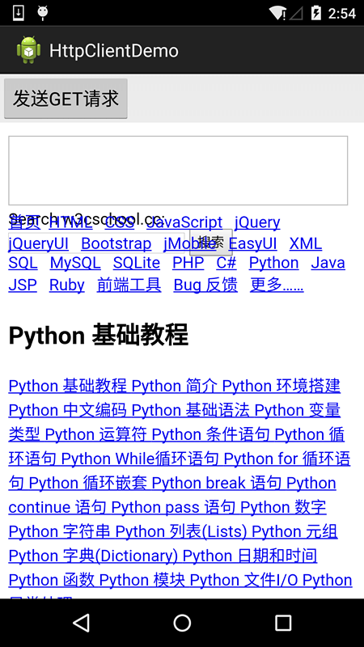

## 7.1.4 Android HTTP请求方式:HttpClient

### 

## 本节引言：

> 在上一节中我们对HttpURLConnection进行了学习，本节到第二种方式：HttpClient，尽管被Google 弃用了，但是我们我们平时也可以拿HttpClient来抓下包，配合Jsoup解析网页效果更佳！HttpClient 用于接收/发送Http请求/响应，但不缓存服务器响应，不执行HTML页面潜入的JS代码，不会对页面内容进行任何解析，处理！开始本节内容！

------

## 1.HttpClient使用流程

**基本流程**：


------

## 2.HttpClient使用示例

### 1）使用HttpClient发送GET请求

直接贴下简单的发送Get请求的代码：

```
public class MainActivity extends Activity implements OnClickListener {

    private Button btnGet;
    private WebView wView;
    public static final int SHOW_DATA = 0X123;
    private String detail = "";

    private Handler handler = new Handler() {
        public void handleMessage(Message msg) {
            if(msg.what == SHOW_DATA)
            {
                wView.loadDataWithBaseURL("",detail, "text/html","UTF-8","");
            }
        };
    };
    @Override
    protected void onCreate(Bundle savedInstanceState) {
        super.onCreate(savedInstanceState);
        setContentView(R.layout.activity_main);
        initView();
        setView();
    }

    private void initView() {
        btnGet = (Button) findViewById(R.id.btnGet);
        wView = (WebView) findViewById(R.id.wView);
    }

    private void setView() {
        btnGet.setOnClickListener(this);
        wView.getSettings().setDomStorageEnabled(true);
    }
    @Override
    public void onClick(View v) {
        if (v.getId() == R.id.btnGet) {
            GetByHttpClient();
        }
    }
    private void GetByHttpClient() {
        new Thread()
        {
            public void run() 
            {
                    try {
                        HttpClient httpClient = new DefaultHttpClient();
                        HttpGet httpGet = new HttpGet("http://www.w3cschool.cc/python/python-tutorial.html");
                        HttpResponse httpResponse = httpClient.execute(httpGet);
                        if (httpResponse.getStatusLine().getStatusCode() == 200) {
                            HttpEntity entity = httpResponse.getEntity();
                            detail = EntityUtils.toString(entity, "utf-8");
                            handler.sendEmptyMessage(SHOW_DATA);
                        }
                    } catch (Exception e) {
                        e.printStackTrace();
                    }
            };
        }.start();
    }

}
```

**运行截图**



另外，如果是带有参数的GET请求的话，我们可以将参数放到一个List集合中，再对参数进行URL编码， 最后和URL拼接下就好了：

```
List<BasicNameValuePair> params = new LinkedList<BasicNameValuePair>();  
params.add(new BasicNameValuePair("user", "猪小弟"));  
params.add(new BasicNameValuePair("pawd", "123"));
String param = URLEncodedUtils.format(params, "UTF-8"); 
HttpGet httpGet = new HttpGet("http://www.baidu.com"+"?"+param);
```

------

### 2）使用HttpClient发送POST请求

> POST请求比GET稍微复杂一点，创建完HttpPost对象后，通过NameValuePair集合来存储等待提交的参数，并将参数传递到UrlEncodedFormEntity中，最后调用setEntity(entity)完成， HttpClient.execute(HttpPost)即可；这里就不写例子了，暂时没找到Post的网站，又不想自己写个Servlet，So,直接贴核心代码吧~

**核心代码**:

```
private void PostByHttpClient(final String url)
{
    new Thread()
    {
        public void run() 
        {
            try{
                HttpClient httpClient = new DefaultHttpClient();
                HttpPost httpPost = new HttpPost(url);
                List<NameValuePair> params = new ArrayList<NameValuePair>();
                params.add(new BasicNameValuePair("user", "猪大哥"));
                params.add(new BasicNameValuePair("pawd", "123"));
                UrlEncodedFormEntity entity = new UrlEncodedFormEntity(params,"UTF-8");
                httpPost.setEntity(entity);
                HttpResponse httpResponse =  httpClient.execute(httpPost);
                if (httpResponse.getStatusLine().getStatusCode() == 200) {
                    HttpEntity entity2 = httpResponse.getEntity();
                    detail = EntityUtils.toString(entity2, "utf-8");
                    handler.sendEmptyMessage(SHOW_DATA);
                }
            }catch(Exception e){e.printStackTrace();}
        };
    }.start();
}
```

------

## 3.HttpClient抓数据示例(教务系统数据抓取)

> 其实关于HttpClient的例子有很多，比如笔者曾经用它来抓学校教务系统上学生的课程表: 这就涉及到Cookie，模拟登陆的东西，说到抓数据(爬虫)，一般我们是搭配着JSoup来解析抓到数据的，有兴趣可以自己查阅相关资料，这里贴下笔者毕设app里获取网页部分的关键 代码！大家可以体会下：

HttpClient可以通过下述代码获取与设置Cookie： **HttpResponse loginResponse = new DefaultHttpClient().execute(getLogin);** 获得Cookie:**cookie = loginResponse.getFirstHeader("Set-Cookie").getValue();** 请求时带上Cookie**:httpPost.setHeader("Cookie", cookie);**

```
//获得链接,模拟登录的实现:
public int getConnect(String user, String key) throws Exception {
    // 先发送get请求 获取cookie值和__ViewState值
    HttpGet getLogin = new HttpGet(true_url);
    // 第一步:主要的HTML:
    String loginhtml = "";
    HttpResponse loginResponse = new DefaultHttpClient().execute(getLogin);
    if (loginResponse.getStatusLine().getStatusCode() == 200) {
        HttpEntity entity = loginResponse.getEntity();
        loginhtml = EntityUtils.toString(entity);
        // 获取响应的cookie值
        cookie = loginResponse.getFirstHeader("Set-Cookie").getValue();
        System.out.println("cookie= " + cookie);
    }

    // 第二步:模拟登录
    // 发送Post请求,禁止重定向
    HttpPost httpPost = new HttpPost(true_url);
    httpPost.getParams().setParameter(ClientPNames.HANDLE_REDIRECTS, false);

    // 设置Post提交的头信息的参数
    httpPost.setHeader("User-Agent",
            "Mozilla/5.0 (Windows NT 6.3; WOW64; Trident/7.0; rv:11.0) like Gecko");
    httpPost.setHeader("Referer", true_url);
    httpPost.setHeader("Cookie", cookie);

    // 设置请求数据
    List<NameValuePair> params = new ArrayList<NameValuePair>();

    params.add(new BasicNameValuePair("__VIEWSTATE",
            getViewState(loginhtml)));// __VIEWSTATE参数，如果变化可以动态抓取获取
    params.add(new BasicNameValuePair("Button1", ""));
    params.add(new BasicNameValuePair("hidPdrs", ""));
    params.add(new BasicNameValuePair("hidsc", ""));
    params.add(new BasicNameValuePair("lbLanguage", ""));
    params.add(new BasicNameValuePair("RadioButtonList1", "%D1%A7%C9%FA"));
    params.add(new BasicNameValuePair("txtUserName", user));
    params.add(new BasicNameValuePair("TextBox2", key));
    params.add(new BasicNameValuePair("txtSecretCode", "")); // ( ╯□╰ )逗比正方,竟然不需要验证码

    // 设置编码方式,响应请求,获取响应状态码:
    httpPost.setEntity(new UrlEncodedFormEntity(params, "gb2312"));
    HttpResponse response = new DefaultHttpClient().execute(httpPost);
    int Status = response.getStatusLine().getStatusCode();
    if(Status == 200)return Status;
    System.out.println("Status= " + Status);

    // 重定向状态码为302
    if (Status == 302 || Status == 301) {
        // 获取头部信息中Location的值
        location = response.getFirstHeader("Location").getValue();
        System.out.println(location);
        // 第三步:获取管理信息的主页面
        // Get请求
        HttpGet httpGet = new HttpGet(ip_url + location);// 带上location地址访问
        httpGet.setHeader("Referer", true_url);
        httpGet.setHeader("Cookie", cookie);

        // 主页的html
        mainhtml = "";
        HttpResponse httpResponseget = new DefaultHttpClient()
                .execute(httpGet);
        if (httpResponseget.getStatusLine().getStatusCode() == 200) {
            HttpEntity entity = httpResponseget.getEntity();
            mainhtml = EntityUtils.toString(entity);
        }

    }
    return Status;
}
```

------

## 4.使用HttpPut发送Put请求

**示例代码如下**：

```
public static int PutActCode(String actCode, String licPlate, Context mContext) {
    int resp = 0;
    String cookie = (String) SPUtils.get(mContext, "session", "");
    HttpPut httpPut = new HttpPut(PUTACKCODE_URL);
    httpPut.setHeader("Cookie", cookie);
    try {

        List<NameValuePair> params = new ArrayList<NameValuePair>();
        params.add(new BasicNameValuePair("activation_code", actCode));
        params.add(new BasicNameValuePair("license_plate", licPlate));
        httpPut.setEntity(new UrlEncodedFormEntity(params, "UTF-8"));
        HttpResponse course_response = new DefaultHttpClient().execute(httpPut);
        if (course_response.getStatusLine().getStatusCode() == 200) {
            HttpEntity entity2 = course_response.getEntity();
            JSONObject jObject = new JSONObject(EntityUtils.toString(entity2));
            resp = Integer.parseInt(jObject.getString("status_code"));
            return resp;
        }
    } catch (Exception e) {
        e.printStackTrace();
    }
    return resp;
}
```

------

## 本节小结：

> 好的，本节关于Android HTTP的第二种请求方式:HttpClient就到这里， 下节开始我们来学习XML以及Json的解析，本节就到这里，谢谢~