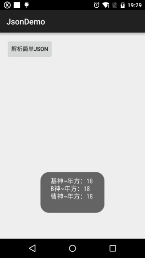
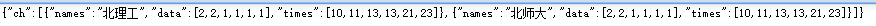
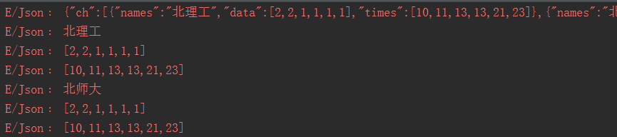

## 7.2.2 Android JSON数据解析

### 

## 本节引言：

> 相信大家肯定对 Json 不陌生吧，我们和服务器交互一般用得较多的数据传递方式都是 Json 字符串的形式， 保存对象，我们也可以写成一个 Json 字符串然后存储！解析 Json 不知道你用的是 Gson，Fastjson，jackson 等，不过本节我们并不会去用这些第三方的解析库，而是使用 Android 自带的 Json 解析器来解析 Json！ 好的，开始本节内容！

------

## 1.Json概念以及与XML的比较

**1）Json是什么？**

> 答：JavaScript Object Natation, 一种轻量级的数据交换格式, 与XML一样, 广泛被采用的客户端和服务端交互的解决方案！具有良好的可读和便于快速编写的特性。

**2）Json与XML的比较**：

> - JSON和XML的数据可读性基本相同;
> - JSON和XML同样拥有丰富的解析手段
> - JSON相对于XML来讲，数据的体积小
> - JSON与JavaScript的交互更加方便
> - JSON对数据的描述性比XML较差
> - JSON的速度要远远快于XML
>
> PS:上述来自于百度~简单点说Json的优点：体积小，节省流量，只是不如XML直观，可读性稍微差一点而已！

**3）Json的格式规范**：

> 就像协议一样，肯定是有一套规范的，毕竟双方都是通过Json字符串来传递数据，语法规则如下： **数据在名称/值对中**；**数据由逗号分隔**；**花括号保存对象**；**方括号保存数组**； 而Json数据的书写格式：**名称/值对** 比如： **"person"："coder-pig"** 比如一个简单的Json字符串：

```
[
    { "id":"1","name":"基神","age":"18" },
    { "id":"2","name":"B神","age":"18"  },
    { "id":"3","name":"曹神","age":"18" }
]
```

> 我们除了解析Json还可以自己拼接Json，当然如果你自己拼了一个Json字符串又不知道对不对， 可以百度随便找一个校验工具，比如： [http://www.runoob.com/jsontool](https://www.runoob.com/jsontool)把Json字符串贴上去，校验下就好！

------

## 2.Android给我们提供的Json解析类

> 这些API都存在于org.json包下，而我们用到的类有下面这些：
>
> - **JSONObject**： Json对象，可以完成Json字符串与Java对象的相互转换
> - **JSONArray**： Json数组，可以完成Json字符串与Java集合或对象的相互转换
> - **JSONStringer**： Json文本构建类，这个类可以帮助快速和便捷的创建JSON text， 每个JSONStringer实体只能对应创建一个JSON text
> - **JSONTokener**：Json解析类
> - **JSONException**：Json异常

------

## 3.代码示例：解析Json字符串：

PS:这里我们就不另外写servlet或者请求网站，直接把Json写到字符串中来解析，模拟下就算了！

### 1)简单的Json字符串解析示例：

我们解析的是上面这个简单的Json，首先我们来写一个POJO类：

**Person.java**：

```
/**
 * Created by Jay on 2015/9/8 0008.
 */
public class Person {
    private String id;
    private String name;
    private String age;
    
    public void setId(String id){
        this.id = id;
    }
    public String getId(){
        return this.id;
    }
    public void setName(String name){
        this.name = name;
    }
    public String getName(){
        return this.name;
    }
    public void setAge(String age){
        this.age = age;
    }
    public String getAge(){
        return this.age;
    }
    
    @Override
    public String toString() {
        return this.name + "~年方：" + this.age;
    }
}
```

写一个解析上述Json字符串的方法：

```
private void parseEasyJson(String json){
    persons = new ArrayList<Person>();
    try{
        JSONArray jsonArray = new JSONArray(json);
        for(int i = 0;i < jsonArray.length();i++){
            JSONObject jsonObject = (JSONObject) jsonArray.get(i);
            Person person = new Person();
            person.setId(i+"");
            person.setName(jsonObject.getString("name"));
            person.setAge(jsonObject.getString("age"));
            persons.add(person);
        }
    }catch (Exception e){e.printStackTrace();}
}
```

**运行效果图**：



嘿嘿，很简单是吧，接下来我们找一个复杂点的！

------

### 2)复杂的Json字符串解析示例：

如果是这样的Json字符串呢？



呵呵，那就需要我们一步步来扣数据了：

**解析代码如下**：

```
private void parseDiffJson(String json) {
    try {
        JSONObject jsonObject1 = new JSONObject(json);
        Log.e("Json", json);
        JSONArray jsonArray = jsonObject1.getJSONArray("ch");
        for (int i = 0; i < jsonArray.length(); i++) {
            JSONObject jsonObject = (JSONObject) jsonArray.get(i);
            //取出name
            String sname = jsonObject.getString("names");
            JSONArray jarray1 = jsonObject.getJSONArray("data");
            JSONArray jarray2 = jsonObject.getJSONArray("times");åå
            Log.e("Json", sname);
            Log.e("Json", jarray1.toString());
            Log.e("Json", jarray2.toString());
        }
    } catch (Exception e) {
        e.printStackTrace();
    }

}
```

**看下打印的Log**:



当然还有一层，有兴趣你就自己扣...

------

## 本节小结：

> 好的，使用Android给我们提供的扣脚Json解析类果然要慢慢扣，当然你也可以将解析的过程 反过来，自己拼接JSON，时间关系，这里就慢慢拼接了，哈哈，当然进阶部分我们 学习了第三方的一些Json解析库就轻松多了，~好的，本节就到这里，谢谢~