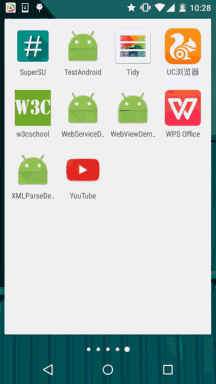

## 7.5.1 WebView(网页视图)基本用法

### 

## 本节引言

> 本节给大家带来的是Android中的一个用于显示网页的控件：**WebView**(网页视图)。
>
> 现在Android应用层开发的方向有两种：客户端开发和HTML5移动端开发！
>
> 所谓的HTML5端就是：HTML5 + CSS + JS来构建一个网页版的应用, 而这中间的媒介就是这个WebView, 而Web和网页端可以通过JS来进行交互, 比如, 网页读取手机联系人, 调用手机相关的API等！
>
> 而且相比起普通的客户端开发, HTML5移动端有个优势： 可以用百分比来布局, 而且如果HTML5端有什么大改, 我们不用像客户端那样去重新下一个APP, 然后 覆盖安装, 我们只需修改下网页即可！而客户端...惨不忍睹, 当然HTML5也有个缺点, 就是性能的问题,  数据积累, 耗电问题, 还有闪屏等等...
>
> 另外, 针对这种跨平台我们可以使用其他的第三方快速开发框架, 比如PhoneGap, 对了, 还有现在网络上很多一键生成APP类的网站, 用户通过拖拉, 设置图片 之类的简单操作就可以生成一个应用, 大部分都是用的HTML5来完成的！有模板, 直接套, 你懂的~ 好的, 话不多说, 开始本节内容！

## 1.什么是WebView？

> 答：Android内置webkit内核的高性能浏览器,而WebView则是在这个基础上进行封装后的一个控件, WebView直译网页视图, 我们可以简单的看作一个可以嵌套到界面上的一个浏览器控件！

## 2.相关方法

> 先上官方文档：[WebView](http://androiddoc.qiniudn.com/reference/android/webkit/WebView.html) 并不打算一个个地去讲属性,用到哪个写哪个,其他的自行查阅文档！ 除了直接WebView外我们还可以添加你自己的行为,可以自行定制下述类：

------

**WebChromeClient**：辅助WebView处理Javascript的对话框、网站图标、网站title、加载进度等！ 比如下面这些：

| 方法                                                         | 作用                       |
| :----------------------------------------------------------- | :------------------------- |
| **onJsAlert**(WebView view,String url,String message,JsResult result) | 处理Js中的Alert对话框      |
| **onJsConfirm**(WebView view,String url,String message,JsResult result) | 处理Js中的Confirm对话框    |
| **onJsPrompt**(WebView view,String url,String message,String defaultValue,JsPromptResult result) | 处理Js中的Prompt对话框     |
| **onProgressChanged**(WebView view,int newProgress)          | 当加载进度条发生改变时调用 |
| **onReceivedIcon**(WebView view, Bitmap icon)                | 获得网页的icon             |
| **onReceivedTitle**(WebView view, String title)              | 获得网页的标题             |

------

**WebViewClient**：辅助WebView处理各种通知与请求事件！ 比如下面这些方法：

| 方法                                                         | 作用                                                         |
| :----------------------------------------------------------- | :----------------------------------------------------------- |
| **onPageStared**(WebView view,String url)                    | 通知主程序网页开始加载                                       |
| **onPageFinished**(WebView view,String url,Bitmap favicon)   | 通知主程序, 网页加载完毕                                     |
| **doUpdateVisitedHistory**(WebView view,String url,boolean isReload) | 更新历史记录                                                 |
| **onLoadResource**(WebView view,String url)                  | 通知主程序WebView即将加载指定url的资源                       |
| **onScaleChanged**(WebView view,float oldScale,float newScale) | ViewView的缩放发生改变时调用                                 |
| **shouldOverrideKeyEvent**(WebView view,KeyEvent event)      | 控制webView是否处理按键事件,  如果返回true, 则WebView不处理, 返回false则处理 |
| **shouldOverrideUrlLoading**(WebView view,String url)        | 控制对新加载的Url的处理, 返回true, 说明主程序处理WebView不做处理, 返回false意味着WebView会对其进行处理 |
| **onReceivedError**(WebView view,int errorCode,String description,String failingUrl) | 遇到不可恢复的错误信息时调用                                 |

------

**WebSettings**：WebView相关配置的设置，比如setJavaScriptEnabled()设置是否允许JS脚本执行 部分方法如下：

| 方法                                                         | 作用                                                         |
| :----------------------------------------------------------- | :----------------------------------------------------------- |
| **getSettings**()                                            | 返回一个WebSettings对象, 用来控制WebView的属性设置           |
| **loadUrl**(String url)                                      | 加载指定的Url                                                |
| **loadData**(String data,String mimeType, String encoding)   | 加载指定的Data到WebView中.使用"data:"作为标记头,该方法不能加载网络数据.其中mimeType为数据类型如:textml,image/jpeg. encoding为字符的编码方式 |
| **loadDataWithBaseURL**(String baseUrl, String data, String mimeType, String encoding, String historyUrl) | 比上面的loadData更加强大                                     |
| **setWebViewClient**(WebViewClient client)                   | 为WebView指定一个WebViewClient对象.WebViewClient可以辅助WebView处理各种通知,请求等事件。 |
| **setWebChromeClient**(WebChromeClient client)               | 为WebView指定一个WebChromeClient对象,WebChromeClient专门用来辅助WebView处理js的对话框, 网站title, 网站图标, 加载进度条等 |

这里重要区分三个load方法的区别：

> **loadUrl**()：直接显示网页内容(单独显示网络图片)，一般不会出现乱码。 **loadData**(data, "text/html", "UTF-8")：用来加载URI格式的数据，不能通过网络来加载内容， 不能加载图片，而且经常会遇到乱码的问题，我们知道String类型的数据主要是Unicode编码的， 而WebView一般为了节省资源使用的是UTF-8编码，尽管我们按上面写了，但是还需要为webView设置： webview.getSettings().setDefaultTextEncodingName("UTF -8"); **loadDataWithBaseURL**(baseUrl, string, "text/html", "utf-8", null)：loadData类的一个增强类，可以加载图片，baseUrl为你存储的图片路径，而且只需在这里设置utf-8就可以解决乱码问题了！

这里只是列举了部分属性而已，其他的还需自行查阅官方文档：

[WebChromeClient文档](http://androiddoc.qiniudn.com/reference/android/webkit/WebChromeClient.html)

[WebViewClient文档](http://androiddoc.qiniudn.com/reference/android/webkit/WebViewClient.html)

[WebSettings文档](http://androiddoc.qiniudn.com/reference/android/webkit/WebSettings.html)

------

## 3.一些常见需求讲解

### 需求1：根据URL加载网页

**1）直接在Activity上加载一个WebView**


**实现代码**：

```
public class MainActivity extends AppCompatActivity {

    private WebView webView;
    private long exitTime = 0;

    @Override
    protected void onCreate(Bundle savedInstanceState) {
        super.onCreate(savedInstanceState);
        setContentView(R.layout.activity_main);
        webView = new WebView(this);
        webView.setWebViewClient(new WebViewClient() {
            //设置在webView点击打开的新网页在当前界面显示,而不跳转到新的浏览器中
            @Override
            public boolean shouldOverrideUrlLoading(WebView view, String url) {
                view.loadUrl(url);
                return true;
            }
        });
        webView.getSettings().setJavaScriptEnabled(true);  //设置WebView属性,运行执行js脚本
        webView.loadUrl("http://www.baidu.com/");          //调用loadUrl方法为WebView加入链接
        setContentView(webView);                           //调用Activity提供的setContentView将webView显示出来
    }


    //我们需要重写回退按钮的时间,当用户点击回退按钮：
    //1.webView.canGoBack()判断网页是否能后退,可以则goback()
    //2.如果不可以连续点击两次退出App,否则弹出提示Toast
    @Override
    public void onBackPressed() {
        if (webView.canGoBack()) {
            webView.goBack();
        } else {
            if ((System.currentTimeMillis() - exitTime) > 2000) {
                Toast.makeText(getApplicationContext(), "再按一次退出程序",
                        Toast.LENGTH_SHORT).show();
                exitTime = System.currentTimeMillis();
            } else {
                super.onBackPressed();
            }

        }
    }
}
```

------

**2）布局代码中设置WebView**

相信大家都见过很多的新闻类App吧或者门户信息类的App,他的结构可能是这样的：


左上角一个点击关闭当前Activity的按钮, 中间是新闻的title, 右面是一个刷新按钮, 而在右下角可能有这样一个悬浮的按钮, 当我们滑动超过屏幕宽度他就会显示出来, 当用户点击后又会回滚到网页的顶部！下面我们来简单的实现下！

**运行效果图**：



**实现代码**：

**MainActivity.java**：

```
public class MainActivity extends AppCompatActivity implements View.OnClickListener {


    private Button btn_back;
    private TextView txt_title;
    private Button btn_top;
    private Button btn_refresh;
    private WebView wView;
    private long exitTime = 0;

    @Override
    protected void onCreate(Bundle savedInstanceState) {
        super.onCreate(savedInstanceState);
        setContentView(R.layout.activity_main);
        bindViews();
    }


    private void bindViews() {
        btn_back = (Button) findViewById(R.id.btn_back);
        txt_title = (TextView) findViewById(R.id.txt_title);
        btn_top = (Button) findViewById(R.id.btn_top);
        btn_refresh = (Button) findViewById(R.id.btn_refresh);
        wView = (WebView) findViewById(R.id.wView);

        btn_back.setOnClickListener(this);
        btn_refresh.setOnClickListener(this);
        btn_top.setOnClickListener(this);

        wView.loadUrl("http://www.baidu.com");
        wView.setWebChromeClient(new WebChromeClient() {
            //这里设置获取到的网站title
            @Override
            public void onReceivedTitle(WebView view, String title) {
                super.onReceivedTitle(view, title);
                txt_title.setText(title);
            }
        });


        wView.setWebViewClient(new WebViewClient() {
            //在webview里打开新链接
            @Override
            public boolean shouldOverrideUrlLoading(WebView view, String url) {
                view.loadUrl(url);
                return true;
            }
        });
    }

    @Override
    public void onClick(View v) {
        switch (v.getId()) {
            case R.id.btn_back:
                finish();          //关闭当前Activity
                break;
            case R.id.btn_refresh:
                wView.reload();    //刷新当前页面
                break;
            case R.id.btn_top:
                wView.setScrollY(0);   //滚动到顶部
                break;
        }
    }
    
    @Override
    public void onBackPressed() {
        if (wView.canGoBack()) {
            wView.goBack();
        } else {
            if ((System.currentTimeMillis() - exitTime) > 2000) {
                Toast.makeText(getApplicationContext(), "再按一次退出程序",
                        Toast.LENGTH_SHORT).show();
                exitTime = System.currentTimeMillis();
            } else {
                finish();
            }

        }
    }
}
```

**问题答疑**：

相信细心的朋友看到，我们回到一开始加载的页面后，按返回键，按了多次还是没有退出当前的APP，后来还是我们手动去点back键通过调用finish方法才能关闭当前的Activity? 这是为什么呢？明明百度一下已经是第一个页面啊？

> 答：其实发生这个的原因是：网址的重定向问题引起的，其实我们在访问百度的时候：
>
> 尽管我们load的是www.baidu.com，但是百度做了重定向，跳转到了手机版百度一下网页： 即实际你的流程是：www.baidu.com -> 手机版百度一下 -> 打开其他的链接！
>
> 我们看到我们上面shouldOverrideUrlLoading()方法是这样写的：
>
> **view.loadUrl(url);return true;** 
>
> 我们知道用户点击一次回退键，那么webview会调用一次goback方法()，我们把上面三个 设做A,B,C三个站点，在C时点回退，C - > B没问题，接着再点 B -> A，这个时候问题就来了尽管B来到了A，但是因为重定向又跳转到了B，如此循环往复...这就是为什么点击回退键并没有退出WebView的原因，解决方法：手速，在webview未加载完网页前连续双击回退键，手速要够快，哈哈！说笑而已，要解决这个问题，我们只需将 shouldOverrideUrlLoading里的东东删掉，然后写上**return false**；即可！ 不信是重定向，可以自己修改下URL试试~

------

### 需求2：WebView滚动事件的监听

我们都知道监听滚动事件一般都是设置setOnScrollChangedListener，可惜的是 WebView并没有给我们提供这样的方法，但是我们可以重写WebView，覆盖里面的一个方法： protected void onScrollChanged(final int l, final int t, final int oldl,final int oldt){} 然后再对外提供一个接口，示例代码如下：

**MyWebViewDemo.java**：

```
/**
 * Created by Jay on 2015/9/11 0011.
 */
public class MyWebView extends WebView {

    private OnScrollChangedCallback mOnScrollChangedCallback;

    public MyWebView(Context context) {
        super(context);
    }

    public MyWebView(Context context, AttributeSet attrs) {
        super(context, attrs);
    }

    public MyWebView(Context context, AttributeSet attrs, int defStyleAttr) {
        super(context, attrs, defStyleAttr);
    }

    @Override
    protected void onScrollChanged(int l, int t, int oldl, int oldt) {
        super.onScrollChanged(l, t, oldl, oldt);
        if (mOnScrollChangedCallback != null) {
            mOnScrollChangedCallback.onScroll(l - oldl, t - oldt);
        }
    }

    public OnScrollChangedCallback getOnScrollChangedCallback() {
        return mOnScrollChangedCallback;
    }

    public void setOnScrollChangedCallback(
            final OnScrollChangedCallback onScrollChangedCallback) {
        mOnScrollChangedCallback = onScrollChangedCallback;
    }

    public static interface OnScrollChangedCallback {
        //这里的dx和dy代表的是x轴和y轴上的偏移量，你也可以自己把l, t, oldl, oldt四个参数暴露出来
        public void onScroll(int dx, int dy);
    }

}
```

**MainActivity.java**:

```
public class MainActivity extends AppCompatActivity {

    private MyWebView wView;
    private Button btn_icon;
    private long exitTime = 0;

    @Override
    protected void onCreate(Bundle savedInstanceState) {
        super.onCreate(savedInstanceState);
        setContentView(R.layout.activity_main);
        btn_icon = (Button) findViewById(R.id.btn_icon);
        wView = (MyWebView) findViewById(R.id.wView);
        wView.loadUrl("http://www.hao123.com");
        wView.setWebViewClient(new WebViewClient() {
            //在webview里打开新链接
            @Override
            public boolean shouldOverrideUrlLoading(WebView view, String url) {
                view.loadUrl(url);
                return true;
            }
        });

        //比如这里做一个简单的判断，当页面发生滚动，显示那个Button
        wView.setOnScrollChangedCallback(new MyWebView.OnScrollChangedCallback() {
            @Override
            public void onScroll(int dx, int dy) {
                if (dy > 0) {
                    btn_icon.setVisibility(View.VISIBLE);
                } else {
                    btn_icon.setVisibility(View.GONE);
                }
            }
        });

        btn_icon.setOnClickListener(new View.OnClickListener() {
            @Override
            public void onClick(View v) {
                wView.setScrollY(0);
                btn_icon.setVisibility(View.GONE);
            }
        });

    }

    @Override
    public void onBackPressed() {
        if (wView.canGoBack()) {
            wView.goBack();
        } else {
            if ((System.currentTimeMillis() - exitTime) > 2000) {
                Toast.makeText(getApplicationContext(), "再按一次退出程序",
                        Toast.LENGTH_SHORT).show();
                exitTime = System.currentTimeMillis();
            } else {
                finish();
            }

        }
    }
}
```

**运行效果图**：


当网页开始滚动，会呈现一个呵呵的按钮，我们点击呵呵按钮可以回到顶部！ 然后呵呵按钮会隐藏~

------

### 需求3：滚动条的问题

> 你可能用的属性如下：
>
> - setHorizontalScrollBarEnabled(false);//水平不显示
> - setVerticalScrollBarEnabled(false); //垂直不显示
> - setScrollBarStyle(View.SCROLLBARS_OUTSIDE_OVERLAY);//滚动条在WebView内侧显示
> - setScrollBarStyle(View.SCROLLBARS_INSIDE_OVERLAY)//滚动条在WebView外侧显示

------

### 需求4：设置缩放以及自适应屏幕

根据我们一般的习惯打开网页对于看不清楚的地方，我们喜欢双指来缩放网页，而WebView 则需要我们自己手动来设置这个是否支持缩放了！

只需要在加入下述代码即可：

```
WebSettings settings = wView.getSettings();
settings.setUseWideViewPort(true);//设定支持viewport
settings.setLoadWithOverviewMode(true);   //自适应屏幕
settings.setBuiltInZoomControls(true);
settings.setDisplayZoomControls(false);
settings.setSupportZoom(true);//设定支持缩放
```

使用上述代码后，进去页面就会是这样一个效果：


当我们缩放时，出现了一个恶心的问题，就是很常见的缩放控件，我们肯定是不想要的啦， 那么加上下面句代码就可以把缩放控件给隐藏掉了！

```
settings.setDisplayZoomControls(false);
```

我们也可以自行设置初始的缩放比例，只需为webView：

```
wView.setInitialScale(25);//为25%，最小缩放等级
```

嘿嘿，上面是整个网页都缩放的，不过可能有时我们仅仅是需要对字体进行缩放，那么可以 这样做：

```
settings.setTextZoom(int)；
```

也可以直接通过：

```
settings.setTextSize(TextSize.LARGER)；
```

来设置大小。

Android自带五个可选字体大小的值：SMALLEST(50%),SMALLER(75%),NORMAL(100%),LARGER(150%), LARGEST(200%)。

------

### 需求5.获取WebView的Cookie数据

我们都知道Cookie其实只是一个代表用户唯一标识的字符串，情景一般是： 用户输入账号密码后，点击登陆，用户要拿着这个Cookie去访问服务器提供的相关服务！ 我们可以把cookie的获取写到onPageFinsihed的方法中，简单的可以这样写：

```
@Override
public void onPageFinished(WebView view, String url) {             
    CookieManager cookieManager = CookieManager.getInstance();
    String CookieStr = cookieManager.getCookie(url);
    Log.e("HEHE", "Cookies = " + CookieStr);
    super.onPageFinished(view, url);
}
```

------

### 需求6.设置WebView的Cookie数据

嘿嘿，我们上面获取到了Cookie或者通过其他途径获得了Cookie，我们如何为WebView设置Cookie呢？ 我们可以在需要设置Cookie的地方加入下述代码：

```
CookieSyncManager.createInstance(MainActivity.this);  
CookieManager cookieManager = CookieManager.getInstance();  
cookieManager.setAcceptCookie(true);  
cookieManager.setCookie(url, cookies);  //cookies是要设置的cookie字符串 
CookieSyncManager.getInstance().sync();
```

对了，上述代码需要写在loadUrl()之前，而且如果设置了Cookie了，尽量别再进行其他的设置不然可能会无效，建议设置cookie的写在webView相关设置的最后面~loadUrl()之前!

------

## 4.示例代码下载：

WebViewDemo1：[下载 WebViewDemo1.zip](https://www.runoob.com/try/download/WebViewDemo1.zip)

WebViewDemo2：[下载 WebViewDemo2.zip](https://www.runoob.com/try/download/WebViewDemo2.zip)

------

## 本节小结：

> 好的，本节给大家介绍了一下WebView的基本用法，加载网页，设置缩放，字体缩放， 自适应屏幕，以及Cookie的获取以及设置；相信日常开发中还有各种奇葩的需求，不过 限于篇幅就写这么多，有idea的欢迎留言，下节我们来学习HTML5端如何通过JavaScript 来与WebView交互，并获取手机的相关数据！敬请期待~谢谢~