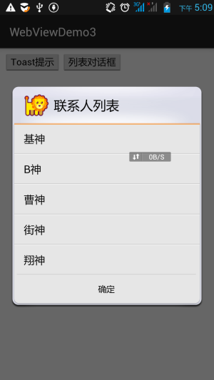
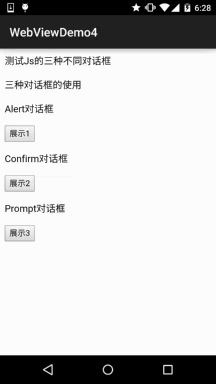
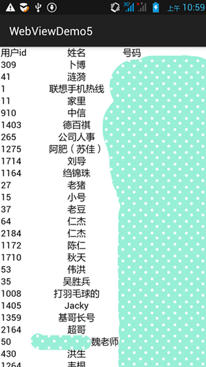
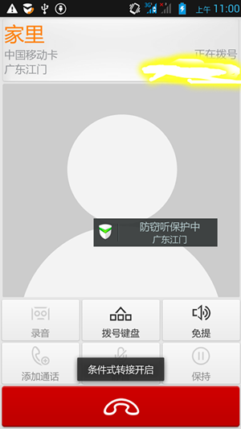

## 7.5.2 WebView和JavaScrip交互基础

### 

## 本节引言：

> 在上一节中我们对Android的WebView(网页视图)进行了学习，相信已经了解了WebView的基本用法；
>
> 而本节我们要学习的就是通过：**HTML** -> **JS** ->**Java**来完成HTML5端与Android手机间的互访！好的，话不多说，有码有真相，让我们通过编写代码来体验这种微妙的联系吧~
>
> PS：为了方便，本节用到的HTML都是以文件的形式放到assets目录下，只需通过 loadUrl("file:///android_asset/~")即可加载对应的HTML~

------

## 1.核心步骤讲解：

**首先**，我们定义一个类，用于将数据暴露出来，JS通过该类暴露的方法(**Public**)来调用Android！

**接着**，我们在WebView所在页面Activity，使用下述代码:
**webview.getSettings().setJavaScriptEnabled(true);**
**webview.addJavascriptInterface(object,"name");**

然后js或者html中调用name.xxx调用对象里的暴露的方法：
比如： < input type="button" value="Toast提示" onclick="name.showToast('呵呵');"/>
另外，setJavaScriptEnabled是**在Android 4.4以前**的系统才有效！！！下一节我们会来讲解Android 4.4后 WebKit的变化以及要注意的地方！

------

## 2.使用示例讲解：

### 1）HTML通过JS显示Toast与普通列表的对话框

**运行效果图**：



**代码实现**：

先准备我们的HTML文件，创建好后放到assets目录下：

**demo1.html**:

```
<html>
<head>
    <title>Js调用Android</title>
</head>

<body>
<input type="button" value="Toast提示" onclick="myObj.showToast('曹神前来日狗~');"/>
<input type="button" value="列表对话框" onclick="myObj.showDialog();"/>
</body>
</html>
```

自定义一个Object对象，js通过该类暴露的方法来调用Android

**MyObject.java**:

```
/**
 * Created by Jay on 2015/9/11 0011.
 */
public class MyObject {
    private Context context;
    public MyObject(Context context) {
        this.context = context;
    }

    //将显示Toast和对话框的方法暴露给JS脚本调用
    public void showToast(String name) {
        Toast.makeText(context, name, Toast.LENGTH_SHORT).show();
    }

    public void showDialog() {
        new AlertDialog.Builder(context)
                .setTitle("联系人列表").setIcon(R.mipmap.ic_lion_icon)
                .setItems(new String[]{"基神", "B神", "曹神", "街神", "翔神"}, null)
                .setPositiveButton("确定", null).create().show();
    }
}
```

最后是**MainActivity.java**，启用JavaScript支持，然后通过addJavascriptInterface暴露对象~

```
public class MainActivity extends AppCompatActivity {
    private WebView wView;

    @Override
    protected void onCreate(Bundle savedInstanceState) {
        super.onCreate(savedInstanceState);
        setContentView(R.layout.activity_main);
        wView = (WebView) findViewById(R.id.wView);
        wView.loadUrl("file:///android_asset/demo1.html");
        WebSettings webSettings = wView.getSettings();
        //①设置WebView允许调用js
        webSettings.setJavaScriptEnabled(true);
        webSettings.setDefaultTextEncodingName("UTF-8");
        //②将object对象暴露给Js,调用addjavascriptInterface
        wView.addJavascriptInterface(new MyObject(MainActivity.this), "myObj");
    }
}
```

------

### 2）HTML通过JS调用三种不同的对话框

**运行效果图**：



**实现代码**：

先往assets目录下塞一个html文件： **demo2.html**：

```
<html>
<head>
    <meta http-equiv = "Content-Type" content="text/html;charset=UTF-8"
    <title>测试Js的三种不同对话框</title>
    <script language="JavaScript">
        function alertFun()
        {
            alert("Alert警告对话框!");
        }
        function confirmFun()
        {
            if(confirm("访问百度?"))
            {location.href = "http://www.baidu.com";}
            else alert("取消访问!");
        }
        function promptFun()
        {
            var word = prompt("Prompt对话框","请输入点什么...:");
            if(word)
            {
                alert("你输入了:"+word)
            }else{alert("呵呵,你什么都没写!");}
        }
    </script>
</head>

<body>
<p>三种对话框的使用</p>

<p>Alert对话框</p>
<p>
    <input type="submit" name = "Submit1" value="展示1" onclick="alertFun()"/>
</p>
<p>Confirm对话框</p>
<p>
    <input type="submit" name = "Submit2" value="展示2" onclick="confirmFun()"/>
</p>
<p>Prompt对话框</p>
<p>
    <input type="submit" name = "Submit3" value="展示3" onclick="promptFun()"/>
</p>
</body>
</html>
```

PS：主布局和prompt布局这里就不贴了！ 直接上**MainActivity.java**:

```
public class MainActivity extends AppCompatActivity {

    private WebView wView;

    @Override
    protected void onCreate(Bundle savedInstanceState) {
        super.onCreate(savedInstanceState);
        setContentView(R.layout.activity_main);
        wView = (WebView) findViewById(R.id.wView);

        //获得WebSetting对象,支持js脚本,可访问文件,支持缩放,以及编码方式
        WebSettings webSettings = wView.getSettings();
        webSettings.setJavaScriptEnabled(true);
        webSettings.setAllowFileAccess(true);
        webSettings.setBuiltInZoomControls(true);
        webSettings.setDefaultTextEncodingName("UTF-8");
        //设置WebChromeClient,处理网页中的各种js事件
        wView.setWebChromeClient(new MyWebChromeClient());
        wView.loadUrl("file:///android_asset/demo2.html");
    }

    //这里需要自定义一个类实现WebChromeClient类,并重写三种不同对话框的处理方法
    //分别重写onJsAlert,onJsConfirm,onJsPrompt方法
    class MyWebChromeClient extends WebChromeClient {
        @Override
        public boolean onJsAlert(WebView view, String url, String message,
                                 final JsResult result) {
            //创建一个Builder来显示网页中的对话框
            new Builder(MainActivity.this).setTitle("Alert对话框").setMessage(message)
                    .setPositiveButton("确定", new OnClickListener() {
                        @Override
                        public void onClick(DialogInterface dialog, int which) {
                            result.confirm();
                        }
                    }).setCancelable(false).show();
            return true;
        }

        @Override
        public boolean onJsConfirm(WebView view, String url, String message,
                                   final JsResult result) {
            new Builder(MainActivity.this).setTitle("Confirm对话框").setMessage(message)
                    .setPositiveButton("确定", new OnClickListener() {

                        @Override
                        public void onClick(DialogInterface dialog, int which) {
                            result.confirm();
                        }
                    })
                    .setNegativeButton("取消", new DialogInterface.OnClickListener() {

                        @Override
                        public void onClick(DialogInterface dialog, int which) {
                            result.cancel();
                        }
                    }).setCancelable(false).show();
            return true;
        }

        @Override
        public boolean onJsPrompt(WebView view, String url, String message,
                                  String defaultValue, final JsPromptResult result) {
            //①获得一个LayoutInflater对象factory,加载指定布局成相应对象
            final LayoutInflater inflater = LayoutInflater.from(MainActivity.this);
            final View myview = inflater.inflate(R.layout.prompt_view, null);
            //设置TextView对应网页中的提示信息,edit设置来自于网页的默认文字
            ((TextView) myview.findViewById(R.id.text)).setText(message);
            ((EditText) myview.findViewById(R.id.edit)).setText(defaultValue);
            //定义对话框上的确定按钮
            new Builder(MainActivity.this).setTitle("Prompt对话框").setView(myview)
                    .setPositiveButton("确定", new OnClickListener() {
                        @Override
                        public void onClick(DialogInterface dialog, int which) {
                            //单击确定后取得输入的值,传给网页处理
                            String value = ((EditText) myview.findViewById(R.id.edit)).getText().toString();
                            result.confirm(value);
                        }
                    })
                    .setNegativeButton("取消", new OnClickListener() {
                        @Override
                        public void onClick(DialogInterface dialog, int which) {
                            result.cancel();
                        }
                    }).show();
            return true;
        }

    }
}
```

------

### 3.HTML通过JS读取Android联系人并显示

> 该代码实现的是通过js读取Android手机中联系列表, 然后显示到HTML中， 当我们点击某个电话号码时, 会直接跳转到拨号页面。 实现关键： 利用onload()在网页加载的时候加载相应的js脚本, 而js脚本中定义的一个函数取出传递过来的对象, 获取里面的数据, 通过for循环以单元行的形式打印出来！

**运行效果图**：



实现代码：

往assets文件夹下编写要给**demo3.html**文件，内容如下：

```
<html>
<head>
    <meta http-equiv="Content-Type" content="text/html; charset=utf-8" />
    <title>显示获取的联系人列表</title>
    <script language="JavaScript">
        function show(jsondata)  
        {  
            //将传递过来的Json转换为对象  
            var jsonobjs = eval(jsondata);  
            //获取下面定义的表格  
            var table = document.getElementById("PersonTable");  
            //遍历上面创建的Json对象,将每个对象添加为  
            //表格中的一行,而它的每个属性作为一列  
            for(var i = 0;i < jsonobjs.length;i++)  
            {  
                //添加一行,三个单元格:  
                var tr = table.insertRow(table.rows.length);  
                var td1 = tr.insertCell(0);  
                var td2 = tr.insertCell(1);  
                td2.align = "center";  
                var td3 = tr.insertCell(2);  
                //设置单元格的内容和属性  
                //其中innerHTML为设置或者获取位于对象起始和结束标签内的HTML  
                //jsonobjs[i]为对象数组中的第i个对象  
                td1.innerHTML = jsonobjs[i].id;  
                td2.innerHTML = jsonobjs[i].name;  
                //为现实的内容添加超链接,超链接会调用Java代码中的  
                //call方法并且把内容作为参数传递过去  
                td3.innerHTML = "<a href = 'javascript:sharp.call(\""+jsonobjs[i].phone + "\")'>"  
                +jsonobjs[i].phone + "</a>";;  
            }  
        }  
    </script>
</head>

<!-- onload指定该页面被加载时调用的方法,这里调用的是Java代码中的contactlist方法-->
<body style="margin:0px; background-color:#FFFFFF; color:#000000;" onload = "javascript:sharp.contactlist()">
<!--定义一个表格-->
<table border = "0" width = "100%" id = "PersonTable" cellspacing = "0">
    <tr>
        <td width = "15%">用户id</td>
        <td align = "center">姓名</td>
        <td width = "15%">号码</td>
    </tr>
</table>
</body>
</html>  
```

再写一个业务类**Contact.java：**

```
/**
 * Created by Jay on 2015/9/11 0011.
 */
public class Contact {
    private String id;
    private String name;
    private String phone;

    public Contact(){}

    public String getId() {
        return id;
    }

    public void setId(String id) {
        this.id = id;
    }

    public String getName() {
        return name;
    }

    public void setName(String name) {
        this.name = name;
    }

    public String getPhone() {
        return phone;
    }

    public void setPhone(String phone) {
        this.phone = phone;
    }

    @Override
    public String toString() {
        return this.id + "~" + this.name + "~" + this.phone;
    }
}
```

再写一个业务类**Contact.java**：

```
public class MainActivity extends AppCompatActivity {

    private WebView wView;

    @SuppressLint("JavascriptInterface")
    @Override
    protected void onCreate(Bundle savedInstanceState) {
        super.onCreate(savedInstanceState);
        setContentView(R.layout.activity_main);
        //设置WebView的相关设置,依次是:
        //支持js,不保存表单,不保存密码,不支持缩放
        //同时绑定Java对象
        wView = (WebView) findViewById(R.id.wView);
        wView.getSettings().setJavaScriptEnabled(true);
        wView.getSettings().setSaveFormData(false);
        wView.getSettings().setSavePassword(false);
        wView.getSettings().setSupportZoom(false);
        wView.getSettings().setDefaultTextEncodingName("UTF-8");
        wView.addJavascriptInterface(new SharpJS(), "sharp");
        wView.loadUrl("file:///android_asset/demo3.html");
    }

    //自定义一个Js的业务类,传递给JS的对象就是这个,调用时直接javascript:sharp.contactlist()
    public class SharpJS {
        public void contactlist() {
            try {
                System.out.println("contactlist()方法执行了！");
                String json = buildJson(getContacts());
                wView.loadUrl("javascript:show('" + json + "')");
            } catch (Exception e) {
                System.out.println("设置数据失败" + e);
            }
        }

        public void call(String phone) {
            System.out.println("call()方法执行了！");
            Intent it = new Intent(Intent.ACTION_CALL, Uri.parse("tel:" + phone));
            startActivity(it);
        }
    }

    //将获取到的联系人集合写入到JsonObject对象中,再添加到JsonArray数组中
    public String buildJson(List<Contact> contacts) throws Exception
    {
        JSONArray array = new JSONArray();
        for(Contact contact:contacts)
        {
            JSONObject jsonObject = new JSONObject();
            jsonObject.put("id", contact.getId());
            jsonObject.put("name", contact.getName());
            jsonObject.put("phone", contact.getPhone());
            array.put(jsonObject);
        }
        return array.toString();
    }

    //定义一个获取联系人的方法,返回的是List<Contact>的数据
    public List<Contact> getContacts()
    {
        List<Contact> Contacts = new ArrayList<Contact>();
        //①查询raw_contacts表获得联系人的id
        ContentResolver resolver = getContentResolver();
        Uri uri = ContactsContract.CommonDataKinds.Phone.CONTENT_URI;
        //查询联系人数据
        Cursor cursor = resolver.query(uri, null, null, null, null);
        while(cursor.moveToNext())
        {
            Contact contact = new Contact();
            //获取联系人姓名,手机号码
            contact.setId(cursor.getString(cursor.getColumnIndex(ContactsContract.Contacts._ID)));
            contact.setName(cursor.getString(cursor.getColumnIndex(ContactsContract.CommonDataKinds.Phone.DISPLAY_NAME)));
            contact.setPhone(cursor.getString(cursor.getColumnIndex(ContactsContract.CommonDataKinds.Phone.NUMBER)));
            Contacts.add(contact);
        }
        cursor.close();
        return Contacts;
    }
}
```

好的，就是那么简单，但是，当你看到效果示意图，我祭出的是我大联想而非N5，就说明了，上述代码 在N5中执行不了，因为在4.4以后addJavascriptInterface()就不可以用了~至于为什么，我们会在下节课 中对WebView在4.4后的注意事项跟大家说下~

------

## 代码下载：

WebViewDemo4：[下载 WebViewDemo4.zip](https://www.runoob.com/try/download/WebViewDemo4.zip)

WebViewDemo5：[下载 WebViewDemo5.zip](https://www.runoob.com/try/download/WebViewDemo5.zip)

------

## 本节小结：

> 好的，本节我们对WebView和JavaScrip交互进行了简单的学习，有点意思是吧~，如果你会 HTML + CSS + JS，那么你可以尝试着自己创建一个HTML5端的移动APP试试~本节就说这么多， 谢谢~