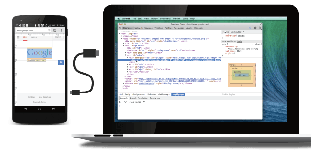
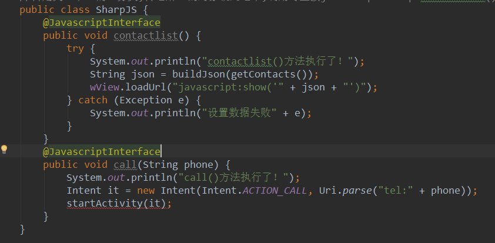
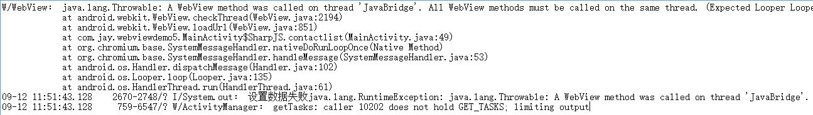
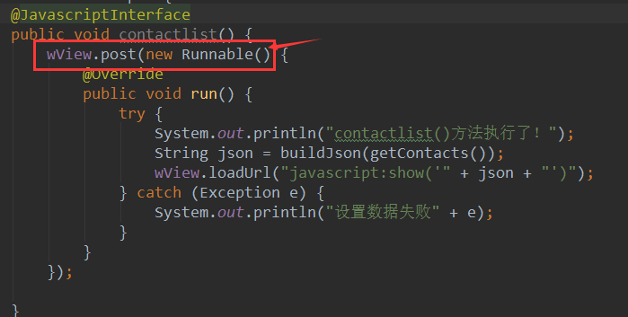
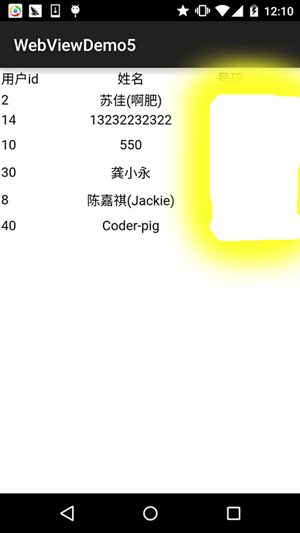

## 7.5.3 Android 4.4后WebView的一些注意事项

### 

## 本节引言：

> 本节参考原文：[Android 4.4 中 WebView 使用注意事项.md](https://github.com/cundong/blog/blob/master/Android 4.4 中 WebView 使用注意事项.md)
>
> 从Android 4.4开始，Android中的WebView不再是基于WebKit的，而是开始基于Chromium，这个改变使得WebView的性能大幅提升，并且对HTML5，CSS，JavaScript有了更好的支持！
>
> 虽然chromium完全取代了以前的WebKit for Android，但Android WebView的API接口并没有变， 与老的版本完全兼容。这样带来的好处是基于WebView构建的APP，无需做任何修改， 就能享受chromium内核的高效与强大。
>
> 对于4.4后的WebView，我们需要注意下下面这些问题：

------

## 1.多线程

> 如果你在子线程中调用WebView的相关方法，而不在UI线程，则可能会出现无法预料的错误。 所以，当你的程序中需要用到多线程时候，也请使用runOnUiThread()方法来保证你关于 WebView的操作是在UI线程中进行的：

```
runOnUiThread(newRunnable(){
@Override
publicvoid run(){
   // Code for WebView goes here
   }
});
```

------

## 2.线程阻塞

> 永远不要阻塞UI线程，这是开发Android程序的一个真理。虽然是真理，我们却往往不自觉的犯一些错误违背它，一个开发中常犯的错误就是：在UI线程中去等待JavaScript 的回调。 例如：

```
// This code is BAD and will block the UI thread
webView.loadUrl("javascript:fn()"); 
while(result == null) {  
    Thread.sleep(100); 
}
```

千万不要这样做，Android 4.4中，提供了新的Api来做这件事情。 evaluateJavascript() 就是专门来异步执行JavaScript代码的。

------

## 3.evaluateJavascript() 方法

> 专门用于异步调用JavaScript方法，并且能够得到一个回调结果。

**示例**：

```
mWebView.evaluateJavascript(script, new ValueCallback<String>() {
 @Override
 public void onReceiveValue(String value) {
      //TODO
 }
});
```

------

## 4.处理WebView中url的跳转

> 新版WebView对于自定义scheme的url跳转，新增了更为严格的限制条件。 当你实现了 shouldOverrideUrlLoading() 或 shouldInterceptRequest() 回调，WebView 也只会在跳转url是合法Url时才会跳转。 例如，如果你使用这样一个url ：

```
<a href="showProfile">Show Profile</a>
```

shouldOverrideUrlLoading() 将不会被调用。

正确的使用方式是：

```
<a href="example-app:showProfile">Show Profile</a>
```

对应的检测Url跳转的方式：

```
// The URL scheme should be non-hierarchical (no trailing slashes)
 privatestaticfinalString APP_SCHEME ="example-app:";
 @Override 
 publicboolean shouldOverrideUrlLoading(WebView view,String url){
     if(url.startsWith(APP_SCHEME)){
         urlData =URLDecoder.decode(url.substring(APP_SCHEME.length()),"UTF-8");
         respondToData(urlData);
         return true;
     }
     return false;
}
```

当然，也可以这样使用：

```
webView.loadDataWithBaseURL("example-app://example.co.uk/", HTML_DATA, null,"UTF-8", null);
```

------

## 5.UserAgent变化

> 如果你的App对应的服务端程序，会根据客户端传来的UserAgent来做不同的事情，那么你需要注意 的是，新版本的WebView中，UserAgent有了些微妙的改变：

```
Mozilla/5.0 (Linux; Android 4.4; Nexus 4 Build/KRT16H)
AppleWebKit/537.36(KHTML, like Gecko) Version/4.0 Chrome/30.0.0.0
Mobile Safari/537.36
```

使用**getDefaultUserAgent()**方法可以获取默认的UserAgent，也可以通过：

```
mWebView.getSettings().setUserAgentString(ua);
mWebView.getSettings().getUserAgentString();
```

来设置和获取自定义的UserAgent。

------

## 6.使用addJavascriptInterface()的注意事项

> 从Android4.2开始。 只有添加 @JavascriptInterface 声明的Java方法才可以被JavaScript调用， 例如：

```
class JsObject {
    @JavascriptInterface
    public String toString() { return "injectedObject"; }
}

webView.addJavascriptInterface(new JsObject(), "injectedObject");
webView.loadData("", "text/html", null);
webView.loadUrl("javascript:alert(injectedObject.toString())");
```

------

## 7.Remote Debugging

> 新版的WebView还提供了一个很厉害的功能：使用Chrome来调试你运行在WebView中的程序 具体可以看：[remote-debugging](https://developers.google.com/chrome-developer-tools/docs/remote-debugging) PS：需要梯子~你也可以直接百度remote-debugging了解相关信息，以及如何使用！ 

------

## 上一节中N5读取联系人的问题解决：

> 嘿嘿，看完上面的，我们知道在Android4.2后，只有添加 @JavascriptInterface 声明的Java方法才可以被JavaScript调用，于是乎我们为之前的两个方法加上@JavascriptInterface



但是，加完以后，并没有和我们的预想一样，出现我们想要的联系人列表，这是为什么呢？ 我们通过查看Log发现下面这样一段信息：



大概的意思就是：所有的WebView方法都应该在同一个线程程中调用，而这里的contactlist方法却在 JavaBridge线程中被调用了！所以我们要要把contactlist里的东东写到同一个线程中，比如一种解决 方法，就是下面这种：



嘿嘿，接下来运行下程序，神奇的发现，我们N5的手机联系人可以读取到了~



同理，之前第一个示例也可以这样解决~

------

## 本节小结：

> 本节跟大家走了一趟Android 4.4后WebView要注意的事项，以及一些对上一节中N5问题 的解决~相信会给大家在实际开发中使用WebView带来便利~谢谢